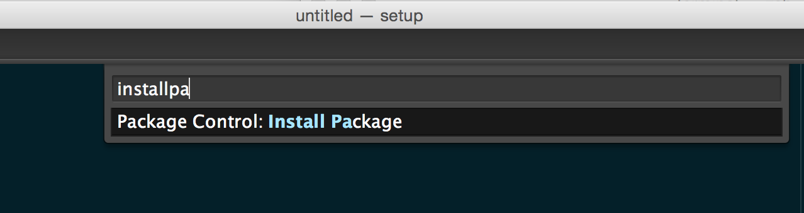

# Setup instructions

The following instructions will help you to get ready for [Le Wagon](http://www.lewagon.org) fullstack bootcamp:

- Grab a text editor, where you'll spend your day and nights
- Install a package manager
- Pimp your Terminal
- Setup Git and GitHub
- Install Ruby


## GitHub account

Have you signed up to GitHub? If not, [do it right away](https://github.com/join).

**[Upload a picture](https://github.com/settings/profile)** and put your name correctly on your GitHub account. This is important as we'll use an internal dashboard with your avatars.


## Command Line Tools

Open the Terminal (click the loupe icon in the top right corner):


Type what is after the dollar sign `$`. The dollar sign means that you need to type what's after into the Terminal.

```bash
$ xcode-select --install
```

If you have get following message, you can just skip this step and go to Sublime Text install.

```
# command line tools are already installed, use "Software Update" to install updates
```

Otherwise, it will open a window asking you if you want to install some software. Accept and wait. If it fails, try again the command line above, sometimes the Apple servers are overloaded.


While it's downloading, you can go on with the Sublime Text configuration (next session), but **stop** before Homebrew. You'll need the command line tools installed for that step.


## Sublime Text 2 - Your text editor

A text editor is one of the most important tools of a developer. Go to [this page](http://www.sublimetext.com/2) and download Sublime Text 2 for OS X. Install it (double click the downloaded file and drag & drop the app **into** the `Applications` folder, **don't skip this**).

Sublime Text is free without any time limitation but a popup will appear every ten saves to remind you there is a license to buy. You can hit `Esc` when this happens, but feel free to buy Sublime Text if you really like this one (there are alternatives).

Again, make sure that Sublime Text is there, not in the disk image you downloaded. To make sure it's correct, once Sublime Text is installed, unmount the "Sublime Text 2" disk in the left panel of Finder. Finder will complain if something went wrong. Ask a teacher.


### Package control

We will install the package manager right away, you'll need this to install addons. Launch Sublime Text, and open the console via the `View > Show Console` menu. This will show a prompt at the bottom of Sublime Text window where you can type stuff. You need to [copy some code](https://sublime.wbond.net/installation#st2) and paste it in that Sublime Text console. Then hit `Enter`. Restart Sublime Text (`⌘` + `Q` is a handy shortcut to quit an application on OS X, the red dot in the top left corner of the window does **not** quit an application).

If you have trouble with this step, ask a teacher. This was the only time we use the sublime text prompt. All other commands will be in the Terminal.

To check that the Package Control is installed, you can hit `⌘`+`⇧`+`P` (`Ctrl`+`⇧`+`P` on Ubuntu), and type `installp`. If you see something like below, you're good to go!



### Useful Packages

Here is a list of packages you should install to harness the power of Sublime Text with Ruby, Rails and Middleman:
Launch Package Control as explained above, hit `Enter` to view the package list, find and install (hitting `Enter` again):

- BracketHighlighter
- Emmet
- Git
- GitGutter
- Syntax Highlighting for Sass

### Preferences

We need to set some default on Sublime Text. Sharing defaults within your
colleagues, fellow students and teachers is important: it eases the process
of getting help or helping other.

1. Open Sublime Text
1. Go to `Preferences > Settings - Users`
1. Erase all the content of the file which got opened.
1. Copy paste the code below.
1. Save the file

```json
{
  "tab_size": 2,
  "translate_tabs_to_spaces": true,
  "detect_indentation": false,
  "ensure_newline_at_eof_on_save": true,
  "trim_automatic_white_space": true,
  "trim_trailing_white_space_on_save": true,
  "draw_white_space": true,
  "use_tab_stops": true,
  "hot_exit": false,
  "remember_open_files": false,
  "highlight_modified_tabs": true,
  "rulers": [ 80 ],
  "wordWrap": false,
  "folder_exclude_patterns": [ "tmp", "log", ".git", "_site", ".bundle", ".sass-cache", "build" ]
}
```

The convention we are enforcing with this configuration is that we use 2 spaces
for indentation (no tabs). So each time you will hit the `tab` key,
Sublime Text will insert 2 spaces.

You can now quit Sublime Text.


## Homebrew

On Mac, you need to install [Homebrew](http://brew.sh/) which is a Package Manager.
It will be used as soon as we need to install some software.
To do so, open your Terminal and run:

```bash
$ ruby -e "$(curl -fsSL https://raw.githubusercontent.com/Homebrew/install/master/install)"
```

This will ask for your confirmation (hit `Enter`) and your laptop session password.

Then install some useful software:

```bash
$ brew install git vim tree
```


## Oh-my-zsh - Fancy your Terminal

We will use the shell named `zsh` instead of `bash`, the default one.

```bash
$ curl -L http://install.ohmyz.sh | sh
```

Be careful, at the end of this script, it will prompt for your laptop password again. You have to write it correctly (you will not see it when you type) and hit `Enter`. You should get something like:

```bash
         __                                     __
  ____  / /_     ____ ___  __  __   ____  _____/ /_
 / __ \/ __ \   / __ `__ \/ / / /  /_  / / ___/ __ \
/ /_/ / / / /  / / / / / / /_/ /    / /_(__  ) / / /
\____/_/ /_/  /_/ /_/ /_/\__, /    /___/____/_/ /_/
                        /____/                       ....is now installed!
````

Now quit the Terminal (`⌘` + `Q`), and restart it.

You should see something like this:


If not, **stop right away** and call a teacher.

On Mac, open `Terminal > Preferences` and set the "Pro" theme as default in `Profiles` (*`Réglages`* in French).


Quit and relaunch the Terminal. It should now have a nice black background, more easy on the eyes.


## GitHub

We need to configure Git with SSH keys, this way you won't have to put your password each
time you want to `git push` some modifications.

It is a tricky concept and a tricky setup, fortunately GitHub wrote a great article.
Just [go to this article](https://help.github.com/articles/generating-ssh-keys/#step-2-generate-a-new-ssh-key), and select your environment at the top (Mac or Linux). If you need help, ask a teacher. *Do not* download GitHub for Mac, follow the part with SSH Keys.

**NB:** when asked for a passphrase, don't put your laptop password or your GitHub password. It is
important to protect your keys with a password, otherwise anyone having access to these files
will be able to impersonate your GitHub account (and get access to your private code for instance).


## Your Configuration

Hackers love to refine and polish their shell and tools. We'll start with a great default configuration provided by [Le Wagon](http://github.com/lewagon/dotfiles), stored on GitHub. As your configuration is personal, you need your own repository storing it, so you first need to fork it to your GitHub account.

:arrow_right: [Go to this page](https://github.com/lewagon/dotfiles/fork) and **fork** the repository to your account.
Forking means that it will create a new repo in your GitHub account, identical to the original one.

Then follow the instructions in the readme of the repo you've just forked. Once done,
come back to this tutorial.


## Installing Ruby (with [rbenv](https://github.com/sstephenson/rbenv), not rvm)

You may already have installed ruby, but we are going to do it again using `rbenv`, a manager for installing different Ruby versions on your computer. If you installed `rvm` before, run `rvm implode` to remove it beforehand.

Open a Terminal, and run:

```bash
$ curl https://raw.githubusercontent.com/fesplugas/rbenv-installer/master/bin/rbenv-installer | bash
```


Now, you are ready to install the latest ruby version, and set it as the default version.

```bash
$ rbenv install 2.2.2
$ rbenv global 2.2.2
```

Then restart your Terminal (close it and reopen it).

```bash
$ ruby -v
```

You should see something starting with `ruby 2.2.2p`. If not, ask a teacher.

## Installing some gems

```bash
$ gem install bundler rspec rubocop pry pry-byebug hub
```

Never install a gem with `sudo gem install`! Even if you stumble upon Stackoverflow answer
telling you to do so.


## Security

It is mandataory that you protect your session behind a password.If it is not already the case, go to ` > System Preferences > Users & Groups`, and change your account password. You should also go to ` > System Preferences > Security > General`. You should require a password `5 seconds` after sleep or screen saver begins.

You can also go to ` > System Preferences > Mission Control`, and click on the `Hot Corners` button at the bottom left. Choose for the bottom right corner to start the screen saver. That way, when you leave your desk, you can quickly lock you screen by putting your mouse in the bottom right corner. 5 seconds after, your Macbook will be locked and will ask for a password to get back on the session.

