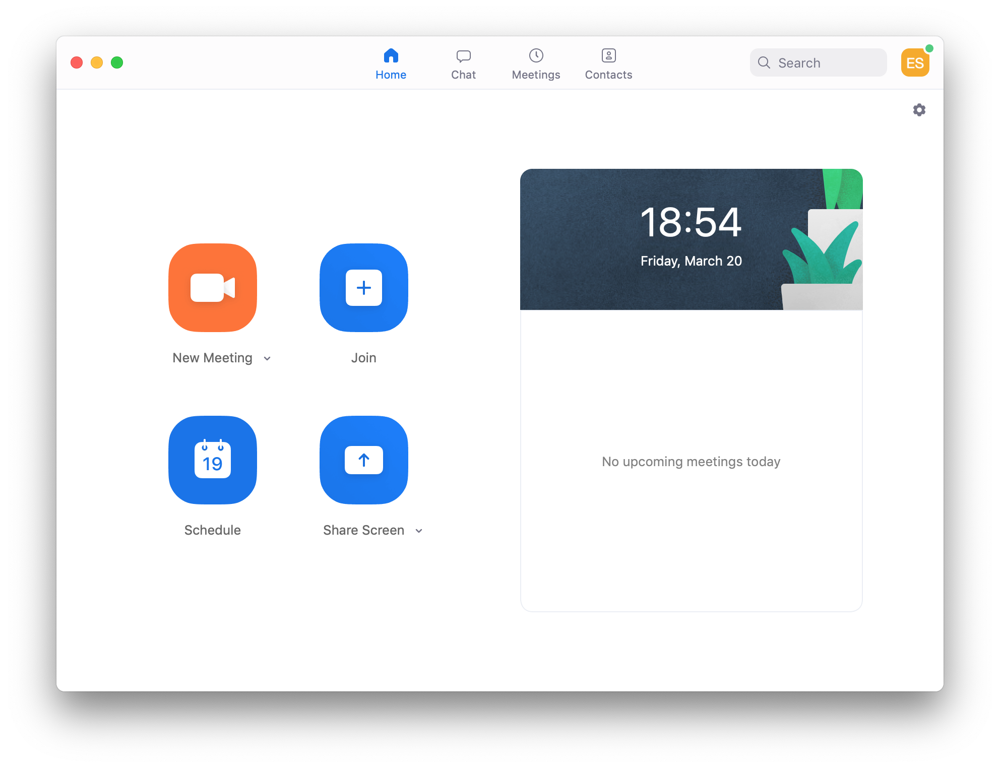
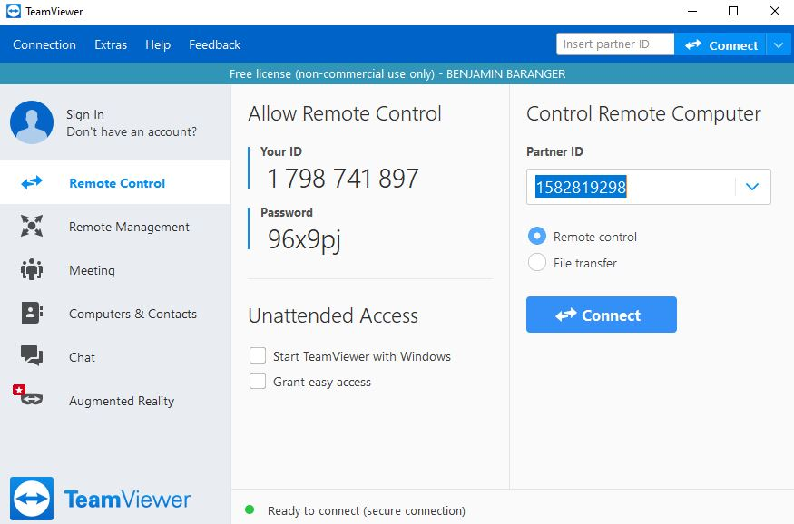
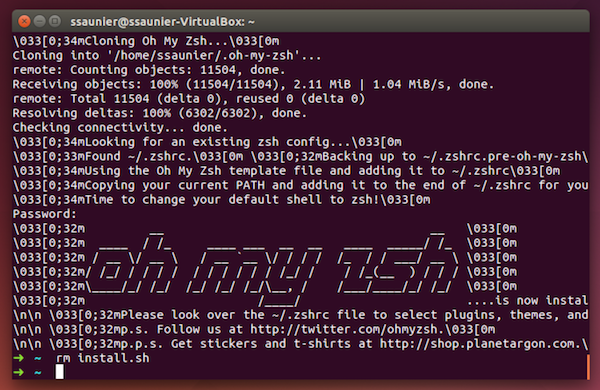

# Setup instructions

The following instructions will help you to get ready for [Le Wagon](http://www.lewagon.org) fullstack bootcamp:

- Grab a text editor, where you will spend your days and nights
- Install a package manager
- Pimp your Terminal
- Setup git and GitHub
- Install Ruby


## Remote tools

To be able to interact when we are not in the same physical room, we will be using two tools:

### Zoom

Zoom is a video conferencing tool. To create an account and install the app, go to [https://zoom.us/download](https://zoom.us/download) and under **Zoom Client for Meetings** click the **Download** button. Open the file you have just downloaded. A progress bar will appear, then Zoom will start. Click on **Connection** and create an account with the **Sign Up Free** option:


Once connected, you should see:



You can close Zoom now.

### Teamviewer

For the most complicated problems, a teacher might have to take control of your computer. To be able to do this, we will need to use the Teamviewer tool. Go to the [Teamviewer download page](https://www.teamviewer.com/en/download). It should automatically detect your operating system. If it doesn't, choose your operating system from the list at the top of the page. Click on **Download Teamviewer**, and open the file you just have downloaded. Leave the default settings as they are, and click on **Accept**. A progress bar will appear, then Teamviewer will start when the installation is over. It should look like this:



This will only be used as last resort when debugging becomes too tricky through spoken word. Nobody will ever be able to take control of your screen without you knowing it :ok_hand:

You can close Teamviewer now.

If you are not familiar with video calls, here is a great [article](https://martinfowler.com/articles/effective-video-calls.html) full of good practices :camera: :microphone:


## GitHub account

Have you signed up to GitHub? If not, [do it right away](https://github.com/join).

:point_right: **[Upload a picture](https://github.com/settings/profile)** and put your name correctly on your GitHub account. This is important as we'll use an internal dashboard with your avatars. Please do this **now**, before you continue with this guide.


## Git

To install `git`, first open a terminal. To open a terminal, you can click on the Ubuntu Start button in the sidebar and type `Terminal`. Then click on the terminal icon.

Then copy this line with `Ctrl` + `C`:

```bash
sudo apt install -y git
```

:bulb: To **paste it in the terminal**, you need to use `Ctrl` + `Shift` + `V`.


## Sublime Text 3 - Your text editor

A text editor is one of the most important tools of a developer.
Follow these instructions in the Terminal:

```bash
wget -qO - https://download.sublimetext.com/sublimehq-pub.gpg | sudo apt-key add -
```

:point_up: This command will ask for your password with: `[sudo] password for <username>:`. Don't panick! Calmy type your password key by key. You won't have a visual feedback (like little `*`), that's **perfectly normal**, keep on typing. When you're done, hit `Enter` :muscle:.

```bash
sudo apt install -y apt-transport-https
echo "deb https://download.sublimetext.com/ apt/stable/" | sudo tee /etc/apt/sources.list.d/sublime-text.list
sudo apt update
sudo apt install -y sublime-text
```

Sublime Text is free without any time limitation but a popup will appear every ten saves to remind you there is a license to buy. You can hit `Esc` when this happens, but feel free to buy Sublime Text if you really like this one (there are alternatives).


## Oh-my-zsh - Fancy your Terminal

We will use the shell named `zsh` instead of `bash`, the default one.

```bash
sudo apt install -y zsh curl vim nodejs imagemagick jq
sh -c "$(curl -fsSL https://raw.githubusercontent.com/robbyrussell/oh-my-zsh/master/tools/install.sh)"
# it will ask for your session password
```

Be careful, those commands will ask you to type your password twice. At the end
your prompt should look like this:



If it doesn't, **ask a teacher**.

To make this change stick, restart your laptop (or virtual machine):

```bash
sudo reboot
```


## GitHub

We need to generate SSH keys which are going to be used by GitHub and Heroku
to authenticate you. Think of it as a way to log in, but different from the
well known username/password couple. If you already generated keys
that you already use with other services, you can skip this step.

Open a terminal and type this, replacing the email with **yours** (the
same one you used to create your GitHub account). It will prompt
for information. Just press enter until it asks for a **passphrase**.

```bash
mkdir -p ~/.ssh && ssh-keygen -t ed25519 -o -a 100 -f ~/.ssh/id_ed25519 -C "TYPE_YOUR_EMAIL@HERE.com"
```

**NB:** when asked for a passphrase, put something you want (and that you'll remember),
it's a password to protect your private key stored on your hard drive. You'll type,
nothing will show up on the screen, **that's normal**. Just type the passphrase,
and when you're done, press `Enter`.

Then you need to give your **public** key to GitHub. Run:

```bash
cat ~/.ssh/id_ed25519.pub
```

It will prompt on the screen the content of the `id_ed25519.pub` file. Copy that text,
then go to [github.com/settings/ssh](https://github.com/settings/ssh). Click on
**Add SSH key**, fill in the Title with your computer name, and paste the **Key**.
Finish by clicking on the **Add key** green button.

To check that this step is completed, in the terminal run this. You will be
prompted a warning, type `yes` then `Enter`.

```bash
ssh -T git@github.com
```

If you see something like this, you're done!

```bash
# Hi --------! You've successfully authenticated, but GitHub does not provide shell access
```

If it does not work, try running this before trying again the `ssh -T` command:

```bash
ssh-add ~/.ssh/id_ed25519
```

Don't be in a rush, take time to [read this article](http://sebastien.saunier.me/blog/2015/05/10/github-public-key-authentication.html) to get a better
understanding of what those keys are used for.


## Dotfiles (Standard configuration)

Hackers love to refine and polish their shell and tools. We'll start with a great default configuration provided by [Le Wagon](http://github.com/lewagon/dotfiles), stored on GitHub. As your configuration is personal, you need your own repository storing it, so you first need to fork it to your GitHub account.

:arrow_right: [Click here to **fork**](https://github.com/lewagon/dotfiles/fork) the `lewagon/dotfiles` repository to your account.

You should arrive on a page that looks like this. Make sure to **select your GitHub account**.


Forking means that it will create a new repo in your GitHub account, identical to the original one. You'll have a new repository on your GitHub account, `your_github_username/dotfiles`. We need to fork because each of you will need to put specific information (e.g. your name) in those files.

Open your terminal. **Don't blindly copy paste this line**, replace `replace_this_with_your_github_username` with *your*
own github usernickname.

```bash
export GITHUB_USERNAME=replace_this_with_your_github_username

# Example:
#   export GITHUB_USERNAME=ssaunier
```

Now copy/paste this very long line in your terminal. Do **not** change this one.

```bash
mkdir -p ~/code/$GITHUB_USERNAME && cd $_ && git clone git@github.com:$GITHUB_USERNAME/dotfiles.git
```

Run the `dotfiles` installer.

```bash
cd ~/code/$GITHUB_USERNAME/dotfiles
zsh install.sh
```

Then run the git installer:

```bash
cd ~/code/$GITHUB_USERNAME/dotfiles
zsh git_setup.sh
```

:point_up: This will **prompt** you for your name (`Firstname Lastname`) and your email.

Be careful, you **need** to put the **same** email as the one you sign up with on GitHub.

Please now **quit** all your opened terminal windows.

### Sublime Text auto-configuration

Open a new terminal and type this:

```bash
cd ~/code
stt
```

It will **open Sublime Text in the context of your current folder**. That's how we'll use it.

**Close Sublime text** and open it again:

```bash
stt
```

**Wait 1 minute** for additional packages to be automatically installed (New tabs with text will automatically open, containing documentation for each new package installed). TO follow package installation, you can go to `View > Show console`.

To check if plugins are installed, open the Command Palette (`⌘` + `⇧` + `P` on OSX, `Ctrl` + `⇧` + `P` on Linux), type in `Packlist` and then `Enter`, you should see a couple of packages installed (like [Emmet](http://emmet.io/)).

If you don't, please install all of them manually. The list is referenced [here](https://github.com/lewagon/dotfiles/blob/master/Package%20Control.sublime-settings).

When it's done, you can close Sublime Text.


## Installing Ruby (with [rbenv](https://github.com/sstephenson/rbenv))

First we need to clean up any previous Ruby installation you might have:

```bash
rvm implode && sudo rm -rf ~/.rvm
# If you got "zsh: command not found: rvm", carry on. It means `rvm` is not
# on your computer, that's what we want!

rm -rf ~/.rbenv
```

Then in the terminal, run:

```bash
sudo apt install -y build-essential tklib zlib1g-dev libssl-dev libffi-dev libxml2 libxml2-dev libxslt1-dev libreadline-dev
sudo apt clean
git clone https://github.com/rbenv/rbenv.git ~/.rbenv
git clone https://github.com/rbenv/ruby-build.git ~/.rbenv/plugins/ruby-build
```

**Close your terminal and open it again** (Alt+F4 and restart it). If you get a warning, just **ignore** it from now (Ruby is not installed yet).


Now, you are ready to install the latest ruby version, and set it as the default version.

Run this command, it will **take a while (5-10 minutes)**

```bash
rbenv install 2.6.6
```

Once the ruby installation is done, run this command to tell the system
to use the 2.6.6 version by default.

```bash
rbenv global 2.6.6
```

Then **restart** your Terminal again (close it and reopen it).

```bash
ruby -v
```

You should see something starting with `ruby 2.6.6p`. If not, ask a teacher.

## Installing some gems

---

:warning: If you are in **China** :cn:, you should update the way we'll install gem with the following commands. If you are not in China, well just skip this and go directly to the next `gem install` command!

```bash
# China only!
gem sources --remove https://rubygems.org/
gem sources -a https://gems.ruby-china.com/
gem sources -l
# *** CURRENT SOURCES ***
# https://gems.ruby-china.com/
# Ruby-china.com must be in the list now
```

---

All, please run the following line:

```bash
gem install rake bundler rspec rubocop rubocop-performance pry pry-byebug hub colored octokit
```

If you encounter the following error:

`
ERROR: While executing gem ... (TypeError)
incompatible marshal file format (can't be read)
format version 4.8 required; 60.33 given
`

Run the following command:
```bash
rm -rf ~/.gemrc
```

Rerun the command to install the gems.

**Never** install a gem with `sudo gem install`! Even if you stumble upon a Stackoverflow answer
(or the Terminal) telling you to do so.


## Postgresql

In a few weeks, we'll talk about SQL and Databases and you'll need something called Postgresql,
an open-source robust and production-ready database. Let's install it now.

```
sudo apt install -y postgresql postgresql-contrib libpq-dev build-essential
sudo -u postgres psql --command "CREATE ROLE `whoami` LOGIN createdb;"
```


## Ubuntu inotify

Ubuntu is always tracking changes in your folders, and to do this it uses inotify.
By default the Ubuntu limit is set to 8192 files monitored.

As programming involves a lot of files, we need to raise this limit.
In your terminal run:

```bash
echo fs.inotify.max_user_watches=524288 | sudo tee -a /etc/sysctl.conf && sudo sysctl -p
```

## Extra

### Install video codec H264

On our pedagogical platform (Kitt, you'll soon discover it!), we have some videos. By default Firefox on Linux cannot play them as they use an unsupported codec (H264). To get those videos working for you, you need to run this:

```bash
sudo apt install libavcodec-extra -y
```

### Install useful terminal tools

`tree` is a nice tool to visualize a directory tree inside the terminal:

`ncdu` is a text-based interface disk utility.

`htop` is an interactive process viewer.

`tig` is a text-mode interface for `git`.

`hub` is a command line tool that wraps `git` in order to extend it with extra features and commands that make working with GitHub easier.

```bash
sudo apt install tree ncdu htop tig hub
```


## Check-up

Let's check if you successfully installed everything.

Quit all opened Terminal, open a new one and run the following commands:

```bash
curl -Ls https://raw.githubusercontent.com/lewagon/setup/master/check.rb > _.rb && ruby _.rb || rm _.rb
```

It should tell you if your workstation is ready :) If not, ask a teacher.


## Alumni

Register as a Wagon alumni by going to [kitt.lewagon.com/onboarding](http://kitt.lewagon.com/onboarding). Select your batch, sign in with GitHub and enter all your information.

Your teacher will then validate that you are indeed part of the batch. You can ask him to do it as soon as you completed the registration form.

Once the teacher has approved your profile, go to your email inbox. You should have 2 emails:

- One from Slack, inviting you to the Le Wagon Alumni slack community (where you'll chat with your buddies and all the previous alumni). Click on **Join** and fill the information.
- One from GitHub, inviting you to `lewagon` team. **Accept it** otherwise you won't be able to access the lecture slides.


## Slack

[Install Slack for Linux (beta)](https://get.slack.help/hc/en-us/articles/212924728-Slack-for-Linux-beta-).

Launch the app and sign in to `lewagon-alumni` organization.

Make sure you upload a picture there.

You can also sign in to Slack on your iPhone or Android device!

The idea is that you'll have Slack open all day, so that you can share useful links / ask for help / decide where to go to lunch / etc.

In case of remote tickets, you will use Slack audio or video call to get help. To ensure that everything is working fine, [test your camera and microphone](https://lewagon-alumni.slack.com/help/test/calls). If your browser is asking your permission to access your microphone and camera, click on yes.

After the test are finished, you should have green "All clear" messages at least for your microphone and camera. If not, ask a teacher.


