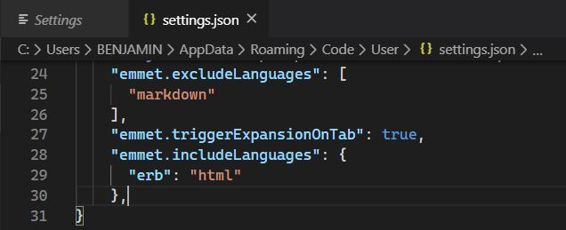
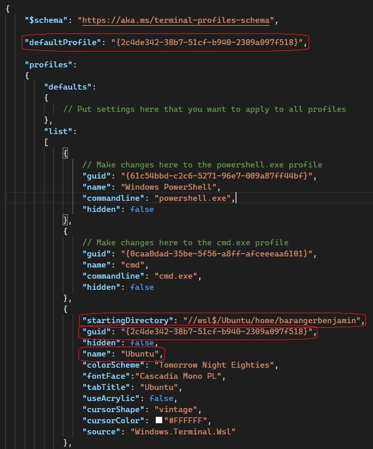

# Setup instructions

The following instructions will help you to get ready for [Le Wagon](http://www.lewagon.org) fullstack bootcamp:

- Grab a text editor, where you will spend your days and nights
- Install a package manager
- Pimp your Terminal
- Setup git and GitHub
- Install Ruby


## Prerequisites

Before we start, it is important you meet the following prerequisites to ensure the smooth running of the setup.
Take your time to read through everything and do not hesitate to ask for help if you feel stuck.

Ready? Let's go :sunglasses:


### Windows 10

For this setup, you need to be using the latest version of Windows.

This means that you need to be on **Windows 10**, with all the latest updates installed.

To check your Windows version:


>\- Press `Windows` + `R`  
>\- Type  `winver`  
>\- Press `Return`

&nbsp;

&nbsp;&nbsp;&nbsp; :x: If it does not mention **Windows 10**, you cannot proceed with this setup — but do not panic! You can always upgrade to Windows 10!

&nbsp;&nbsp;&nbsp; :white_check_mark: If the first words of this window are **Windows 10** you're good to go! :muscle:


---

#### :wrench: Potential Fixes

<details>
  <summary>Upgrade to Windows 10</summary>

  &nbsp;
  - Download Windows 10 from [Microsoft](https://www.microsoft.com/software-download/windows10ISO)
  - Install it. It should take roughly an hour, bu this is dependent on your computer
</details>

---


Once you're sure that you're using Windows 10, you will need to check that your computer has all the latest updates.


### Latest version of Windows

Open Windows Update:


>\- Press `Windows` + `R`  
>\- Type  `ms-settings:windowsupdate`  
>\- Press `Return`
>
>
>\- Click on `Check updates`

&nbsp;

&nbsp;&nbsp;&nbsp; :x: If you have an error message about Windows not being able to apply updates, please **contact a teacher**.

&nbsp;&nbsp;&nbsp; :white_check_mark: If you have updates available please install them and repeat the process until it says that you are up to date :star:.


---

#### :wrench: Potential Fixes

<details>
  <summary>Activate Windows Update Service to fix Updates</summary>

  &nbsp;
  
  
  Some antiviruses and pieces of software desactivate the Update service we need, resulting in the error you see. Let's fix that!


  >\- Press `Windows` + `R`  
  >\- Type  `services.msc`  
  >\- Press `Return`
  >
  >
  >\- Double Click `Windows Update Service`  
  >\- Set its `Startup` to `Automatic`  
  >\- Click on `Start`  
  >\- Click on `Ok`

  Then let's try updates again!
</details>

---

### Minimum version

Some of the tools we need to install have been release with the `1903` version **or above** of Windows 10 so we need to make sure you have at least this one.


>\- Press `Windows` + `R`  
>\- Type  `winver`  
>\- Press `Return`  


Check the **Version number**:


&nbsp;&nbsp;&nbsp; :x: If it is below `1903`, just follow the [Latest version of Windows](#Latest-version-of-Windows) paragraph above to install the latest updates.

&nbsp;&nbsp;&nbsp; :white_check_mark: If it says at least `1903`, you are good to go! :sunglasses:


### Virtualization

We need to ensure that the Virtualization options are enabled in the BIOS of your computer.

For many computers, this is already the case. Let's check:


>\- Press `Windows` + `R`  
>\- Type  `taskmgr`  
>\- Press `Return`
>
>
>\- Click on the `Performance` tab  
>\- Click on `CPU`


&nbsp;

&nbsp;&nbsp;&nbsp; :x: If the line is missing or if it is disabled, please **contact a teacher before trying to activate the Virtualization**.

&nbsp;&nbsp;&nbsp; :white_check_mark: The status will be listed under the graph and will say "Virtualization: Enabled" if this tool is enabled.


---

#### :wrench: Potential Fixes

<details>
  <summary>Activate Virtualization</summary>

  &nbsp;
  
  
  We need to access the BIOS / UEFI of the computer to activate it.


  >\- Press `Windows + R`  
  >\- Type  `shutdown.exe /r /o /t 1`  
  >\- Press `Return`
  >
  >
  >\- Wait for the computer to shutdown
  >
  >
  >\- Click on `Troubleshoot`  
  >\- Click on `Advanced Options`  
  >\- Click on `UEFI Firmware Settings`  
  >\- Click on `Restart`


  You need to activate the virtualization option for your processor here:
  - Most of the time, in the advanced settings, the CPU settings, or the Northbridge settings
  - The option can be called differently according to your computer:
      - Intel: `Intel VT-x`, `Intel Virtualization Technology`, `Virtualization Extensions`, `Vanderpool`...
      - AMD: `SVM Mode` or `AMD-V`
  - Save the changes after activation, and reboot the computer through the appropriate option
</details>

---


## GitHub account

Have you signed up to GitHub? If not, [do it right away](https://github.com/join).

:point_right: **[Upload a picture](https://github.com/settings/profile)** and put your name correctly on your GitHub account. This is important as we'll use an internal dashboard with your avatars. Please do this **now**, before you continue with this guide.


## Remote tools

To be able to interact when we are not in the same physical room, we will be using two tools:

### Zoom

Zoom is a video conferencing tool. To create an account and install the app, go to [https://zoom.us/download](https://zoom.us/download) and under **Zoom Client for Meetings** click the **Download** button. Open the file you have just downloaded. A progress bar will appear, then Zoom will start. Click on **Connection** and create an account with the **Sign Up Free** option:


Once connected, you should see:


You can close Zoom now.

### Teamviewer

For the most complicated problems, a teacher might have to take control of your computer. To be able to do this, we will need to use the Teamviewer tool. Go to the [Teamviewer download page](https://www.teamviewer.com/en/download). It should automatically detect your operating system. If it doesn't, choose your operating system from the list at the top of the page. Click on **Download Teamviewer**, and open the file you just have downloaded. Leave the default settings as they are, and click on **Accept**. A progress bar will appear, then Teamviewer will start when the installation is over. It should look like this:


This will only be used as last resort when debugging becomes too tricky through spoken word. Nobody will ever be able to take control of your screen without you knowing it :ok_hand:

You can close Teamviewer now.

If you are not familiar with video calls, here is a great [article](https://martinfowler.com/articles/effective-video-calls.html) full of good practices :camera: :microphone:


## Windows Subsystem for Linux
### Install WSL 1
WSL is the development environment we are using to run Ubuntu. You can learn more about WSL [here](https://docs.microsoft.com/en-us/windows/wsl/faq).

We will install WSL through the Powershell Terminal:


:warning: In the following instruction, please aware of the `Ctrl` + `Shift` + `Return` key stroke to execute **Windows Powershell** with administrator privileges instead of just clicking on `Ok`or pressing `Return`.


>\- Press `Windows` + `R`  
>\- Type  `powershell`  
>\- Press `Ctrl` + `Shift` + `Return`


:warning: You may have to accept the UAC confirmation about the privilege elevation.


&nbsp;  
A blue terminal window will appear:


>\- Copy the following commands  
>\- Paste them into the Powershell window by right-clicking into it (`Ctrl` + `V` does not work here!)  
>\- Run them by pressing `Return`


&nbsp;  
```powershell
Enable-WindowsOptionalFeature -Online -FeatureName Microsoft-Windows-Subsystem-Linux
```

```powershell
dism.exe /online /enable-feature /featurename:Microsoft-Windows-Subsystem-Linux /all /norestart
```

```powershell
dism.exe /online /enable-feature /featurename:VirtualMachinePlatform /all /norestart
```

&nbsp;


&nbsp;&nbsp;&nbsp; :x: If you encounter an error message (or if you see some text in red in the window), please **contact a teacher**!

&nbsp;&nbsp;&nbsp; :white_check_mark: When all three commands ran without any error, you can restart your computer.


### Upgrade to WSL 2
Once your computer has restarted, we need to download the WSL2 installer.


>\- Go to the [download page](https://aka.ms/wsl2kernel) and get the installer  
>\- Click `Next`  
>\- Click `Finish`


&nbsp;

&nbsp;&nbsp;&nbsp; :x: If you encounter the error `This update only applies to machines with the Windows Subsystem for Linux`, **right click** on the program and select `uninstall`; you shall be able to install it normally this time.

&nbsp;&nbsp;&nbsp; :white_check_mark: If everything is fine, we are ready to use WSL 2 instead of WSL 1!

### Make WSL 2 the default Windows Subsystem for Linux
Now that WSL 2 is installed, let's use it by default when we deal with WSL:


>\- Press `Windows` + `R`  
>\- Type  `cmd`  
>\- Press `Return`


In the window which appears, type:

```bash
wsl --set-default-version 2
```

&nbsp;


&nbsp;&nbsp;&nbsp; :x: If the message you get talks about Virtualization, please **contact a teacher**

&nbsp;&nbsp;&nbsp; :white_check_mark: You can close this Command Prompt terminal; we are ready to install Ubuntu!


## Ubuntu
### Installation


>\- Click on `Start`  
>\- Type  `Microsoft Store`  
>\- Click on the Microsoft Windows Store in the list
>
>
>\- Search for `Ubuntu` in the search bar  
>\- Select version without any number, just plain "Ubuntu"
>
>
>\- Click on `Install`


:warning: Don't install **Ubuntu 18.04 LTS** nor **Ubuntu 20.04**!

---

#### :wrench: Potential Fixes


<details>
  <summary>Uninstall wrong versions of Ubuntu</summary>

  &nbsp;
  
  
  To uninstall a wrong version of Ubuntu, you just have to go to the Installed Program List of Windows 10:


  >\- Press `Windows` + `R`  
  >\- Type  `appwiz.cpl`  
  >\- Press `Return`


  Find the right software to uninstall, and click on the uninstall button.
</details>

---


&nbsp;
Once the installation is done, the `Install` button becomes a `Launch` button:


>\- Click on `Launch`


At first launch, you will be asked some information:
- Choose a **username**:
    - one word
    - lowercase
    - no special characters
    - for example: `lewagon` or your `firstname`
- Choose a **password**
- Confirm your password


:warning: When typing the password, nothing will not appear on the screen — there will be no familiar typing indicator even though your keystrokes are being registered!

:warning: This is a security feature to mask not only your password as a whole but also its length!


&nbsp;


&nbsp;&nbsp;&nbsp; :white_check_mark: The installation should be complete; you can close the Ubuntu window now that it is installed on your computer.

### Check the WSL version of Ubuntu 


>\- Press `Windows` + `R`  
>\- Type  `cmd`  
>\- Press `Return`


Type the following command:

```bash
wsl -l -v
```

&nbsp;

&nbsp;&nbsp;&nbsp; :x: If the version of Ubuntu WSL is 1, we will need to convert it to version 2.

&nbsp;&nbsp;&nbsp; :white_check_mark: If the version of Ubuntu WSL is 2, you are ready to install VS Code!


---

#### :wrench: Potential Fixes


<details>
  <summary>Convert Ubuntu WSL V1 to V2</summary>

  
  &nbsp;
  
  
  In the Command Prompt window, type:

  ```bash
  wsl --set-version Ubuntu 2
  ```
  
  &nbsp;

  &nbsp;&nbsp;&nbsp; :white_check_mark: After a few seconds, you should get the following message: `The conversion is complete`.

  &nbsp;&nbsp;&nbsp; :x: If it does not work, we need to be sure that Ubuntu files are not compressed.
</details>

<details>
  <summary>Check for Uncompress Files</summary>


  &nbsp;
  >\- Press `Windows` + `R`  
  >\- Type  `%localappdata%\Packages`  
  >\- Press `Return`
  >
  >
  >\- Open the folder named `CanonicalGroupLimited.UbuntuonWindows...`  
  >\- Right Click on the `LocalState` folder  
  >\- Click on `Properties`  
  >\- Click on `Advanced`  
  >\- Make sure that the option `Compress content` is **not** ticked, then click on `Ok`.
  

  Apply changes to this folder only, and try to convert the Ubuntu WSL version again.


  &nbsp;&nbsp;&nbsp; :x: If the conversion still does not work, please **contact a teacher**.
</details>

---


(You can now close this Command Prompt window.)


## Visual Studio Code

We use Visual Code Studio for writing code on Windows, because it integrates nicely with the Ubuntu terminal.

For this integration to work, you need to uninstall other code editor, like for example SublimeText, as their WSL integration interferes with the integration of VS Code.

### Installation
>\- Go the [Visual Studio Code page](https://code.visualstudio.com/download)  
>\- Choose the Windows version of VS Code


The tool should start to download automatically.

>\- Open the file you have just downloaded.  
>\- Install it with a few options:  
>    \- Register VS Code as an editor for supported file types  
>    \- Let the other options as they are

### Connecting VS Code to Ubuntu

- Launch VS Code a first time, then:
    - Pin it to the taskbar; you will be using it a lot!
    - You should have a frame at the bottom-right corner of VS Code saying it detects WSL
    - Accept the installation of the WSL extension for VS Code

:warning: This extension is mandatory for you to be able to work with VS Code!

### VS Code Shortcuts

In VS Code:


>\- Click on `File`  
>\- Click on `Preferences`  
>\- Click on `Keymaps`  
>\- Click on `Sublime Text Keymap and Settings Importer`  
>\- Click on `Install`  
>\- Click on `Reload Required`


### VS Code Extensions

Let's gain time now and add other nice extensions that will help your bootcamp even better in the future.

For each of these extensions:


>\- On the web page, click on `install`  
>\- In the browser, accept to use VS Code to install the extension  
>\- In VS Code, click on `install`


- [Rails Snippets](https://marketplace.visualstudio.com/items?itemName=hridoy.rails-snippets)
- [ESLint](https://marketplace.visualstudio.com/items?itemName=dbaeumer.vscode-eslint)
- [ERB Helper Tags](https://marketplace.visualstudio.com/items?itemName=rayhanw.erb-helpers)
- [ruby-rubocop](https://marketplace.visualstudio.com/items?itemName=misogi.ruby-rubocop)

### VS Code Settings
>\- Press `Ctrl` + `,` on your keyboard to open the settings  
>\- In the search bar, type `emmet`  
>\- Click on the first **`Edit in settings.json`** link


Paste the following just before the last `}`:

```bash
"emmet.triggerExpansionOnTab": true,
"emmet.includeLanguages": {
  "erb": "html"
},
```

It should look like this:



:warning: You should add a comma if there is none after the **`]`** like line 26 in the image above ☝️


:warning: Don't forget to save those changes!

### Final Check

To make sure everything works fine, close VS Code, then open your Ubuntu terminal:


>\- Press `Windows` + `R`  
>\- Type  `ubuntu`  
>\- Press `Return`


In Ubuntu, let's try to launch VS Code:

```bash
code
```

&nbsp;

&nbsp;&nbsp;&nbsp; :x: If Visual Studio Code does not open, please **contact a teacher**

&nbsp;&nbsp;&nbsp; :white_check_mark: If Visual Studio Code opens, your code editor is ready! :muscle:


## Windows Terminal

The standard Ubuntu terminal is a very crude way of using Ubuntu; let's use a real modern terminal!

### Installation

We first need to install **Windows Terminal** from the Microsoft Windows Store:


>\- Click on `Start`  
>\- Type  `Microsoft Store`  
>\- Click on the Microsoft Windows Store in the list
>
>
>\- Search for `Windows Terminal` in the search bar
>
>
>\- Click on `Install`


Once the installation is done, the `Install` button becomes a `Launch` button:


>\- Click on `Launch`  
>\- Right Click on the icon in the taskbar  
>\- Choose to pin the app to the bar


This terminal allows you to open multiple terminal sessions, including **Powershell**, **Command Prompt**, and **Ubuntu** that you installed earlier.

This terminal has tabs: you can choose to open a new terminal tab clicking on the **down arrow** / **v-shape** next to the current one.

:warning: From now on, we will only need **Ubuntu** as a terminal.

### Ubuntu as the default terminal

Let's make Ubuntu the default terminal of your Windows Terminal application.


>\- Press `Ctrl` + `,`


It should open the settings:



We have put in red the part we will use or change.


&nbsp;


First, let us ask Ubuntu to start directly inside your Ubuntu Home Directory instead of the Windows one:


>\- Locate the `"name": "Ubuntu",`  
>\- Add the following line after it:

```bash
"startingDirectory": "//wsl$/Ubuntu/home/the-username-you-chose-at-the-ubuntu-install",
```

:warning: Do not forget the comma at the end of the line!

:warning: Do not forget to replace the username by your own in the line above!


&nbsp;

Now, let us ask Windows Terminal to start directly an Ubuntu Terminal when launched:


>\- Locate the `"guid"` for Ubuntu  
>\- Copy the value between `{` and `}`  
>\- Locate the `"defaultProfile"`  
>\- Replace the value between `{` and `}` with what you copied from above


:warning: Do not forget to save those changes!

&nbsp;

&nbsp;&nbsp;&nbsp; :white_check_mark: Voilà, your **Windows Terminal** is setup! :confetti_ball:  
&nbsp;&nbsp;&nbsp;&nbsp;&nbsp;&nbsp;&nbsp;&nbsp;&nbsp;&nbsp; **From now on, every time we will refer to the terminal or the console it will be this one.**


## Git

To install `git`:


>\- Open an Ubuntu terminal.  
>\- Copy and paste the following lines:


```bash
sudo apt update
```
```bash
sudo apt install -y git apt-transport-https unzip gnome-terminal
````


## Oh-my-zsh - Fancy your Terminal

We will use the shell named `zsh` instead of `bash`, the default one.

```bash
# it will ask for your session password
sudo apt install -y zsh curl vim nodejs imagemagick jq
```
```bash
sh -c "$(curl -fsSL https://raw.githubusercontent.com/robbyrussell/oh-my-zsh/master/tools/install.sh)"
```

At then end, your terminal should look like this:


&nbsp;

&nbsp;&nbsp;&nbsp; :x: If it does not, please **contact a teacher**.

&nbsp;&nbsp;&nbsp; :white_check_mark: If everything is correct, let's configure GitHub!

---

#### :wrench: Potential Fixes

<details>
  <summary>Error: "chsh command unsuccessful. Change your default shell manually."</summary>

  &nbsp;
  
  
  You probably typed the wrong password when asked.
  Starting the script again will not work as it will try to create a configuration folder that now already exists !

  We need to remove it first:

  ```bash
  rm -rf ~/.oh-my-zsh
  ```


  Then let's try again!
</details>

---


## GitHub

We need to generate SSH keys which are going to be used by GitHub and Heroku
to authenticate you. Think of it as a way to log in, but different from the
well known username/password couple. If you already generated keys
that you already use with other services, you can skip this step.

Open a terminal and type this, replacing the email with **yours** (the
same one you used to create your GitHub account). It will prompt
for information. Just press enter until it asks for a **passphrase**.

```bash
mkdir -p ~/.ssh && ssh-keygen -t ed25519 -o -a 100 -f ~/.ssh/id_ed25519 -C "TYPE_YOUR_EMAIL@HERE.com"
```

**NB:** when asked for a passphrase, put something you want (and that you'll remember),
it's a password to protect your private key stored on your hard drive. You'll type,
nothing will show up on the screen, **that's normal**. Just type the passphrase,
and when you're done, press `Enter`.

Then you need to give your **public** key to GitHub. Run:

```bash
cat ~/.ssh/id_ed25519.pub
```

It will prompt on the screen the content of the `id_ed25519.pub` file.


>\- Copy that text  
>\- Go to [github.com/settings/ssh](https://github.com/settings/ssh)  
>\- Click on `Add SSH key`  
>\- Fill in the Title with your computer name  
>\- Paste the **Key**  
>\- Finish by clicking on the **Add key** green button.


To check that this step is completed, in the terminal run this.

```bash
ssh -T git@github.com
```

:warning: You will be prompted a warning, type `yes` then `Enter`.

This is the expected result:

```
# Hi --------! You've successfully authenticated, but GitHub does not provide shell access
```

&nbsp;

&nbsp;&nbsp;&nbsp; :white_check_mark: If you got this message, the keys were added successfully!

&nbsp;&nbsp;&nbsp; :x: If you encountered an error, you will have to try again. Do not hesitate to *contact a teacher*.


---

#### :wrench: Potential Fixes

<details>
  <summary>If `ssh -T git@github.com` does not work</summary>

  &nbsp;
  
  
  Try running this command before trying again:

  ```bash
  ssh-add ~/.ssh/id_ed25519
  ```
  </details>

---


Don't be in a rush, take time to [read this article](http://sebastien.saunier.me/blog/2015/05/10/github-public-key-authentication.html) to get a better
understanding of what those keys are used for.


## Nodejs

This is not used at the beginning of the course, but let's get a head start and install nodejs, used for Javascript :thumbsup:.

Copy paste the following commands:


```bash
curl -sL https://deb.nodesource.com/setup_10.x | sudo -E bash -
```
```bash
sudo apt install -y nodejs
```


## Dotfiles (Standard configuration)

Hackers love to refine and polish their shell and tools. We'll start with a great default configuration provided by [Le Wagon](http://github.com/lewagon/dotfiles), stored on GitHub. As your configuration is personal, you need your own repository storing it, so you first need to fork it to your GitHub account.

>\- [Click here to **fork**](https://github.com/lewagon/dotfiles/fork) the `lewagon/dotfiles` repository to your account  
>\- You should arrive on a page that looks like below  
>\- Make sure to **select your GitHub account**.


Forking means that it will create a new repo in your GitHub account, identical to the original one. You'll have a new repository on your GitHub account, `your_github_username/dotfiles`.

We need to fork because each of you will need to put specific information (e.g. your name) in those files.

>\- Open your terminal.

```bash
export GITHUB_USERNAME=replace_this_with_your_github_username

# Example:
#   export GITHUB_USERNAME=ssaunier
```
:warning: **Don't blindly copy paste this line**, replace `replace_this_with_your_github_username` with *your* own GitHub usernickname.


&nbsp;


Now let's get your new default configuration on your computer:

```bash
mkdir -p ~/code/$GITHUB_USERNAME && cd $_ && git clone git@github.com:$GITHUB_USERNAME/dotfiles.git
```

Run the `dotfiles` installer:

```bash
cd ~/code/$GITHUB_USERNAME/dotfiles && zsh install.sh
```

Then run the git installer:

```bash
cd ~/code/$GITHUB_USERNAME/dotfiles && zsh git_setup.sh
```

:point_up: This will **prompt** you for your name (`Firstname Lastname`), then your email.


:warning: Be careful, you **need** to put the **same** email as the one you sign up with on GitHub.


&nbsp;


Let us open the `~/.zshrc` profile file in Visual Code Studio and change slightly its content:

```bash
code ~/.zshrc
```

>\- Locate the line `# Actually load Oh-My-Zsh`  
>\- **Above it** write the following line:

```bash
ZSH_DISABLE_COMPFIX=true
```

&nbsp;


You don't want to be asked for your passphrase every time you communicate with a distant repository. So you need to add the plugin `ssh-agent` to `oh my zsh`:


>\- Spot the line starting with `plugins=`  
>\- Add `ssh-agent` to the plugins list.

The list should look like:

```
plugins=(gitfast last-working-dir common-aliases sublime zsh-syntax-highlighting history-substring-search ssh-agent)
```

&nbsp;


&nbsp;&nbsp;&nbsp; :white_check_mark: Save the `.zshrc` file with `Ctrl` + `S` and close Visual Code Studio.


## Installing Ruby (with [rbenv](https://github.com/sstephenson/rbenv))

First we need to clean up any previous Ruby installation you might have:

```bash
rvm implode && sudo rm -rf ~/.rvm
# If you got "zsh: command not found: rvm", carry on. It means `rvm` is not
# on your computer, that's what we want!

rm -rf ~/.rbenv
```

Then in the terminal, run:

```bash
sudo apt install -y build-essential tklib zlib1g-dev libssl-dev libffi-dev libxml2 libxml2-dev libxslt1-dev libreadline-dev
```
```bash
sudo apt clean
```
```bash
git clone https://github.com/rbenv/rbenv.git ~/.rbenv
```
```bash
git clone https://github.com/rbenv/ruby-build.git ~/.rbenv/plugins/ruby-build
```

**Close your terminal and open it again** (Alt+F4 and restart it). If you get a warning, just **ignore** it from now (Ruby is not installed yet).


Now, you are ready to install the latest ruby version, and set it as the default version.

Run this command, it will **take a while (5-10 minutes)**

```bash
rbenv install 2.6.6
```

Once the ruby installation is done, run this command to tell the system
to use the 2.6.6 version by default.

```bash
rbenv global 2.6.6
```

Then **restart** your Terminal again (close it and reopen it).

```bash
ruby -v
```

You should see something starting with `ruby 2.6.6p`. If not, ask a teacher.

## Installing some gems

---

<details>
  <summary>Click here if you are in :cn: <bold>China</bold></summary>


  &nbsp;
  
  :warning: If you are in China, you should update the way we'll install gem with the following commands.

```bash
# China only!
gem sources --remove https://rubygems.org/
gem sources -a https://gems.ruby-china.com/
gem sources -l
# *** CURRENT SOURCES ***
# https://gems.ruby-china.com/
# Ruby-china.com must be in the list now
```
</details>

---

All, please run the following line:

```bash
gem install rake bundler rspec rubocop rubocop-performance pry pry-byebug hub colored octokit
```

If you encounter the following error:

`
ERROR: While executing gem ... (TypeError)
incompatible marshal file format (can't be read)
format version 4.8 required; 60.33 given
`

Run the following command:
```bash
rm -rf ~/.gemrc
```

Rerun the command to install the gems.

**Never** install a gem with `sudo gem install`! Even if you stumble upon a Stackoverflow answer
(or the Terminal) telling you to do so.


To be sure that you can interact with your browser installed on Windows from your new Ubuntu terminal:
Run the appropriate command in your terminal:

If you're using Google Chrome.
```bash
echo "export BROWSER=/mnt/c/Program\ Files\ \(x86\)/Google/Chrome/Application/chrome.exe" >> ~/.zshrc
```
If you're using Mozilla Firefox.
```bash
echo "export BROWSER=/mnt/c/Program\ Files\ \(x86\)/Mozilla\ Firefox/firefox.exe" >> ~/.zshrc
```

Restart your terminal.


## Postgresql

In a few weeks, we'll talk about SQL and Databases and you'll need something called Postgresql, an open-source robust and production-ready database.

Let's install it now.


```bash
sudo apt install -y postgresql postgresql-contrib libpq-dev build-essential
```
```bash
sudo /etc/init.d/postgresql start
```
```bash
sudo -u postgres psql --command "CREATE ROLE `whoami` LOGIN createdb;"
```

You can configure PostgreSQL to autostart, so you don't have to execute `sudo /etc/init.d/postgresql start` each time you open a new terminal:

```bash
sudo echo "`whoami` ALL=NOPASSWD:/etc/init.d/postgresql start" | sudo tee /etc/sudoers.d/postgresql
```
```bash
sudo chmod 440 /etc/sudoers.d/postgresql
```
```bash
echo "sudo /etc/init.d/postgresql start" >> ~/.zshrc
```


## Check-up

Let's check if you successfully installed everything.

Quit all opened Terminal, open a new one and run the following commands:

```bash
curl -Ls https://raw.githubusercontent.com/lewagon/setup/master/check.rb > _.rb && ruby _.rb || rm _.rb
```

It should tell you if your workstation is ready :) If not, ask a teacher.


## Alumni

Register as a Wagon alumni by going to [kitt.lewagon.com/onboarding](http://kitt.lewagon.com/onboarding). Select your batch, sign in with GitHub and enter all your information.

Your teacher will then validate that you are indeed part of the batch. You can ask him to do it as soon as you completed the registration form.

Once the teacher has approved your profile, go to your email inbox. You should have 2 emails:

- One from Slack, inviting you to the Le Wagon Alumni slack community (where you'll chat with your buddies and all the previous alumni). Click on **Join** and fill the information.
- One from GitHub, inviting you to `lewagon` team. **Accept it** otherwise you won't be able to access the lecture slides.


## Slack

Download and install the Slack app from [slack.com](https://slack.com/downloads/windows).

Launch the app and sign in to `lewagon-alumni` organization.

Make sure you upload a picture there.

You can also sign in to Slack on your iPhone or Android device!

The idea is that you'll have Slack open all day, so that you can share useful links / ask for help / decide where to go to lunch / etc.

In case of remote tickets, you will use Slack audio or video call to get help. To ensure that everything is working fine, [test your camera and microphone](https://lewagon-alumni.slack.com/help/test/calls). If your browser is asking your permission to access your microphone and camera, click on yes.

After the test are finished, you should have green "All clear" messages at least for your microphone and camera. If not, ask a teacher.


