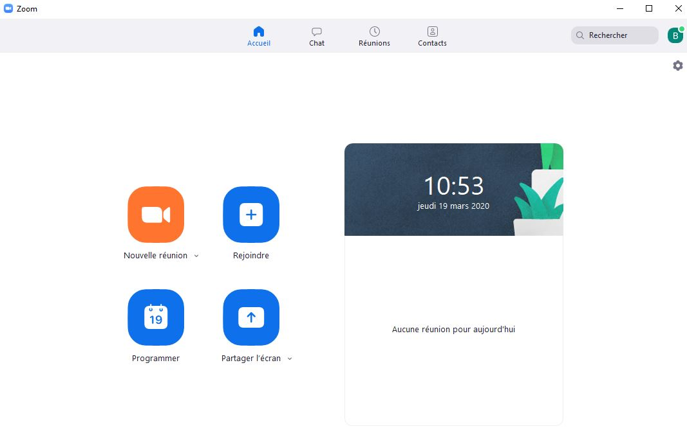
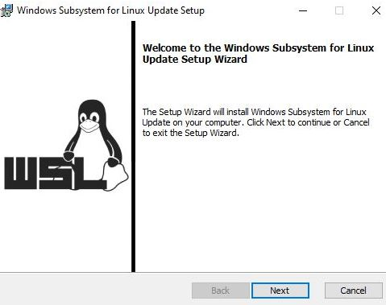
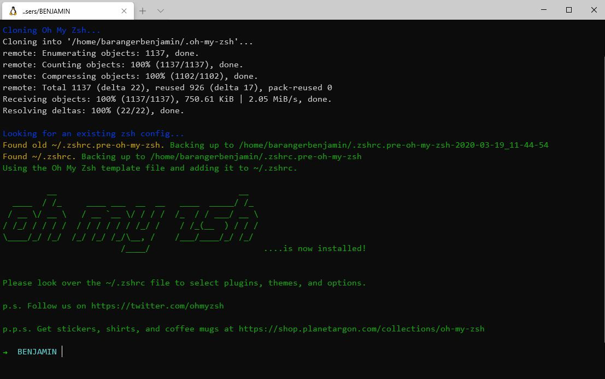

# Setup your machine!

Welcome to this setup where we are going to install the tools required to make your machine a true developer environment :muscle:


## Prerequisites

Before we start it is important you meet the following prerequisites to ensure the smooth running of the setup.
Take your time to read through everything and do not hesitate to ask for help if you feel stuck.
Ready? Let's go :sunglasses:


### Latest version of Windows

For this setup, you need to be running on the latest version of Windows.

This means that you need to be on Windows 10 with all the latest updates installed.

You can check your software version by clicking on **Start>Settings>System>About**, look where it says *edition*. If you see something that starts with "Windows 10..." you're good to go :muscle:.

Not the case? Don't panic :scream: You can always install windows 10 from [microsoft]( https://www.microsoft.com/en-gb/windows/get-windows-10) and click on *Check for Updates* then follow the instructions on screen. Come back to this setup when Windows 10 is installed.

Once you are sure that you're running Windows 10, you will need to check that your machine is running with all the latest updates. For this click on **Start>Settings>Updates & Security>Windows Update** then click on **Check updates**. If you have updates available please install them and repeat until it says that you are up to date :star:.


### The insider program

As a soon-to-be-developer, you always want to get the beta version of everything :nerd_face:.

This also applies to Windows, so we are going to sign up to their beta program, the **Insider program** .

Go to **Start>Settings>Updates & Security>Insider Program**

Click on **Get Started**. It will ask you to **Link an account**; follow the instructions on screen. You will be asked to choose your insider parameters, choose the second setting, the **fast** one :zap:. Then confirm and restart your computer when you are prompted to do so.

After your computer has restarted you can double-check that you are now part of the insider program by clicking on **Start>Settings>Updates & Security>Insider Program**, you should then be asked with the insider parameter that you chose earlier (**fast**).

By joining the insider program you have unlocked more content and updates - which we also want to install. Go to **Start>Settings>Updates & Security>Windows Update**, you should see new updates available.
:warning: These updates can be very long (more than 30 minutes) so make sure your computer has battery and that you won't have to close it during the installation :warning:

Start the updates and go grab a coffee :coffee: or tea :tea:.

After your computer has restarted, go to **Start>Settings>System>About**, this time check the *Version*, if it says at least 2004, you are good to go :sunglasses:.  

### Enable virtualization

Last requirement and the rest will be a breeze, we promise :crossed_fingers:. We need to enable the virtualization tool in the BIOS of your computer. 

You can go [here](https://en.wikipedia.org/wiki/BIOS) for more information about it, in short it is the program that is run by the motherboard in your computer when you start it. One issue is that the way to access that BIOS is different depending on the motherboard manufacturer. And because it would be too easy, each manufacturer calls the virtualization tool a different way as well :sweat_smile:.


Let's retrieve your motherboard model :muscle:

Click on **Start** and type **System Information** and open it.

Locate the *System Model* line, the value on the right is your motherboard model.

Now because everything is dependant of your motherboard, we will have to do a google search on how to enable virtualization with this model. 

:warning: We invite you to contact a teacher to do that operation together as it might be a bit scary. Choose the tool of your choice so the teacher can see your screen :man_mechanic:​ :warning:

If we take my example (sorry it is in French) :


So I googled "*mpg x570 plus enable virtualization*" and the first video in the results taught me how to do it. It is part of a developer life to search for information and apply them this way :nerd_face:.

Follow the instructions you found to enable virtualization and come back here, we will be waiting :smile:.  


## GitHub account

Have you signed up to GitHub? If not, [do it right away](https://github.com/join).

:point_right: **[Upload a picture](https://github.com/settings/profile)** and put your name correctly on your GitHub account. This is important as we'll use an internal dashboard with your avatars. Please do it **now**.


## Slack

Download and install the Slack app from [slack.com](https://slack.com/downloads/windows), and install it.

Launch the app and sign in to `lewagon-alumni` organization.

Make sure you upload a picture there.

You can also sign in to Slack on your iPhone or Android device!

The idea is that you'll have Slack open all day, so that you can share useful links / ask for help / decide where to go to lunch / etc.

In case of remote tickets, you will use Slack audio or video call to get helped. To ensure that everything is working fine, [test your camera and microphone](https://lewagon-alumni.slack.com/help/test/calls). If your browser is asking your permission to access your microphone and camera, click on yes.

After the test are finished, you should have green "All clear" messages at least for your microphone and camera. If not, ask a teacher.


## Alumni

Register as a Wagon alumni by going to [kitt.lewagon.com/onboarding](http://kitt.lewagon.com/onboarding). Select your batch, sign in with GitHub and enter all your information.

Your teacher will then validate that you are indeed part of the batch. You can ask him to do it as soon as you completed the registration form.

Once the teacher has approved your profile, go to your email inbox. You should have 2 emails:

- One from Slack, inviting you to the Le Wagon Alumni slack community (where you'll chat with your buddies and all the previous alumni). Click on **Join** and fill the information.
- One from GitHub, inviting you to `lewagon` team. **Accept it** otherwise you won't be able to access the lecture slides.


## Remote tools

To be able to interact when you are not on site, we will be using two tools.

### Zoom

Zoom is a video conferencing, go to [zoom page](https://zoom.us/download) and under *Zoom Client for Meetings* hit the **Download** button. open the executable you have just downloaded, a progress bar will appear then zoom will start. Click on **Connexion** and create an account. Once connected, zoom should look like this:



You can close zoom now :wink:.

### Teamviewer


For the most extreme bugs, a teacher might have to take control over your machine. to be able to do that we will need the Teamviewer tool. Go to the [teamviewer download page](https://www.teamviewer.com/en/download). It should automatically detect your exploitation system, if it doesn't don't hesitate to chose it from the list at the top of the page. Click on **Download Teamviewer**. Open the executable you just have downloaded, leave default settings and click on **Accept**. Progress bar will appear then Teamviewer will start when the installation is over. it should look like this:


You can close Teamviewer now :wink:.

:warning: We will not and cannot take control over your computer without your permission. Your teamviewer password changes every time you restart the application :thumbsup: We will only use this tool in last resort if a teacher needs hands on your machine. :warning:

To facilitate your video calls, please read this [article](https://martinfowler.com/articles/effective-video-calls.html) :camera: :microphone:  ​

## Windows Subsystem for Linux

WSL is the development environment you are going to use, you can learn more about WSL [here](https://docs.microsoft.com/en-us/windows/wsl/faq).

Click on **Start** and type **powershell**. Right click on **Windows Powershell (x86)** then click on **Run as administrator**. A blue box will appear, copy and paste the following command into that blue box:

(You will be asked to restart your computer, type **n** and **enter** to prevent your computer to restart).
```powershell
Enable-WindowsOptionalFeature -Online -FeatureName Microsoft-Windows-Subsystem-Linux
```


Run the following command:

```powershell
dism.exe /online /enable-feature /featurename:Microsoft-Windows-Subsystem-Linux /all /norestart
```

Then this one:

```powershell
dism.exe /online /enable-feature /featurename:VirtualMachinePlatform /all /norestart
```

You can now restart your computer.

Once your computer has restarted, click on **Start** and type **Microsoft Store**. Launch it. In the search bar, type **Ubuntu**. Click on the first result **Ubuntu**, not **Ubuntu 18.04 LTS**. Click on **Install**.

:warning: There is no progress bar for this installation, when it is done you will be asked, in the bottom right corner, to launch it.

The first time you open WSL - it should ask you to choose a username :warning: Your username should be **one word**, **downcased** with no **special characters** :warning:
Example: 'lewagon'

It will then ask you for a new password: when you type your password, :warning: it will not appear on the screen :warning: - and there will be no familiar typing indicator even though your keystrokes are being registered.  This is a security feature to mask not only your password as a whole but also its length!

You will have to retype your password then the installation will be successful.

You can close the terminal now that WSL is installed on your machine.


### Upgrade to WSL 2

By default WSL is in its first version, **1**.
Let's upgrade it to its **version 2**.
For this, we need to update its kernel, follow this [link](https://aka.ms/wsl2kernel). Click on the suggested link to download the update package. Once it has downloaded, open the program.


Click on **next** then **finish**.

We also need to make sur the its files are not compressed. Let's enable an option to let you see hidden files/folders :female_detective:. Click on **Start**; in the search bar type *folder* open the folder options. Click in the second tab **View** then under *Hidden files and folders* select **Show hidden files, folders, and drives**, click on **Apply** then **Ok** to close this window.

Open a file explorer, in the sidebar click on *This computer* >*Windows (C:)* > *Users* > *your username account* > *AppData* > *Local* > *Packages*. Here you need to locate the folder starting with **CanonicalGroupLimited.UbuntuonWindows** and open it.

Locate the **LocalState** folder and **right click** on it > **Properties** > **Advanced**

Make sure than the option **Compress content** is not checked. Click on **ok** to validate your choice. You will be asked to know if you want to apply only to this folder or also the subfolders. Please choose only this folder. 

Click on **Start**, in the search bar type *cmd*, open the **Command Prompt**
You will see all the WSL updates installed on your machine with the command

```wsl -l -v```
(translates to wsl list version)

You should see the Ubuntu version that you installed before.

Let's upgrade it to the version 2, by running the following command

```wsl --set-version Ubuntu 2```

A message will appear telling you that the conversion is in progress and that it will take a few minutes.

When you get the message *The conversion is complete*, paste the following command in the command prompt:

```wsl -l -v``` and double-check that the version is now the version 2.


## Windows Terminal


Let's install the latest terminal from Microsoft.

Click on **Start** and type **store** and open the **Microsoft Store**.

In the search bar, type **terminal**, in the result click on **Windows Terminal (Preview)**

Install it.

Click on **Start** and type **terminal**, open **Windows Terminal (Preview)**

This terminal allows you to open multiple terminal tools, including *Powershelll*, *Command Prompt* and *Ubuntu* that you have installed above :point_up_2: This terminal has tabs, locate the **down arrow** and click on it, it will show you all the terminal you can open from here, click on **Ubuntu**

Voilà, you are in your **Ubuntu Terminal** :confetti_ball: From now on every time we will refer to the terminal/console it will be this one.

# Setup instructions

The following instructions will help you to get ready for [Le Wagon](http://www.lewagon.org) fullstack bootcamp:

- Grab a text editor, where you'll spend your day and nights
- Install a package manager
- Pimp your Terminal
- Setup git and GitHub
- Install Ruby


## Git

To install `git`, first open a terminal. To open a terminal, hit **Start** and type **windows terminal** and click on **Windows Terminal (Preview)**.

Then copy **line by line** (this will help you identify which line fails if needed :thumbsup:) this line with `Ctrl` + `C`:

```bash
sudo apt update
sudo apt install -y apt-transport-https unzip gnome-terminal
sudo apt install -y git
```

You can paste by doing a right click in the terminal. Press *Enter*


## Visual Studio Code

Let's install the text editor in which you will write your code :nerd_face:

We will be using Visual Code Studio because of it's extensive compatibility with your terminal

Go the [visual studio code page](https://code.visualstudio.com/download) and click on Windows. The download of the tool should start automatically. Then open the executable and install it leaving all the default functionalities.

Let's add an extension to VS Code **Remote Development** to help VS Code interact with your terminal. Go to the [extension page](https://marketplace.visualstudio.com/items?itemName=ms-vscode-remote.vscode-remote-extensionpack) and click on **Install**. This will prompt you that VS Code is required to install this extension, click on **Continue**. You will get an alert asking you to open Visual Studio Code. The editor will open to the extension page


Click on **Install Locally**, then click on **Reload Required** 

Your code editor is ready :muscle:

## Oh-my-zsh - Fancy your Terminal

We will use the shell named `zsh` instead of `bash`, the default one.

```bash
sudo apt install -y zsh curl vim nodejs imagemagick jq
sh -c "$(curl -fsSL https://raw.githubusercontent.com/robbyrussell/oh-my-zsh/master/tools/install.sh)"
# it will ask for your session password
```

At then end; your terminal should look like this:



If it doesn't, **ask a teacher**.

Then run:

```bash
chmod 0770 ~/.oh-my-zsh/custom/plugins/zsh-syntax-highlighting
```


## Nodejs

Not for the beginning of the course, but let's get a head start and install 
nodejs, used for Javascript.

```bash
curl -sL https://deb.nodesource.com/setup_10.x | sudo -E bash -
sudo apt install -y nodejs
```

## Dotfiles (Standard configuration)

Hackers love to refine and polish their shell and tools. We'll start with a great default configuration provided by [Le Wagon](http://github.com/lewagon/dotfiles), stored on GitHub. As your configuration is personal, you need your own repository storing it, so you first need to fork it to your GitHub account.

:arrow_right: [Click here to **fork**](https://github.com/lewagon/dotfiles/fork) the `lewagon/dotfiles` repository to your account.

You should arrive on a page that looks like this. Make sure to **select your GitHub account**.


Forking means that it will create a new repo in your GitHub account, identical to the original one. You'll have a new repository on your GitHub account, `your_github_username/dotfiles`. We need to fork because each of you will need to put specific information (e.g. your name) in those files.

Open your terminal. **Don't blindly copy paste this line**, replace `replace_this_with_your_github_username` with *your*
own github usernickname.

```bash
export GITHUB_USERNAME=replace_this_with_your_github_username

# Example:
#   export GITHUB_USERNAME=ssaunier
```

Now copy/paste this very long line in your terminal. Do **not** change this one.

```bash
mkdir -p ~/code/$GITHUB_USERNAME && cd $_ && git clone git@github.com:$GITHUB_USERNAME/dotfiles.git
```

Run the `dotfiles` installer.

```bash
cd ~/code/$GITHUB_USERNAME/dotfiles
zsh install.sh
```

Then run the git installer:

```bash
cd ~/code/$GITHUB_USERNAME/dotfiles
zsh git_setup.sh
```

:point_up: This will **prompt** you for your name (`Firstname Lastname`) and your email.

Be careful, you **need** to put the **same** email as the one you sign up with on GitHub.

Copy the following command in your terminal to open the `~/.zshrc` profile file in Visual Code Studio:
```bash
code ~/.zshrc
```
Locate the line `# Actually load Oh-My-Zsh` and **above it** write the following line:
```bash
ZSH_DISABLE_COMPFIX=true
```


You don't want to be asked for your passphrase every time you communicate with a distant repository. So you need to add the plugin `ssh-agent` to `oh my zsh`.
Spot the line starting with `plugins=` Then add `ssh-agent` to the plugins list. The list should look like:

```
plugins=(gitfast last-working-dir common-aliases sublime zsh-syntax-highlighting history-substring-search ssh-agent)
```
Save the `.zshrc` file with `Ctrl` + `S` and close Visual Code Studio.


## Installing Ruby (with [rbenv](https://github.com/sstephenson/rbenv))

First we need to clean up any previous Ruby installation you might have:

```bash
rvm implode && sudo rm -rf ~/.rvm
# If you got "zsh: command not found: rvm", carry on. It means `rvm` is not
# on your computer, that's what we want!

rm -rf ~/.rbenv
```

Then in the terminal, run:

```bash
sudo apt install -y build-essential tklib zlib1g-dev libssl-dev libffi-dev libxml2 libxml2-dev libxslt1-dev libreadline-dev
sudo apt clean
git clone https://github.com/rbenv/rbenv.git ~/.rbenv
git clone https://github.com/rbenv/ruby-build.git ~/.rbenv/plugins/ruby-build
```

**Close your terminal and open it again** (Alt+F4 and restart it). If you get a warning, just **ignore** it from now (Ruby is not installed yet).


Now, you are ready to install the latest ruby version, and set it as the default version.

Run this command, it will **take a while (5-10 minutes)**

```bash
rbenv install 2.6.5
```

Once the ruby installation is done, run this command to tell the system
to use the 2.6.5 version by default.

```bash
rbenv global 2.6.5
```

Then **restart** your Terminal again (close it and reopen it).

```bash
ruby -v
```

You should see something starting with `ruby 2.6.5p`. If not, ask a teacher.

## Installing some gems

---

:warning: If you are in **China** :cn:, you should update the way we'll install gem with the following commands. If you are not in China, well just skip this and go directly to the next `gem install` command!

```bash
# China only!
gem sources --remove https://rubygems.org/
gem sources -a https://gems.ruby-china.com/
gem sources -l
# *** CURRENT SOURCES ***
# https://gems.ruby-china.com/
# Ruby-china.com must be in the list now
```

---

All, please run the following line:

```bash
gem install rake bundler rspec rubocop rubocop-performance pry pry-byebug hub colored octokit
```

**Never** install a gem with `sudo gem install`! Even if you stumble upon a Stackoverflow answer
(or the Terminal) telling you to do so.


To be sure that you can interact with your browser installed on Windows from your new Ubuntu terminal:
Run the appropriate command in your terminal:

If you're using Google Chrome.
```bash
echo "export BROWSER=/mnt/c/Program\ Files\ \(x86\)/Google/Chrome/Application/chrome.exe" >> ~/.zshrc
```
If you're using Mozilla Firefox.
```bash
echo "export BROWSER=/mnt/c/Program\ Files\ \(x86\)/Mozilla\ Firefox/firefox.exe" >> ~/.zshrc
```

Restart your terminal.


## Postgresql

In a few weeks, we'll talk about SQL and Databases and you'll need something called Postgresql,
an open-source robust and production-ready database. Let's install it now.


```bash
sudo apt install -y postgresql postgresql-contrib libpq-dev build-essential
sudo /etc/init.d/postgresql start
sudo -u postgres psql --command "CREATE ROLE `whoami` LOGIN createdb;"
```

You can configure PostgreSQL to autostart, so you don't have to execute `sudo /etc/init.d/postgresql start` each time you open a new terminal:

```bash
sudo echo "`whoami` ALL=NOPASSWD:/etc/init.d/postgresql start" | sudo tee /etc/sudoers.d/postgresql
sudo chmod 440 /etc/sudoers.d/postgresql
echo "sudo /etc/init.d/postgresql start" >> ~/.zshrc
```


## Check-up

Let's check if you successfully installed everything.

Quit all opened Terminal, open a new one and run the following commands:

```bash
curl -Ls https://raw.githubusercontent.com/lewagon/setup/master/check.rb > _.rb && ruby _.rb || rm _.rb
```

It should tell you if your workstation is ready :) If not, ask a teacher.


