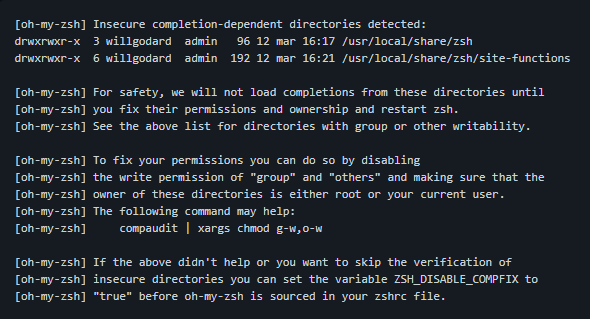

Hello and welcome to this Apple M1 Cheatsheet.

The goal is to gather here all tips and known issues about the new processor from Apple!

- [Issues](https://github.com/lewagon/setup/blob/master/apple_m1_cheatsheet.md#issues)
  - [Install brew](https://github.com/lewagon/setup/blob/master/apple_m1_cheatsheet.md#install-brew)
  - [ZSH Permissions](https://github.com/lewagon/setup/blob/master/apple_m1_cheatsheet.md#zsh-permissions)
- [Tips](https://github.com/lewagon/setup/blob/master/apple_m1_cheatsheet.md#tips)
  

# Issues

## Install Brew

To get Homebrew working, let’s install it using Rosetta:
```bash
arch -x86_64 /bin/bash -c "$(curl -fsSL https://raw.githubusercontent.com/Homebrew/install/master/install.sh)"
```

## ZSH Permissions

Issue with Zsh setup (with MacBookAir M1):

Here is the error message displayed after installing Zsh :





Solution is :

- Open Sublime text app then go to File > Open
- Browse to /Users/your_name et press cmd + shift + "." to display hidden files and open .zshrc
- Past the line ZSH_DISABLE_COMPFIX=true before the line source $ZSH/oh-my-zsh.sh
- Save the file and restart your terminal: cmd + "Q"
- Original solution found [here](https://github.com/ohmyzsh/ohmyzsh/issues/6835#issuecomment-390216875)

# Tips