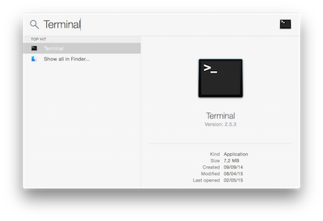
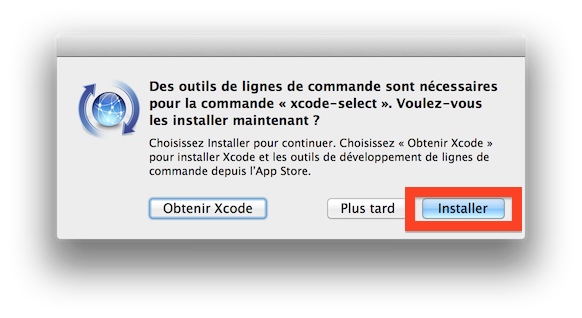
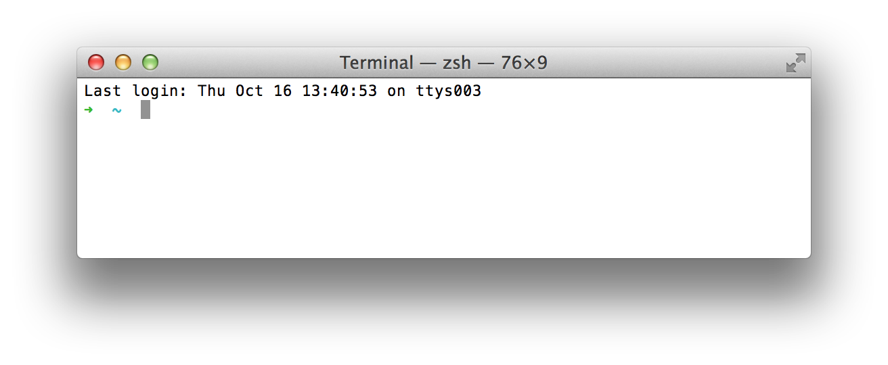
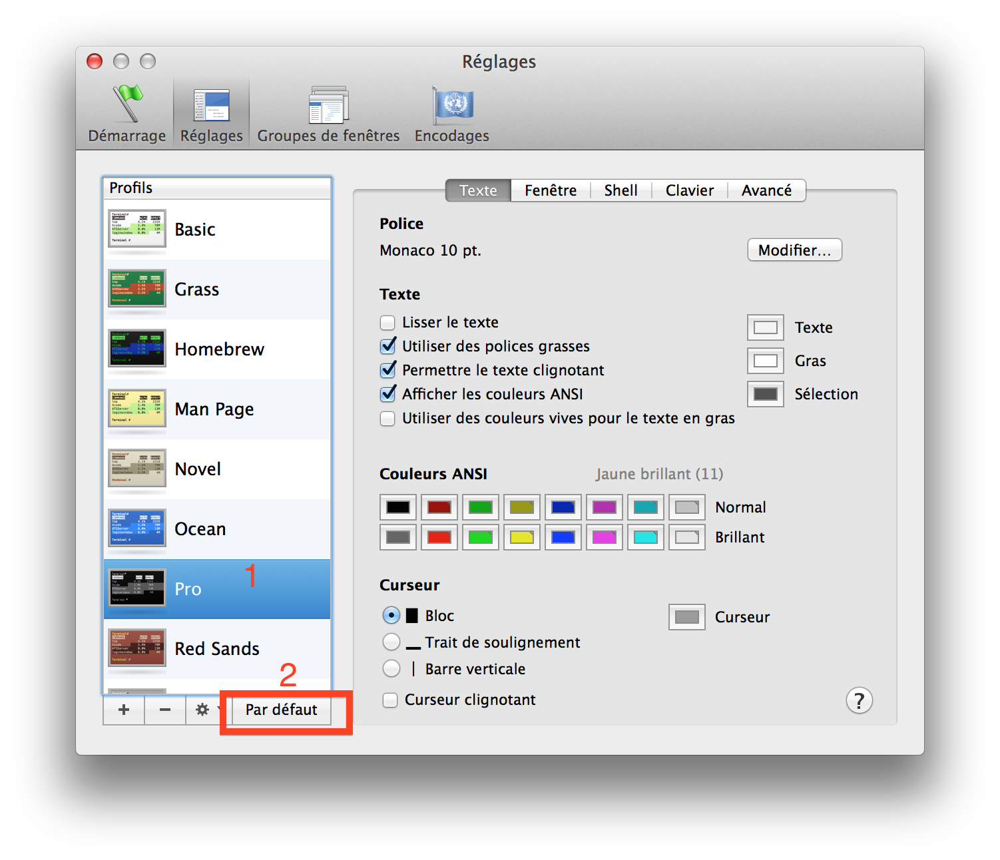
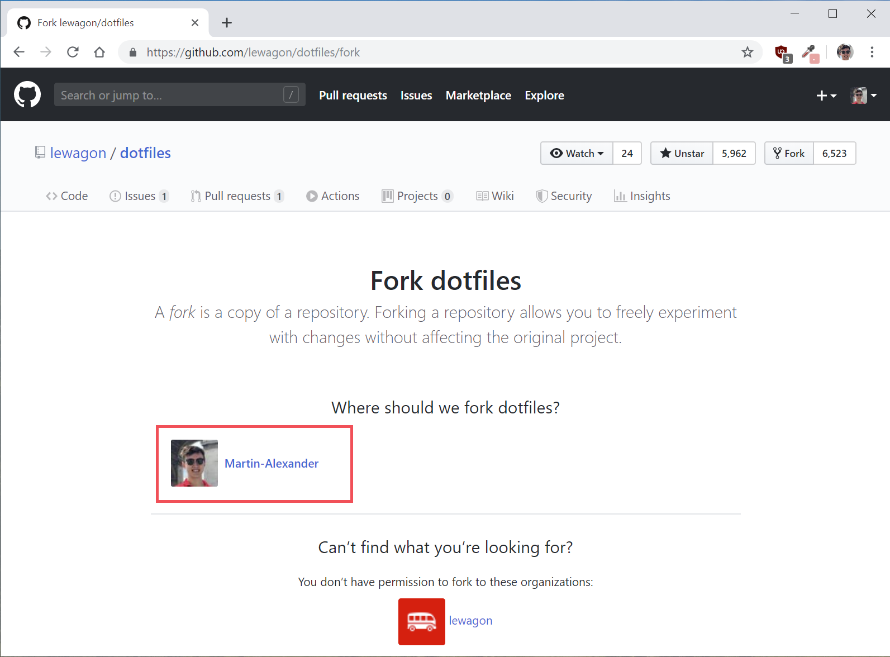

# Setup instructions

The following instructions will help you to get ready for [Le Wagon](http://www.lewagon.org) fullstack bootcamp:

- Grab a text editor, where you'll spend your day and nights
- Install a package manager
- Pimp your Terminal
- Setup git and GitHub
- Install Ruby


## Command Line Tools

Open the Terminal (click the magnifying glass icon in the top right corner of your screen and type `Terminal`):



Copy-paste the following command in the terminal and hit Enter.

```bash
xcode-select --install
```

If you'll receive the following message, you can just skip this step and go to next step.

```
# command line tools are already installed, use "Software Update" to install updates
```

Otherwise, it will open a window asking you if you want to install some software. Accept and wait. If it fails, try again the command line above, sometimes the Apple servers are overloaded.



While it's downloading, you can go on with configuring your GitHub account, but **stop** before Homebrew. You'll need the command line tools installed for that step.


## GitHub account

Have you signed up to GitHub? If not, [do it right away](https://github.com/join).

:point_right: **[Upload a picture](https://github.com/settings/profile)** and put your name correctly on your GitHub account. This is important as we'll use an internal dashboard with your avatars. Please do it **now**.


## Homebrew

On Mac, you need to install [Homebrew](http://brew.sh/) which is a Package Manager.
It will be used as soon as we need to install some software.
To do so, open your Terminal and run:

```bash
ruby -e "$(curl -fsSL https://raw.githubusercontent.com/Homebrew/install/master/install)"
```

This will ask for your confirmation (hit `Enter`) and your laptop session password.

If you already have Homebrew, it will tell you so, that's fine, go on.

Then install some useful software:

```bash
brew update
```

If you get a `/usr/local must be writable` error, just run this:

```bash
sudo chown -R $USER:admin /usr/local
brew update
```

Error message or not, proceed running the following in the terminal (you can copy / paste all the lines at once).

```bash
function install_or_upgrade { brew ls | grep $1 > /dev/null; if (($? == 0)); then brew upgrade $1; else brew install $1; fi }
install_or_upgrade "git"
install_or_upgrade "wget"
install_or_upgrade "imagemagick"
install_or_upgrade "jq"
install_or_upgrade "openssl"
```


## Sublime Text 3 - Your text editor

A text editor is one of the most important tools of a developer. Go to [this page](http://www.sublimetext.com/3) and download **Sublime Text 3** for OS X. Install it (double click the downloaded file and drag & drop the app **into** the `Applications` folder, **don't skip this**). If you had Sublime Text 2 installed before, please uninstall it (by dragging/dropping it to the Trash).

Sublime Text is free without any time limitation but a popup will appear every ten saves to remind you there is a license to buy. You can hit `Esc` when this happens, but feel free to buy Sublime Text if you really like this one (there are alternatives).

Again, make sure that Sublime Text is there, not in the disk image you downloaded. To make sure it's correct, once Sublime Text is installed, unmount the "Sublime Text 3" disk in the left panel of Finder. Finder will complain if something went wrong. Ask a teacher.


## Oh-my-zsh - Fancy your Terminal

We will use the shell named `zsh` instead of `bash`, the default one.

```bash
sh -c "$(curl -fsSL https://raw.githubusercontent.com/robbyrussell/oh-my-zsh/master/tools/install.sh)"
```

Be careful, at the end of this script, it will prompt for your laptop password again. You have to write it correctly (you will not see it when you type) and hit `Enter`. You should get something like:

```bash
         __                                     __
  ____  / /_     ____ ___  __  __   ____  _____/ /_
 / __ \/ __ \   / __ `__ \/ / / /  /_  / / ___/ __ \
/ /_/ / / / /  / / / / / / /_/ /    / /_(__  ) / / /
\____/_/ /_/  /_/ /_/ /_/\__, /    /___/____/_/ /_/
                        /____/                       ....is now installed!
````

Now quit the Terminal (`⌘` + `Q`), and restart it.

You should see something like this:



If not, **stop right away** and call a teacher.

On Mac, open `Terminal > Preferences` and set the "Pro" theme as default in `Profiles` (*`Réglages`* in French).



Quit and relaunch the Terminal. It should now have a nice black background, more easy on the eyes.


## GitHub

We need to generate SSH keys which are going to be used by GitHub and Heroku
to authenticate you. Think of it as a way to log in, but different from the
well known username/password couple. If you already generated keys
that you already use with other services, you can skip this step.

Open a terminal and type this, replacing the email with **yours** (the
same one you used to create your GitHub account). It will prompt
for information. Just press enter until it asks for a **passphrase**.

```bash
mkdir -p ~/.ssh && ssh-keygen -t ed25519 -o -a 100 -f ~/.ssh/id_ed25519 -C "TYPE_YOUR_EMAIL@HERE.com"
```

**NB:** when asked for a passphrase, put something you want (and that you'll remember),
it's a password to protect your private key stored on your hard drive. You'll type,
nothing will show up on the screen, **that's normal**. Just type the passphrase,
and when you're done, press `Enter`.

Then you need to give your **public** key to GitHub. Run:

```bash
cat ~/.ssh/id_ed25519.pub
```

It will prompt on the screen the content of the `id_ed25519.pub` file. Copy that text,
then go to [github.com/settings/ssh](https://github.com/settings/ssh). Click on
**Add SSH key**, fill in the Title with your computer name, and paste the **Key**.
Finish by clicking on the **Add key** green button.

To check that this step is completed, in the terminal run this. You will be
prompted a warning, type `yes` then `Enter`.

```bash
ssh -T git@github.com
```

If you see something like this, you're done!

```bash
# Hi --------! You've successfully authenticated, but GitHub does not provide shell access
```

If it does not work, try running this before trying again the `ssh -T` command:

```bash
ssh-add ~/.ssh/id_ed25519
```

Don't be in a rush, take time to [read this article](http://sebastien.saunier.me/blog/2015/05/10/github-public-key-authentication.html) to get a better
understanding of what those keys are used for.


## Dotfiles (Standard configuration)

Hackers love to refine and polish their shell and tools. We'll start with a great default configuration provided by [Le Wagon](http://github.com/lewagon/dotfiles), stored on GitHub. As your configuration is personal, you need your own repository storing it, so you first need to fork it to your GitHub account.

:arrow_right: [Click here to **fork**](https://github.com/lewagon/dotfiles/fork) the `lewagon/dotfiles` repository to your account.

You should arrive on a page that looks like this. Make sure to **select your GitHub account**.



Forking means that it will create a new repo in your GitHub account, identical to the original one. You'll have a new repository on your GitHub account, `your_github_username/dotfiles`. We need to fork because each of you will need to put specific information (e.g. your name) in those files.

Open your terminal. **Don't blindly copy paste this line**, replace `replace_this_with_your_github_username` with *your*
own github usernickname.

```bash
export GITHUB_USERNAME=replace_this_with_your_github_username

# Example:
#   export GITHUB_USERNAME=ssaunier
```

Now copy/paste this very long line in your terminal. Do **not** change this one.

```bash
mkdir -p ~/code/$GITHUB_USERNAME && cd $_ && git clone git@github.com:$GITHUB_USERNAME/dotfiles.git
```

Run the `dotfiles` installer.

```bash
cd ~/code/$GITHUB_USERNAME/dotfiles
zsh install.sh
```

Then run the git installer:

```bash
cd ~/code/$GITHUB_USERNAME/dotfiles
zsh git_setup.sh
```

:point_up: This will **prompt** you for your name (`Firstname Lastname`) and your email.

Be careful, you **need** to put the **same** email as the one you sign up with on GitHub.

Please now **quit** all your opened terminal windows.

### Sublime Text auto-configuration

Open a new terminal and type this:

```bash
stt
```

It will **open Sublime Text in the context of your current folder**. That's how we'll use it.

**Close Sublime text** and open it again:

```bash
stt
```

**Wait 1 minute** for additional packages to be automatically installed (New tabs with text will automatically open, containing documentation for each new package installed). TO follow package installation, you can go to `View > Show console`.

To check if plugins are installed, open the Command Palette (`⌘` + `⇧` + `P` on OSX, `Ctrl` + `⇧` + `P` on Linux), type in `Packlist` and then `Enter`, you should see a couple of packages installed (like [Emmet](http://emmet.io/)).

If you don't, please install all of them manually. The list is referenced [here](https://github.com/lewagon/dotfiles/blob/master/Package%20Control.sublime-settings).

When it's done, you can close Sublime Text.


### SSH Passphrase

In a terminal window, launch this command:

```bash
sw_vers
```

If your OS version (`ProductVersion` line) is greater or equal than **10.12**, you may proceed with the rest of this section. :warning: Otherwise, skip it and go directly to the Ruby install.

In order not to re-type your SSH passphrase at every `git push`, you can add these lines to the `~/.ssh/config` file:

```bash
touch ~/.ssh/config  # Creates the file if it does not exist
st ~/.ssh/config     # Opens the file in Sublime text
```

And then add these 3 lines to the file. **Save**.

```bash
Host *
  AddKeysToAgent yes
  UseKeychain yes
```


## Installing Ruby (with [rbenv](https://github.com/sstephenson/rbenv))

First we need to clean up any previous Ruby installation you might have:

```bash
rvm implode && sudo rm -rf ~/.rvm
# If you got "zsh: command not found: rvm", carry on. It means `rvm` is not
# on your computer, that's what we want!

sudo rm -rf $HOME/.rbenv /usr/local/rbenv /opt/rbenv /usr/local/opt/rbenv
```

Now let's get [`rbenv`](https://github.com/rbenv/rbenv) and [`ruby-build`](https://github.com/rbenv/ruby-build) packages from Homebrew, they'll be useful.

```bash
brew uninstall --force rbenv ruby-build
```

Then quit **all your opened terminal windows** (Cmd + Q) and restart one. Then run:

```bash
brew install rbenv
```

Again, quit all your terminal windows and restart.


Now, you are ready to install the latest ruby version, and set it as the default version.

Run this command, it will **take a while (5-10 minutes)**

```bash
rbenv install 2.6.5
```

Once the ruby installation is done, run this command to tell the system
to use the 2.6.5 version by default.

```bash
rbenv global 2.6.5
```

Then **restart** your Terminal again (close it and reopen it).

```bash
ruby -v
```

You should see something starting with `ruby 2.6.5p`. If not, ask a teacher.

## Installing some gems

---

:warning: If you are in **China** :cn:, you should update the way we'll install gem with the following commands. If you are not in China, well just skip this and go directly to the next `gem install` command!

```bash
# China only!
gem sources --remove https://rubygems.org/
gem sources -a https://gems.ruby-china.com/
gem sources -l
# *** CURRENT SOURCES ***
# https://gems.ruby-china.com/
# Ruby-china.com must be in the list now
```

---

All, please run the following line:

```bash
gem install rake bundler rspec rubocop rubocop-performance pry pry-byebug hub colored octokit
```

**Never** install a gem with `sudo gem install`! Even if you stumble upon a Stackoverflow answer
(or the Terminal) telling you to do so.


## Postgresql

In a few weeks, we'll talk about SQL and Databases and you'll need something called Postgresql,
an open-source robust and production-ready database. Let's install it now.

```bash
brew install postgresql
brew services start postgresql
```

Once you've done that, let's check if it worked:

```bash
psql -d postgres
```

If you enter a new prompt like this one, you're good!

```bash
psql (9.5.3)
Type "help" for help.

postgres=#
```

To quit it, type `\q` then `Enter`.


## Security

It is mandatory that you protect your session behind a password.If it is not already the case, go to ` > System Preferences > Users & Groups`, and change your account password. You should also go to ` > System Preferences > Security > General`. You should require a password `5 seconds` after sleep or screen saver begins.

You can also go to ` > System Preferences > Mission Control`, and click on the `Hot Corners` button at the bottom left. Choose for the bottom right corner to start the screen saver. That way, when you leave your desk, you can quickly lock you screen by putting your mouse in the bottom right corner. 5 seconds after, your Macbook will be locked and will ask for a password to get back on the session.


## Check-up

Let's check if you successfully installed everything.

Quit all opened Terminal, open a new one and run the following commands:

```bash
curl -Ls https://raw.githubusercontent.com/lewagon/setup/master/check.rb > _.rb && ruby _.rb || rm _.rb
```

It should tell you if your workstation is ready :) If not, ask a teacher.


## Alumni

Register as a Wagon alumni by going to [kitt.lewagon.com/onboarding](http://kitt.lewagon.com/onboarding). Select your batch, sign in with GitHub and enter all your information.

Your teacher will then validate that you are indeed part of the batch. You can ask him to do it as soon as you completed the registration form.

Once the teacher has approved your profile, go to your email inbox. You should have 2 emails:

- One from Slack, inviting you to the Le Wagon Alumni slack community (where you'll chat with your buddies and all the previous alumni). Click on **Join** and fill the information.
- One from GitHub, inviting you to `lewagon` team. **Accept it** otherwise you won't be able to access the lecture slides.


## Slack

[Download](https://itunes.apple.com/fr/app/slack/id803453959?mt=12) the Slack native app from the mac App Store, and sign in to `lewagon-alumni` organization.

Make sure you upload a picture there.

You can also sign in to Slack on your iPhone or Android device!

The idea is that you'll have Slack open all day, so that you can share useful links / ask for help / decide where to go to lunch / etc.

Enjoy your ride with Le Wagon :)


## Keyboard

As you become a programmer, you'll understand that leaving the keyboard takes a lot of time,
so you'll want to minimize using the trackpad or the mouse. Here are a few tricks on OSX
to help you do that:

### Keyboard speed

Go to  > System Preferences > Keyboard. Set `Key Repeat` to the fastest position (to the right) and
`Delay Until Repeat` to the shortest position (to the right).

### Full Keyboard Access

Go to  > System Preferences > Keyboard. Click on the third tab (Shortcuts). At the bottom of the
pane, click the radio button `All controls`. This way when you get a dialog with several options,
you'll be able to type `Enter` to confirm, or `Space` to choose the cancel option. If you have more than
two options, you can use tab to circle between them.

### macOS For hackers

[Read this script](https://github.com/mathiasbynens/dotfiles/blob/master/.macos) and cherry-pick some stuff you think will suit you.
For instance, you can type in the terminal this one:

```bash
# Expanding the save panel by default
defaults write NSGlobalDomain NSNavPanelExpandedStateForSaveMode -bool true
defaults write NSGlobalDomain PMPrintingExpandedStateForPrint -bool true
defaults write NSGlobalDomain PMPrintingExpandedStateForPrint2 -bool true

# Save screenshots to the Desktop (or elsewhere)
defaults write com.apple.screencapture location "${HOME}/Desktop"

# etc..
```


