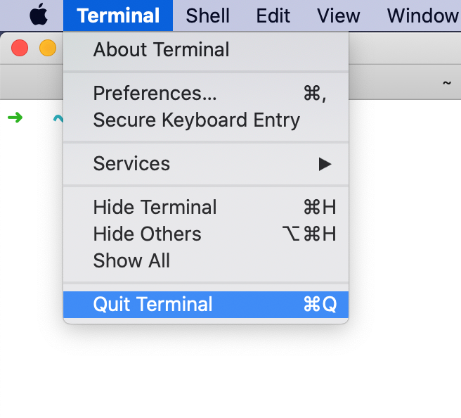

# Setup instructions

The following instructions will help you to get ready for [Le Wagon](http://www.lewagon.org) fullstack bootcamp:

- Grab a text editor, where you will spend your days and nights
- Install a package manager
- Pimp your Terminal
- Setup git and GitHub
- Install Ruby


## Remote tools

To be able to interact when we are not in the same physical room, we will be using two tools:

### Zoom

⚠️ If you already have Zoom installed, please make sure that the version is at least **5.4**. Otherwise, you will not be able to use breakout rooms in order to work with your buddy.

Zoom is a video conferencing tool. To create an account and install the app, go to [https://zoom.us/download](https://zoom.us/download) and under **Zoom Client for Meetings** click the **Download** button. Open the file you have just downloaded. A progress bar will appear, then Zoom will start. Click on **Connection** and create an account with the **Sign Up Free** option:


Once connected, you should see:


You can close Zoom now.

### Teamviewer

For the most complicated problems, a teacher might have to take control of your computer. To be able to do this, we will need to use the Teamviewer tool. Go to the [Teamviewer download page](https://www.teamviewer.com/en/download). It should automatically detect your operating system. If it doesn't, choose your operating system from the list at the top of the page. Click on **Download Teamviewer** and open the file you just have downloaded. Leave the default settings as they are and click on **Accept**. A progress bar will appear, then Teamviewer will start when the installation is over. It should look like this:


This will only be used as last resort when debugging becomes too tricky through spoken word. Nobody will ever be able to take control of your screen without you knowing it :ok_hand:

You can close Teamviewer now.

If you are not familiar with video calls, here is a great [article](https://martinfowler.com/articles/effective-video-calls.html) full of good practices :camera: :microphone:


## Checking your computer for Apple Silicon (Apple M1 chips)

If you bought your computer after late 2020, chances are your Apple laptop uses Apple silicon instead of Intel processors. Let's find out...

Open a new Terminal window from Applications > Utilities or search with [Spotlight](https://support.apple.com/en-gb/HT204014):


Copy-paste the following command in the terminal and hit `Enter` to execute the command.

``` bash
if [[ `uname -m` == 'arm64' ]]; then
  echo "Your computer uses Apple Silicon 🌟"
else
  echo "Your computer has an Intel processor 🤖"
fi
```

☝️ The result of the command should indicate whether your computer uses Apple Silicon.

If your computer uses Apple Silicon, proceed with the next section. Otherwise, you can skip to the section below.

## Setup for Apple Silicon

### Uninstall Homebrew

We need to uninstall Homebrew in case a native version was installed.

Execute the following command in the terminal:

``` bash
/bin/bash -c "$(curl -fsSL https://raw.githubusercontent.com/Homebrew/install/HEAD/uninstall.sh)"
```

If brew was not installed you will get the message `brew: command not found!`

### Configure Terminal for Rosetta

Open the Finder app (or search for it with [Spotlight](https://support.apple.com/en-gb/HT204014)).

Go to Applications > Utilities.

Duplicate the Terminal app (select it, then Cmd + C, Cmd + V), and rename a copy as Terminal Rosetta.

Press Cmd + I on the Terminal Rosetta app, then check the box "Run under Rosetta".

⚠️ From now on during the bootcamp, whenever you are asked to open a Terminal, you will use the **Terminal Rosetta** app.

Launch the Terminal app. You will be prompted to install Rosetta. Click Install.


## A note about quitting apps on a Mac

Clicking the little red cross in the top left corner of the application window on a Mac **does not really quit it**, it just closes an active window. To quit the application _for real_ either press `Cmd + Q` when the application is active, or navigate to `APP_NAME` -> `Quit` in the menu bar.



During this setup you will be asked to **quit and re-open** applications multiple times, please make sure you do it properly :pray:

## Command Line Tools

Open a new Terminal window from Applications > Utilities or searching with [Spotlight](https://support.apple.com/en-gb/HT204014):


Copy-paste the following command in the terminal and hit `Enter` to execute the command.

```bash
xcode-select --install
```

If you receive the following message, you can just skip this step and go to next step.

```
# command line tools are already installed, use "Software Update" to install updates
```

Otherwise, it will open a window asking you if you want to install some software. Accept and wait. If it fails, try again `xcode-select --install`, sometimes the Apple servers are overloaded.


While it's downloading, you can go on with configuring your GitHub account, but **stop** before Homebrew. You'll need the command line tools installed for that step.

If you receive the following message, you need to update the sofware update catalog.

```
Xcode is not currently available from the Software Update server
```

In this case, copy-paste the following command in the terminal and hit Enter.

```bash
sudo softwareupdate --clear-catalog
```

Once this is done, you can try to install again (copy-paste the following command and hit enter).

```bash
xcode-select --install
```

Then follow the previous instructions for this command.


## GitHub account

Have you signed up to GitHub? If not, [do it right away](https://github.com/join).

:point_right: **[Upload a picture](https://github.com/settings/profile)** and put your name correctly on your GitHub account. This is important as we'll use an internal dashboard with your avatars. Please do this **now**, before you continue with this guide.


## Homebrew

On Mac, you need to install [Homebrew](http://brew.sh/) which is a Package Manager.
It will be used as soon as we need to install some software.
To do so, open your Terminal and run:

```bash
/bin/bash -c "$(curl -fsSL https://raw.githubusercontent.com/Homebrew/install/HEAD/install.sh)"
```

This will ask for your confirmation (hit `Enter`) and your **macOS user account password** (the one you use to [log in](https://support.apple.com/en-gb/HT202860) when you reboot your Macbook).
:warning: When typing a password in the Terminal, you will **not** get a visual feedback (something like `*****`), this is **normal**!! Type the password and confirm by typing `Enter`.

If you already have Homebrew, it will tell you so, that's fine, go on.

Then install some useful software:

```bash
brew update
```

If you get a `/usr/local must be writable` error, just run this:

```bash
sudo chown -R $USER:admin /usr/local
brew update
```

Error message or not, proceed running the following in the terminal (you can copy / paste all the lines at once).

```bash
brew upgrade git         || brew install git
brew upgrade gh          || brew install gh
brew upgrade wget        || brew install wget
brew upgrade imagemagick || brew install imagemagick
brew upgrade jq          || brew install jq
brew upgrade openssl     || brew install openssl
```


## Sublime Text 3 - Your text editor

A text editor is one of the most important tools of a developer. Go to [this page](http://www.sublimetext.com/3) and download **Sublime Text 3** for OS X. Install it (double click the downloaded file and drag & drop the app **into** the `Applications` folder, **don't skip this**). If you had Sublime Text 2 installed before, please uninstall it (by dragging/dropping it to the Trash).

Sublime Text is free without any time limitation but a popup will appear every ten saves to remind you there is a license to buy. You can hit `Esc` when this happens, but feel free to buy Sublime Text if you really like this one (there are alternatives).

Again, make sure that Sublime Text is there, not in the disk image you downloaded. To make sure it's correct, once Sublime Text is installed, unmount the "Sublime Text 3" disk in the left panel of Finder. Finder will complain if something went wrong. Ask a teacher.


## Oh-my-zsh - Fancy your Terminal

We will use the shell named `zsh` instead of `bash`, the default one, alongside with useful and fancy [`oh-my-zsh`](https://ohmyz.sh/) plugins:

```bash
sh -c "$(curl -fsSL https://raw.github.com/ohmyzsh/ohmyzsh/master/tools/install.sh)"
```

Be careful, at the end of this script, it will prompt for your macOS user account password again (Remember! No visual feedback!). You should get something like:

```bash
         __                                     __
  ____  / /_     ____ ___  __  __   ____  _____/ /_
 / __ \/ __ \   / __ `__ \/ / / /  /_  / / ___/ __ \
/ /_/ / / / /  / / / / / / /_/ /    / /_(__  ) / / /
\____/_/ /_/  /_/ /_/ /_/\__, /    /___/____/_/ /_/
                        /____/                       ....is now installed!
````

Now quit the Terminal (`⌘` + `Q`) and restart it.

You should see something like this:


If not, **stop right away** and call a teacher.

On Mac, open `Terminal > Preferences` and set the "Pro" theme as default in `Profiles` (*`Réglages`* in French).


**Quit** and restart the Terminal. It should now have a nice black background, more easy on the eyes.

:bulb: There are plenty of themes available on the Internet like [MaterialDark](https://github.com/lysyi3m/macos-terminal-themes#materialdark-download) if you fancy trying another one. That's something you can configure later during the day or come back to it if you are done with your setup early. Please carry on with the Github setup!


## GitHub

We need to generate SSH keys which are going to be used by GitHub and Heroku
to authenticate you. Think of it as a way to log in, but different from the
well known username/password couple. If you already generated keys
that you already use with other services, you can skip this step.

Open a terminal and type this, replacing the email with **yours** (the
same one you used to create your GitHub account). It will prompt
for information. Just press enter until it asks for a **passphrase**.

```bash
mkdir -p ~/.ssh && ssh-keygen -t ed25519 -o -a 100 -f ~/.ssh/id_ed25519 -C "TYPE_YOUR_EMAIL@HERE.com"
```

**NB:** when asked for a passphrase, put something you want (and that you'll remember),
it's a password to protect your private key stored on your hard drive. You'll type,
nothing will show up on the screen, **that's normal**. Just type the passphrase,
and when you're done, press `Enter`.

Then you need to give your **public** key to GitHub. Run:

```bash
cat ~/.ssh/id_ed25519.pub
```

It will prompt on the screen the content of the `id_ed25519.pub` file.


>\- Copy that text from `ssh` to the end of your email address
>\- Go to [github.com/settings/ssh](https://github.com/settings/ssh)
>\- Click on the green button `New SSH key`
>\- Fill in the Title with your computer name (`Macbook Pro` for instance)
>\- Paste the **Key**
>\- Finish by clicking on the **Add key** green button.


To check that this step is completed, in the terminal run this.

```bash
ssh -T git@github.com
```

:warning: You will be prompted a warning, type `yes` then `Enter`.

This is the expected result:

```
# Hi --------! You've successfully authenticated, but GitHub does not provide shell access
```

&nbsp;

&nbsp;&nbsp;&nbsp; :white_check_mark: If you got this message, the keys were added successfully!

&nbsp;&nbsp;&nbsp; :x: If you encountered an error, you will have to try again. Do not hesitate to *contact a teacher*.


---

#### :wrench: Troubleshooting

<details>
  <summary>If <code>ssh -T git@github.com</code> does not work</summary>

  &nbsp;


  Try running this command before trying again:

  ```bash
  ssh-add ~/.ssh/id_ed25519
  ```
  </details>

---


Don't be in a rush, take time to [read this article](http://sebastien.saunier.me/blog/2015/05/10/github-public-key-authentication.html) to get a better
understanding of what those keys are used for.


## GitHub CLI

CLI is the acronym of [Command-line Interface](https://en.wikipedia.org/wiki/Command-line_interface).

In this section, we will install [GitHub CLI](https://cli.github.com/) to perform useful actions with GitHub data directly from the Terminal.

It should already be installed on your laptop from the previous commands. First you need to **login**:

```bash
gh auth login -s 'user:email' -w
```

You will get the following output:

```bash
- Logging into github.com

! First copy your one-time code: 0EF9-D015
- Press Enter to open github.com in your browser...
```

Select and copy the code (`0EF9-D015` in the example), then type `Enter`. Your browser will open and ask you to authorize GitHub CLI to use your GitHub account. Accept and wait a bit. Come back to the terminal, type `Enter` again, and that should be it :tada:

To check that you are properly connected, type:

```bash
gh auth status
```

If you get `Logged in to github.com as <YOUR USERNAME> `, then all good. If not, **ask a teacher**.

Then run the following configuration line:

```bash
gh config set git_protocol ssh
```

Finally, create a [gist](https://docs.github.com/en/free-pro-team@latest/github/writing-on-github/editing-and-sharing-content-with-gists) to make sure `gh` is working:

```bash
echo "Hello [Le Wagon](https://www.lewagon.com) :wave:" | gh gist create -d "Starting my coding journey..." -f "SETUP_DAY.md" -p -w
```

This line should open your browser on the newly created gist page. See, we've just created a [**Markdown**](https://guides.github.com/features/mastering-markdown/) file!


## Dotfiles (Standard configuration)

Hackers love to refine and polish their shell and tools.

We'll start with a great default configuration provided by Le Wagon: [`lewagon/dotfiles`](http://github.com/lewagon/dotfiles).

As your configuration is personal, you need your **own** repository storing it. Forking means
that it will create a new repo in your GitHub account, identical to the original one.
You'll have a new repository on your GitHub account, `$GITHUB_USERNAME/dotfiles`.
We need to fork because each of you will need to put **specific** information (e.g. your name) in those files.

Open your terminal and run the following command:

```bash
export GITHUB_USERNAME=`gh api user | jq -r '.login'`
echo $GITHUB_USERNAME
```

You should see your GitHub username printed. If it's not the case, **stop here** and ask for help.
There seems to be a problem with the previous step (`gh auth`).

Time to fork the repo and clone it on your laptop:

```bash
mkdir -p ~/code/$GITHUB_USERNAME && cd $_
gh repo fork lewagon/dotfiles --clone
```

Run the `dotfiles` installer.

```bash
cd ~/code/$GITHUB_USERNAME/dotfiles && zsh install.sh
```

Check the emails registered with your GitHub Account. You'll need to pick one
at the next step:

```bash
gh api user/emails | jq -r '.[].email'
```

Run the git installer:

```bash
cd ~/code/$GITHUB_USERNAME/dotfiles && zsh git_setup.sh
```

:point_up: This will **prompt** you for your name (`FirstName LastName`) and your email. Be careful
you **need** to put one of the email listed above thanks to the previous `gh api ...` command. If you
don't do that, Kitt won't be able to track your progress.

Please now **quit** all your opened terminal windows.

### Sublime Text auto-configuration

Open a new terminal and type this:

```bash
cd ~/code
stt
```

It will **open Sublime Text in the context of your current folder**. That's how we'll use it.

**Close Sublime text** and open it again:

```bash
stt
```

**Wait 1 minute** for additional packages to be automatically installed (New tabs with text will automatically open, containing documentation for each new package installed). TO follow package installation, you can go to `View > Show console`.

To check if plugins are installed, open the Command Palette (`⌘` + `⇧` + `P` on OSX, `Ctrl` + `⇧` + `P` on Linux), type in `Packlist` and then `Enter`, you should see a couple of packages installed (like [Emmet](http://emmet.io/)).

If you don't, please install all of them manually. The list is referenced [here](https://github.com/lewagon/dotfiles/blob/master/Package%20Control.sublime-settings).

When it's done, you can close Sublime Text.


### SSH Passphrase

In a terminal window, launch this command:

```bash
sw_vers
```

<details>
  <summary>Click here if your OS version (ProductVersion line) is less than 10.12</summary>

  In order not to re-type your SSH passphrase at every `git push`, you can add these lines to the `~/.ssh/config` file:
  
  First open the `~/.ssh/config` file.

  ```bash
  touch ~/.ssh/config  # Creates the file if it does not exist
  st ~/.ssh/config     # Opens the file in Sublime text
  ```

  And then add these 3 lines to the file. **Save**.

  ```bash
  Host *
    AddKeysToAgent yes
    UseKeychain yes
  ```
</details>


## Installing Ruby (with [rbenv](https://github.com/sstephenson/rbenv))

First, we need to clean up any previous Ruby installation you might have:

```bash
rvm implode && sudo rm -rf ~/.rvm
# If you got "zsh: command not found: rvm", carry on. It means `rvm` is not
# on your computer, that's what we want!

sudo rm -rf $HOME/.rbenv /usr/local/rbenv /opt/rbenv /usr/local/opt/rbenv
```

Now let's get [`rbenv`](https://github.com/rbenv/rbenv) and [`ruby-build`](https://github.com/rbenv/ruby-build) packages from Homebrew, they'll be useful.

```bash
brew uninstall --force rbenv ruby-build
```

Then quit **all your opened terminal windows** (Cmd + Q) and restart one. Then run:

```bash
brew install rbenv
```

Again, quit all your terminal windows and restart.

## Apple Silicon computers

<details>
  <summary>Forgot if your computer uses Apple Silicon ?</summary>

  &nbsp;


  Copy-paste the following command in the terminal and hit `Enter` to execute the command.

  ``` bash
  arch_name="$(uname -m)"

  if [ "${arch_name}" = "x86_64" ]; then
      if [ "$(sysctl -in sysctl.proc_translated)" = "1" ]; then
          echo "Your computer uses Apple Silicon (Rosetta) 🌟"
      else
          echo "Your computer has an Intel processor 🤖"
      fi
  elif [ "${arch_name}" = "arm64" ]; then
      echo "Your computer uses Apple Silicon 🌟"
  else
      echo "Unknown architecture: ${arch_name}, call a TA 🤔"
  fi
  ```

  ☝️ The result of the command should indicate whether your computer uses Apple Silicon.

</details>

If your computer uses **Apple Silicon**, run the following command. If not, ignore it.

``` bash
echo 'export RUBY_CONFIGURE_OPTS="--with-openssl-dir=$(brew --prefix openssl@1.1)"' >> ~/.zshrc
```


Now, you are ready to install the latest ruby version and set it as the default version.

Run this command, it will **take a while (5-10 minutes)**

```bash
rbenv install 2.6.6
```

Once the ruby installation is done, run this command to tell the system
to use the 2.6.6 version by default.

```bash
rbenv global 2.6.6
```

Then **restart** your Terminal again (close it and reopen it).

```bash
ruby -v
```

You should see something starting with `ruby 2.6.6p`. If not, ask a teacher.

## Installing some gems

---

<details>
  <summary>Click here if you are in :cn: <bold>China</bold></summary>


  &nbsp;

  :warning: If you are in China, you should update the way we'll install gem with the following commands.

```bash
# China only!
gem sources --remove https://rubygems.org/
gem sources -a https://gems.ruby-china.com/
gem sources -l
# *** CURRENT SOURCES ***
# https://gems.ruby-china.com/
# Ruby-china.com must be in the list now
```
</details>

---

All, please run the following line:

```bash
gem install rake bundler rspec rubocop rubocop-performance pry pry-byebug colored http
```

If you encounter the following error:

`
ERROR: While executing gem ... (TypeError)
incompatible marshal file format (can't be read)
format version 4.8 required; 60.33 given
`

Run the following command:
```bash
rm -rf ~/.gemrc
```

Rerun the command to install the gems.

**Never** install a gem with `sudo gem install`! Even if you stumble upon a Stackoverflow answer
(or the Terminal) telling you to do so.


## Installing Node (with [nvm](https://github.com/nvm-sh/nvm))

```bash
curl -o- https://raw.githubusercontent.com/nvm-sh/nvm/v0.37.0/install.sh | zsh
```

Restart your terminal and run the following:

```bash
nvm -v
```
You should see a version. If not, ask a teacher.

Now let's install node:

```bash
nvm install 14.15.0
```

When the command returns, run

```bash
node -v
```

You should see `v14.15.0`. If not, ask a teacher.


## PostgreSQL

In a few weeks, we'll talk about SQL and Databases and you'll need something called PostgreSQL,
an open-source robust and production-ready database. Let's install it now.

```bash
brew install postgresql
brew services start postgresql
```

Once you've done that, let's check if it worked:

```bash
psql -d postgres
```

If you enter a new prompt like this one, you're good!

```bash
psql (12.5)
Type "help" for help.

postgres=#
```

To quit it, type `\q` then `Enter`.


## Security

It is mandatory that you protect your session behind a password.If it is not already the case, go to ` > System Preferences > Users & Groups` and change your account password. You should also go to ` > System Preferences > Security > General`. You should require a password `5 seconds` after sleep or screen saver begins.

You can also go to ` > System Preferences > Mission Control` and click on the `Hot Corners` button at the bottom left. Choose for the bottom right corner to start the screen saver. That way, when you leave your desk, you can quickly lock you screen by putting your mouse in the bottom right corner. 5 seconds after, your Macbook will be locked and will ask for a password to get back on the session.


## Check-up

Let's check if you successfully installed everything.

Quit all opened Terminal, open a new one and run the following commands:

```bash
curl -Ls https://raw.githubusercontent.com/lewagon/setup/master/check.rb > _.rb && ruby _.rb || rm _.rb
```

It should tell you if your workstation is ready :) If not, ask a teacher.


## Alumni
:warning: If you have received an email from Le Wagon inviting you to sign up on Kitt (our learning platform), you can safely skip this step. Instead, please follow the instructions in the email you received if you haven't done so already.
If you are unsure about what to do, you can follow [this link](https://kitt.lewagon.com/). If you are already logged in, you can safely skip this section. If you are not logged in, click on `Enter Kitt as a Student`. If you manage to login, you can safely skip this step. Otherwise ask a teacher whether you should have received an email or follow the instructions below.

Register as a Wagon alumni by going to [kitt.lewagon.com/onboarding](http://kitt.lewagon.com/onboarding). Select your batch, sign in with GitHub and enter all your information.

Your teacher will then validate that you are indeed part of the batch. You can ask him to do it as soon as you completed the registration form.

Once the teacher has approved your profile, go to your email inbox. You should have 2 emails:

- One from Slack, inviting you to the Le Wagon Alumni slack community (where you'll chat with your buddies and all the previous alumni). Click on **Join** and fill the information.
- One from GitHub, inviting you to `lewagon` team. **Accept it** otherwise you won't be able to access the lecture slides.


## Slack

[Download](https://itunes.apple.com/fr/app/slack/id803453959?mt=12) the Slack native app from the mac App Store and sign in to `lewagon-alumni` organization.

Make sure you upload a picture there.

You can also sign in to Slack on your iPhone or Android device!

The idea is that you'll have Slack open all day, so that you can share useful links / ask for help / decide where to go to lunch / etc.

In case of remote tickets, you will use Slack audio or video call to get help. To ensure that everything is working fine, [test your camera and microphone](https://lewagon-alumni.slack.com/help/test/calls). If your browser is asking your permission to access your microphone and camera, click on yes.

After the test are finished, you should have green "All clear" messages at least for your microphone and camera. If not, ask a teacher.


## Keyboard

As you become a programmer, you'll understand that leaving the keyboard takes a lot of time,
so you'll want to minimize using the trackpad or the mouse. Here are a few tricks on OSX
to help you do that:

### Keyboard speed

Go to  > System Preferences > Keyboard. Set `Key Repeat` to the fastest position (to the right) and
`Delay Until Repeat` to the shortest position (to the right).

### Full Keyboard Access

Go to  > System Preferences > Keyboard. Click on the third tab (Shortcuts). At the bottom of the
pane, click the radio button `All controls`. This way when you get a dialog with several options,
you'll be able to type `Enter` to confirm, or `Space` to choose the cancel option. If you have more than
two options, you can use tab to circle between them.

### macOS For hackers

[Read this script](https://github.com/mathiasbynens/dotfiles/blob/master/.macos) and cherry-pick some stuff you think will suit you.
For instance, you can type in the terminal this one:

```bash
# Expanding the save panel by default
defaults write NSGlobalDomain NSNavPanelExpandedStateForSaveMode -bool true
defaults write NSGlobalDomain PMPrintingExpandedStateForPrint -bool true
defaults write NSGlobalDomain PMPrintingExpandedStateForPrint2 -bool true

# Save screenshots to the Desktop (or elsewhere)
defaults write com.apple.screencapture location "${HOME}/Desktop"

# etc..
```


