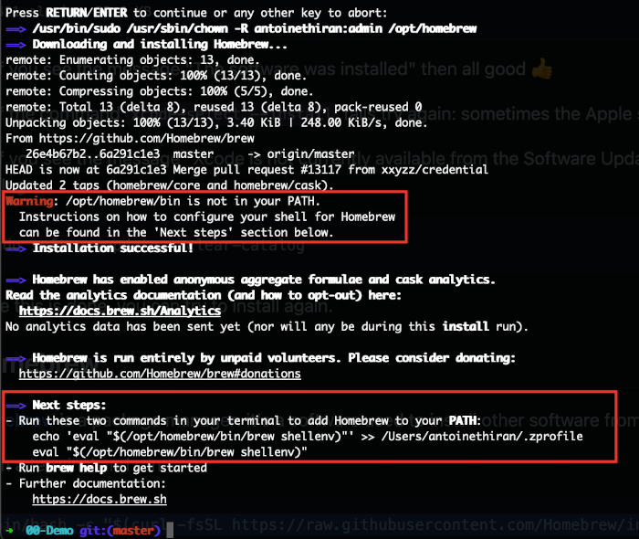

# 电脑设置教程

以下的教程将会帮助你为接下来在[Le Wagon Web Development course](https://www.lewagon.com/web-development-course/full-time)全栈开发训练营中做好准备：

请**仔细阅读并按顺序执行指令**。如果你在哪一步卡住了，不用犹豫，可以举手咨询老师:raising_hand:

让我们开始吧 :rocket:

## Zoom

为了让我们能够线上的交流，我们将会使用[Zoom](https://zoom.us/)，一个视频会议工具。

:warning: 如果你已经安装了Zoom，请确保它的版本至少是**5.6**。

打开[zoom.us/download](https://zoom.us/download).

在**Zoom会议客户端（Zoom Client）**下方点击**下载（Download）**按钮。

打开你刚刚下载的文件并安装应用程序。

打开Zoom。

如果你的Mac使用Apple silicon的话, [你必须安装Rosetta](https://support.apple.com/en-us/HT211861)。点击安装（install），然后输入你的用户名和密码来允许安装。


如果你已经有Zoom账号了，那就用你的账号密码登陆吧。

如果没有账号的话，点击**Sign Up Free**链接：


接下来，它会跳转到Zoom的网站让你填一个表。

完成这个表之后，回到Zoom软件，然后用你的账号密码登陆吧。

你应该会看到下面这个界面：


现在你可以关掉Zoom了。


## GitHub账户

你有注册好GitHub账户嘛？如果还没有，[现在注册](https://github.com/join)。

:point_right: **[上传一张照片](https://github.com/settings/profile)** 并在你的GitHub账户中设置你的名称。这一步很重要，因为我们将使用一个带有你头像的内部dashboard。请**现在**立即做这一步，然后再去继续下面的步骤。


## 一个有关在mac上跳出应用程序的小贴士

在mac上点击应用程序窗口左上方的小红叉**并不是真正的退出了它**，他只是关闭了一个活跃窗口。如果想要 _真正_ 的退出应用程序，你需要在应用活跃的时候按`Cmd + Q`，或者在你的菜单栏里前往`APP_NAME` -> 点击`Quit`


在这个设置教程中，你将会被要求**退出并重启**应用程序很多次，请确保你可以正确的退出重启 :pray:

## 命令行工具

打开一个新的终端窗口,复制粘贴以下指令到你的终端并按下`Enter`来执行指令:

```bash
xcode-select --install
```

如果你收到了以下消息，你可以直接就跳过这一步并前往下一步。

```bash
# command line tools are already installed, use "Software Update" to install updates
```

不然的话，他将会打开一个窗口询问你是否想要下载一些软件: 点击“Install”（安装）并等待。


:heavy_check_mark: 当你看到"The software was installed"这条消息的时候，你就可以继续下一步了 :+1:

:x: 如果`xcode-select --install` 指令失败了，再重新试着运行一次：有时候Apple服务器会过载。

:x: 如果你看到"Xcode is not currently available from the Software Update server",你就需要更新你的软件系统：

```bash
sudo softwareupdate --clear-catalog
```

这个执行结束之后，你可以尝试再一次安装（复制粘贴以下指令并按下Enter）。


## Homebrew

[Homebrew](http://brew.sh/)，一个包管理工具：这是一个帮助你在命令行中安装其他软件的软件。让我们一起安装它！

想要安装，你需要打开终端并执行：

```bash
/bin/bash -c "$(curl -fsSL https://raw.githubusercontent.com/Homebrew/install/HEAD/install.sh)"
```

这将会询问你的确认（按下`Enter`）并输入你的**macOS用户账户密码**（那个当你重启你Macbook时，用来[登入](https://support.apple.com/en-gb/HT202860) 的密码）。

:warning: 当你输入你的密码的时候，屏幕上不会有任何的显示，**这是正常的**。这是一个安全保护的设置，来隐藏你整个密码，包括它的长度。你可以放心的输入你的密码，结束后按下`Enter`就可以了。

:warning: 如果你看到了下面的警告:point_down:，运行`Next steps`下面的两个命令把Homebrew加到你的PATH里。



```bash
# ⚠️ Only execute these commands if you saw this warning ☝
echo 'eval "$(/opt/homebrew/bin/brew shellenv)"' >> ~/.zprofile
eval "$(/opt/homebrew/bin/brew shellenv)"
```

如果你已经有了Homebrew,终端会告诉你的。那么一切正常，你可以继续接下来的步骤。

接下来，让我们安装一些有用的软件：

```bash
brew update
```

如果你得到了`/usr/local must be writable`的报错，直接运行以下指令：

```bash
sudo chown -R $USER:admin /usr/local
brew update
```

无论是否有这行报错，继续执行下方的指令（你可以一次性直接复制/粘贴下方所有行）

```bash
brew upgrade git         || brew install git
brew upgrade gh          || brew install gh
brew upgrade wget        || brew install wget
brew upgrade imagemagick || brew install imagemagick
brew upgrade jq          || brew install jq
brew upgrade openssl     || brew install openssl
```


## Visual Studio Code (VS Code)

### 安装

让我们一起安装[Visual Studio Code](https://code.visualstudio.com)代码编辑器。 

复制(`CMD` + `C`)下面的指令，并粘贴(`CMD` + `V`)到终端Terminal里:

```bash
brew install --cask visual-studio-code
```

然后在终端使用下方指令启动VS Code:

```bash
code
```

:heavy_check_mark: 如果一个VS Code窗口被打开，那么你就准备好继续下一步了:+1:

:x: 如果没有成功打开的话，**请联系你的老师**


## VS Code 插件

### 安装

现在我们来给 VS Code 安装一些有用的插件吧。

复制粘贴下面的命令到终端：

```bash
code --install-extension ms-vscode.sublime-keybindings
code --install-extension emmanuelbeziat.vscode-great-icons
code --install-extension MS-vsliveshare.vsliveshare
code --install-extension rebornix.ruby
code --install-extension dbaeumer.vscode-eslint
code --install-extension Rubymaniac.vscode-paste-and-indent
code --install-extension alexcvzz.vscode-sqlite
code --install-extension anteprimorac.html-end-tag-labels
```

你安装的就是下面这些插件：

- [Sublime Text Keymap and Settings Importer](https://marketplace.visualstudio.com/items?itemName=ms-vscode.sublime-keybindings)
- [VSCode Great Icons](https://marketplace.visualstudio.com/items?itemName=emmanuelbeziat.vscode-great-icons)
- [Live Share](https://marketplace.visualstudio.com/items?itemName=MS-vsliveshare.vsliveshare)
- [Ruby](https://marketplace.visualstudio.com/items?itemName=rebornix.Ruby)
- [ESLint](https://marketplace.visualstudio.com/items?itemName=dbaeumer.vscode-eslint)
- [Paste and Indent](https://marketplace.visualstudio.com/items?itemName=Rubymaniac.vscode-paste-and-indent)
- [SQLite](https://marketplace.visualstudio.com/items?itemName=alexcvzz.vscode-sqlite)


## macOS Terminal Theme

在Mac上，打开`Terminal > Preferences`并在`Profiles`中将“Pro”主题设置为默认。


**退出**并重启终端。它现在会有一个好看的黑色背景，对眼睛会更友好。


## Oh-my-zsh

让我们一起安装`zsh`插件[Oh My Zsh](https://ohmyz.sh/).

在终端terminal里执行以下指令：

```bash
sh -c "$(curl -fsSL https://raw.github.com/ohmyzsh/ohmyzsh/master/tools/install.sh)"
```

如果终端里出现询问"Do you want to change your default shell to zsh?", 可以输入`Y`

在你的终端的最后，你会看到以下内容:


:heavy_check_mark: 如果你的终端成功显示了上面，你就可以继续下一步了:+1:

:x: 如果安装失败的话，请询问**你的老师**


## GitHub CLI

CLI是[Command-line Interface（命令行界面）](https://baike.baidu.com/item/%E5%91%BD%E4%BB%A4%E8%A1%8C%E7%95%8C%E9%9D%A2/9910197?fr=aladdin)的首字母缩写。

在这一章节里面，我们会安装[GitHub CLI](https://cli.github.com/)。这样我们就可以直接在终端和Github互动。

你之前执行的命令应该已经安装了GitHub CLI。

首先你需要**登陆**。复制粘贴下面的命令到终端，敲击回车：

:warning: **不要更改下面指令中的`email`**

```bash
gh auth login -s 'user:email' -w
```

gh会问你几个问题：

`What is your preferred protocol for Git operations?（你要用什么协议来执行Git操作？）` 让箭头`>`停在`SSH`前面，然后敲击回车。SSH使用SSH密钥来登陆用户，而不是用用户名和密码。

`Generate a new SSH key to add to your GitHub account?（生成新的SSH密钥，然后添加到Github账号上？）` 敲击回车，让gh帮你生成。

如果你以前生成过SSH密钥，那你就会看到这个问题`Upload your SSH public key to your GitHub account?（上传公共密钥到Github账户上上吗？）` 上下移动箭头`>`，让它停在你想选的SSH公钥前面，然后敲击回车。

`Enter a passphrase for your new SSH key (Optional)（输入新的SSH密钥的密码（非必填））`. 输入一个密码，然后写下来或者记住它。这是保护你本地私钥的密码。然后敲击回车。

`Title for your SSH key`。你可以把它留在建议的 "GitHub CLI"，按`Enter`。

然后你会看到下面的文字输出：

```bash
! First copy your one-time code: 0EF9-D015
- Press Enter to open github.com in your browser...
```

复制那段验证码（code）(在上面的例子中是`0EF9-D015` ），然后敲击`Enter`。

你的浏览器就会打开一个页面让你授权GitHub CLI使用你的GitHub账号。同意，并等待一会儿。

回到终端，再次敲击`回车`，然后就应该好啦:tada:

检查一下你有没有链接好：

```bash
gh auth status
```

如果你看到`Logged in to github.com as <你的GitHub用户名> `，那就可以了。

:x: 如果没有，**问问老师**。


## Dotfiles (标准配置)

黑客很喜欢把他们的shell和工具变得很酷炫。

让我们用Le Wagon提供的一个超棒的默认配置文件来开始吧：[`lewagon/dotfiles`](http://github.com/lewagon/dotfiles).

因为你的配置是私人的，所以你需要保存在**自己**的代码库里（repository/repo）。

Fork的意思是：在你的GitHub账号上建一个新的代码库，和原始的那一个是一模一样的（可以想象成你在复制粘贴这个代码库）。这样，你在你的GitHub上就会有一个新的代码库： `$GITHUB_USERNAME/dotfiles`。我们需要fork，因为每个人都需要在那些文件里加上一些**特定**信息（比如你的名字）。

打开终端，运行下面的命令：

```bash
export GITHUB_USERNAME=`gh api user | jq -r '.login'`
echo $GITHUB_USERNAME
```

:heavy_check_mark: 你应该能看到你的GitHub用户名在终端里显示出来了。

:x: 如果没有的话，现在就**停下**，找老师帮忙。看起来之前的步骤(`gh auth`)有一些问题。

现在就可以fork代码库（repo)，然后克隆到你自己的电脑上了：

```bash
mkdir -p ~/code/$GITHUB_USERNAME && cd $_
gh repo fork lewagon/dotfiles --clone
```

### Dotfiles安装器

运行`dotfiles`安装器：

```bash
cd ~/code/$GITHUB_USERNAME/dotfiles && zsh install.sh
```

用下面的命令检查一下你GitHub账号录入的电子邮箱。你需要在其中选一个（如果你有好几个的话），然后再进入下一个步骤：

```bash
gh api user/emails | jq -r '.[].email'
```

:heavy_check_mark: 如果你看到了你的注册邮箱列表，你就可以继续下一步啦:+1:

:x: 如果没有的话，请在运行上面:point_up: 这个指令之前，[重新授权GitHub](https://github.com/lewagon/setup/blob/master/macos.cn.md#github-cli)。

### git安装器

运行git安装器：

```bash
cd ~/code/$GITHUB_USERNAME/dotfiles && zsh git_setup.sh
```

:point_up: 这会**提示**填写你的全名（`FirstName LastName`）和你的邮箱。

:warning: 注意啦，你**需要**填`gh api ...`命令列出的其中一个电子邮箱。不然，Kitt就没办法跟进你的学习进程。

现在运行下面的命令来**重置**你的终端：

```bash
exec zsh
```


## rbenv

让我们来安装[rbenv](https://github.com/sstephenson/rbenv)，一个帮助我们安装并管理`ruby`环境的软件。

首先，我们需要先清理我们之前可能安装过的Ruby:

```bash
rvm implode && sudo rm -rf ~/.rvm
# 如果出现"zsh: command not found: rvm"报错, 继续后续的步骤. 这是指你的电脑上没有安装`rvm`
# 这是我们想要的！

sudo rm -rf $HOME/.rbenv /usr/local/rbenv /opt/rbenv /usr/local/opt/rbenv
```

:warning: 这条指令会需要你输入你的密码。

:warning: 当你输入你的密码的时候，屏幕上不会有任何的显示，**这是正常的**。这是一个安全保护的设置，来隐藏你整个密码，包括它的长度。你可以放心的输入你的密码，结束后按下`Enter`就可以了。

在终端里运行：

```bash
brew uninstall --force rbenv ruby-build
```

然后运行：

```bash
exec zsh
brew install rbenv
```


## Ruby

### 安装

现在，你已经准备好了去安装最新[ruby](https://www.ruby-lang.org/en/)版本并把它设置为默认版本。

运行下方这个指令，它会**花费一些时间（5-10分钟）**

```bash
rbenv install 3.1.2
```

当Ruby安装好后，运行下面这个指令来告诉系统使用3.1.2这个版本作为默认版本。

```bash
rbenv global 3.1.2
```

然后**重置**你的终端，然后检查Ruby版本：

```bash
exec zsh
ruby -v
```

:heavy_check_mark: 如果你有看到`ruby 3.1.2p`，那么你可以继续下一步+1:

:x: 如果没有的话，**询问一下老师**。

### 安装一些gems

<details>
  <summary>点击这里，如果你在 :cn: <bold>中国</bold>的话</summary>

  :warning: 如果你在中国的话，你应该使用以下命令来安装gem。

```bash
# China only!
gem sources --remove https://rubygems.org/
gem sources -a https://gems.ruby-china.com/
gem sources -l
# *** CURRENT SOURCES ***
# https://gems.ruby-china.com/
# Ruby-china.com must be in the list now
```
</details>

在ruby的世界里，我们将外部的库称之为`gems`：他们是一些你可以下载并在你的电脑上运行的ruby代码。让我们一起安装一些!

在你的终端里，复制粘贴下面的指令：

```bash
gem install colored faker http pry-byebug rake rails rest-client rspec rubocop-performance sqlite3
```

:heavy_check_mark: 如果你看到 `xx gems installed`，那么一切正常 :+1:

:x: 如果你遇到了以下的报错：

```bash
ERROR: While executing gem ... (TypeError)
incompatible marshal file format (can't be read)
format version 4.8 required; 60.33 given
```

运行以下的指令：

```bash
rm -rf ~/.gemrc
```

然后，重新运行安装gems的指令。

:warning: **永远不要**使用`sudo gem install`来安装一个gem！即使你偶然发现了一个网络上的答案（或者终端提示）叫你这么做。


## Node.js

[Node.js](https://nodejs.org/en/)是一个JavaScript运行环境以在终端运行JavaScript代码。让我们一起用[nvm](https://github.com/nvm-sh/nvm)，一个Node.js的版本管理器，来安装Node.js。

在终端里，运行以下指令：

```bash
curl -o- https://raw.githubusercontent.com/nvm-sh/nvm/v0.39.1/install.sh | zsh
```

重启你的终端并执行下方指令：

```bash
nvm -v
```

你应该会看到你的nvm的版本。如果没有的话，问一下你的老师。

现在，让我们来安装node：

```bash
nvm install 16.15.1
```

当这个指令执行结束之后，运行：

```bash
node -v
```

如果看到`v16.15.1`，那么你安装成功了:heavy_check_mark: 然后，你就可以运行下面这个命令了：

```bash
nvm cache clear
```

:x: 如果没有看到版本的话，**问一下你的老师**。


## yarn

让我们一起来安装[`yarn`](https://classic.yarnpkg.com/en/docs/install):

```bash
npm install --global yarn
```

重启终端并运行：

```bash
yarn -v
```

你应该会看到你yarn的版本。如果没有的话，问一下你的老师。


## SQLite

几周后，我们就会开始学习数据库和SQL. [SQLite](https://sqlite.org/index.html)是一个数据库引擎，它可以在单文件数据库上执行SQL查询。现在来安装它吧：

在终端，执行下面的命令：

```bash
brew install sqlite
```

然后执行下面的命令：

```bash
sqlite3 -version
```

:heavy_check_mark: 如果你看到了版本号，那你就可以继续下一步了 :+1:

:x: 如果没有，**问问老师吧**！


## PostgreSQL

有的时候，SQLite功能会不够用。这个时候我们就需要使用一个更高级的工具，叫做[PostgreSQL](https://www.postgresql.org/)。这是一个开源的、强大的、生产环境可用的数据库系统。

让我们现在一起安装它。

运行下方指令：

```bash
brew install postgresql@15 libpq
brew link --force libpq
```

```bash
brew services start postgresql@15
```

当你结束了上方的指令之后，让我们一起来核查一下它是否安装成功了：

```bash
psql -d postgres
```

如果你进入到了一个像下方这个，一个新的输入框的话，那么说明你的PostgreSQL已经安装好啦！

```bash
psql (15.2)
Type "help" for help.

postgres=#
```

如果想要退出它的话，输入`\q`然后按下`Enter`。


## 最后检查

让我们来看看你是否已经成功安装好了所有软件。

在终端，运行下面两行命令：

```bash
exec zsh
curl -Ls https://web-dev-challenge-lewagon-image.oss-cn-shanghai.aliyuncs.com/setup/check.rb > _.rb && ruby _.rb || rm _.rb
```

:heavy_check_mark: 如果出现了一个绿色的`Awesome! Your computer is now ready!`，那么你的工作台已经设置好了 :+1:

如果没有的话，问一下你的老师。


## Kitt

:warning: 如果你已经收到了一封来自Le Wagon邀请你去注册Kitt(我们的学习平台)的邮件并且你也注册完成了的话，你可以安全的跳过这一章节。如果你还没有注册完成的话，请跟随邮件里的教程，完成注册。

如果你不确定你要做什么，可以查看[这个链接](https://kitt.lewagon.com/)。如果你已经登录了的话，你可以跳过这个章节。如果你没有登录的话，你需要点击`Enter Kitt as a Student`。如果你可以成功的登录，你也可以安全的跳过这一步。不然的话，你可以询问一下老师你是否有收到过相关的邮件，或者直接跟着执行下面的教程。

前往[kitt.lewagon.com/onboarding](http://kitt.lewagon.com/onboarding)，注册成为Le Wagon的一名校友。选择你的batch，用gitHub账户登录并填写你的信息。

你的老师将会验证你的确属于这个batch。你可以在完成了注册表单后去询问老师去做验证。

当你的老师验证成功后，请前往你的邮箱收件箱。你应该会有两封邮件：

- 一封来自Slack,邀请你加入Le Wagon Alumni Slack社群（在这儿你可以与你的伙伴和所有之前的学员交流）。点击**Join**并填写相应的个人信息。

- 一封来自GitHub,要求你加入`lewagon`团队。**接受它**，不然的话你将没有办法看到有关讲座和课程的文件。


## Slack

[Slack](https://slack.com/)是一个在技术领域里非常流行的一个交流平台。

### 安装

[下载Slack应用程序](https://itunes.apple.com/fr/app/slack/id803453959?mt=12)并安装它。

:warning: 如果你已经在你的浏览器里使用Slack了，请还是下载并安装功能更全面的**Slack桌面应用程序**。

### 设置

打开Slack应用程序并登入`lewagon-alumni`组织。

确保你已经**上传了你的头像照片** :point_down:


之后你可以全天开着Slack，这样你可以在上面分享有用的链接/寻求帮助/决定去那儿吃饭/...

为了确保视频电话可以正常工作，让我们一起测试摄像头和麦克风：
- 打开Slack应用程序。
- 点击右上方的个人照片。
- 从菜单中选择 `首选项(Preferences)`。
- 点击左侧栏中的 `音频和视频(Audio & video)`。
- 在 `故障排除(Troubleshooting)`下面，点击 `运行音频、视频和屏幕共享测试(Run an audio, video and screensharing test)`。该测试将在一个新窗口中打开。
- 检查你使用的扬声器、麦克风和摄像机设备是否出现在选项中，然后点击 `开始测试(Start test)`。


:heavy_check_mark: 当测试结束以后，你应该会看到你的摄像头和麦克风有绿色的"Succeed"信息。:+1:

:x: 如果测试失败的话，**请联系你的老师**.

你也可以在手机上安装Slack应用并登入`lewagon-alumni`!


## macOS设置

### 安全

你必须使用密码来保护你的电脑。如果你还没有设置过密码的话，请前往`>系统偏好设置>用户和组`并更改您的帐户密码。您还应该前往`>系统偏好设置>安全性>通用`。睡眠或屏幕保护程序启动的`5秒`后，您应该要求输入密码。

您也可以前往` > 系统偏好设置 > 任务控制`，然后单击左下角的`Hot Corners`按钮。选择右下角以启动屏幕保护程序。这样，当您离开办公桌时，可以通过将鼠标置于右下角来快速锁定屏幕。5秒钟后，您的Macbook将被锁定，并要求输入密码以恢复。

### 键盘

当你成为了一名程序员的时候，你将明白离开键盘去操作将会耗费大量的时间，所以你将会想最大化的减少花费在触控盘和鼠标的时间。以下是一些在macOS上的小技巧可以帮助你做到这些。

#### 键盘速度

前往  > 系统偏好设置 > 键盘。设置`Key Repeat`到最快的位置（最右边）并将`Delay Until Repeat`移到最短的位置（最右边）。

#### 黑客的macOS

[阅读这个脚本](https://github.com/mathiasbynens/dotfiles/blob/master/.macos)然后挑选一些你认为适合你的指令。例如，您可以在终端中输入以下内容：

```bash
# 默认情况下扩展保存面板
defaults write NSGlobalDomain NSNavPanelExpandedStateForSaveMode -bool true
defaults write NSGlobalDomain PMPrintingExpandedStateForPrint -bool true
defaults write NSGlobalDomain PMPrintingExpandedStateForPrint2 -bool true

# 将截屏保存到桌面（或其他位置）
defaults write com.apple.screencapture location "${HOME}/Desktop"

# etc..
```

### 将应用程序固定在你的Dock上

你将会经常使用今天安装的大部分应用程序。所以让我们把这些应用程序固定在Dock上，这样我们就很容易打开他们啦！

我们需要启动程序，右键点击，打开菜单栏并选择“选项”（Options），然后选择“保留在Dock上”（Keep in Dock）。


你一定要固定以下应用程序:
- 你的终端
- 你的文件资源管理器
- VS Code
- 你的浏览器
- Slack
- Zoom


## 设置完成啦!

现在你的电脑已经完成[Le Wagon网页开发课程](https://www.lewagon.com/web-development-course/full-time)的设置啦 :muscle: :clap:

享受你的编程之旅，你会掌握它的！ :rocket:


