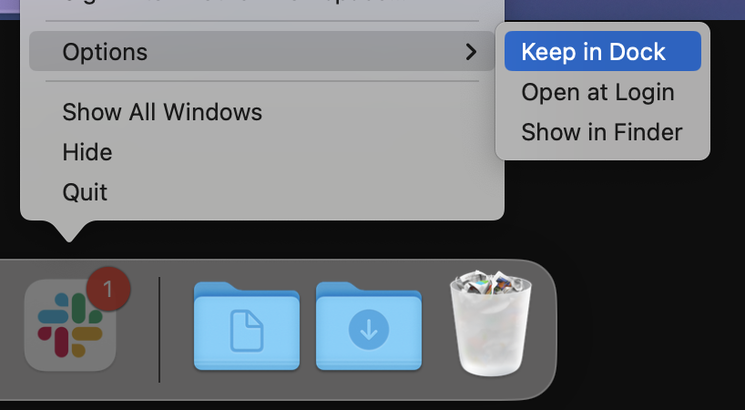

# Instrucciones de la configuración

Aquí abajo encontrarás las instrucciones para la configuración que tu computadora necesita para el [curso de Desarrollo Web de Le Wagon](https://www.lewagon.com/web-development-course/full-time).

Por favor, **léelas cuidadosamente y ejecuta todos los comandos en el orden indicado**. Si tienes algún problema, no dudes en pedirle ayuda a tu profesor :raising_hand:

¡Comencemos! :rocket:


## Zoom

Para poder interactuar cuando no estemos en el mismo lugar físico, usaremos [Zoom](https://zoom.us/), una herramienta de videoconferencia.

:warning: Si ya tienes Zoom instalado, por favor asegúrate de que por lo menos tienes la versión **5.6**.

Ve a [zoom.us/download](https://zoom.us/download).

Haz clic en el botón **Download** debajo de **Zoom Client**.

Abre el archivo que acabas de descargar para instalar la aplicación.

Abre la aplicación Zoom.

Si tienes una Mac con Apple silicon, [te pedirán instalar Rosetta](https://support.apple.com/en-us/HT211861). Haz clic en instalar. Luego escribe tu nombre y contraseña para que corra la instalación.


Si ya tienes una cuenta Zoom, inicia sesión con tus credenciales.

Si no, haz clic en el enlace **Sign Up Free**, que significa registrarse gratuitamente:


Te redireccionarán a la página de Zoom para que completes un formulario.

Cuando termines, regresa a la aplicación Zoom e inicia sesión usando tus credenciales.

Deberías ver una pantalla como la siguiente:


Ya puedes cerrar la aplicación Zoom.


## Cuenta GitHub

¿Ya tienes una cuenta GitHub? Si no es el caso, [ábrela ya](https://github.com/join).

:point_right: **[Sube una foto](https://github.com/settings/profile)** y escribe tu nombre correctamente en tu cuenta GitHub. Esto es importante porque nosotros usaremos un tablero de comando interno con tu avatar. Por favor hazlo **ahora** antes de dar un paso más en esta guía.


## Cómo cerrar aplicaciones en una Mac correctamente

Hacer clic en círculo rojo en la esquina superior izquierda de la ventana de la aplicación en Mac **no la termina el proceso**, solo cierra una ventana activa. Hay dos alternativas para cerrar la aplicación _realmente_. Puedes presionar `Cmd + Q` cuando la misma está activa. La otra opción es ir a `APP_NAME` -> `Quit` en la barra del menú.


Durante esta configuración, se te pedirá **cerrar y abrir nuevamente** aplicaciones varias veces. Por favor asegúrate de hacerlo correctamente :pray:

## Herramientas de la Línea de Comando

Abre una nueva terminal, copia y pega el comando siguiente y presiona `Enter`:

```bash
xcode-select --install
```

Si obtienes el mensaje que te mostramos a continuación, puedes ignorar este paso e ir al siguiente.

```bash
# command line tools are already installed, use "Software Update" to install updates
```

Este mensaje significa que las herramientas de la línea de comando ya están instaladas y te pide que uses "Software Update" para instalar las actualizaciones. Si no recibes este mensaje, se abrirá una ventana preguntándote si quieres instalar algún programa: haz clic en "Install" y espera.


:heavy_check_mark: Si ves el mensaje "The software was installed", lo que significa que el programa se ha instalado, entonces todo está bien :+1:

:x: Si falla el comando `xcode-select --install` , intenta nuevamente: algunas veces los servidores de Apple se sobrecargan.

:x: Si ves el mensaje "Xcode is not currently available from the Software Update server", debes actualizar el catálogo de actualización de programas:

```bash
sudo softwareupdate --clear-catalog
```

Cuando termines eso, puedes intentar hacer la instalación nuevamente.


## Homebrew

[Homebrew](http://brew.sh/) es un gestionador de paquetes: es un programa que se usa para instalar otros programas desde la línea de comando. ¡Vamos a instalarlo!

Abre la terminal y ejecuta lo siguiente:

```bash
/bin/bash -c "$(curl -fsSL https://raw.githubusercontent.com/Homebrew/install/HEAD/install.sh)"
```

Te pedirá que confirmes (presionando `Enter`) y también te pedirá la **contraseña de tu cuenta de usuario macOS** (la que usas para [iniciar sesión](https://support.apple.com/en-gb/HT202860) cuando reinicias tu Macbook).

:warning: Cuando escribas tu contraseña no verás nada en la pantalla. **Esto es normal**. Es una herramienta de seguridad para ocultar tanto el contenido de tu contraseña como su longitud. Simplemente escribe tu contraseña y presiona `Enter` al terminar.

Si ya tienes Homebrew instalado, el sistema te lo dirá y puedes continuar.

Luego instala algunos programas útiles:

```bash
brew update
```

Si obtienes un error como este: `/usr/local must be writable`, ejecuta el código que te mostramos a continuación:

```bash
sudo chown -R $USER:admin /usr/local
brew update
```

Ejecuta el siguiente código en tu terminal (puedes copiar y pegar todas las líneas de código al mismo tiempo) independientemente de si obtienes o no un error.

```bash
brew upgrade git || brew install git
brew upgrade gh || brew install gh
brew upgrade wget || brew install wget
brew upgrade imagemagick || brew install imagemagick
brew upgrade jq || brew install jq
brew upgrade openssl || brew install openssl
```


## Visual Studio Code

### Instalación

Instala el editor de texto [Visual Studio Code](https://code.visualstudio.com).

Copia (presionando `Cmd` + `C`) el comando de aquí abajo y luego pégalo en tu terminal (con `Cmd` + `V`):

```bash
brew install --cask visual-studio-code
```

Luego abre VS Code ejecutando el siguiente comando en tu terminal:

```bash
code
```

:heavy_check_mark: Si se acaba de abrir una ventana de VS Code, todo está bien y puedes continuar :+1:

:x: De lo contrario, por favor **contacta a un profesor**.


## Extensiones de VS Code

### Instalación

Vamos a instalar algunas extensiones útiles de VS Code.

Copia y pega los siguientes comandos en tu terminal:

```bash
code --install-extension ms-vscode.sublime-keybindings
code --install-extension emmanuelbeziat.vscode-great-icons
code --install-extension MS-vsliveshare.vsliveshare
code --install-extension rebornix.ruby
code --install-extension dbaeumer.vscode-eslint
code --install-extension Rubymaniac.vscode-paste-and-indent
```

Aquí está la lista de las extensiones que estás instalando:
- [Sublime Text Keymap and Settings Importer](https://marketplace.visualstudio.com/items?itemName=ms-vscode.sublime-keybindings)
- [VSCode Great Icons](https://marketplace.visualstudio.com/items?itemName=emmanuelbeziat.vscode-great-icons)
- [Live Share](https://marketplace.visualstudio.com/items?itemName=MS-vsliveshare.vsliveshare)
- [Ruby](https://marketplace.visualstudio.com/items?itemName=rebornix.Ruby)
- [ESLint](https://marketplace.visualstudio.com/items?itemName=dbaeumer.vscode-eslint)
- [Paste and Indent](https://marketplace.visualstudio.com/items?itemName=Rubymaniac.vscode-paste-and-indent)


### Configuración de Live Share

[Visual Studio Live Share](https://visualstudio.microsoft.com/services/live-share/) es una extensión de VS Code que te permite compartir el código en tu editor de texto para debugging y pair-programming: ¡Instalémoslo!

Abre VS Code desde tu terminal escribiendo `code` y presionando `Enter`.

Haz clic en la pequeña flecha de la parte inferior de la barra de la izquierda:


- Haz clic en el botón "Share". Luego en "GitHub (Inicia sesión usando tu cuenta GitHub)".
- Va a aparecer una ventana emergente pidiéndote que inicies sesión con GitHub: Haz clic en "Allow".
- Te redireccionarán a una página GitHub en tu navegador pidiéndote que autorices Visual Studio Code: Haz clic en "Continue" y luego en "Authorize github".
- Es posible que VS Code muestre más ventanas emergentess: Ciérralas haciendo clic en "OK".

Eso es todo. ¡Ya puedes continuar!


## Tema de la Terminal en macOS

Abre una terminal. Haz clic en `Terminal > Preferences` y coloca el tema llamado "Pro" como perfil predeterminado.


**Cierra y reinicia** tu terminal: ahora debería tener un fondo negro que no te cansa tanto la vista.


## Oh-my-zsh

Instalemos el plugin `zsh` [Oh My Zsh](https://ohmyz.sh/).

Ejecuta este comando en la terminal:

```bash
sh -c "$(curl -fsSL https://raw.github.com/ohmyzsh/ohmyzsh/master/tools/install.sh)"
```

Si te preguntan "Do you want to change your default shell to zsh?", presiona `Y`

Cuando termines, tu terminal debería lucir así:


:heavy_check_mark: Si es el caso, puedes continuar :+1:

:x: Si no, por favor **pídele ayuda a un profesor**.


## GitHub CLI

CLI es una abreviación de [Command-line Interface](https://en.wikipedia.org/wiki/Command-line_interface) que significa interfaz de línea de comando.

En esta sección usaremos [GitHub CLI](https://cli.github.com/) para interactuar directamente con GitHub desde la terminal.

Ya debería haberse instalado en tu computadora con los comandos que ejecutaste anteriormente.

Lo primero que hay que hacer para **iniciar sesión** es copiar y pegar el comando siguiente en tu terminal:

:warning: **NO edites el `email`**

```bash
gh auth login -s 'user:email' -w
```

gh le hará algunas preguntas:

`What is your preferred protocol for Git operations?` Con las flechas, elige `SSH` y presiona `Enter`. SSH es un protocolo para iniciar la sesión utilizando claves SSH en lugar de la famosa pareja nombre de usuario y contraseña.

`Generate a new SSH key to add to your GitHub account?` Presiona `Enter` para pedirle a gh que genere las claves SSH por ti.

Si ya tienes claves SSH, verás en su lugar `Upload your SSH public key to your GitHub account?`Con las flechas, selecciona la ruta de tu archivo de clave pública y pulsa `Intro`.

`Enter a passphrase for your new SSH key (Optional)`. Pon algo que quieras y que recuerdes. Es una contraseña para proteger tu private key que está almacenada en tu disco duro. Luego presiona `Enter`.

:warning: Cuando escribas tu passphrase, no verás nada en la pantalla. **Esto es normal**. Es una herramienta de seguridad para ocultar tanto el contenido de tu passphrase como su longitud. Simplemente escribe tu passphrase y presiona `Enter` al terminar.

Obtendrás el siguiente resultado:

```bash
! First copy your one-time code: 0EF9-D015
- Press Enter to open github.com in your browser...
```

Selecciona y copia el código (`0EF9-D015` en el ejemplo) y luego presiona `Enter`.

Tu navegador se abrirá y te pedirá que autorices GitHub CLI para usar tu cuenta GitHub. Acepta y espera un poco.

Regresa a la terminal, presiona `Enter` nuevamente y listo. Eso es todo.

Para verificar que están conectado correctamente, escribe lo siguiente:

```bash
gh auth status
```

:heavy_check_mark: Si obtienes este mensaje: `Logged in to github.com as <YOUR USERNAME> `, significa que todo está bien :+1:

:x: De lo contrario, **contacta a un profesor**.


## Dotfiles (configuración estándar)

Los hackers aman mejorar sus shells y sus herramientas.

Comenzaremos con una configuración predeterminada proporcionada por Le Wagon: [`lewagon/dotfiles`](https://github.com/lewagon/dotfiles).

Tu configuración es personal, así que necesitas tu **propio** repositorio para almacenarla. Haz el **fork** del repositorio de Le Wagon.

Hacer un fork significa crear un nuevo repositorio en tu propia cuenta GitHub `$GITHUB_USERNAME/dotfiles` el cual es idéntico al original de Le Wagon y que podrás modificar como quieras.

Abre tu terminal y ejecuta los siguientes comandos:

```bash
export GITHUB_USERNAME=`gh api user | jq -r '.login'`
echo $GITHUB_USERNAME
```

:heavy_check_mark: Deberías ver tu usuario GitHub en la pantalla.

:x: Si no es el caso, **no des un paso más** y pide ayuda. Es posible que haya un problema con el paso anterior (`gh auth`).

Es hora de hacer el fork del repositorio y clonarlo en tu computadora:

```bash
mkdir -p ~/code/$GITHUB_USERNAME && cd $_
gh repo fork lewagon/dotfiles --clone
```

### Instalación de Dotfiles

Ejecuta el instalador de `dotfiles`:

```bash
cd ~/code/$GITHUB_USERNAME/dotfiles
zsh install.sh
```

Verifica los emails registrados en tu cuenta GitHub. Deberás seleccionar uno en el paso siguiente:

```bash
gh api user/emails | jq -r '.[].email'
```

:heavy_check_mark: Si ves una lista de tus emails registrados, puedes continuar :+1:

:x: De lo contrario, por favor haz la [autenticación en GitHub](https://github.com/lewagon/setup/blob/master/macos.es.md#github-cli) nuevamente antes de ejecutar este comando :point_up: again.

### Instalación de git

Ejecuta el instalador de `git`:

```bash
cd ~/code/$GITHUB_USERNAME/dotfiles && zsh git_setup.sh
```

:point_up: Esto te **pedirá** tu nombre (`FirstName LastName`) y tu email.

:warning: **Necesitas** poner uno de los emails que aparecen arriba gracias al comando anterior `gh api ...`. De lo contrario, Kitt no podrá hacerle seguimiento a tu progreso.

Ahora **resetea** tu terminal ejecutando lo siguiente:

```bash
exec zsh
```


## rbenv

Instala [`rbenv`](https://github.com/sstephenson/rbenv), un programa para instalar y gestionar entornos `ruby`.

Primero debemos limpiar cualquier instalación previa de Ruby que tengas en tu computadora:

```bash
rvm implode && sudo rm -rf ~/.rvm
# If you got "zsh: command not found: rvm", carry on. It means `rvm` is not
# on your computer, that's what we want!

sudo rm -rf $HOME/.rbenv /usr/local/rbenv /opt/rbenv /usr/local/opt/rbenv
```

:warning: Este comando te puede pedir tu contraseña.

:warning: Cuando escribas tu contraseña no verás nada en la pantalla. **Esto es normal**. Es una herramienta de seguridad para ocultar tanto el contenido de tu contraseña como su longitud. Simplemente escribe tu contraseña y presiona `Enter` al terminar.

Ejecuta lo siguiente en tu terminal:

```bash
brew uninstall --force rbenv ruby-build
exec zsh
```

Luego ejecuta esto:

```bash
brew install rbenv
```


## Ruby

### Instalación

Ahora estás listo para instalar la última versión de [ruby](https://www.ruby-lang.org/en/) y ponerla como la versión predeterminada.

Corre este comando, **tomará un tiempo (5-10 minutos)**

```bash
rbenv install 3.0.3
```

Cuando la instalación de ruby termine, corre este comando para decirle al sistema que use la versión 3.0.3 por defecto.

```bash
rbenv global 3.0.3
```

**Reinicia** tu terminal y chequea tu versión Ruby:

```bash
exec zsh
```

Luego ejecuta esto:

```bash
ruby -v
```

:heavy_check_mark: Si ves algo que comience por `ruby 3.0.3p`, entonces puedes continuar +1:

:x: Si no es el caso, **pídele ayuda a un profesor**.

### Instalación de algunas gemas

<details>
  <summary>Si estás en <bold>China</bold></summary>

  :warning: Si estás en China, deberías actualizar la forma de instalar las gemas con los siguientes comandos.

```bash
# China only!
gem sources --remove https://rubygems.org/
gem sources -a https://gems.ruby-china.com/
gem sources -l
# *** CURRENT SOURCES ***
# https://gems.ruby-china.com/
# Ruby-china.com must be in the list now
```
</details>

En el universo de ruby, a las librerías externas se les llama `gems`: son pedazos de código ruby que puedes descargar y ejecutar en tu computadora. ¡Instalemos algunas!

En tu terminal, copia y pega el siguiente comando:

```bash
gem install rake bundler rspec rubocop rubocop-performance pry pry-byebug colored http 'rails:~>6.1'
```

:heavy_check_mark: Si obtienes `xx gems installed`, entonces todo está bien :+1:

:x: Si obtienes el siguiente error:

```bash
ERROR: While executing gem ... (TypeError)
incompatible marshal file format (can't be read)
format version 4.8 required; 60.33 given
```

Ejecuta el siguiente comando:
```bash
rm -rf ~/.gemrc
```

Ejecuta el comando nuevamente para instalar las gemas.

:warning: ¡**NUNCA** instales una gema con `sudo gem install`! Incluso si encuentras una solución en Stackoverflow (o la terminal) diciéndote que lo hagas.


## Node.js

[Node.js](https://nodejs.org/en/) es un JavaScript runtime para ejecutar código JavaScript en la terminal. Instálalo con [nvm](https://github.com/nvm-sh/nvm), aun gestionador de versiones para Node.js.

En una terminal, ejecuta estos comandos:

```bash
curl -o- https://raw.githubusercontent.com/nvm-sh/nvm/v0.39.1/install.sh | zsh
exec zsh
```

Luego corre el siguiente comando:

```bash
nvm -v
```

Deberías ver una versión. Si no, pídele ayuda a tu profesor.

Ahora instala node:

```bash
nvm install 16.13.1
```

Cuando termine la instalación, corre lo siguiente:

```bash
node -v
```

Si ves `v16.13.1`, the installation succeeded :heavy_check_mark: entonces ahora puedes ejecutar lo siguiente:

```bash
nvm cache clear
```

:x: De lo contrario, **contacta a un profesor**.


## yarn

[`yarn`](https://yarnpkg.com/) es un gestor de paquetes para instalar librerías JavaScript. Instálalo:

En una terminal, ejecuta los siguientes comandos:

```bash
npm install --global yarn
exec zsh
```

Luego ejecuta este comando:

```bash
yarn -v
```

:heavy_check_mark: si ves una versión, entonces todo está bien :+1:

:x: Si no es el caso, **pídele ayuda a un profesor**


## PostgreSQL

En algunas semanas hablaremos de bases de datos y de SQL y necesitarás algo que se llama [PostgreSQL](https://www.postgresql.org/), un sistema de base de datos de código abierto y listo para usar en producción.

Vamos a instalarlo ahora.

Ejecuta los siguientes comandos:

```bash
brew install postgresql
brew services start postgresql
```

Cuando termines, verifica que funcione:

```bash
psql -d postgres
```

¡Si no tienes ningún problema para agregar algo como esto de aquí abajo, todo está bien!

```bash
psql (13.3)
Type "help" for help.

postgres=#
```

Para cerrarla, escribe `\q` y luego presiona `Enter`.


## Chequeo

Verifiquemos si has instalado todo bien.

Ejecuta el siguiente comando en tu terminal:

```bash
exec zsh
```

Luego ejecuta lo siguiente:

```bash
curl -Ls https://raw.githubusercontent.com/lewagon/setup/master/check.rb > _.rb && ruby _.rb && rm _.rb || rm _.rb
```

:check_mark: Si obtienes un mensaje verde diciendo `Awesome! Your computer is now ready!`, significa que tu computadora está lista y que todo está bien :+1:

:x: De lo contrario, **habla con tu profesor**.


## Kitt

:warning: Si recibiste una invitación por email de Le Wagon para crear una cuenta en Kitt (nuestra plataforma de aprendizaje), ignora este paso y sigue las instrucciones en el email si es que todavía no lo has hecho.

Si no sabes que hacer, haz clic en [este enlace](https://kitt.lewagon.com/). Si ya iniciaste sesión, puedes omitir esta sección. Si no, haz clic en `Enter Kitt as a Student`. Esto significa iniciar sesión como estudiante. Si no tienes problemas para iniciar sesión, puedes omitir este paso. De lo contrario pídele a un profesor que te confirme si debiste haber recibido o si debes seguir las instrucciones de aquí abajo.

Registrate como alumni de Le Wagon yendo a [kitt.lewagon.com/onboarding](http://kitt.lewagon.com/onboarding). Selecciona tu batch, inicia sesión con GitHub y completa toda la información que te piden.

Ahora tu profesor podrá validar que realmente eres parte del batch. Pídele que lo haga justo después de que hayas completado el formulario de registro.

Cuando el profesor haya aprobado tu perfil, ve a la bandeja de entrada de tu email. Deberías tener 2 nuevos emails:

- Uno de Slack, invitándote a la comunidad de los alumni de Le Wagon en slack (donde podrás chatear con tus compañeros y todos los demás alumni). Haz clic en **Join** y completa la información que te piden.
- Otro de GitHub, invitándote a `lewagon` team. **Acéptala**, de lo contrario no podrás acceder a las diapositivas de las clases.


## Slack

[Slack](https://slack.com/) es una plataforma de comunicación popular en la industria tech.

### Instalación

[Descarga la aplicación Slack](https://itunes.apple.com/fr/app/slack/id803453959?mt=12) e instálala.

:warning: Si ya estás usando Slack en tu navegador, por favor descarga e instala  **la aplicación de escritorio** la cual tiene todas las funciones.


### Parámetros

Abre la aplicación e inicia sesión en `lewagon-alumni`.

Asegúrate de **subir una foto para tu perfil** :point_down:


La idea es tener Slack abierto todo el día para compartir enlaces útiles / pedir ayuda / decidir dónde almorzar / etc.

Para asegurarte de que todo lo relacionado a videollamadas funcione bien, prueba tu cámara y tu micrófono:
- Abre la aplicación Slack
- Escribe `/call --test` en la barra de mensaje de cualquier canal y presiona `Enter`
- Haz clic en el botón verde "Start test"


:heavy_check_mark: Cuando termine el test deberías ver mensajes de "Succeed" en verde por lo menos para tu micrófono y tu cámara. :+1:

:x: Si no es el caso, **contacta a un profesor**.

¡También puedes instalar la aplicación Slack en tu smartphone e iniciar sesión en `lewagon-alumni`!


## Parámetros de macOS

### Seguridad

Es imperativo proteger tu sesión con una contraseña. Si todavía no es el caso, ve a ` > System Preferences > Users & Groups` y cambia la contraseña de tu computadora. Luego ve a ` > System Preferences > Security > General`. Configura el sistema para que pida la contraseña cada `5 seconds` después de regresar de la opción suspender y cuando se active el protector de pantalla.

También puedes ir a ` > System Preferences > Mission Control` y haz clic en el botón `Hot Corners` abajo a la izquierda. Selecciona la opción donde al hacer clic en la esquina inferior derecha se active el protector de pantalla. De esa manera al dejar tu escritorio podrás bloquear tu pantalla rápidamente poniendo el cursor del ratón en la esquina inferior derecha. En 5 segundos tu Macbook se bloqueará y te pedirá la contraseña para volver a tu sesión.

### Teclado

A medida que te vayas convirtiendo en programador, entenderás que pierdes tiempo cuando quitas las manos del teclado para usar otra herramienta. Por esa razón es importante aprender a minimizar el uso del trackpad o del ratón. Aquí te mostramos algunos trucos para que lo hagas en macOS.

#### Velocidad del teclado

Ve a ` > System Preferences > Keyboard`. Coloca a `Key Repeat` en la posición más rápida (a la derecha) y a `Delay Until Repeat` en la posición más corta (a la derecha).

#### Acceso total al teclado

Ve a ` > System Preferences > Keyboard`. Haz clic en la tercera pestaña `Shortcuts`. En la parte inferior del panel, haz clic en el botón del radio (también llamado de opción) `All controls`. De esta manera cuando veas un diálogo con muchas opciones, podrás escribir `Enter` para confirmar, o `SPACE` para escoger la opción cancelar. Si hay más de dos opciones, puedes usar la tecla de tabulación para navegar entre ellas.

#### macOS para hackers

[Lee este script](https://github.com/mathiasbynens/dotfiles/blob/master/.macos) y selecciona algunas cosas que creas que serán útiles para ti. Por ejemplo, puedes escribir lo siguiente en la terminal:

```bash
# Expanding the save panel by default
defaults write NSGlobalDomain NSNavPanelExpandedStateForSaveMode -bool true
defaults write NSGlobalDomain PMPrintingExpandedStateForPrint -bool true
defaults write NSGlobalDomain PMPrintingExpandedStateForPrint2 -bool true

# Save screenshots to the Desktop (or elsewhere)
defaults write com.apple.screencapture location "${HOME}/Desktop"

# etc..
```

### Anclaje de aplicaciones a tu dock

Usarás frecuentemente casi todas las aplicaciones que has instalado hoy. ¡Anclémoslas a tu dock para que estén a solo un clic de ti!

Para ello, inicia la aplicación. Haz clic derecho en el ícono de la barra de tareas para hacer que aparezca el menú contextual (también llamado emergente) y selecciona "Options" y después "Keep in Dock".



Ancla lo siguiente:
- Tu terminal
- Tu explorador de archivos
- VS Code
- Tu navegador de Internet
- Slack
- Zoom


## ¡Fin de la configuración!

Tu computadora está lista para el [curso de Desarrollo Web de Le Wagon](https://www.lewagon.com/web-development-course/full-time) :muscle: :clap:

Disfrútalo, sabemos que te va a ir genial :rocket:


