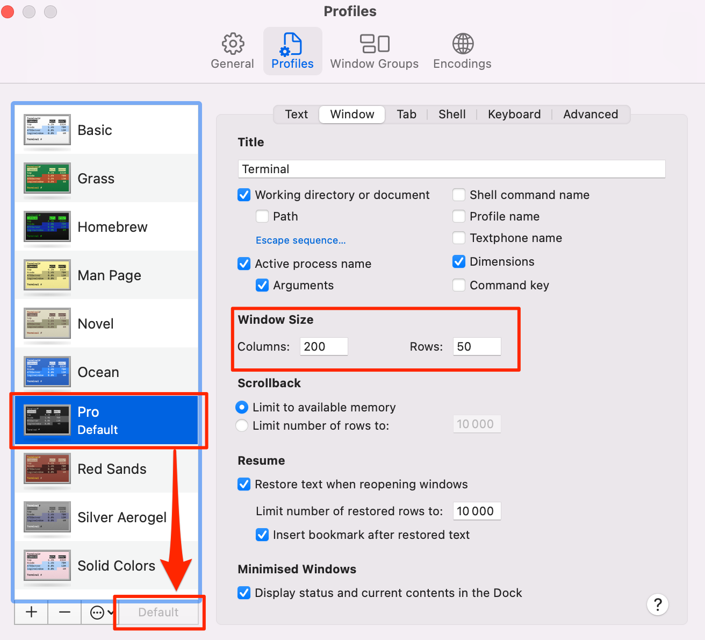

# Instructions de configuration

Les instructions ci-dessous vont te permettre de configurer ton ordinateur pour [la formation AI Software Development du Wagon](https://www.lewagon.com/web-development-course/full-time).

**Lis-les attentivement et exécute toutes les commandes dans l’ordre suivant**. En cas de blocage, n’hésite pas à demander au prof :raising_hand:

C’est parti :rocket:


## Compte GitHub

Est-ce que tu as déjà un compte GitHub ? Si ce n’est pas le cas, [inscris-toi maintenant](https://github.com/join).

:point_right: **[Télécharge une photo](https://github.com/settings/profile)** et indique correctement ton nom sur ton compte GitHub. C’est important, car notre tableau de bord interne utilise ton avatar. Fais-le **maintenant** avant de poursuivre la configuration de ton ordinateur.


:point_right: **[Activez l'authentification à deux facteurs (2FA)](https://docs.github.com/en/authentication/securing-your-account-with-two-factor-authentication-2fa/configuring-two-factor-authentication#configuring-two-factor-authentication-using-text-messages)**. GitHub vous enverra des messages texte avec un code lorsque vous essayez de vous connecter. C'est important pour la sécurité et cela sera bientôt obligatoire pour contribuer du code sur GitHub.


## Comment quitter des applications sur un Mac

Cliquer sur la petite croix rouge dans le coin supérieur gauche de la fenêtre d’une application sur un Mac **ne permet pas vraiment de quitter l’application**, mais seulement de fermer une fenêtre active. Pour *vraiment* quitter une application, appuie sur `Cmd + Q` lorsque l’application est active, ou clique sur `APP_NAME` -\> `Quitter` dans la barre de menu.


Pendant le processus de configuration, on te demandera de **quitter et rouvrir** des applications plusieurs fois ; assure-toi de le faire correctement :pray:

## Outils de ligne de commande

Ouvre un nouveau terminal, copie-colle la commande suivante et appuie sur `Enter` :

```bash
xcode-select --install
```

Si tu vois apparaître le message suivant, passe directement à l’étape suivante.

```bash
# command line tools are already installed, use "Software Update" to install updates
```

Sinon, une nouvelle fenêtre s’ouvrira, te demandant si tu souhaites installer certains logiciels : clique sur « Installer » et patiente.


:heavy_check_mark: Si tu vois apparaître le message « Le logiciel a été installé », alors c’est bon :+1:

:x: Si la commande `xcode-select --install` échoue, réessaie. Les serveurs Apple sont parfois saturés.

:x: Si tu vois apparaître le message « Xcode is not currently available from the Software Update server », tu dois mettre à jour le catalogue de mise à jour de logiciels :

```bash
sudo softwareupdate --clear-catalog
```

Une fois la mise à jour effectuée, réessaie d’installer le logiciel.


## Homebrew

[Homebrew](http://brew.sh/) est un gestionnaire de paquets : un logiciel servant à installer d’autres logiciels à partir de la ligne de commande. Installons-le !

Ouvre un terminal et exécute :

```bash
/bin/bash -c "$(curl -fsSL https://raw.githubusercontent.com/Homebrew/install/HEAD/install.sh)"
```

On te demandera de confirmer (appuie sur `Enter`) et de saisir ton **mot de passe de compte utilisateur macOS** (celui que tu utilises pour [te connecter](https://support.apple.com/en-gb/HT202860) lorsque tu redémarres ton MacBook).

:warning: Lorsque tu saisiras ton mot de passe, rien ne s’affichera à l’écran ; **c’est normal**. Il s’agit d’une mesure de sécurité permettant de masquer ton mot de passe et sa longueur. Saisis simplement ton mot de passe, puis appuie sur `Enter`.

:warning: Si tu vois cet avertissement :point_down:, exécute les deux commandes de la section `Next steps` pour ajouter Homebrew à ton PATH


```bash
# ⚠️ Only execute these commands if you saw this warning ☝
echo 'eval "$(/opt/homebrew/bin/brew shellenv)"' >> ~/.zprofile
eval "$(/opt/homebrew/bin/brew shellenv)"
```

Si tu as déjà Homebrew, le système te l’indiquera. Continue.

Installe ensuite quelques logiciels utiles :

```bash
brew update
```

Si tu vois apparaître une erreur `/usr/local must be writable`, exécute simplement :

```bash
sudo chown -R $USER:admin /usr/local
brew update
```

Exécute les commandes suivantes dans le terminal (tu peux copier-coller toutes les lignes en une seule fois):

```bash
brew upgrade git         || brew install git
brew upgrade gh          || brew install gh
brew upgrade wget        || brew install wget
brew upgrade imagemagick || brew install imagemagick
brew upgrade jq          || brew install jq
brew upgrade openssl     || brew install openssl
```


## Visual Studio Code

### Installation

On va maintenant installer l’éditeur de texte [Visual Studio Code](https://code.visualstudio.com).

Copie (`Cmd` + `C`) la commande ci-dessous, puis colle-la dans ton terminal (`Cmd` + `V`) :

```bash
brew install --cask visual-studio-code
```

Puis lance VS Code en exécutant la commande suivante dans ton terminal :

```bash
code
```

:heavy_check_mark: Si une fenêtre VS Code s’ouvre, c’est bon. :+1:

:x: Sinon, **demande au prof**.


## Extensions VS Code

### Installation

On va maintenant installer quelques extensions utiles à VS Code.

Copie-colle les commandes suivantes dans le terminal :

```bash
code --install-extension ms-vscode.sublime-keybindings
code --install-extension emmanuelbeziat.vscode-great-icons
code --install-extension MS-vsliveshare.vsliveshare
code --install-extension shopify.ruby-lsp
code --install-extension dbaeumer.vscode-eslint
code --install-extension Rubymaniac.vscode-paste-and-indent
code --install-extension alexcvzz.vscode-sqlite
code --install-extension anteprimorac.html-end-tag-labels
code --install-extension marcoroth.herb-lsp
code --install-extension rayhanw.erb-helpers
```

Voici la liste des extensions que tu es en train d'installer :
- [Sublime Text Keymap and Settings Importer](https://marketplace.visualstudio.com/items?itemName=ms-vscode.sublime-keybindings)
- [VSCode Great Icons](https://marketplace.visualstudio.com/items?itemName=emmanuelbeziat.vscode-great-icons)
- [Live Share](https://marketplace.visualstudio.com/items?itemName=MS-vsliveshare.vsliveshare)
- [Ruby](https://marketplace.visualstudio.com/items?itemName=shopify.ruby-lsp)
- [ESLint](https://marketplace.visualstudio.com/items?itemName=dbaeumer.vscode-eslint)
- [Paste and Indent](https://marketplace.visualstudio.com/items?itemName=Rubymaniac.vscode-paste-and-indent)
- [SQLite](https://marketplace.visualstudio.com/items?itemName=alexcvzz.vscode-sqlite)


### Configuration de Live Share

[Visual Studio Live Share](https://visualstudio.microsoft.com/services/live-share/) est une extension de VS Code, qui te permet de partager du code dans ton éditeur de texte pour débugger et faire de la programmation en binôme. Configurons-le !

Lance VS Code depuis ton terminal en saisissant `code` et en appuyant sur `Enter`.

Clique sur la petite flèche en bas de la barre de gauche :point_down:


- Clique sur le bouton « Partager », puis sur « GitHub (connecte-toi avec ton compte GitHub) ».
- Une popup t’invitant à te connecter avec GitHub apparaît. Clique sur « Autoriser ».
- Tu arriveras alors sur une page GitHub dans ton navigateur, où on te demandera d’autoriser Visual Studio Code ; clique sur « Continuer », puis « Autoriser GitHub ».
- Il se peut que VS Code affiche d’autres popups ; ferme-les en cliquant sur « OK ».

C’est bon !


## Thème du terminal macOS

Lance un terminal, clique sur `Terminal > Preferences`, puis sélectionne le thème « Pro » comme profil par défaut.



**Quitte et redémarre** ton terminal ; tu devrais maintenant voir apparaître un fond noir, plus agréable à l’œil.


## Oh-my-zsh

On va maintenant installer le plug-in `zsh` [Oh My Zsh](https://ohmyz.sh/).

Exécute la commande suivante dans un terminal :

```bash
sh -c "$(curl -fsSL https://raw.github.com/ohmyzsh/ohmyzsh/master/tools/install.sh)"
```

Si tu vois apparaître la question « Do you want to change your default shell to zsh? ? », appuie sur `Y`

À la fin, ton terminal devrait ressembler à ceci :


:heavy_check_mark: Si c’est le cas, tu peux continuer :+1:

:x: Sinon, **demande au prof**


## GitHub CLI

CLI est l’acronyme de [Command-line Interface](https://en.wikipedia.org/wiki/Command-line_interface), interface en ligne de commande.

Dans cette section, tu vas installer [GitHub CLI](https://cli.github.com/) pour interagir avec GitHub directement depuis le terminal.

Nous allons utiliser GitHub CLI (`gh`) pour nous connecter à GitHub en utilisant *SSH*, un protocole pour s'authentifier en utilisant des clés SSH au lieu de la fameuse paire nom d'utilisateur et mot de passe.

Elle doit déjà être installée sur ton ordinateur grâce aux commandes précédentes.

Pour **te connecter**, commence par copier-coller la commande suivante dans ton terminal :

:warning: **NE modifie PAS `email`**

```bash
gh auth login -s 'user:email' -w --git-protocol ssh
```

`gh` va te poser quelques questions :

- `Generate a new SSH key to add to your GitHub account?` Appuie sur `Enter` pour demander à gh de générer les clés SSH pour toi.

  Si tu as déjà des clés SSH, tu verras à la place `Upload your SSH public key to your GitHub account?` Avec les flèches, sélectionne le chemain de ta clé publique et appuie sur `Enter`.

- `Enter a passphrase for your new SSH key (Optional)`. Saisis un mot de passe dont tu te souviendras. Ce mot de passe sert à protéger ta clé privée enregistrée sur ton disque sur. Ensuite, appuie sur `Enter`.

- `Title for your SSH key`. Tu peux laisser ce qui est proposé par défaut, à savoir "GitHub CLI", appuie sur `Enter`.

Tu obtiendras le résultat suivant :

```bash
! First copy your one-time code: 0EF9-D015
- Press Enter to open github.com in your browser...
```

Sélectionne et copie le code (`0EF9-D015` dans l’exemple), puis appuie sur `Enter`.

Ton navigateur s’ouvrira et te demandera d’autoriser GitHub CLI à utiliser ton compte GitHub. Accepte et patiente un instant.

Reviens au terminal, appuie à nouveau sur `Enter` et voilà.

Pour vérifier que tu es bien connecté, saisis :

```bash
gh auth status
```

:heavy_check_mark: Si tu vois apparaître `Logged in to github.com as <YOUR USERNAME>`, alors c’est bon :+1:

:x: Sinon, **demande au prof**.


## Dotfiles (configuration standard)

Les hackers adorent perfectionner leur shell et leurs outils.

On va commencer avec une super configuration par défaut fournie par Le Wagon : [`lewagon/dotfiles`](https://github.com/lewagon/dotfiles).

Ta configuration est personnelle ; tu as donc besoin de ton **propre** dépôt de code (repository) pour la sauvegarder. Tu vas donc faire un fork, c’est-à-dire une copie, du dépôt Le Wagon.

Faire un fork consiste à créer un nouveau dépôt dans ton compte GitHub personnel `$GITHUB_USERNAME/dotfiles`, identique au dépôt Le Wagon d’origine et que tu pourras modifier librement.

Ouvre ton terminal et exécute les commandes suivantes :

```bash
export GITHUB_USERNAME=`gh api user | jq -r '.login'`
echo $GITHUB_USERNAME
```

:heavy\_check\_mark: Tu devrais voir apparaître ton nom d’utilisateur GitHub.

:x: Si ce n’est pas le cas, **arrête-toi ici** et demande de l’aide. Il se peut que tu aies rencontré un problème à l’étape précédente (`gh auth`).

Il est temps de faire un fork du dépôt et de le cloner sur ton ordinateur :

```bash
mkdir -p ~/code/$GITHUB_USERNAME && cd $_
gh repo fork lewagon/dotfiles --clone
```

### Programme d'installation des Dotfiles

Exécute le programme d’installation `dotfiles` :

```bash
cd ~/code/$GITHUB_USERNAME/dotfiles
zsh install.sh
```

Vérifie les adresses e-mail associées à ton compte GitHub. Tu devras en choisir une à l’étape suivante :

```bash
gh api user/emails | jq -r '.[].email'
```

:heavy_check_mark: Si tu vois la liste de tes adresses e-mail enregistrées, tu peux continuer :+1:

:x: Sinon, [reconnecte-toi à GitHub](https://github.com/lewagon/setup/blob/master/macos.fr.md#github-cli) avant d'exécuter cette commande à nouveau :point_up:.

### Programme d'installation git

Exécute le programme d’installation de `git` :

```bash
cd ~/code/$GITHUB_USERNAME/dotfiles && zsh git_setup.sh
```

:point_up: On te **demandera** de fournir ton nom (`FirstName LastName`) et ton adresse e-mail.

:warning: Tu **dois** saisir l’une des adresses e-mail indiquées ci-dessus avec la commande `gh api ...` précédente. Sinon, Kitt ne pourra pas suivre tes progrès. 💡 Sélectionnez l'adresse `@users.noreply.github.com` si vous ne souhaitez pas que votre adresse e-mail apparaisse dans les dépôts publics auxquels vous pourriez contribuer.

**Réinitialise** ton terminal en exécutant :

```bash
exec zsh
```


## rbenv

On va maintenant installer [`rbenv`](https://github.com/sstephenson/rbenv), un logiciel qui permet d’installer et de gérer des environnements `ruby`.

Pour commencer, tu dois nettoyer toute installation antérieure éventuelle de Ruby :

```bash
rvm implode && sudo rm -rf ~/.rvm
# Si tu vois apparaître « zsh: command not found: rvm », continue. Cela signifie que `rvm` n’est pas installé
# sur ton ordinateur, et c’est qu’on veut !

sudo rm -rf $HOME/.rbenv /usr/local/rbenv /opt/rbenv /usr/local/opt/rbenv
```

:warning: Cette commande est susceptible de te demander ton mot de passe.

:warning: Lorsque tu saisiras ton mot de passe, rien ne s’affichera à l’écran ; **c’est normal**. Il s’agit d’une mesure de sécurité permettant de masquer ton mot de passe et sa longueur. Saisis simplement ton mot de passe, puis appuie sur `Enter`.

Dans le terminal, exécute :

```bash
brew uninstall --force rbenv ruby-build
exec zsh
```

Puis exécute ensuite :

```bash
brew install rbenv libyaml
```


## Ruby

### Installation

Tu peux maintenant installer la dernière version de [ruby](https://www.ruby-lang.org/en/) et en faire la version par défaut.

Exécute cette commande ; cela **peut prendre un moment (5-10 minutes)**

```bash
rbenv install 3.3.5
```

Une fois que l’installation de Ruby est terminée, exécute cette commande pour indiquer au système
d’utiliser la version 3.3.5 par défaut.

```bash
rbenv global 3.3.5
```

**Réinitialise** ton ton terminal et vérifie ta version de Ruby :

```bash
exec zsh
```

Puis exécute :

```bash
ruby -v
```

:heavy_check_mark: Si tu vois apparaître un message commençant par `ruby 3.3.5`, tu peux continuer :+1:

:x: Sinon, **demande au prof**

### Installer des gems

<details>
  <summary>Si tu es en <bold>Chine</bold> 🇨🇳 clique ici</summary>

  :warning: Si tu es en Chine, mets à jour la procédure d’installation des gems avec les commandes suivantes.

```bash
# En Chine seulement !
gem sources --remove https://rubygems.org/
gem sources -a https://gems.ruby-china.com/
gem sources -l
# *** SOURCES ACTUELLES ***
# https://gems.ruby-china.com/
# Ruby-china.com doit maintenant figurer dans la liste
```
</details>

**Que tu sois en Chine ou non**, continue ici pour installer les gems.

Dans l’environnement ruby, les bibliothèques externes sont appelées des `gems` : ce sont des bouts de code ruby, que tu peux télécharger et exécuter sur ton ordinateur. On va en installer quelques-unes.

Tout d'abord, nous allons mettre à jour `bundler`, ce qui nous permet d'installer des gemmes :

```bash
gem update bundler
```

Copie-colle la commande suivante dans ton terminal :

```bash
gem install colored faker http pry-byebug rake rails:7.1.3.4 rest-client rspec rubocop-performance sqlite3:1.7.3 activerecord:7.1.3.2 ruby-lsp
```

:heavy_check_mark: Si tu vois apparaître `xx gems installed`, c’est bon :+1:

:x: Si tu obtiens l’erreur suivante :

```bash
ERROR: While executing gem ... (TypeError)
incompatible marshal file format (can't be read)
format version 4.8 required; 60.33 given
```

Exécute la commande suivante :
```bash
rm -rf ~/.gemrc
```

Exécute à nouveau la commande pour installer les gems.

:warning: N’installe **JAMAIS** une gem avec `sudo gem install` ! Et ce même si tu tombes sur une réponse de Stack Overflow (ou du terminal) t’invitant à le faire.


## Node.js

[Node.js](https://nodejs.org/en/) est un programme d’exécution JavaScript qui permet d’exécuter du code JavaScript dans le terminal. On va l’installer avec [nvm](https://github.com/nvm-sh/nvm), un gestionnaire de versions pour Node.js.

Exécute les commandes suivantes dans ton terminal :

```bash
curl -o- https://raw.githubusercontent.com/nvm-sh/nvm/v0.39.1/install.sh | zsh
exec zsh
```

Puis exécute la commande suivante :

```bash
nvm -v
```

Tu devrais voir apparaître une version. Sinon, demande au prof.

On va maintenant installer node :

```bash
nvm install 20.17.0
```

Une fois l’installation terminée, exécute :

```bash
node -v
```

Si tu vois apparaître `v20.17.0`, l'installation a réussi :heavy_check_mark: Tu peux alors exécuter :

```bash
nvm cache clear
```

:x: Sinon, **demande au prof**


## yarn

[`yarn`](https://yarnpkg.com/) est un gestionnaire de paquets, qui permet d’installer des bibliothèques JavaScript. Installons-le :

Exécute les commandes suivantes dans le terminal :

```bash
corepack enable
yarn set version stable
```

```bash
exec zsh
```

⚠️ Si tu rencontres des messages d'erreur, essaye d'exécuter `npm install -g corepack` puis exécute à nouveau les commandes ci-dessus.

Puis exécute la commande suivante :

```bash
yarn -v
```

:heavy_check_mark: Si tu vois apparaître une version, c’est bon :+1:

:x: Sinon, **demande au prof**


## SQLite

Dans quelques semaines, on abordera les bases de données et le SQL. [SQLite](https://sqlite.org/index.html) est un système de gestion de base de données utilisé pour exécuter des requêtes SQL sur des bases de données d'un seul fichier. Installons-le :

Dans un terminal, exécute la commande suivante :

```bash
brew install sqlite
```

Puis exécute celle-ci :

```bash
sqlite3 -version
```

:heavy_check_mark: Si tu vois une version s'afficher, c'est tout bon :+1:

:x: If not, **demande au prof**


## PostgreSQL

Parfois, SQLite n'est pas suffisant et nous aurons besoin d'un outil plus avancé appelé [PostgreSQL](https://www.postgresql.org/), un système de gestion de base de données adapté à la production, puissant et open source.

Installons-le maintenant.

Exécute les commandes suivantes :

```bash
brew install postgresql@15 libpq
brew link --force libpq
```

```bash
brew services start postgresql@15
```

Une fois que c’est fait, on va vérifier que tout a bien fonctionné :

```bash
psql -d postgres
```

Tu devrais voir apparaître un nouveau message comme celui-ci :point_down:

```bash
psql (15.2)
Type "help" for help.

postgres=#
```

:heavy_check_mark: Si c'est le cas, saisis `\q` puis `Enter` pour quitter ce programme. Tu peux poursuivre :+1:

:x: Sinon, **demande au prof**


## Vérification

On va maintenant vérifier que tu as tout installé correctement.

Dans ton terminal, exécute la commande suivante :

```bash
exec zsh
```

Puis exécute :

```bash
curl -Ls https://raw.githubusercontent.com/lewagon/setup/master/check.rb > _.rb && ruby _.rb && rm _.rb || rm _.rb
```

:heavy_check_mark: Si tu vois apparaître en vert `Awesome! Your computer is now ready!`, c’est bon :+1:

:x: Sinon, **demande au prof**.


## Kitt

:warning: Si tu as reçu un e-mail du Wagon t’invitant à t’inscrire sur Kitt (notre plateforme pédagogique), tu peux passer cette étape. Suis plutôt les instructions contenues dans l’e-mail que tu as reçu, si tu ne l’as pas déjà fait.

Si tu n’es pas certain de ce que tu dois faire, suis [ce lien](https://kitt.lewagon.com/). Si tu es déjà connecté, tu peux passer cette section. Si tu n’es pas connecté, clique sur `Enter Kitt as a Student`. Si tu réussis à te connecter, tu peux passer cette étape. Sinon, demande au prof si tu aurais dû recevoir un e-mail ou si tu dois suivre les instructions ci-dessous.

Inscris-toi en tant qu’alumni du Wagon sur [kitt.lewagon.com/onboarding](http://kitt.lewagon.com/onboarding). Sélectionne ton batch, connecte-toi avec GitHub et renseigne toutes tes informations.

Le prof vérifiera ensuite avec toi que tu fais bien partie de ce batch. Tu peux lui demander de vérifier dès que tu as fini de remplir le formulaire d’inscription.

Une fois que le prof a vérifié ton profil, consulte ta messagerie. Tu devrais avoir reçu 2 e-mails :

- un de Slack, t’invitant à rejoindre la communauté Slack des anciens étudiants du Wagon (où tu pourras discuter avec tes amis et tous les anciens élèves). Clique sur **Devenir membre** et renseigne toutes les informations ;
- un de GitHub, t’invitant à rejoindre l’équipe `lewagon`. **Accepte** pour accéder aux cours.


## Slack

[Slack](https://slack.com/) est une plateforme de communication assez populaire dans le secteur de la technologie.

### Installation

[Télécharge l’application Slack](https://itunes.apple.com/fr/app/slack/id803453959?mt=12) et installe-la.

:warning: Si tu utilises déjà Slack dans ton navigateur, télécharge et installe **l'application de bureau**, qui comprend toutes les fonctionnalités.


### Paramètres

Lance l’application et connecte-toi à l’organisation `lewagon-alumni`.

Pense à **télécharger une photo de profil** :point_down:


L’idée est de laisser Slack ouvert toute la journée pour partager des liens utiles / demander de l’aide / décider où aller manger, etc.

On va vérifier que tout fonctionne correctement ; pour cela, on va tester ta caméra et ton microphone :
- Ouvre l’application Slack
- Clique sur ta photo de profil en haut à droite
- Clique sur `Preferences` depuis le menu
- Séléctionne `Audio & video` dans la colonne de gauche
- En dessous de `Troubleshooting`, clique sur `Run an audio, video and screensharing test`. Le test va s’ouvrir dans une nouvelle fenêtre
- Vérifie que ton microphone, caméra, et enceintes soient bien séléctionnés, puis clique sur `Start test`


:heavy_check_mark: Une fois le test terminé, tu devrais voir apparaître des messages de succès en vert, au moins pour ton microphone et ta caméra. :+1:

:x: Sinon, **demande au prof**.

Tu peux également installer l’application Slack sur ton téléphone et te connecter à `lewagon-alumni` !


## Paramètres de macOS

### Sécurité

Tu dois obligatoirement protéger ta session avec un mot de passe. Si ce n’est pas déjà le cas, va dans ` > Réglages Système > Utilisateurs & groupes` et modifie le mot de passe de ton compte. Va aussi dans ` > Réglages Système > Sécurité > Général` et configure la sécurité de façon à ce que ton mot de passe te soit demandé `5 secondes` après la mise en veille ou le démarrage de l’économiseur d’écran.

Tu peux également aller dans ` > Réglages Système > Bureau et Dock` et cliquer sur le bouton `coins actifs (Hot Corners)` en bas à gauche. Choisis le coin inférieur droit pour démarrer l’économiseur d’écran. De cette façon, lorsque tu quitteras ton bureau, tu pourras rapidement verrouiller ton écran en plaçant ta souris dans le coin inférieur droit. Cinq secondes plus tard, ton Mac sera verrouillé et tu devras fournir ton mot de passe pour accéder à ta session.

### Clavier

Au fur et à mesure de ta formation de programmeur, tu comprendras que quitter le clavier fait perdre beaucoup de temps ; tu vas donc chercher à limiter ton utilisation du pavé tactile ou de la souris. Voici quelques astuces macOS pour t’aider.

#### Vitesse du clavier

Va dans ` > Réglages Système > Clavier`. Définis `Vitesse de répétition des touches` sur la position la plus rapide (à droite) et `Pause avant répétition` sur la position la plus courte (à droite).

#### macOS pour les hackers

[Lis ce script](https://github.com/mathiasbynens/dotfiles/blob/master/.macos) et sélectionne ce qui t’intéresse. Par exemple, tu peux saisir ce qui suit dans le terminal :

```bash
# Agrandir la fenêtre de sauvegarde par défaut
defaults write NSGlobalDomain NSNavPanelExpandedStateForSaveMode -bool true
defaults write NSGlobalDomain PMPrintingExpandedStateForPrint -bool true
defaults write NSGlobalDomain PMPrintingExpandedStateForPrint2 -bool true

# Enregistrer les captures d’écran sur le bureau (ou ailleurs)
defaults write com.apple.screencapture location "${HOME}/Desktop"

# etc..
```

### Épingler des applications à ton Dock

Tu utiliseras très souvent la plupart des applications que tu as installées aujourd’hui. Épingle-les à ton Dock pour y accéder en un seul clic !

Pour épingler une application à ton Dock, lance l’application, fais un clic droit sur l’icône dans la barre des tâches pour faire apparaître le menu contextuel et choisis « Options », puis « Garder dans le Dock ».


Tu dois épingler :
- ton terminal
- ton explorateur de fichiers
- VS Code
- ton navigateur Internet
- Slack


## La configuration est terminée !

Ton ordinateur est prêt pour [la formation AI Software Development du Wagon](https://www.lewagon.com/web-development-course/full-time) :muscle: :clap:

Profite du bootcamp, tu vas assurer :rocket:


