# Instruções de configuração

Você encontrará abaixo as instruções para configurar seu computador para o [curso de AI Software Development Le Wagon](https://www.lewagon.com/web-development-course/full-time).

Por favor **leia-os com atenção e execute todos os comandos na seguinte ordem**.

Se você tiver dúvidas, não hesite em pedir ajuda a um professor :raising_hand:

Você também pode dar uma olhada em [nossas cheatsheets](https://github.com/lewagon/setup/tree/master/docs) para soluções e dicas de problemas comuns :heavy_check_mark:

Vamos começar :rocket:


## Conta GitHub

Você se inscreveu no GitHub? Caso contrário, [faça isso imediatamente](https://github.com/join).

:point_right: **[Carregue uma imagem](https://github.com/settings/profile)** e coloque seu nome corretamente em sua conta GitHub. Isso é importante porque usaremos um painel interno com seu avatar. Faça isso **agora**, antes de continuar com este guia.

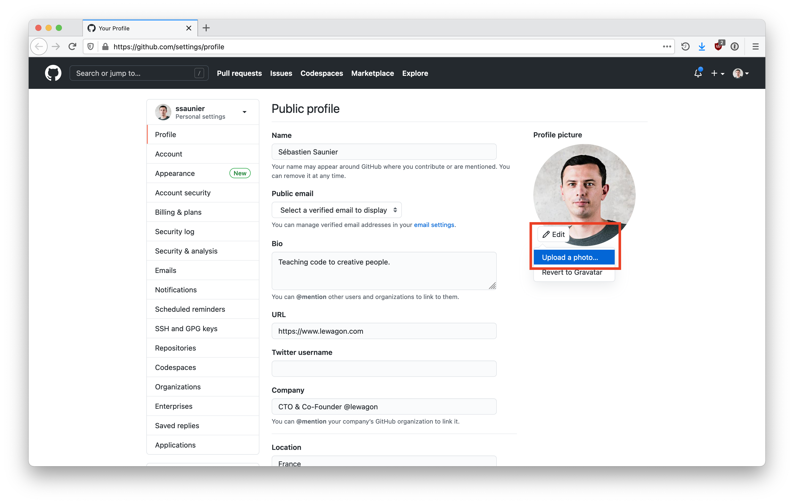

:point_right: [Ative a Autenticação em Duas Etapas (2FA)](https://docs.github.com/en/authentication/securing-your-account-with-two-factor-authentication-2fa/configuring-two-factor-authentication#configuring-two-factor-authentication-using-text-messages). O GitHub enviará mensagens de texto com um código quando você tentar fazer login. Isso é importante para a segurança e em breve será necessário para contribuir com código no GitHub.


## Uma observação sobre como encerrar aplicativos em um Mac

Clicar na pequena cruz vermelha no canto superior esquerdo da janela do aplicativo em um Mac **não o encerra**, apenas fecha uma janela ativa. Para sair do aplicativo _de verdade_ pressione `Cmd + Q` quando o aplicativo estiver ativo ou navegue até `APP_NAME` -> `Quit` na barra de menu.

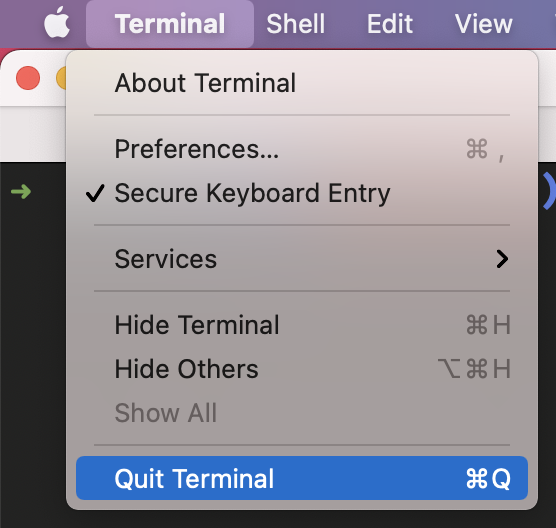

Durante esta configuração, você será solicitado a **sair e reabrir** os aplicativos várias vezes. Certifique-se de fazer isso corretamente :pray:

## Ferramentas de linha de comando

Abra um novo terminal, copie e cole o seguinte comando e pressione `Enter`:

```bash
xcode-select --install
```

Se você receber a mensagem a seguir, basta pular esta etapa e ir para a próxima.

```bash
# ferramentas de linha de comando já estão instaladas, use "Atualização de Software" para instalar atualizações
```

Caso contrário, abrirá uma janela perguntando se deseja instalar algum software: clique em “Instalar” e aguarde.


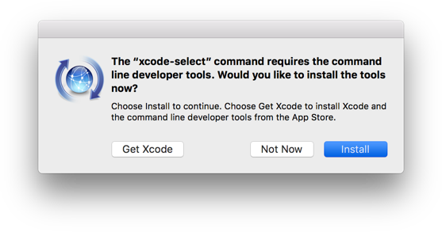

:heavy_check_mark: Se você vir a mensagem "O software foi instalado", tudo bem :+1:

:x: Se o comando `xcode-select --install` falhar, tente novamente: às vezes os servidores Apple ficam sobrecarregados.

:x: Se você vir a mensagem "O Xcode não está disponível no servidor de atualização de software", será necessário atualizar o catálogo de atualização de software:

```bash
sudo softwareupdate --clear-catalog
```

Feito isso, você pode tentar instalar novamente.


## Homebrew

[Homebrew](http://brew.sh/) é um gerenciador de pacotes: é um software usado para instalar outros softwares a partir da linha de comando. Vamos instalá-lo!

Abra um terminal e execute:

```bash
/bin/bash -c "$(curl -fsSL https://raw.githubusercontent.com/Homebrew/install/HEAD/install.sh)"
```

Isso solicitará sua confirmação (pressione `Enter`) e sua **senha da conta de usuário do macOS** (aquela que você usa para [fazer login](https://support.apple.com/en-gb/HT202860) quando você reinicia seu Macbook).

:warning: Quando você digita sua senha, nada aparecerá na tela, **isso é normal**. Este é um recurso de segurança para mascarar não apenas sua senha como um todo, mas também seu comprimento. Basta digitar sua senha e quando terminar, pressione `Enter`.

:warning: Se você vir este aviso :point_down:, execute os dois comandos na seção `Próximas etapas` para adicionar o Homebrew ao seu PATH:

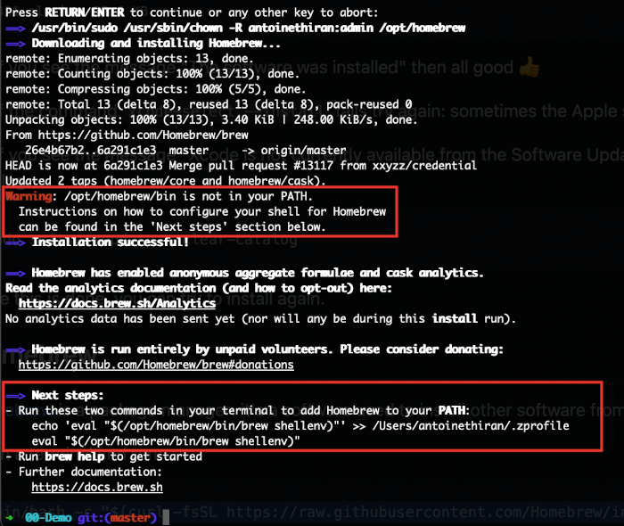

```bash
# ⚠️ Execute esses comandos apenas se você viu este aviso ☝
echo 'eval "$(/opt/homebrew/bin/brew shellenv)"' >> ~/.zprofile
eval "$(/opt/homebrew/bin/brew shellenv)"
```

Se você já tem o Homebrew, ele lhe dirá, tudo bem, vá em frente.

Em seguida, instale algum software útil:

```bash
brew update
```

Se você receber um erro `/usr/local deve ser gravável`, basta executar isto:

```bash
sudo chown -R $USER:admin /usr/local
```

```bash
brew update
```

Continue executando o seguinte no terminal (você pode copiar/colar todas as linhas de uma vez):

```bash
brew upgrade git         || brew install git
brew upgrade gh          || brew install gh
brew upgrade wget        || brew install wget
brew upgrade imagemagick || brew install imagemagick
brew upgrade jq          || brew install jq
brew upgrade openssl     || brew install openssl
```


## Visual Studio Code

### Instalação

Vamos instalar o editor de texto [Visual Studio Code](https://code.visualstudio.com).

Copie (`Cmd` + `C`) o comando abaixo e cole-o em seu terminal (`Cmd` + `V`):

```bash
brew install --cask visual-studio-code
```

Em seguida, inicie o VS Code executando o seguinte comando em seu terminal:

```bash
code
```

:heavy_check_mark: Se uma janela do VS Code acabou de abrir, você está pronto :+1:

:x: Caso contrário, por favor **entre em contato com um professor**


## Extensões do VS Code

### Instalação

Vamos instalar algumas extensões úteis no VS Code.

Copie e cole os seguintes comandos em seu terminal:

```bash
code --install-extension ms-vscode.sublime-keybindings
code --install-extension emmanuelbeziat.vscode-great-icons
code --install-extension github.github-vscode-theme
code --install-extension MS-vsliveshare.vsliveshare
code --install-extension shopify.ruby-lsp
code --install-extension dbaeumer.vscode-eslint
code --install-extension Rubymaniac.vscode-paste-and-indent
code --install-extension alexcvzz.vscode-sqlite
code --install-extension anteprimorac.html-end-tag-labels
code --install-extension marcoroth.herb-lsp
code --install-extension rayhanw.erb-helpers
```

Aqui está uma lista das extensões que você está instalando:

- [Sublime Text Keymap and Settings Importer](https://marketplace.visualstudio.com/items?itemName=ms-vscode.sublime-keybindings)
- [VSCode Great Icons](https://marketplace.visualstudio.com/items?itemName=emmanuelbeziat.vscode-great-icons)
- [Live Share](https://marketplace.visualstudio.com/items?itemName=MS-vsliveshare.vsliveshare)
- [Ruby](https://marketplace.visualstudio.com/items?itemName=shopify.ruby-lsp)
- [ESLint](https://marketplace.visualstudio.com/items?itemName=dbaeumer.vscode-eslint)
- [Paste and Indent](https://marketplace.visualstudio.com/items?itemName=Rubymaniac.vscode-paste-and-indent)
- [SQLite](https://marketplace.visualstudio.com/items?itemName=alexcvzz.vscode-sqlite)


### Recursos de IA no VS Code

O VS Code inclui muitos **recursos poderosos de IA**, que são ótimas ferramentas quando você já sabe programar.

Dito isso, confiar na IA muito cedo pode ocultar conceitos importantes e dificultar o entendimento da depuração. Quando você estiver confortável com os fundamentos, saberá quando e como usar a IA de forma eficaz — sem deixar que ela faça o raciocínio por você.

Para o início do bootcamp, vamos desativar esses recursos. No momento certo do curso, os reativaremos para que você possa usá-los bem.

Em **VS Code**:

1. Vamos abrir a "Paleta de Comandos" do VS Code: digite `Ctrl-Shift-P` (Windows / Linux) ou `Cmd-Shift-P` (macOS).
1. Isso abrirá a Paleta de Comandos: uma pequena caixa de texto no topo da tela. Comece a digitar `aifeatures` até ver "Chat: Learn How to Hide AI features". Clique nela.
  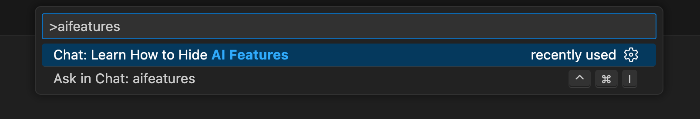
1. Isso abrirá as configurações e mostrará a opção "Disable and hide built-in AI features ...". Marque a caixa de seleção à frente dessa opção.
  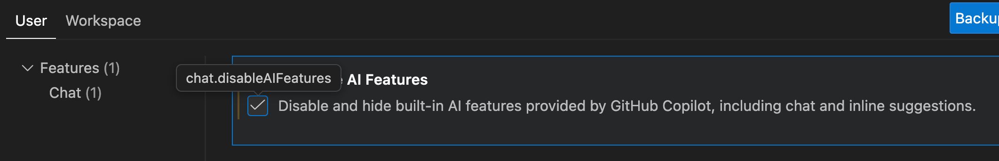

Mais tarde, se quiser **reativar** os recursos de IA, você pode seguir as mesmas instruções para desmarcar a caixa.


### Configuração do Live Share

[Visual Studio Live Share](https://visualstudio.microsoft.com/services/live-share/) é uma extensão do VS Code que permite compartilhar o código em seu editor de texto para depuração e programação em pares: vamos configurá-lo acima!

Inicie o VS Code em seu terminal digitando `code` e pressionando `Enter`.

Clique na pequena seta na parte inferior da barra esquerda :point_down:

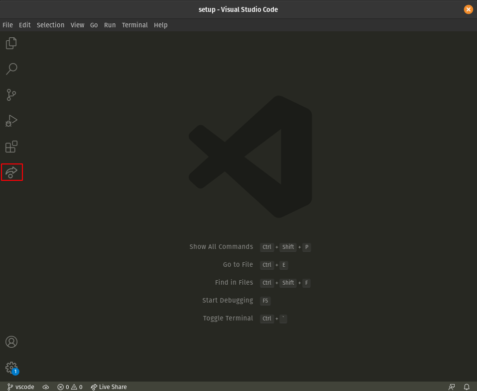

- Clique no botão "Compartilhar" e depois em "GitHub (faça login usando a conta GitHub)".
- Um pop-up aparece solicitando que você faça login no GitHub: clique em “Permitir”.
- Você é redirecionado para uma página do GitHub em seu navegador solicitando autorização do Visual Studio Code: clique em "Continuar" e depois em "Autorizar github".
- O VS Code pode exibir pop-ups adicionais: feche-os clicando em "OK".

É isso, você está pronto para continuar!


## Tema do Terminal macOS

Inicie um terminal, clique em `Terminal > Settings` e defina o tema "Pro" como perfil padrão.

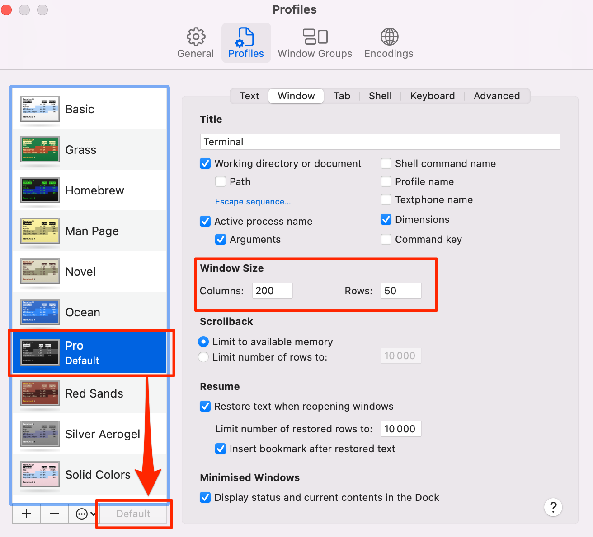

Na guia Janela, defina também seu **Tamanho da janela** para Colunas: 200, Linhas: 50

**Saia e reinicie** seu terminal: agora ele deve ter um belo fundo preto, mais agradável aos olhos.


## Oh-My-Zsh

Vamos instalar o plugin `zsh` [Oh My Zsh](https://ohmyz.sh/).

Em um terminal execute o seguinte comando:

```bash
sh -c "$(curl -fsSL https://raw.github.com/ohmyzsh/ohmyzsh/master/tools/install.sh)"
```

Se for perguntado "Deseja alterar seu shell padrão para zsh?", pressione `Y`

No final seu terminal deverá ficar assim:

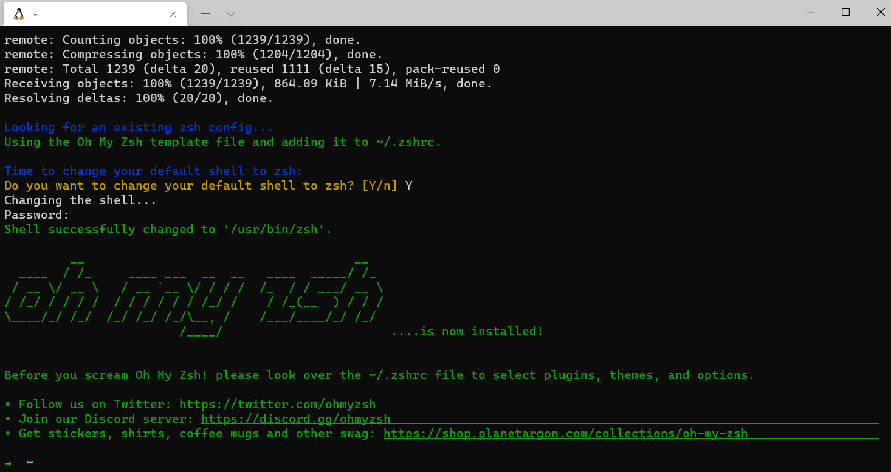

:heavy_check_mark: Se isso acontecer, você pode continuar :+1:

:x: Caso contrário, por favor **entre em contato com um professor**


## CLI do GitHub

CLI é o acrônimo de [Interface de linha de comando](https://en.wikipedia.org/wiki/Command-line_interface).

Nesta seção, usaremos [GitHub CLI](https://cli.github.com/) para interagir com o GitHub diretamente do terminal.

Usaremos o GitHub CLI (`gh`) para conectar ao GitHub usando *SSH*, um protocolo para fazer login usando chaves SSH em vez do conhecido par nome de usuário/senha.


Ele já deve estar instalado no seu computador a partir dos comandos anteriores.

Primeiro, para **fazer login**, copie e cole o seguinte comando em seu terminal:

:warning: **NÃO edite o `email`** — Mesmo que `user:email` pareça um espaço reservado para seu endereço de e-mail real, não é — não o substitua.

```bash
gh auth login -s 'user:email' -w --git-protocol ssh
```

`gh` fará algumas perguntas:

- `Generate a new SSH key to add to your GitHub account?` Pressione `Enter` para pedir ao gh para gerar as chaves SSH para você.

  Se você já possui chaves SSH, verá `Upload your SSH public key to your GitHub account?` Com as setas, selecione o caminho do arquivo de sua chave pública e pressione `Enter`.

- `Enter a passphrase for your new SSH key (Optional)`:
  - **PARA A MAIORIA DOS ALUNOS:** Apenas pressione `Enter` para pular. Você não precisa de uma senha para o bootcamp e ela seria solicitada toda vez que você usar a chave. Há, no entanto, um risco de que se alguém roubar seu laptop, ele possa enviar código para o GitHub.
  - **SE A SEGURANÇA É MUITO IMPORTANTE PARA VOCÊ:** Digite uma senha de sua escolha e pressione `Enter`. É _muito_ importante que se você inserir uma senha, anote-a em algum lugar imediatamente e não a perca nem a esqueça. Você precisará digitá-la com frequência.

- `Title for your SSH key`. Você pode deixá-lo no "GitHub CLI" proposto, pressione `Enter`.

Você obterá então a seguinte saída:

```bash
! First copy your one-time code: 0EF9-D015
- Press Enter to open github.com in your browser...
```

Selecione e copie o código (`0EF9-D015` no exemplo) e pressione `Enter`.

Seu navegador será aberto e solicitará que você autorize o GitHub CLI a usar sua conta GitHub. Aceite e espere um pouco.

Volte ao terminal, pressione `Enter` novamente e pronto.

Para verificar se você está conectado corretamente, digite:

```bash
gh auth status
```

:heavy_check_mark: Se você estiver `Logado no github.com como <SEU NOME DE USUÁRIO> `, então tudo bem :+1:

:x: Caso contrário, **entre em contato com um professor**.


## Dotfiles (configuração padrão)

Os hackers adoram refinar e aprimorar sua estrutura e ferramentas.

Começaremos com uma ótima configuração padrão fornecida pelo Le Wagon: [`lewagon/dotfiles`](https://github.com/lewagon/dotfiles).

Como sua configuração é pessoal, você precisa de seu próprio repositório para armazená-la. Então você irá fazer o **fork** do repositório Le Wagon.

Bifurcar significa que você criará um novo repositório em sua própria conta GitHub `$GITHUB_USERNAME/dotfiles`, idêntico ao original do Le Wagon que você poderá modificar à vontade.

Abra seu terminal e defina uma variável para seu nome de usuário GitHub:

```bash
export GITHUB_USERNAME=`gh api user | jq -r '.login'`
```

```bash
echo $GITHUB_USERNAME
```

:heavy_check_mark: Você deverá ver seu nome de usuário do GitHub impresso.

:x: Se não, **pare aqui** e peça ajuda. Pode haver um problema com a etapa anterior (`gh auth`).

:warning: Por favor note que esta variável só é definida para o tempo em que seu terminal está aberto. Se você fechá-lo antes ou durante as próximas etapas, será necessário configurá-lo novamente com as duas etapas acima!


É hora de fazer um fork do repositório e cloná-lo em seu computador:

```bash
mkdir -p ~/code/$GITHUB_USERNAME && cd $_
```

```bash
gh repo fork lewagon/dotfiles --clone
```

### Instalador do Dotfiles

Execute o instalador `dotfiles`:

```bash
cd ~/code/$GITHUB_USERNAME/dotfiles
```

```bash
zsh install.sh
```

Verifique os e-mails registrados em sua conta GitHub. Você precisará escolher um na próxima etapa:

```bash
gh api user/emails | jq -r '.[].email'
```

:heavy_check_mark: Se você vir a lista de seus e-mails registrados, você pode prosseguir :+1:

:x: Caso contrário, [reautentique no GitHub](https://github.com/lewagon/setup/blob/master/macos.pt.md#github-cli) antes de executar este comando :point_up: novamente.

### Instalador git

Execute o instalador `git`:

```bash
cd ~/code/$GITHUB_USERNAME/dotfiles && zsh git_setup.sh
```

:point_up: Isso **solicitará** seu nome (`Nome Sobrenome`) e seu e-mail. O email que você escolher será exibido **publicamente** na internet. 💡 Selecione o endereço `@users.noreply.github.com` se você não deseja que seu e-mail apareça em repositórios públicos aos quais você possa contribuir.

:warning: Você **precisa** colocar um dos e-mails listados acima graças ao comando anterior `gh api ...`. Se você não fizer isso, Kitt não conseguirá acompanhar seu progresso.

Agora **reinicie** seu terminal executando:

```bash
exec zsh
```

_Isso recarrega seu shell para que ele incorpore a nova configuração._


## rbenv

Vamos instalar o [`rbenv`](https://github.com/sstephenson/rbenv), um software para instalar e gerenciar ambientes `ruby`.

Primeiro, precisamos limpar qualquer instalação anterior do Ruby que você possa ter:

```bash
rvm implode && sudo rm -rf ~/.rvm
# If you got "zsh: command not found: rvm", carry on. It means `rvm` is not
# on your computer, that's what we want!

sudo rm -rf $HOME/.rbenv /usr/local/rbenv /opt/rbenv /usr/local/opt/rbenv
```

:warning: Este comando pode solicitar sua senha.

:warning: Quando você digita sua senha, nada aparecerá na tela, **isso é normal**. Este é um recurso de segurança para mascarar não apenas sua senha como um todo, mas também seu comprimento. Basta digitar sua senha e quando terminar, pressione `Enter`.

No terminal, execute:

```bash
brew uninstall --force rbenv ruby-build
```

```bash
exec zsh
```

Então rode:

```bash
brew install rbenv libyaml
```


## Ruby

### Instalação

Agora, você está pronto para instalar a versão mais recente do [ruby](https://www.ruby-lang.org/en/) e defini-la como a versão padrão.

Execute este comando, **demorará um pouco (5 a 10 minutos)**

```bash
rbenv install 3.3.5
```

Assim que a instalação do Ruby estiver concluída, execute este comando para informar ao sistema
para usar a versão 3.3.5 por padrão.

```bash
rbenv global 3.3.5
```

**Reinicialize** seu terminal e verifique sua versão do Ruby:

```bash
exec zsh
```

Então corra:

```bash
ruby -v
```

:heavy_check_mark: Se você vir algo começando com `ruby 3.3.5` então você pode prosseguir :+1:

:x: Se não, **pergunte a um professor**

### Instalando algumas gems

<details>
  <summary>Se você estiver na <bold>China</bold> 🇨🇳 clique aqui</summary>

  :warning: Se você estiver na China, você deve atualizar a forma como instalaremos o gem com os seguintes comandos.

```bash
# Somente China!
fontes de gemas --remove https://rubygems.org/
fontes de gemas -a https://gems.ruby-china.com/
fontes de gemas -l
#***FONTES ATUAIS***
# https://gems.ruby-china.com/
# Ruby-china.com deve estar na lista agora
```
</details>

**Todos, na China ou não**, continuem aqui para instalar gems.

No mundo Ruby, chamamos bibliotecas externas de `gems`: são pedaços de código Ruby que você pode baixar e executar em seu computador. Vamos instalar alguns!

No seu terminal, copie e cole o seguinte comando:

```bash
gem install colored faker http pry-byebug rake rails:8.1.1 rest-client rspec rubocop-performance sqlite3:2.8.1 activerecord:8.1.1 ruby-lsp
```

:heavy_check_mark: Se você tiver `xx gems installed`, então tudo bem :+1:

:x: Se você encontrar o seguinte erro:

```bash
ERROR: While executing gem ... (TypeError)
incompatible marshal file format (can't be read)
format version 4.8 required; 60.33 given
```

Execute o seguinte comando:
```bash
rm -rf ~/.gemrc
```

Execute novamente o comando para instalar as gemas.

:warning: **NUNCA** instale uma gem com `sudo gem install`! Mesmo se você encontrar uma resposta do Stackoverflow (ou o terminal) solicitando que você faça isso.


## Node.js

[Node.js](https://nodejs.org/en/) é um tempo de execução JavaScript para executar código JavaScript no terminal. Vamos instalá-lo com [nvm](https://github.com/nvm-sh/nvm), um gerenciador de versões para Node.js.

Em um terminal, execute os seguintes comandos:

```bash
curl -o- https://raw.githubusercontent.com/nvm-sh/nvm/v0.39.1/install.sh | zsh
```

```bash
exec zsh
```

Em seguida, execute o seguinte comando:

```bash
nvm -v
```

Você deverá ver uma versão. Se não, pergunte a um professor.

Agora vamos instalar o Node.js:

```bash
nvm install 20.17.0
```

Quando a instalação terminar, execute:

```bash
node -v
```

Se você vir `v20.17.0`, a instalação foi bem-sucedida :heavy_check_mark: Você pode então executar:

```bash
nvm cache clear
```

:x: Caso contrário, **entre em contato com um professor**


## Yarn

[`yarn`](https://yarnpkg.com/) é um gerenciador de pacotes para instalar bibliotecas JavaScript. Vamos instalá-lo:

Em um terminal, execute os seguintes comandos:

```bash
corepack enable
yarn set version stable
```

```bash
exec zsh
```

⚠️ Se vires quaisquer mensagens de erro, tenta executar `npm install -g corepack` e, em seguida, volta a executar os comandos acima.

Em seguida, execute o seguinte comando:

```bash
yarn -v
```

:heavy_check_mark: Se você vir uma versão, você está bem :+1:

:x: Se não, **entre em contato com um professor**


## SQLite

Em algumas semanas falaremos sobre bancos de dados e SQL. [SQLite](https://sqlite.org/index.html) é um mecanismo de banco de dados usado para executar consultas SQL em bancos de dados de arquivo único. Vamos instalá-lo:

Em um terminal, execute os seguintes comandos:

```bash
brew install sqlite
```

Em seguida, execute o seguinte comando:

```bash
sqlite3 -version
```

:heavy_check_mark: Se você vir uma versão, você está bem :+1:

:x: Se não, **peça um professor**


## PostgreSQL

Às vezes, o SQLite não é suficiente e precisaremos de uma ferramenta mais avançada chamada [PostgreSQL](https://www.postgresql.org/), um sistema de banco de dados de código aberto, robusto e pronto para produção.

Vamos instalá-lo agora.

Execute os seguintes comandos:

```bash
brew install postgresql@15 libpq
brew link --force libpq
```

```bash
brew services start postgresql@15
```

Depois de fazer isso, vamos verificar se funcionou:

```bash
psql -d postgres
```

Você deverá ver um novo prompt como este :point_down:

```bash
psql (15.2)
Type "help" for help.

postgres=#
```

:heavy_check_mark: Se for esse o caso, digite `\q` e depois `Enter` para sair deste prompt. Você está pronto para ir :+1:

:x: Se não, por favor **entre em contato com um professor**


## Checagem

Vamos verificar se você instalou tudo com sucesso.

No seu terminal, execute o seguinte comando:

```bash
exec zsh
```

Então corra:

```bash
curl -Ls https://raw.githubusercontent.com/lewagon/setup/master/check.rb > _.rb && ruby _.rb && rm _.rb || rm _.rb
```

:heavy_check_mark: Se você receber uma mensagem verde `Awesome! Your computer is now ready!`, então você está bem :+1:

:x: Caso contrário, **entre em contato com um professor**.


## Kitt

:warning: Se você recebeu um e-mail do Le Wagon convidando você a se inscrever no Kitt (nossa plataforma de aprendizagem), você pode pular esta etapa com segurança. Em vez disso, siga as instruções no e-mail que você recebeu, caso ainda não tenha feito isso.

Se não tiver certeza sobre o que fazer, siga [este link](https://kitt.lewagon.com/). Se você já estiver logado, pode pular esta seção com segurança. Se você não estiver logado, clique em `Enter Kitt as a Student`. Se você conseguir fazer login, poderá pular esta etapa com segurança. Caso contrário, pergunte a um professor se você deveria ter recebido um e-mail ou siga as instruções abaixo.

Registre-se como Alumni da Le Wagon acessando [kitt.lewagon.com/onboarding](http://kitt.lewagon.com/onboarding). Selecione seu batch, faça login no GitHub e insira todas as suas informações.

Seu professor irá então validar que você realmente faz parte do batch. Você pode pedir que eles façam isso assim que preencher o formulário de registro.

Assim que o professor aprovar seu perfil, acesse sua caixa de entrada de e-mail. Você deve ter 2 e-mails:

- Um do Slack, convidando você para a comunidade Le Wagon Alumni do Slack (onde você conversará com seus amigos e todos os ex-alunos anteriores). Clique em **Inscreva-se** e preencha os dados.
- Um do GitHub, convidando você para a equipe `lewagon`. **Aceite** caso contrário você não conseguirá acessar os slides da aula.


## Slack

[Slack](https://slack.com/) é uma plataforma de comunicação bastante popular na indústria de tecnologia.

### Instalação

[Baixe o aplicativo Slack](https://itunes.apple.com/us/app/slack/id803453959?mt=12) e instale-o.

:warning: Se você já usa o Slack em seu navegador, baixe e instale **o aplicativo para desktop** que vem com todos os recursos.


### Configurações

Inicie o aplicativo e faça login na organização `lewagon-alumni`.

Certifique-se de **fazer upload de uma foto de perfil** :point_down:

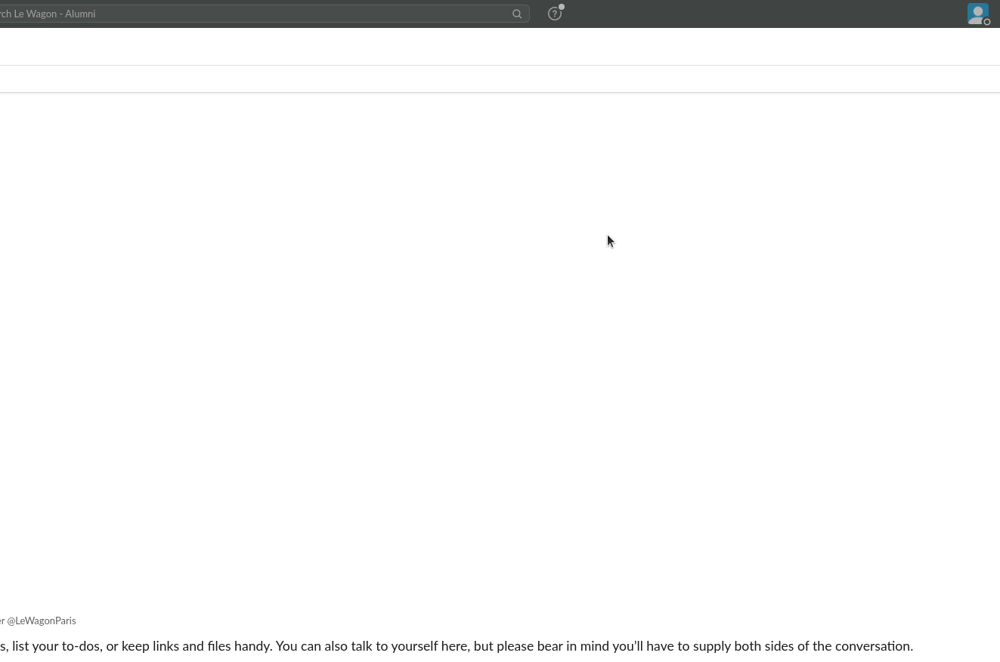

A ideia é que você tenha o Slack aberto o dia todo, para que você possa compartilhar links úteis/pedir ajuda/decidir onde ir almoçar/etc.

Para garantir que tudo está funcionando bem nas videochamadas, vamos testar sua câmera e microfone:
- Abra o aplicativo Slack
- Clique na foto do seu perfil no canto superior direito.
- Selecione `Preferências` no menu.
- Clique em `Áudio e vídeo` na coluna do lado esquerdo.
- Abaixo de `Solução de problemas`, clique em `Executar um teste de áudio, vídeo e compartilhamento de tela`. O teste será aberto em uma nova janela.
- Verifique se seus dispositivos preferidos de alto-falante, microfone e câmera aparecem nos menus suspensos e clique em `Iniciar teste`.

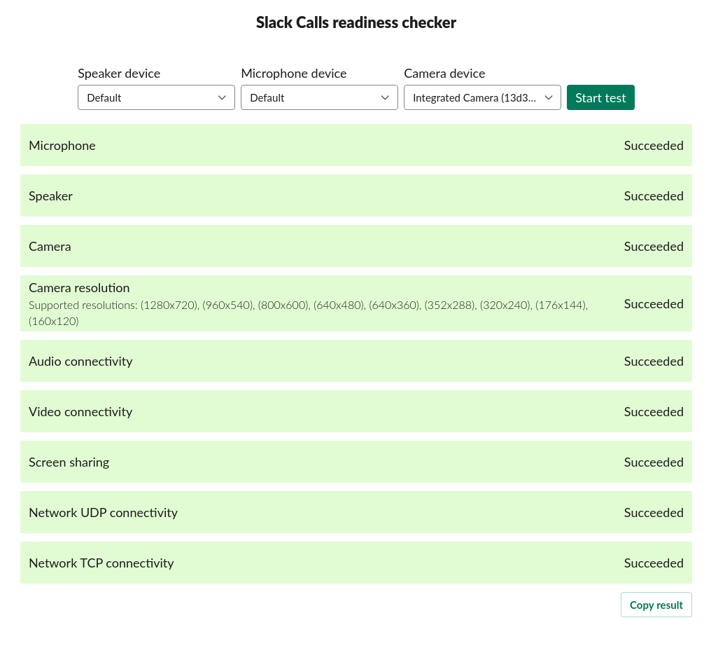

:heavy_check_mark: Quando o teste terminar, você deverá ver mensagens verdes de "Sucesso" pelo menos para seu microfone e câmera. :+1:

:x: Caso contrário, **entre em contato com um professor**.

Você também pode instalar o aplicativo Slack no seu telefone e entrar em `lewagon-alumni`!


## Configurações do MacOS

### Segurança

É obrigatório que você proteja sua sessão com uma senha. Se ainda não for o caso, vá para ` > Ajustes do Sistema > Usuários e Grupos` e altere a senha da sua conta. Você também deve ir para ` > Ajustes do Sistema > Segurança > Geral`. Você deve exigir uma senha `5 segundos` após o início da suspensão ou da proteção de tela.

Você também pode ir para ` > Ajustes do Sistema > Controle daVelocidade de repetição de teclaVelocidade de repetição de Escritorio y Dock` e clicar no botão `cantos de acesso rápido (Hot Corners)` no canto inferior esquerdo. Escolha no canto inferior direito para iniciar o protetor de tela. Dessa forma, ao sair da mesa, você pode bloquear rapidamente a tela colocando o mouse no canto inferior direito. 5 segundos depois, seu MacBook estará bloqueado e solicitará uma senha para voltar à sessão.

### Teclado

Ao se tornar um programador, você entenderá que deixar o teclado leva muito tempo, então você vai querer minimizar o uso do trackpad ou do mouse. Aqui estão alguns truques no macOS para ajudá-lo a fazer isso.

#### Velocidade do teclado

Vá para ` > Preferências do Sistema > Teclado`. Defina `Velocidade de repetição de tecla` para a posição mais rápida (à direita) e `Atraso da repetição` para a posição mais curta (à direita).

#### macOS Para hackers

[Leia este script](https://github.com/mathiasbynens/dotfiles/blob/master/.macos) e escolha algumas coisas que você acha que combinam com você. Por exemplo, você pode digitar no terminal este:

```bash
# Expanding the save panel by default
defaults write NSGlobalDomain NSNavPanelExpandedStateForSaveMode -bool true
defaults write NSGlobalDomain PMPrintingExpandedStateForPrint -bool true
defaults write NSGlobalDomain PMPrintingExpandedStateForPrint2 -bool true

# Save screenshots to the Desktop (or elsewhere)
defaults write com.apple.screencapture location "${HOME}/Desktop"

# etc..
```

### Fixe aplicativos no seu dock

Você usará a maioria dos aplicativos que instalou hoje com muita frequência. Vamos fixá-los no seu dock para que fiquem a apenas um clique de distância!

Para fixar um aplicativo no seu dock, inicie o aplicativo, clique com o botão direito no ícone na barra de tarefas para abrir o menu de contexto e escolha "Opções" e depois "Manter no Dock".

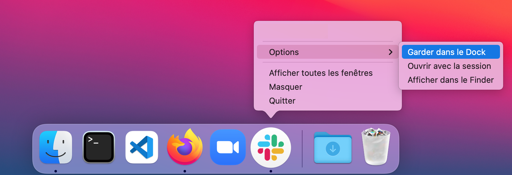

Você deve fixar:
- Seu terminal
- Seu explorador de arquivos
- VS Code
- Seu navegador de Internet
- Slack


## Configuração concluída!

Seu computador agora está pronto para o [curso de AI Software Development Le Wagon](https://www.lewagon.com/web-development-course/full-time) :muscle: :clap:

Aproveite o bootcamp, você vai acertar :rocket:


