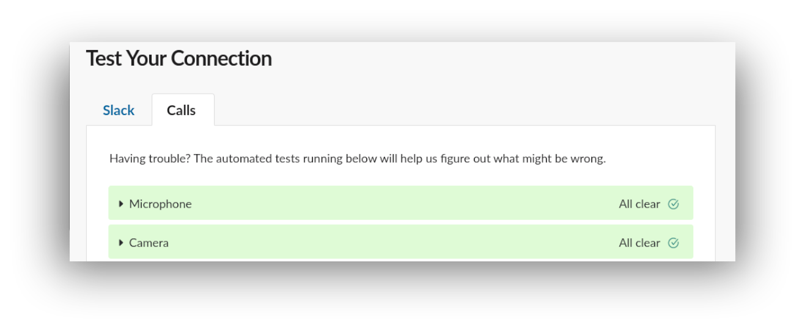

# 电脑设置教程

以下的教程将会帮助你为接下来在[Le Wagon](http://www.lewagon.org) 全栈开发训练营中做好准备：

- 获取一个文本编辑器，这里将会是你日日夜夜花时间的地方
- 安装一个软件包管理器
- 装扮你的终端
- 配置git和GitHub
- 安装Ruby


## GitHub账户

你有注册好GitHub账户嘛？如果还没有，[现在注册](https://github.com/join)。

:point_right: **[上传一张照片](https://github.com/settings/profile)** 并在你的GitHub账户中设置你的名称。这一步很重要，因为我们将使用一个带有你头像的内部dashboard。请**现在**立即做这一步，然后再去继续下面的步骤。


## Git

安装`git`：


- 打开Ubuntu终端
- 复制粘贴下面的命令：


```bash
sudo apt update
```
```bash
sudo apt install -y git apt-transport-https unzip gnome-terminal
````

现在我们来安装GitHub[官方命令行界面（CLI)](https://cli.github.com) (Command Line Interface)。运行以下代码:

```bash
sudo apt-key adv --keyserver hkp://keyserver.ubuntu.com:80 --recv-key C99B11DEB97541F0
sudo apt-add-repository https://cli.github.com/packages
sudo apt update
sudo apt install -y gh
```

运行以下的命令，来检查`gh`是否成功安装了：

```bash
gh --version
```

如果这行命令没有提示`gh version X.Y.Z (YYYY-MM-DD)`，且版本（version）大于等于1.4 ，请参考[这个文档](https://github.com/cli/cli/blob/trunk/docs/install_linux.md#official-sources)：这里面有故障排查的方法。如果有困惑，问问老师。


## zsh

Instead of using the default `bash` [shell](https://en.wikipedia.org/wiki/Shell_(computing)), we will use `zsh`.

In a terminal execute the following command and type in your password if asked:

```bash
sudo apt install -y zsh curl vim imagemagick jq
```


## Oh-my-zsh

Let's install the `zsh` plugin [Oh My Zsh](https://ohmyz.sh/).

In a terminal execute the following command:

```bash
sh -c "$(curl -fsSL https://raw.github.com/ohmyzsh/ohmyzsh/master/tools/install.sh)"
```

If asked "Do you want to change your default shell to zsh?", press `Y`

At the end your terminal should look like this:


:heavy_check_mark: If it does, you can continue :+1:

:x: Otherwise, please **ask for a teacher**


## GitHub CLI

CLI是[Command-line Interface（命令行界面）](https://baike.baidu.com/item/%E5%91%BD%E4%BB%A4%E8%A1%8C%E7%95%8C%E9%9D%A2/9910197?fr=aladdin)的首字母缩写。

在这一章节里面，我们会安装[GitHub CLI](https://cli.github.com/)。这样我们就可以从终端链接GitHub的数据，执行一些有用的动作。

之前执行的命令应该已经安装了GitHub CLI。首先你需要**登陆**。复制下面的命令（**不要**更改它），然后复制到终端，敲击回车：

```bash
gh auth login -s 'user:email' -w
```

你会看到下面的输出结果：

```bash
- Logging into github.com
! First copy your one-time code: 0EF9-D015
- Press Enter to open github.com in your browser...
```

复制那段验证码（code）(在上面的例子中是`0EF9-D015` ），然后敲击`Enter`。你的浏览器就会打开一个页面让你授权GitHub CLI使用你的GitHub账号。同意，并等待一会儿。回到终端，再次敲击`回车`，然后就应该好啦:tada:

检查一下你有没有链接好：

```bash
gh auth status
```

如果你看到`Logged in to github.com as <你的GitHub用户名> `，那就可以了。如果没有，**问问老师**。

然后运行下面的配置命令:

```bash
gh config set git_protocol ssh
```

最后，新建一个[gist](https://docs.github.com/en/free-pro-team@latest/github/writing-on-github/editing-and-sharing-content-with-gists)来确保`gh` 可以正常运作：

```bash
echo "Hello [Le Wagon](https://www.lewagon.com) :wave:" | gh gist create -d "Starting my coding journey..." -f "SETUP_DAY.md" -p -w
```

这一行命令会在你的浏览器里打开刚创建的gist页面。看呐，我们刚创建了一个[**Markdown**](https://guides.github.com/features/mastering-markdown/)文件！


## GitHub

我们需要生成SSH密钥。这些会在GitHub和Heroku上使用。把它当成一种登陆的方式好了，但它和平时用的用户名和密码不一样。如果你之前有生成过密钥，你就可以跳过这个步骤。

打开终端，然后输入下面的命令，把email换成**你自己的**（应该用你注册GitHub的email）。然后它会提示你一些信息。按回车键，直到它问你要**密码**。

```bash
mkdir -p ~/.ssh && ssh-keygen -t ed25519 -o -a 100 -f ~/.ssh/id_ed25519 -C "TYPE_YOUR_EMAIL@HERE.com"
```

**敲黑板：** 当它问你要密码时，输入你想要的密码（并且是你可以记住的密码）。这个密码会保护你保存在硬盘上的私钥。你输入的时候，还是不会在屏幕上看到任何东西，这是**正常的！**输入密码，当你输完的时候，按下回车。

然后你需要把**公钥**存到GitHub上。运行下面的命令：

```bash
gh auth refresh -s write:public_key
```

它会在屏幕上提示一次性代码(####-####). 复制后按“ENTER”，然后将代码粘贴到浏览器中，然后按照说明对 GitHub 进行授权.

回到终端，按“ENTER”并运行:

```bash
gh ssh-key add ~/.ssh/id_ed25519.pub
```
这应该返回 `✓ Public key added to your account` . 如果没有，请不要犹豫**与老师联系.**


## Dotfiles (标准配置)

黑客很喜欢把他们的shell和工具变得很酷炫。

让我们用Le Wagon提供的一个超棒的默认配置文件来开始吧：[`lewagon/dotfiles`](http://github.com/lewagon/dotfiles).

因为你的配置是私人的，所以你需要保存在**自己**的代码库里（repository/repo）。Fork的意思是：在你的GitHub账号上建一个新的代码库，和原始的那一个是一模一样的（可以想象成你在复制粘贴这个代码库）。
这样，你在你的GitHub上就会有一个新的代码库： `$GITHUB_USERNAME/dotfiles`。
我们需要fork，因为每个人都需要在那些文件里加上一些**特定**信息（比如你的名字）。

打开终端，运行下面的命令：

```bash
export GITHUB_USERNAME=`gh api user | jq -r '.login'`
echo $GITHUB_USERNAME
```

你就能看到你的GitHub用户名在终端里显示出来了。
如果没有的话，现在就**停下**，找老师帮忙。看起来之前的步骤(`gh auth`)有一些问题。

现在就可以fork代码库（repo)，然后克隆到你自己的电脑上了：

```bash
mkdir -p ~/code/$GITHUB_USERNAME && cd $_
gh repo fork lewagon/dotfiles --clone
```

运行`dotfiles`安装器：

```bash
cd ~/code/$GITHUB_USERNAME/dotfiles && zsh install.sh
```

用下面的命令检查一下你GitHub账号录入的电子邮箱。你需要在其中选一个（如果你有好几个的话），然后再进入下一个步骤：

```bash
gh api user/emails | jq -r '.[].email'
```

运行git安装器：

```bash
cd ~/code/$GITHUB_USERNAME/dotfiles && zsh git_setup.sh
```

:point_up: 这会**提示**填写你的全名（`FirstName LastName`）和你的邮箱。注意啦，你**需要**填`gh api ...`命令列出的其中一个电子邮箱。不然，Kitt就没办法跟进你的学习进程。

现在**退出**你刚打开的所有终端窗口。


### Sublime Text 自动配置

打开一个新的终端并输入：

```bash
cd ~/code
stt
```

它将会**在Sublime Text中打开当前文件夹**。这是我们如何使用它的方法。

**关闭Sublime Text**并重新打开它：

```bash
stt
```

**等待一分钟**，等所有额外的软件包都自动安装好（会自动打开一个带有文本的新的窗口，上面会包含每个你安装好的新包的文档）。如果想要跟踪软件包的安装进度，你可以前往`View > Show console`。

如果想要核查是否所有的插件都安装好了，你可以打开`命令面板 Command Palette`(在OSX上，按下`⌘` + `⇧` + `P`；在linux上，按下`Ctrl` + `⇧` + `P`)，输入`Packlist`然后按`Enter`，你应该会看到有一些软件包被安装了（像是[Emmet](http://emmet.io/)）。

当这些结束之后，你可以关闭Sublime Text。


现在，你已经准备好了去安装最新Ruby版本并把它设置为默认版本。

运行下方这个指令，它会**花费一些时间（5-10分钟）**

```bash
rbenv install 2.7.4
```

当Ruby安装好后，运行下面这个指令来告诉系统使用2.7.4这个版本作为默认版本。

```bash
rbenv global 2.7.4
```

然后再次**重启**你的终端（关掉并重新打开它）。

```bash
ruby -v
```

你应该会看到`ruby 2.7.4p`。如果没有的话，询问一下老师。

## 安装一些gems

---

<details>
  <summary>点击这里，如果你在 :cn: <bold>中国</bold>的话</summary>


  &nbsp;

  :warning: 如果你在中国的话，你应该使用以下命令来安装gem。

```bash
# China only!
gem sources --remove https://rubygems.org/
gem sources -a https://gems.ruby-china.com/
gem sources -l
# *** CURRENT SOURCES ***
# https://gems.ruby-china.com/
# Ruby-china.com must be in the list now
```
</details>

---

无论你是不是在中国，请都运行下面的指令：

```bash
gem install rake bundler rspec rubocop rubocop-performance pry pry-byebug colored http
```

如果你遇到了以下的报错：

`
ERROR: While executing gem ... (TypeError)
incompatible marshal file format (can't be read)
format version 4.8 required; 60.33 given
`

运行以下的指令：

```bash
rm -rf ~/.gemrc
```

然后，重新运行安装gems的指令。

**永远不要**使用`sudo gem install`来安装一个gem！即使你偶然发现了一个网络上的答案（或者终端提示）叫你这么做。


## Node (使用[nvm](https://github.com/nvm-sh/nvm))

```bash
curl -o- https://web-dev-challenge-lewagon-image.oss-cn-shanghai.aliyuncs.com/setup/install_nvm.sh | zsh
```

重启你的终端并执行下方指令：

```bash
nvm -v
```

你应该会看到你的nvm的版本。如果没有的话，问一下你的老师。

现在，让我们来安装node：

```bash
nvm install 14.15.0
```

当这个指令执行结束之后，运行：

```bash
node -v
```

你应该会看到`v14.15.0`。如果没有的话，问一下你的老师。


## yarn

让我们一起来安装[`yarn`](https://classic.yarnpkg.com/en/docs/install):

```bash
npm install --global yarn
```

重启终端并运行：

```bash
yarn -v
```

你应该会看到你yarn的版本。如果没有的话，问一下你的老师。


## PostgreSQL

In a few weeks, we'll talk about SQL and Databases and you'll need something called PostgreSQL,
an open-source robust and production-ready database. Let's install it now.

```
sudo apt install -y postgresql postgresql-contrib libpq-dev build-essential
sudo -u postgres psql --command "CREATE ROLE `whoami` LOGIN createdb;"
```


## 最后检查

让我们来看看你是否已经成功安装好了所有软件。

退出所有的终端，打开一个新的终端窗口并运行下方指令：

```bash
curl -Ls https://web-dev-challenge-lewagon-image.oss-cn-shanghai.aliyuncs.com/setup/check.rb > _.rb && ruby _.rb || rm _.rb
```

它应该会告诉你，你的工作台是否已经正确的设置好了 ：）如果没有的话，问一下你的老师。


## 校友
:warning: 如果你已经收到了一封来自Le Wagon邀请你去注册Kitt(我们的学习平台)的邮件并且你也注册完成了的话，你可以安全的跳过这一章节。如果你还没有注册完成的话，请跟随邮件里的教程，完成注册。

如果你不确定你要做什么，可以查看[这个链接](https://kitt.lewagon.com/)。如果你已经登录了的话，你可以跳过这个章节。如果你没有登录的话，你需要点击`Enter Kitt as a Student`。如果你可以成功的登录，你也可以安全的跳过这一步。不然的话，你可以询问一下老师你是否有收到过相关的邮件，或者直接跟着执行下面的教程。

前往[kitt.lewagon.com/onboarding](http://kitt.lewagon.com/onboarding)，注册成为Le Wagon的一名校友。选择你的batch，用gitHub账户登录并填写你的信息。

你的老师将会验证你的确属于这个batch。你可以在完成了注册表单后去询问老师去做验证。

当你的老师验证成功后，请前往你的邮箱收件箱。你应该会有两封邮件：

- 一封来自Slack,邀请你加入Le Wagon Alumni Slack社群（在这儿你可以与你的伙伴和所有之前的学员交流）。点击**Join**并填写相应的个人信息。

- 一封来自GitHub,要求你加入`lewagon`团队。**接受它**，不然的话你将没有办法看到有关讲座和课程的文件。


## Slack

[Install Slack for Linux (beta)](https://get.slack.help/hc/en-us/articles/212924728-Slack-for-Linux-beta-).

Launch the app and sign in to `lewagon-alumni` organization.

Make sure you upload a picture there.

You can also sign in to Slack on your iPhone or Android device!

The idea is that you'll have Slack open all day, so that you can share useful links / ask for help / decide where to go to lunch / etc.

In case of remote tickets, you will use Slack audio or video call to get help. To ensure that everything is working fine, launch the Slack app on your computer, then [follow this procedure](https://slack.com/intl/en-gb/help/articles/115003538426-Troubleshoot-Slack-Calls#run-our-calls-test) (tl;dr type `/call --test` then the `Enter` key in any channel).

After the test are finished, you should have green "All clear" messages at least for your microphone and camera. If not, ask a teacher.



## Ubuntu settings

### Install video codec H264

On our pedagogical platform (Kitt, you'll soon discover it!), we have some videos. By default Firefox on Linux cannot play them as they use an unsupported codec (H264). To get those videos working for you, you need to run this:

```bash
sudo apt install libavcodec-extra -y
```

### Install useful terminal tools

`tree` is a nice tool to visualize a directory tree inside the terminal:

`ncdu` is a text-based interface disk utility.

`htop` is an interactive process viewer.

`tig` is a text-mode interface for `git`.

```bash
sudo apt install tree ncdu htop tig
```

### Ubuntu inotify

Ubuntu is always tracking changes in your folders and to do this it uses inotify.
By default the Ubuntu limit is set to 8192 files monitored.

As programming involves a lot of files, we need to raise this limit.
In your terminal run:

```bash
echo fs.inotify.max_user_watches=524288 | sudo tee -a /etc/sysctl.conf && sudo sysctl -p
```

### Pin apps to your dock

You are going to use most of the apps you've installed today really often. So let's pin them to your dock so that they are just one click away!

To pin an app to your dock, launch the app, right-click on the icon in the dock to bring up the context menu and choose "Add to Favorites".


You must pin:
- Your terminal
- Your file explorer
- VS Code
- Your Internet browser
- Slack
- Zoom


conclusion.md


