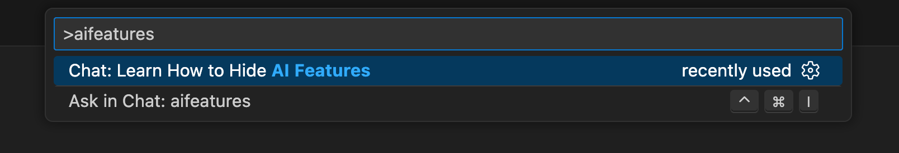
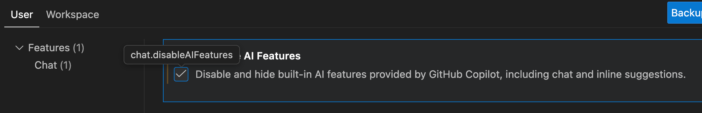

# Instrucciones de la configuración

Aquí abajo encontrarás las instrucciones para la configuración que tu computadora necesita para el [curso de AI Software Development de Le Wagon](https://www.lewagon.com/web-development-course/full-time).

Por favor, **léelas cuidadosamente y ejecuta todos los comandos en el orden indicado**. Si tienes algún problema, no dudes en pedirle ayuda a tu profesor :raising_hand:

¡Comencemos! :rocket:


## Cuenta GitHub

¿Ya tienes una cuenta GitHub? Si no es el caso, [ábrela ya](https://github.com/join).

:point_right: **[Sube una foto](https://github.com/settings/profile)** y escribe tu nombre correctamente en tu cuenta GitHub. Esto es importante porque nosotros usaremos un tablero de comando interno con tu avatar. Por favor hazlo **ahora** antes de dar un paso más en esta guía.


:point_right: **[Habilita la Autenticación de Dos Factores (2FA)](https://docs.github.com/en/authentication/securing-your-account-with-two-factor-authentication-2fa/configuring-two-factor-authentication#configuring-two-factor-authentication-using-text-messages)**. GitHub te enviará mensajes de texto con un código cuando intentes iniciar sesión. Esto es importante para la seguridad y también pronto será necesario para contribuir código en GitHub.


## Visual Studio Code

### Instalación

Instala el editor de texto [Visual Studio Code](https://code.visualstudio.com).

Copia (presionando `Cmd` + `C`) el comando de aquí abajo y luego pégalo en tu terminal (`Ctrl` + `Shift` + `v`):

```bash
wget -qO- https://packages.microsoft.com/keys/microsoft.asc | gpg --dearmor > packages.microsoft.gpg
sudo install -o root -g root -m 644 packages.microsoft.gpg /etc/apt/trusted.gpg.d/
sudo sh -c 'echo "deb [arch=amd64,arm64,armhf signed-by=/etc/apt/trusted.gpg.d/packages.microsoft.gpg] https://packages.microsoft.com/repos/code stable main" > /etc/apt/sources.list.d/vscode.list'
rm -f packages.microsoft.gpg
sudo apt update
sudo apt install -y code
```

Escribe tu contraseña cuando estos comandos te la pidan.

:warning: Cuando escribas tu contraseña no verás nada en la pantalla. **Esto es normal**. Es una herramienta de seguridad para ocultar tanto el contenido de tu contraseña como su longitud. Simplemente escribe tu contraseña y presiona `Enter` al terminar.

### Abrir desde la terminal

Ahora abre VS Code desde **la terminal**:

```bash
code
```

:heavy_check_mark: Si se acaba de abrir una ventana de VS Code, entonces todo está bien :+1:

:x: Si no es el caso, por favor **pídele ayuda a un profesor**.


## Extensiones de VS Code

### Instalación

Vamos a instalar algunas extensiones útiles de VS Code.

Copia y pega los siguientes comandos en tu terminal:

```bash
code --install-extension ms-vscode.sublime-keybindings
code --install-extension emmanuelbeziat.vscode-great-icons
code --install-extension github.github-vscode-theme
code --install-extension MS-vsliveshare.vsliveshare
code --install-extension shopify.ruby-lsp
code --install-extension dbaeumer.vscode-eslint
code --install-extension Rubymaniac.vscode-paste-and-indent
code --install-extension alexcvzz.vscode-sqlite
code --install-extension anteprimorac.html-end-tag-labels
code --install-extension marcoroth.herb-lsp
code --install-extension rayhanw.erb-helpers
```

Aquí está la lista de las extensiones que estás instalando:
- [Sublime Text Keymap and Settings Importer](https://marketplace.visualstudio.com/items?itemName=ms-vscode.sublime-keybindings)
- [VSCode Great Icons](https://marketplace.visualstudio.com/items?itemName=emmanuelbeziat.vscode-great-icons)
- [Live Share](https://marketplace.visualstudio.com/items?itemName=MS-vsliveshare.vsliveshare)
- [Ruby](https://marketplace.visualstudio.com/items?itemName=shopify.ruby-lsp)
- [ESLint](https://marketplace.visualstudio.com/items?itemName=dbaeumer.vscode-eslint)
- [Paste and Indent](https://marketplace.visualstudio.com/items?itemName=Rubymaniac.vscode-paste-and-indent)
- [SQLite](https://marketplace.visualstudio.com/items?itemName=alexcvzz.vscode-sqlite)


### Funciones de IA en VS Code

VS Code incluye muchas y potentes **funciones de IA**, que son una gran herramienta una vez que ya sabes programar.

Dicho esto, depender de la IA demasiado pronto puede ocultar conceptos importantes y dificultar la comprensión de la depuración. Una vez que estés cómodo con los fundamentos, sabrás cuándo y cómo usar la IA de forma eficaz —sin dejar que haga el trabajo por ti.

Para el inicio del bootcamp, desactivaremos estas funciones. Llegado el momento apropiado en el curso, las volveremos a habilitar para que puedas utilizarlas bien.

En **VS Code**:

1. Abramos la "Paleta de comandos" de VS Code: escribe `Ctrl-Shift-P` (Windows / Linux) o `Cmd-Shift-P` (macOS).
1. Se abrirá la Paleta de comandos: una pequeña caja de texto en la parte superior de la pantalla. Empieza a escribir `aifeatures` hasta que veas "Chat: Learn How to Hide AI features". Haz clic en ella.
  
1. Esto abrirá la configuración y te mostrará la opción "Disable and hide built-in AI features ...". Marca la casilla delante de esa opción.
  

Más adelante, si quieres **volver a habilitar** las funciones de IA, puedes seguir las mismas instrucciones para desmarcar la casilla.


### Configuración de Live Share

[Visual Studio Live Share](https://visualstudio.microsoft.com/services/live-share/) es una extensión de VS Code que te permite compartir el código en tu editor de texto para debugging y pair-programming: ¡Instalémoslo!

Abre VS Code desde tu terminal escribiendo `code` y presionando `Enter`.

Haz clic en la pequeña flecha de la parte inferior de la barra de la izquierda:


- Haz clic en el botón "Share". Luego en "GitHub (Inicia sesión usando tu cuenta GitHub)".
- Va a aparecer una ventana emergente pidiéndote que inicies sesión con GitHub: Haz clic en "Allow".
- Te redireccionarán a una página GitHub en tu navegador pidiéndote que autorices Visual Studio Code: Haz clic en "Continue" y luego en "Authorize github".
- Es posible que VS Code muestre más ventanas emergentess: Ciérralas haciendo clic en "OK".

Eso es todo. ¡Ya puedes continuar!


## Herramientas de línea de comando

### Comprueba la configuración regional (locale)

La "locale" es un mecanismo que permite adaptar los programas a su idioma y país.

Comprobemos que la configuración regional por defecto es el inglés:

```bash
locale
```

Si la salida no contiene `LANG=en_US.UTF-8`, ejecute el siguiente comando en un Ubuntu terminal para instalar la locale inglesa:

```bash
sudo locale-gen en_US.UTF-8
```

Si después, recibes una advertencia (`bash: warning: setlocale: LC_ALL: cannot change locale (en_US.utf-8)`) en tu terminal, por favor haz lo siguiente:

<details>
  <summary>Generar la configuración regional<>/summary>

Por favor, ejecuta estas líneas en tu terminal.

```bash
sudo update-locale LANG=en_US.UTF8
sudo apt-get update
sudo apt-get install language-pack-en language-pack-en-base manpages
```
</details>

### Zsh & Git

En lugar de usar el `bash` [shell](https://en.wikipedia.org/wiki/Shell_(computing)) predeterminado, usaremos `zsh`.

También utilizaremos [`git`](https://git-scm.com/), un programa de línea de comando para control de versiones.

Vamos a instalarlos, junto con otros programas útiles:
- Abre una **terminal de Ubuntu**
- Copia y pega los siguientes comandos:

```bash
sudo apt update
```

```bash
sudo apt install -y curl git imagemagick jq unzip vim zsh
```

Estos comandos te pedirán tu contraseña: escríbela.

:warning: Cuando escribas tu contraseña no verás nada en la pantalla. **Esto es normal**. Es una herramienta de seguridad para ocultar tanto el contenido de tu contraseña como su longitud. Simplemente escribe tu contraseña y presiona `Enter` al terminar.

### Instalación de la CLI de GitHub

Instalemos la [CLI oficial de GitHub](https://cli.github.com) (Interfaz de Línea de Comando). Es un programa que se usa para interactuar con tu cuenta GitHub por medio de la línea de comando.

En tu terminal, copia y pega los siguientes comandos y escribe tu contraseña si te la piden:

```bash
sudo apt remove -y gitsome # gh command can conflict with gitsome if already installed
curl -fsSL https://cli.github.com/packages/githubcli-archive-keyring.gpg | sudo dd of=/usr/share/keyrings/githubcli-archive-keyring.gpg
echo "deb [arch=$(dpkg --print-architecture) signed-by=/usr/share/keyrings/githubcli-archive-keyring.gpg] https://cli.github.com/packages stable main" | sudo tee /etc/apt/sources.list.d/github-cli.list > /dev/null
sudo apt update
sudo apt install -y gh
```

Ejecuta el comando que te mostramos a continuación para verificar que `gh` se haya instalado correctamente en tu máquina:

```bash
gh --version
```

:heavy_check_mark: Si ves esta versión `gh version X.Y.Z (YYYY-MM-DD)`, puedes continuar trabajando :+1:

:x: Si no es el caso, por favor **contacta a un profesor**


## Oh-my-zsh

Instalemos el plugin `zsh` [Oh My Zsh](https://ohmyz.sh/).

Ejecuta este comando en la terminal:

```bash
sh -c "$(curl -fsSL https://raw.github.com/ohmyzsh/ohmyzsh/master/tools/install.sh)"
```

Si te preguntan "Do you want to change your default shell to zsh?", presiona `Y`

Cuando termines, tu terminal debería lucir así:


:heavy_check_mark: Si es el caso, puedes continuar :+1:

:x: Si no, por favor **pídele ayuda a un profesor**.


## GitHub CLI

CLI es una abreviación de [Command-line Interface](https://en.wikipedia.org/wiki/Command-line_interface) que significa interfaz de línea de comando.

En esta sección usaremos [GitHub CLI](https://cli.github.com/) para interactuar directamente con GitHub desde la terminal.

Usaremos la GitHub CLI (`gh`) para conectarnos a GitHub utilizando *SSH*, un protocolo para iniciar la sesión utilizando claves SSH en lugar de la famosa pareja nombre de usuario y contraseña.

Ya debería haberse instalado en tu computadora con los comandos que ejecutaste anteriormente.

Lo primero que hay que hacer para **iniciar sesión** es copiar y pegar el comando siguiente en tu terminal:

:warning: **NO edites el `email`**

```bash
gh auth login -s 'user:email' -w --git-protocol ssh
```

`gh` le hará algunas preguntas:

- `Generate a new SSH key to add to your GitHub account?` Presiona `Enter` para pedirle a gh que genere las claves SSH por ti.

  Si ya tienes claves SSH, verás en su lugar `Upload your SSH public key to your GitHub account?`Con las flechas, selecciona la ruta de tu archivo de clave pública y pulsa `Intro`.

- `Enter a passphrase for your new SSH key (Optional)`. Pon algo que quieras y que recuerdes. Es una contraseña para proteger tu private key que está almacenada en tu disco duro. Luego presiona `Enter`.

- `Title for your SSH key`. Puede dejarlo en la propuesta "GitHub CLI", presiona `Enter`.

Obtendrás el siguiente resultado:

```bash
! First copy your one-time code: 0EF9-D015
- Press Enter to open github.com in your browser...
```

Selecciona y copia el código (`0EF9-D015` en el ejemplo) y luego presiona `Enter`.

Tu navegador se abrirá y te pedirá que autorices GitHub CLI para usar tu cuenta GitHub. Acepta y espera un poco.

Regresa a la terminal, presiona `Enter` nuevamente y listo. Eso es todo.

Para verificar que están conectado correctamente, escribe lo siguiente:

```bash
gh auth status
```

:heavy_check_mark: Si obtienes este mensaje: `Logged in to github.com as <YOUR USERNAME> `, significa que todo está bien :+1:

:x: De lo contrario, **contacta a un profesor**.


## Dotfiles (configuración estándar)

Los hackers aman mejorar sus shells y sus herramientas.

Comenzaremos con una configuración predeterminada proporcionada por Le Wagon: [`lewagon/dotfiles`](https://github.com/lewagon/dotfiles).

Tu configuración es personal, así que necesitas tu **propio** repositorio para almacenarla. Haz el **fork** del repositorio de Le Wagon.

Hacer un fork significa crear un nuevo repositorio en tu propia cuenta GitHub `$GITHUB_USERNAME/dotfiles` el cual es idéntico al original de Le Wagon y que podrás modificar como quieras.

Abre tu terminal y ejecuta los siguientes comandos:

```bash
export GITHUB_USERNAME=`gh api user | jq -r '.login'`
echo $GITHUB_USERNAME
```

:heavy_check_mark: Deberías ver tu usuario GitHub en la pantalla.

:x: Si no es el caso, **no des un paso más** y pide ayuda. Es posible que haya un problema con el paso anterior (`gh auth`).

Es hora de hacer el fork del repositorio y clonarlo en tu computadora:

```bash
mkdir -p ~/code/$GITHUB_USERNAME && cd $_
gh repo fork lewagon/dotfiles --clone
```

### Instalación de Dotfiles

Ejecuta el instalador de `dotfiles`:

```bash
cd ~/code/$GITHUB_USERNAME/dotfiles
zsh install.sh
```

Verifica los emails registrados en tu cuenta GitHub. Deberás seleccionar uno en el paso siguiente:

```bash
gh api user/emails | jq -r '.[].email'
```

:heavy_check_mark: Si ves una lista de tus emails registrados, puedes continuar :+1:

:x: De lo contrario, por favor haz la [autenticación en GitHub](https://github.com/lewagon/setup/blob/master/ubuntu.es.md#github-cli) nuevamente antes de ejecutar este comando :point_up: again.

### Instalación de git

Ejecuta el instalador de `git`:

```bash
cd ~/code/$GITHUB_USERNAME/dotfiles && zsh git_setup.sh
```

:point_up: Esto te **pedirá** tu nombre (`FirstName LastName`) y tu email. Cualquier correo que elijas se mostrará **públicamente** en internet. 💡 Selecciona la dirección `@users.noreply.github.com` si no quieres que tu correo electrónico aparezca en los repositorios públicos a los que puedas contribuir.

:warning: **Necesitas** poner uno de los emails que aparecen arriba gracias al comando anterior `gh api ...`. De lo contrario, Kitt no podrá hacerle seguimiento a tu progreso.

Ahora **resetea** tu terminal ejecutando lo siguiente:

```bash
exec zsh
```


## Desahilitación de la solicitud de SSH passphrase

No vas a querer que te pidan tu passphrase cada vez que te comuniques con un repositorio remoto. Por eso debes agregarle plugin `ssh-agent` a `oh my zsh`:

Primero abre el archivo `.zshrc`:

```bash
code ~/.zshrc
```

Luego:
- Identifica la línea que comienza por `plugins=`
- Agrega `ssh-agent` al final de la lista de plugins

La lista debería verse de la siguiente manera:

```bash
plugins=(gitfast last-working-dir common-aliases zsh-syntax-highlighting history-substring-search pyenv ssh-agent)
```

:heavy_check_mark: Guarda el archivo `.zshrc` con `Ctrl` + `S` y cierra tu editor de texto.


## rbenv

Instala [`rbenv`](https://github.com/sstephenson/rbenv), un programa para instalar y gestionar entornos `ruby`.

Primero debemos limpiar cualquier instalación previa de Ruby que tengas en tu computadora:

```bash
rvm implode && sudo rm -rf ~/.rvm
# If you got "zsh: command not found: rvm", carry on.
# It means `rvm` is not on your computer, that's what we want!
rm -rf ~/.rbenv
```

Luego ejecuta lo siguiente en tu terminal:

```bash
sudo apt install -y build-essential tklib zlib1g-dev libssl-dev libffi-dev libxml2 libxml2-dev libxslt1-dev libreadline-dev libyaml-dev
```

```bash
git clone https://github.com/rbenv/rbenv.git ~/.rbenv
```

```bash
git clone https://github.com/rbenv/ruby-build.git ~/.rbenv/plugins/ruby-build
exec zsh
```


## Ruby

### Instalación

Ahora estás listo para instalar la última versión de [ruby](https://www.ruby-lang.org/en/) y ponerla como la versión predeterminada.

Corre este comando, **tomará un tiempo (5-10 minutos)**

```bash
rbenv install 3.3.5
```

Cuando la instalación de ruby termine, corre este comando para decirle al sistema que use la versión 3.3.5 por defecto.

```bash
rbenv global 3.3.5
```

**Reinicia** tu terminal y chequea tu versión Ruby:

```bash
exec zsh
```

Luego ejecuta esto:

```bash
ruby -v
```

:heavy_check_mark: Si ves algo que comience por `ruby 3.3.5`, entonces puedes continuar +1:

:x: Si no es el caso, **pídele ayuda a un profesor**.

### Instalación de algunas gemas

<details>
  <summary>Si estás en <bold>China</bold> 🇨🇳 haga clic aquí</summary>

  :warning: Si estás en China, deberías actualizar la forma de instalar las gemas con los siguientes comandos.

```bash
# China only!
gem sources --remove https://rubygems.org/
gem sources -a https://gems.ruby-china.com/
gem sources -l
# *** CURRENT SOURCES ***
# https://gems.ruby-china.com/
# Ruby-china.com must be in the list now
```
</details>

**Todos, todas, en China o no**, continúen aquí para instalar gemas.

En el universo de ruby, a las librerías externas se les llama `gems`: son pedazos de código ruby que puedes descargar y ejecutar en tu computadora. ¡Instalemos algunas!

Primero, vamos a actualizar `bundler`, que es lo que nos permite instalar gemas:

```bash
gem update bundler
```

En tu terminal, copia y pega el siguiente comando:

```bash
gem install colored faker http pry-byebug rake rails:7.1.3.4 rest-client rspec rubocop-performance sqlite3:1.7.3 activerecord:7.1.3.2 ruby-lsp
```

:heavy_check_mark: Si obtienes `xx gems installed`, entonces todo está bien :+1:

:x: Si obtienes el siguiente error:

```bash
ERROR: While executing gem ... (TypeError)
incompatible marshal file format (can't be read)
format version 4.8 required; 60.33 given
```

Ejecuta el siguiente comando:
```bash
rm -rf ~/.gemrc
```

Ejecuta el comando nuevamente para instalar las gemas.

:warning: ¡**NUNCA** instales una gema con `sudo gem install`! Incluso si encuentras una solución en Stackoverflow (o la terminal) diciéndote que lo hagas.


## Node.js

[Node.js](https://nodejs.org/en/) es un JavaScript runtime para ejecutar código JavaScript en la terminal. Instálalo con [nvm](https://github.com/nvm-sh/nvm), aun gestionador de versiones para Node.js.

En una terminal, ejecuta estos comandos:

```bash
curl -o- https://raw.githubusercontent.com/nvm-sh/nvm/v0.39.1/install.sh | zsh
exec zsh
```

Luego corre el siguiente comando:

```bash
nvm -v
```

Deberías ver una versión. Si no, pídele ayuda a tu profesor.

Ahora instala node:

```bash
nvm install 20.17.0
```

Cuando termine la instalación, corre lo siguiente:

```bash
node -v
```

Si ves `v20.17.0`, the installation succeeded :heavy_check_mark: entonces ahora puedes ejecutar lo siguiente:

```bash
nvm cache clear
```

:x: De lo contrario, **contacta a un profesor**.


## yarn

[`yarn`](https://yarnpkg.com/) es un gestor de paquetes para instalar librerías JavaScript. Instálalo:

En una terminal, ejecuta los siguientes comandos:

```bash
corepack enable
yarn set version stable
```

```bash
exec zsh
```

⚠️ Si ves algún mensaje de error, intenta ejecutar `npm install -g corepack` y luego vuelve a ejecutar los comandos anteriores.

Luego ejecuta este comando:

```bash
yarn -v
```

:heavy_check_mark: si ves una versión, entonces todo está bien :+1:

:x: Si no es el caso, **pídele ayuda a un profesor**


## SQLite

En algunas semanas hablaremos de bases de datos y de SQL. [SQLite](https://sqlite.org/index.html) es un sistema utilizado en bases de datos para ejecutar consultas SQL en bases de datos de un solo archivo. Vamos a instalarlo:

En un terminal, ejecuta los siguientes comandos:

```bash
sudo apt-get install sqlite3 libsqlite3-dev pkg-config
```

A continuación, ejecuta el siguiente comando:

```bash
sqlite3 -version
```

:heavy_check_mark: Si ves una versión, puedes continuar :+1:

:x: Si no, **pídele ayuda a un profesor**


## PostgreSQL

A veces SQLite no es suficiente y necesitaremos una herramienta más avanzada llamada [PostgreSQL](https://www.postgresql.org/). Esta es un sistema para bases de datos de código abierto y listo para usar en producción.

Instálalo ejecutando los siguientes comandos:

```bash
sudo apt install -y postgresql postgresql-contrib libpq-dev build-essential
```

```bash
sudo -u postgres psql --command "CREATE ROLE \"`whoami`\" LOGIN createdb superuser;"
```


## Chequeo

Verifiquemos si has instalado todo bien.

Ejecuta el siguiente comando en tu terminal:

```bash
exec zsh
```

Luego ejecuta lo siguiente:

```bash
curl -Ls https://raw.githubusercontent.com/lewagon/setup/master/check.rb > _.rb && ruby _.rb && rm _.rb || rm _.rb
```

:heavy_check_mark: Si obtienes un mensaje verde diciendo `Awesome! Your computer is now ready!`, significa que tu computadora está lista y que todo está bien :+1:

:x: De lo contrario, **habla con tu profesor**.


## Kitt

:warning: Si recibiste una invitación por email de Le Wagon para crear una cuenta en Kitt (nuestra plataforma de aprendizaje), ignora este paso y sigue las instrucciones en el email si es que todavía no lo has hecho.

Si no sabes que hacer, haz clic en [este enlace](https://kitt.lewagon.com/). Si ya iniciaste sesión, puedes omitir esta sección. Si no, haz clic en `Enter Kitt as a Student`. Esto significa iniciar sesión como estudiante. Si no tienes problemas para iniciar sesión, puedes omitir este paso. De lo contrario pídele a un profesor que te confirme si debiste haber recibido o si debes seguir las instrucciones de aquí abajo.

Registrate como alumni de Le Wagon yendo a [kitt.lewagon.com/onboarding](http://kitt.lewagon.com/onboarding). Selecciona tu batch, inicia sesión con GitHub y completa toda la información que te piden.

Ahora tu profesor podrá validar que realmente eres parte del batch. Pídele que lo haga justo después de que hayas completado el formulario de registro.

Cuando el profesor haya aprobado tu perfil, ve a la bandeja de entrada de tu email. Deberías tener 2 nuevos emails:

- Uno de Slack, invitándote a la comunidad de los alumni de Le Wagon en slack (donde podrás chatear con tus compañeros y todos los demás alumni). Haz clic en **Join** y completa la información que te piden.
- Otro de GitHub, invitándote a `lewagon` team. **Acéptala**, de lo contrario no podrás acceder a las diapositivas de las clases.


## Slack

[Slack](https://slack.com/) es una plataforma de comunicación popular en la industria tech.

### Instalación

[Descarga la aplicación Slack](https://get.slack.help/hc/en-us/articles/212924728-Slack-for-Linux-beta-) e instálala.

:warning: Si ya estás usando Slack en tu navegador, por favor descarga e instala **la aplicación de escritorio** la cual tiene todas las funciones.


### Parámetros

Abre la aplicación e inicia sesión en `lewagon-alumni`.

Asegúrate de **subir una foto para tu perfil** :point_down:


La idea es tener Slack abierto todo el día para compartir enlaces útiles / pedir ayuda / decidir dónde almorzar / etc.

Para asegurarte de que todo lo relacionado a videollamadas funcione bien, prueba tu cámara y tu micrófono:
- Abre la aplicación Slack
- Haz clic en tu foto de perfil en la esquina superior derecha
- Selecciona "Preferencias" en el menú.
- Haz clic en "Audio y vídeo" en la columna de la izquierda.
- Debajo de "Solución de problemas", haz clic en "Ejecutar una prueba de audio, vídeo y pantalla compartida". La prueba se abrirá en una nueva ventana.
- Comprueba que tus dispositivos preferidos de altavoz, micrófono y cámara aparecen en los menús desplegables y haz clic en "Iniciar prueba"
- Haz clic en el botón verde "Start test"


:heavy_check_mark: Cuando termine el test deberías ver mensajes de "Succeed" en verde por lo menos para tu micrófono y tu cámara. :+1:

:x: Si no es el caso, **contacta a un profesor**.

¡También puedes instalar la aplicación Slack en tu smartphone e iniciar sesión en `lewagon-alumni`!


## Parámetros de Ubuntu

### Instala video codec H264

Tenemos algunos videos en nuestra plataforma pedagógica (Kitt. ¡La descubrirás pronto!). La configuración predeterminada de Firefox en Linux no permite reproducirlos ya que usan un codec (H264) que no está soportado. Para que funcionen los videos debes ejecutar lo siguiente:

```bash
sudo apt install libavcodec-extra -y
```

### Instalación de herramientas útiles de terminal

`tree` es buena para visualizar un árbol de directorio dentro de la terminal:

`ncdu` es para discos con interfaz en modo texto.

`htop` nos muestra procesos de forma interactiva.

`tig` es una interfaz en modo texto para `git`.

```bash
sudo apt install tree ncdu htop tig
```

### Ubuntu inotify

Ubuntu siempre le hace seguimiento a los cambios en tus carpetas para eso usa inotify.
El límite predeterminado de monitoreo de Ubuntu es 8192 archivos.

Necesitamos aumentar este límite ya que la programación requiere de muchos archivos.
Ejecuta lo siguiente en tu terminal:

```bash
echo fs.inotify.max_user_watches=524288 | sudo tee -a /etc/sysctl.conf && sudo sysctl -p
```

### Anclaje de aplicaciones a tu dock

Usarás frecuentemente casi todas las aplicaciones que has instalado hoy. ¡Anclémoslas a tu dock para que estén a solo un clic de ti!

Para ello, abre la aplicación. Haz clic derecho en el ícono de la barra de tareas para hacer que aparezca el menú contextual (también llamado emergente). Selecciona "Options" y después "Keep in Dock".


Ancla lo siguiente:
- Tu terminal
- Tu explorador de archivos
- VS Code
- Tu navegador de Internet
- Slack


## ¡Fin de la configuración!

Tu computadora está lista para el [curso de AI Software Development de Le Wagon](https://www.lewagon.com/web-development-course/full-time) :muscle: :clap:

Disfrútalo, sabemos que te va a ir genial :rocket:


