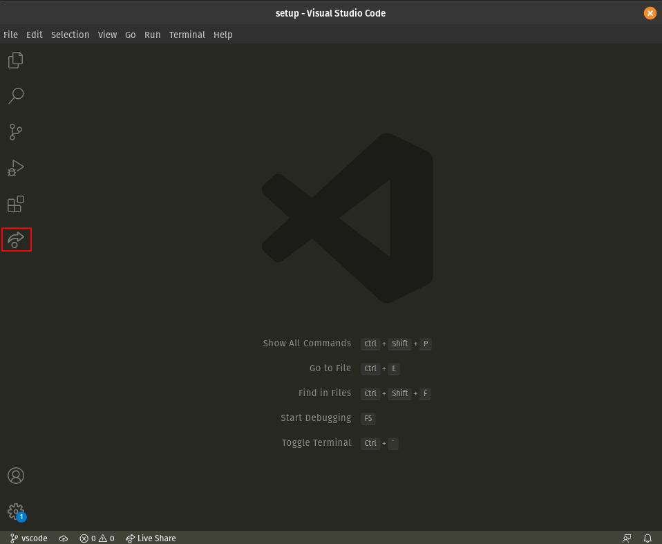
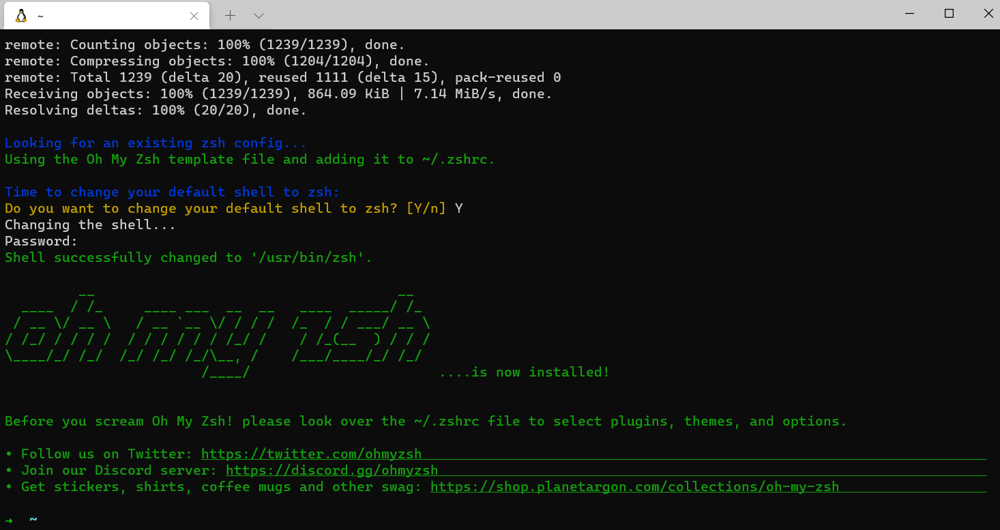
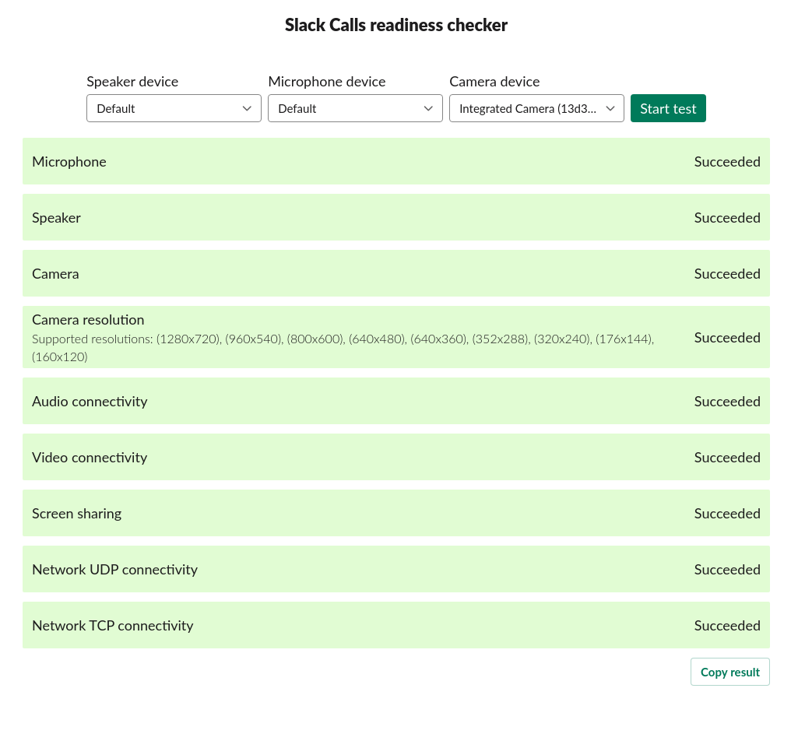
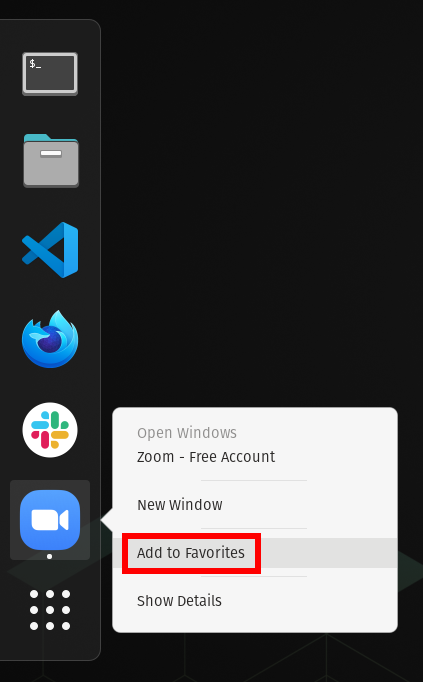

# Instruções de configuração

Você encontrará abaixo as instruções para configurar seu computador para o [curso de desenvolvimento web Le Wagon](https://www.lewagon.com/web-development-course/full-time).

Por favor **leia-os com atenção e execute todos os comandos na seguinte ordem**.

Se você tiver dúvidas, não hesite em pedir ajuda a um professor :raising_hand:

Você também pode dar uma olhada em [nossas cheatsheets](https://github.com/lewagon/setup/tree/master/docs) para soluções e dicas de problemas comuns :heavy_check_mark:

Vamos começar :rocket:


## Conta GitHub

Você se inscreveu no GitHub? Caso contrário, [faça isso imediatamente](https://github.com/join).

:point_right: **[Carregue uma imagem](https://github.com/settings/profile)** e coloque seu nome corretamente em sua conta GitHub. Isso é importante porque usaremos um painel interno com seu avatar. Faça isso **agora**, antes de continuar com este guia.


:point_right: [Ative a Autenticação em Duas Etapas (2FA)](https://docs.github.com/en/authentication/securing-your-account-with-two-factor-authentication-2fa/configuring-two-factor-authentication#configuring-two-factor-authentication-using-text-messages). O GitHub enviará mensagens de texto com um código quando você tentar fazer login. Isso é importante para a segurança e em breve será necessário para contribuir com código no GitHub.


## Visual Studio Code

### Instalação

Vamos instalar o editor de texto [Visual Studio Code](https://code.visualstudio.com).

Copie (`Ctrl` + `C`) os comandos abaixo e cole-os em seu terminal (`Ctrl` + `Shift` + `v`):

```bash
wget -qO- https://packages.microsoft.com/keys/microsoft.asc | gpg --dearmor > packages.microsoft.gpg
```

```bash
sudo install -o root -g root -m 644 packages.microsoft.gpg /etc/apt/trusted.gpg.d/
```

```bash
sudo sh -c 'echo "deb [arch=amd64,arm64,armhf signed-by=/etc/apt/trusted.gpg.d/packages.microsoft.gpg] https://packages.microsoft.com/repos/code stable main" > /etc/apt/sources.list.d/vscode.list'
```

```bash
rm -f packages.microsoft.gpg
```

```bash
sudo apt update
```

```bash
sudo apt install -y code
```

Esses comandos solicitarão sua senha: digite-a.

:warning: Quando você digita sua senha, nada aparecerá na tela, **isso é normal**. Este é um recurso de segurança para mascarar não apenas sua senha como um todo, mas também seu comprimento. Basta digitar sua senha e quando terminar, pressione `Enter`.

### Iniciando a partir do terminal

Agora vamos iniciar o VS Code no **terminal**:

```bash
code
```

:heavy_check_mark: Se uma janela do VS Code acabou de abrir, você está pronto: +1:

:x: Caso contrário, por favor **entre em contato com um professor**


## Extensões do VS Code

### Instalação

Vamos instalar algumas extensões úteis no VS Code.

Copie e cole os seguintes comandos em seu terminal:

```bash
code --install-extension ms-vscode.sublime-keybindings
code --install-extension emmanuelbeziat.vscode-great-icons
code --install-extension github.github-vscode-theme
code --install-extension MS-vsliveshare.vsliveshare
code --install-extension shopify.ruby-lsp
code --install-extension dbaeumer.vscode-eslint
code --install-extension Rubymaniac.vscode-paste-and-indent
code --install-extension alexcvzz.vscode-sqlite
code --install-extension anteprimorac.html-end-tag-labels
```

Aqui está uma lista das extensões que você está instalando:

- [Sublime Text Keymap and Settings Importer](https://marketplace.visualstudio.com/items?itemName=ms-vscode.sublime-keybindings)
- [VSCode Great Icons](https://marketplace.visualstudio.com/items?itemName=emmanuelbeziat.vscode-great-icons)
- [Live Share](https://marketplace.visualstudio.com/items?itemName=MS-vsliveshare.vsliveshare)
- [Ruby](https://marketplace.visualstudio.com/items?itemName=shopify.ruby-lsp)
- [ESLint](https://marketplace.visualstudio.com/items?itemName=dbaeumer.vscode-eslint)
- [Paste and Indent](https://marketplace.visualstudio.com/items?itemName=Rubymaniac.vscode-paste-and-indent)
- [SQLite](https://marketplace.visualstudio.com/items?itemName=alexcvzz.vscode-sqlite)


### Configuração do Live Share

[Visual Studio Live Share](https://visualstudio.microsoft.com/services/live-share/) é uma extensão do VS Code que permite compartilhar o código em seu editor de texto para depuração e programação em pares: vamos configurá-lo acima!

Inicie o VS Code em seu terminal digitando `code` e pressionando `Enter`.

Clique na pequena seta na parte inferior da barra esquerda :point_down:



- Clique no botão "Compartilhar" e depois em "GitHub (faça login usando a conta GitHub)".
- Um pop-up aparece solicitando que você faça login no GitHub: clique em “Permitir”.
- Você é redirecionado para uma página do GitHub em seu navegador solicitando autorização do Visual Studio Code: clique em "Continuar" e depois em "Autorizar github".
- O VS Code pode exibir pop-ups adicionais: feche-os clicando em "OK".

É isso, você está pronto para continuar!


## Ferramentas de linha de comando

### Zsh e Git

Em vez de usar o `bash` [shell](https://en.wikipedia.org/wiki/Shell_(computing)), usaremos `zsh`.

Também usaremos [`git`](https://git-scm.com/), um software de linha de comando usado para controle de versão.

Vamos instalá-los, juntamente com outras ferramentas úteis:
- Abra um **terminal Ubuntu**
- Copie e cole os seguintes comandos:

```bash
sudo apt update
```

```bash
sudo apt install -y curl git imagemagick jq unzip vim zsh tree
```

Esses comandos solicitarão sua senha: digite-a.

:warning: Quando você digita sua senha, nada aparecerá na tela, **isso é normal**. Este é um recurso de segurança para mascarar não apenas sua senha como um todo, mas também seu comprimento. Basta digitar sua senha e quando terminar, pressione `Enter`.

### Instalação da CLI do GitHub

Vamos agora instalar a [CLI oficial do GitHub](https://cli.github.com) (interface de linha de comando). É um software usado para interagir com sua conta GitHub através da linha de comando.

Em seu terminal, copie e cole os seguintes comandos e digite sua senha, se solicitado:

```bash
sudo apt remove -y gitsome # gh command can conflict with gitsome if already installed
curl -fsSL https://cli.github.com/packages/githubcli-archive-keyring.gpg | sudo dd of=/usr/share/keyrings/githubcli-archive-keyring.gpg
```

```bash
echo "deb [arch=$(dpkg --print-architecture) signed-by=/usr/share/keyrings/githubcli-archive-keyring.gpg] https://cli.github.com/packages stable main" | sudo tee /etc/apt/sources.list.d/github-cli.list > /dev/null
```

```bash
sudo apt update
```

```bash
sudo apt install -y gh
```

Para verificar se `gh` foi instalado com sucesso em sua máquina, você pode executar:

```bash
gh --version
```

:heavy_check_mark: Se você vir `gh versão X.Y.Z (AAAA-MM-DD)`, está pronto para prosseguir :+1:

:x: Caso contrário, por favor **entre em contato com um professor**


## Oh-My-Zsh

Vamos instalar o plugin `zsh` [Oh My Zsh](https://ohmyz.sh/).

Em um terminal execute o seguinte comando:

```bash
sh -c "$(curl -fsSL https://raw.github.com/ohmyzsh/ohmyzsh/master/tools/install.sh)"
```

Se for perguntado "Deseja alterar seu shell padrão para zsh?", pressione `Y`

No final seu terminal deverá ficar assim:



:heavy_check_mark: Se isso acontecer, você pode continuar :+1:

:x: Caso contrário, por favor **entre em contato com um professor**


## CLI do GitHub

CLI é o acrônimo de [Interface de linha de comando](https://en.wikipedia.org/wiki/Command-line_interface).

Nesta seção, usaremos [GitHub CLI](https://cli.github.com/) para interagir com o GitHub diretamente do terminal.

Ele já deve estar instalado no seu computador a partir dos comandos anteriores.

Primeiro, para **fazer login**, copie e cole o seguinte comando em seu terminal:

:warning: **NÃO edite o `email`**

```bash
gh auth login -s 'user:email' -w
```

`gh` fará algumas perguntas:

`What is your preferred protocol for Git operations?` Com as setas, escolha `SSH` e pressione `Enter`. SSH é um protocolo para fazer login usando chaves SSH em vez do conhecido par nome de usuário/senha.

`Generate a new SSH key to add to your GitHub account?` Pressione `Enter` para pedir ao gh para gerar as chaves SSH para você.

Se você já possui chaves SSH, verá `Upload your SSH public key to your GitHub account?` Com as setas, selecione o caminho do arquivo de sua chave pública e pressione `Enter`.

`Enter a passphrase for your new SSH key (Optional)`. Digite algo que você deseja e que você lembrará. É uma senha para proteger sua chave privada armazenada no disco rígido. Em seguida, pressione `Enter`.

`Title for your SSH key`. Você pode deixá-lo no "GitHub CLI" proposto, pressione `Enter`.

Você obterá então a seguinte saída:

```bash
! First copy your one-time code: 0EF9-D015
- Press Enter to open github.com in your browser...
```

Selecione e copie o código (`0EF9-D015` no exemplo) e pressione `Enter`.

Seu navegador será aberto e solicitará que você autorize o GitHub CLI a usar sua conta GitHub. Aceite e espere um pouco.

Volte ao terminal, pressione `Enter` novamente e pronto.

Para verificar se você está conectado corretamente, digite:

```bash
gh auth status
```

:heavy_check_mark: Se você estiver `Logado no github.com como <SEU NOME DE USUÁRIO> `, então tudo bem :+1:

:x: Caso contrário, **entre em contato com um professor**.


## Dotfiles (configuração padrão)

Os hackers adoram refinar e aprimorar sua estrutura e ferramentas.

Começaremos com uma ótima configuração padrão fornecida pelo Le Wagon: [`lewagon/dotfiles`](https://github.com/lewagon/dotfiles).

Como sua configuração é pessoal, você precisa de seu próprio repositório para armazená-la. Então você irá fazer o **fork** do repositório Le Wagon.

Bifurcar significa que você criará um novo repositório em sua própria conta GitHub `$GITHUB_USERNAME/dotfiles`, idêntico ao original do Le Wagon que você poderá modificar à vontade.

Abra seu terminal e defina uma variável para seu nome de usuário GitHub:

```bash
export GITHUB_USERNAME=`gh api user | jq -r '.login'`
```

```bash
echo $GITHUB_USERNAME
```

:heavy_check_mark: Você deverá ver seu nome de usuário do GitHub impresso.

:x: Se não, **pare aqui** e peça ajuda. Pode haver um problema com a etapa anterior (`gh auth`).

:warning: Por favor note que esta variável só é definida para o tempo em que seu terminal está aberto. Se você fechá-lo antes ou durante as próximas etapas, será necessário configurá-lo novamente com as duas etapas acima!


É hora de fazer um fork do repositório e cloná-lo em seu computador:

```bash
mkdir -p ~/code/$GITHUB_USERNAME && cd $_
```

```bash
gh repo fork lewagon/dotfiles --clone
```

### Instalador do Dotfiles

Execute o instalador `dotfiles`:

```bash
cd ~/code/$GITHUB_USERNAME/dotfiles
```

```bash
zsh install.sh
```

Verifique os e-mails registrados em sua conta GitHub. Você precisará escolher um na próxima etapa:

```bash
gh api user/emails | jq -r '.[].email'
```

:heavy_check_mark: Se você vir a lista de seus e-mails registrados, você pode prosseguir :+1:

:x: Caso contrário, [reautentique no GitHub](https://github.com/lewagon/setup/blob/master/ubuntu.pt.md#github-cli) antes de executar este comando :point_up: novamente.

### Instalador git

Execute o instalador `git`:

```bash
cd ~/code/$GITHUB_USERNAME/dotfiles && zsh git_setup.sh
```

:point_up: Isso **solicitará** seu nome (`Nome Sobrenome`) e seu e-mail. O email que você escolher será exibido **publicamente** na internet. 💡 Selecione o endereço `@users.noreply.github.com` se você não deseja que seu e-mail apareça em repositórios públicos aos quais você possa contribuir.

:warning: Você **precisa** colocar um dos e-mails listados acima graças ao comando anterior `gh api ...`. Se você não fizer isso, Kitt não conseguirá acompanhar seu progresso.

Agora **reinicie** seu terminal executando:

```bash
exec zsh
```


## Desativar prompt de senha SSH

Você não quer que sua senha seja solicitada sempre que se comunicar com um repositório distante. Então, você precisa adicionar o plugin `ssh-agent` ao `oh my zsh`:

Primeiro, abra o arquivo `.zshrc`:

```bash
code ~/.zshrc
```

Então:
- Identifique a linha que começa com `plugins=`
- Adicione `ssh-agent` no final da lista de plugins

:heavy_check_mark: Salve o arquivo `.zshrc` com `Ctrl` + `S` e feche seu editor de texto.


## rbenv

Vamos instalar o [`rbenv`](https://github.com/sstephenson/rbenv), um software para instalar e gerenciar ambientes `ruby`.

Primeiro, precisamos limpar qualquer instalação anterior do Ruby que você possa ter:

```bash
rvm implode && sudo rm -rf ~/.rvm
# Se você obteve "zsh: comando não encontrado: rvm", continue.
# Significa que `rvm` não está no seu computador, é isso que queremos!
rm -rf ~/.rbenv
```

Então no terminal, execute:

```bash
sudo apt install -y build-essential tklib zlib1g-dev libssl-dev libffi-dev libxml2 libxml2-dev libxslt1-dev libreadline-dev libyaml-dev
```

```bash
git clone https://github.com/rbenv/rbenv.git ~/.rbenv
```

```bash
git clone https://github.com/rbenv/ruby-build.git ~/.rbenv/plugins/ruby-build
```

```bash
exec zsh
```


## Ruby

### Instalação

Agora, você está pronto para instalar a versão mais recente do [ruby](https://www.ruby-lang.org/en/) e defini-la como a versão padrão.

Execute este comando, **demorará um pouco (5 a 10 minutos)**

```bash
rbenv install 3.3.5
```

Assim que a instalação do Ruby estiver concluída, execute este comando para informar ao sistema
para usar a versão 3.3.5 por padrão.

```bash
rbenv global 3.3.5
```

**Reinicialize** seu terminal e verifique sua versão do Ruby:

```bash
exec zsh
```

Então corra:

```bash
ruby -v
```

:heavy_check_mark: Se você vir algo começando com `ruby 3.3.5` então você pode prosseguir :+1:

:x: Se não, **pergunte a um professor**

### Instalando algumas gems

<details>
  <summary>Se você estiver na <bold>China</bold> 🇨🇳 clique aqui</summary>

  :warning: Se você estiver na China, você deve atualizar a forma como instalaremos o gem com os seguintes comandos.

```bash
# Somente China!
fontes de gemas --remove https://rubygems.org/
fontes de gemas -a https://gems.ruby-china.com/
fontes de gemas -l
#***FONTES ATUAIS***
# https://gems.ruby-china.com/
# Ruby-china.com deve estar na lista agora
```
</details>

**Todos, na China ou não**, continuem aqui para instalar gems.

No mundo Ruby, chamamos bibliotecas externas de `gems`: são pedaços de código Ruby que você pode baixar e executar em seu computador. Vamos instalar alguns!

No seu terminal, copie e cole o seguinte comando:

```bash
gem install colored faker http pry-byebug rake rails:7.1.3.4 rest-client rspec rubocop-performance sqlite3:1.7.3 activerecord:7.1.3.2 ruby-lsp
```

:heavy_check_mark: Se você tiver `xx gems installed`, então tudo bem :+1:

:x: Se você encontrar o seguinte erro:

```bash
ERROR: While executing gem ... (TypeError)
incompatible marshal file format (can't be read)
format version 4.8 required; 60.33 given
```

Execute o seguinte comando:
```bash
rm -rf ~/.gemrc
```

Execute novamente o comando para instalar as gemas.

:warning: **NUNCA** instale uma gem com `sudo gem install`! Mesmo se você encontrar uma resposta do Stackoverflow (ou o terminal) solicitando que você faça isso.


## Node.js

[Node.js](https://nodejs.org/en/) é um tempo de execução JavaScript para executar código JavaScript no terminal. Vamos instalá-lo com [nvm](https://github.com/nvm-sh/nvm), um gerenciador de versões para Node.js.

Em um terminal, execute os seguintes comandos:

```bash
curl -o- https://raw.githubusercontent.com/nvm-sh/nvm/v0.39.1/install.sh | zsh
```

```bash
exec zsh
```

Em seguida, execute o seguinte comando:

```bash
nvm -v
```

Você deverá ver uma versão. Se não, pergunte a um professor.

Agora vamos instalar o Node.js:

```bash
nvm install 20.17.0
```

Quando a instalação terminar, execute:

```bash
node -v
```

Se você vir `v20.17.0`, a instalação foi bem-sucedida :heavy_check_mark: Você pode então executar:

```bash
nvm cache clear
```

:x: Caso contrário, **entre em contato com um professor**


## Yarn

[`yarn`](https://yarnpkg.com/) é um gerenciador de pacotes para instalar bibliotecas JavaScript. Vamos instalá-lo:

Em um terminal, execute os seguintes comandos:

```bash
corepack enable
yarn set version stable
```

```bash
exec zsh
```

⚠️ Se vires quaisquer mensagens de erro, tenta executar `npm install -g corepack` e, em seguida, volta a executar os comandos acima.

Em seguida, execute o seguinte comando:

```bash
yarn -v
```

:heavy_check_mark: Se você vir uma versão, você está bem :+1:

:x: Se não, **entre em contato com um professor**


## SQLite

Em algumas semanas falaremos sobre bancos de dados e SQL. [SQLite](https://sqlite.org/index.html) é um mecanismo de banco de dados usado para executar consultas SQL em bancos de dados de arquivo único. Vamos instalá-lo:

Em um terminal, execute os seguintes comandos:

```bash
sudo apt-get install sqlite3 libsqlite3-dev pkg-config
```

Em seguida, execute o seguinte comando:

```bash
sqlite3 -version
```

:heavy_check_mark: Se você vir uma versão, você está bem :+1:

:x: Se não, **peça um professor**


## PostgreSQL

Às vezes, o SQLite não é suficiente e precisaremos de uma ferramenta mais avançada chamada [PostgreSQL](https://www.postgresql.org/), um sistema de banco de dados de código aberto, robusto e pronto para produção.

Vamos instalá-lo agora.

Execute os seguintes comandos:

```bash
sudo apt install -y postgresql postgresql-contrib libpq-dev build-essential
```

```bash
sudo -u postgres psql --command "CREATE ROLE \"`whoami`\" LOGIN createdb superuser;"
```


## Checagem

Vamos verificar se você instalou tudo com sucesso.

No seu terminal, execute o seguinte comando:

```bash
exec zsh
```

Então corra:

```bash
curl -Ls https://raw.githubusercontent.com/lewagon/setup/master/check.rb > _.rb && ruby _.rb && rm _.rb || rm _.rb
```

:heavy_check_mark: Se você receber uma mensagem verde `Awesome! Your computer is now ready!`, então você está bem :+1:

:x: Caso contrário, **entre em contato com um professor**.


## Kitt

:warning: Se você recebeu um e-mail do Le Wagon convidando você a se inscrever no Kitt (nossa plataforma de aprendizagem), você pode pular esta etapa com segurança. Em vez disso, siga as instruções no e-mail que você recebeu, caso ainda não tenha feito isso.

Se não tiver certeza sobre o que fazer, siga [este link](https://kitt.lewagon.com/). Se você já estiver logado, pode pular esta seção com segurança. Se você não estiver logado, clique em `Enter Kitt as a Student`. Se você conseguir fazer login, poderá pular esta etapa com segurança. Caso contrário, pergunte a um professor se você deveria ter recebido um e-mail ou siga as instruções abaixo.

Registre-se como Alumni da Le Wagon acessando [kitt.lewagon.com/onboarding](http://kitt.lewagon.com/onboarding). Selecione seu batch, faça login no GitHub e insira todas as suas informações.

Seu professor irá então validar que você realmente faz parte do batch. Você pode pedir que eles façam isso assim que preencher o formulário de registro.

Assim que o professor aprovar seu perfil, acesse sua caixa de entrada de e-mail. Você deve ter 2 e-mails:

- Um do Slack, convidando você para a comunidade Le Wagon Alumni do Slack (onde você conversará com seus amigos e todos os ex-alunos anteriores). Clique em **Inscreva-se** e preencha os dados.
- Um do GitHub, convidando você para a equipe `lewagon`. **Aceite** caso contrário você não conseguirá acessar os slides da aula.


## Slack

[Slack](https://slack.com/) é uma plataforma de comunicação bastante popular na indústria de tecnologia.

### Instalação

[Baixe o aplicativo Slack](https://get.slack.help/hc/en-us/articles/212924728-Slack-for-Linux-beta-) e instale-o.

:warning: Se você já usa o Slack em seu navegador, baixe e instale **o aplicativo para desktop** que vem com todos os recursos.


### Configurações

Inicie o aplicativo e faça login na organização `lewagon-alumni`.

Certifique-se de **fazer upload de uma foto de perfil** :point_down:


A ideia é que você tenha o Slack aberto o dia todo, para que você possa compartilhar links úteis/pedir ajuda/decidir onde ir almoçar/etc.

Para garantir que tudo está funcionando bem nas videochamadas, vamos testar sua câmera e microfone:
- Abra o aplicativo Slack
- Clique na foto do seu perfil no canto superior direito.
- Selecione `Preferências` no menu.
- Clique em `Áudio e vídeo` na coluna do lado esquerdo.
- Abaixo de `Solução de problemas`, clique em `Executar um teste de áudio, vídeo e compartilhamento de tela`. O teste será aberto em uma nova janela.
- Verifique se seus dispositivos preferidos de alto-falante, microfone e câmera aparecem nos menus suspensos e clique em `Iniciar teste`.



:heavy_check_mark: Quando o teste terminar, você deverá ver mensagens verdes de "Sucesso" pelo menos para seu microfone e câmera. :+1:

:x: Caso contrário, **entre em contato com um professor**.

Você também pode instalar o aplicativo Slack no seu telefone e entrar em `lewagon-alumni`!


## Configurações do Ubuntu

### Instale o codec de vídeo H264

Na nossa plataforma pedagógica (Kitt, você vai descobrir em breve!), temos alguns vídeos. Por padrão, o Firefox no Linux não pode reproduzi-los porque eles usam um codec não suportado (H264). Para que esses vídeos funcionem para você, você precisa executar o seguinte:

```bash
sudo apt install libavcodec-extra -y
```

### Instale ferramentas de terminal úteis

`tree` é uma boa ferramenta para visualizar uma árvore de diretórios dentro do terminal:

`ncdu` é um utilitário de disco de interface baseado em texto.

`htop` é um visualizador de processos interativo.

`tig` é uma interface em modo texto para `git`.

```bash
sudo apt install tree ncdu htop tig
```

### Ubuntu inotify

O Ubuntu está sempre rastreando alterações em suas pastas e para isso usa o inotify.
Por padrão, o limite do Ubuntu é definido para 8.192 arquivos monitorados.

Como a programação envolve muitos arquivos, precisamos aumentar esse limite.
Em seu terminal, execute:

```bash
echo fs.inotify.max_user_watches=524288 | sudo tee -a /etc/sysctl.conf && sudo sysctl -p
```

### Fixe aplicativos no seu dock

Você usará a maioria dos aplicativos que instalou hoje com muita frequência. Então, vamos fixá-los no seu dock para que fiquem a apenas um clique de distância!

Para fixar um aplicativo no seu dock, inicie o aplicativo, clique com o botão direito no ícone do dock para abrir o menu de contexto e escolha "Adicionar aos Favoritos".



Você deve fixar:
- Seu terminal
- Seu explorador de arquivos
- VS Code
- Seu navegador de Internet
- Slack


## Configuração concluída!

Seu computador agora está pronto para o [curso de Desenvolvimento Web Le Wagon](https://www.lewagon.com/web-development-course/full-time) :muscle: :clap:

Aproveite o bootcamp, você vai acertar :rocket:


