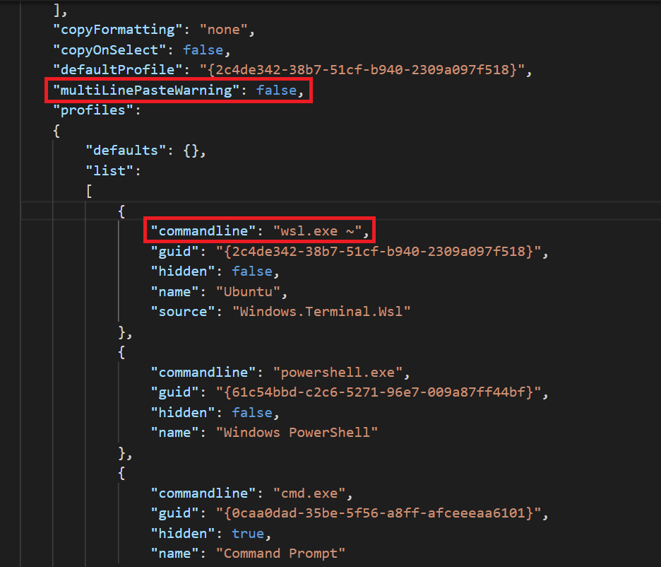

# 电脑设置教程

以下的教程将会帮助你为接下来在[Le Wagon Web Development course](https://www.lewagon.com/web-development-course/full-time)全栈开发训练营中做好准备：

请**仔细阅读并按顺序执行指令**。如果你在哪一步卡住了，不用犹豫，可以举手咨询老师:raising_hand:

让我们开始吧 :rocket:

## Zoom

为了让我们能够线上的交流，我们将会使用[Zoom](https://zoom.us/)，一个视频会议工具。

:warning: 如果你已经安装了Zoom，请确保它的版本至少是**5.6**。

打开[https://zoom.us/download](https://zoom.us/download)。

在**Zoom会议客户端（Zoom Client）**下方点击**下载（Download）**按钮。

打开你刚刚下载的文件并安装应用程序。

打开Zoom。

如果你已经有Zoom账号了，那就用你的账号密码登陆吧。

如果没有账号的话，点击**Sign Up Free**链接：


接下来，它会跳转到Zoom的网站让你填一个表。

完成这个表之后，回到Zoom软件，然后用你的账号密码登陆吧。

你应该会看到下面这个界面：


现在你可以关掉Zoom了。


## GitHub账户

你有注册好GitHub账户嘛？如果还没有，[现在注册](https://github.com/join)。

:point_right: **[上传一张照片](https://github.com/settings/profile)** 并在你的GitHub账户中设置你的名称。这一步很重要，因为我们将使用一个带有你头像的内部dashboard。请**现在**立即做这一步，然后再去继续下面的步骤。


## 开始设置的条件

在开始之前，很重要的一件事是先看看你的电脑设置有没有满足这些条件！这样才能保证配置成功。请花点时间仔细阅读所有的文字。如果有问题，不要犹豫向老师提问哦。

### Windows 10 或者 Windows 11

你的电脑必须是 **Windows 10 或者 Windows 11**才可以开始配置。

检查windows版本的方式：
- 按下 `Windows` + `R`
- 输入  `winver`
- 按下 `Enter`

:heavy_check_mark: 如果窗口里的前几个词就是**Windows 10 或者 Windows 11**的话，你可以直接到下一步了！:+1:

:x: 如果你的电脑没有提示**Windows 10 或者 Windows 11**，那你现在就需要更新到Windows 10:point_down:

<details>
  <summary>更新到Windows 10</summary>

  - 从[Microsoft](https://www.microsoft.com/software-download/windows10ISO)下载Windows 10
  - 下载后就可以安装它。应该会花掉差不多1小时的时间，这取决于你的电脑。
  - 安装结束后，运行上面的命令:point_up:来检查你有没有**Windows 10**。
</details>

:information_source: [Windows 11更新正在滚动](https://www.microsoft.com/en-us/windows/get-windows-11)，意思就是有些电脑可能还不能更新到11。

:warning: **如果Windows 10已经装好了，你不需要更新到11来继续配置**。

### 最近的更新

确认好你的电脑是Windows 10或者11之后，你就可以安装最近的更新了。

打开Windows更新：
- 按下 `Windows` + `R`
- 输入  `ms-settings:windowsupdate`
- 按下 `Enter`
- 点击 `检查更新`(`Check updates`)

:heavy_check_mark: 如果你看到一个绿色的勾勾，然后还有一条“You're up to date（已经是最新版本）”的信息，那你就可以继续下一步了:+1:

:warning: 如果你看到一个红色的感叹号，然后还有一条“Update available（有可更新版本）”，那就请安装它，然后重复以上步骤直到电脑提示你所有的东西都是最新版本:loop:

:x: 如果出现关于无法更新的错误提示，**叫老师**来看看。

<details>
  <summary>启用Windows Update Service（Windows更新服务）来修复更新</summary>

  有些软件可能会禁用我们想用的更新服务。所以更新的时候你的电脑就会报错。可以这样修复它！（如果你的电脑系统语言是中文，你可以找到下面英文按键的对应中文按键。如果找不到，可以问问老师！）
  - 按下 `Windows` + `R`
  - 输入  `services.msc`
  - 按下 `Enter`
  - 双击 `Windows Update Service`
  - 把它从 `Startup` 改成 `Automatic`
  - 点击 `Start`
  - 点击 `Ok`
  现在，我们再来试试更新吧！
</details>

### 最低版本需求

有些我们需要的工具已经在Windows 10的`1903`或**之后**的版本中发布了。所以请保证你最少要这个版本！

- 按下 `Windows` + `R`
- 输入  `winver`
- 按下 `Enter`

检查**版本号**:

:heavy_check_mark: 如果你是`1903`或以上的版本, 你就可以继续下一步了:+1:

:x: 如果低于`1903`, 请**问老师**。


### 虚拟化


我们需要保证你电脑的虚拟化选项是激活的。

对于大多数电脑来说，这个选项已经被激活了。不过还是检查一下吧:


- 按下 `Windows` + `R`
- 输入  `taskmgr`
- 按下 `Enter`
>
>
- 点击 `Performance`
- 点击 `CPU`


&nbsp;

&nbsp;&nbsp;&nbsp; :x: 如果这一行没有出现，或者显示禁用了，请**让老师来帮你激活虚拟化**。

&nbsp;&nbsp;&nbsp; :heavy_check_mark: 如果被激活了的话，那在图表下方会显示状态 "Virtualization: Enabled"。


---

#### :wrench: 可能的解决方案

<details>
  <summary>激活虚拟化</summary>

  &nbsp;


  要激活它，我们需要访问电脑的 BIOS / UEFI。

  - 按下 `Windows + R`
  - 输入  `shutdown.exe /r /o /t 1`
  - 按下 `Enter`
  >
  >
  - 等待电脑关机
  >
  >
  - 点击 `Troubleshoot`
  - 点击 `Advanced Options`
  - 点击 `UEFI Firmware Settings`
  - 点击 `Restart`


  在这儿，你需要激活你处理器的虚拟化选项：
  - 大多数时候，在高级设置里面，CPU设置，或者北桥（Northbridge）设置里面
  - 电脑不一样，选项的名称可能也不一样：
      - 因特尔（Intel）: `Intel VT-x`, `Intel Virtualization Technology`, `Virtualization Extensions`, `Vanderpool`...
      - AMD: `SVM Mode` 或者 `AMD-V`
  - 在激活后请保存，然后重启电脑
</details>

---


## Windows的Linux子系统

WSL是一个用来运行Ubuntu的开发环境。你可以在[这儿](https://docs.microsoft.com/en-us/windows/wsl/faq)了解更多关于WSL的信息。

:information_source: 接下来的步骤是要看你的Windows系统版本的。请执行你对应系统版本的步骤哦:point_down:

### Windows 11

如果你是Windows 11，我们就在Windows终端用一个命令来安装WSL 2和Ubuntu。

:warning: 在下面的步骤中，请使用 `Ctrl` + `Shift` + `Enter`来用管理员权限执行**Windows终端**，而不是只点击 `Ok`或者敲击`Enter`。

- 按下 `Windows` + `R`
- 输入  `powershell`
- 按下 **`Ctrl` + `Shift` + `Enter`**

:warning: 在这一步，你可能需要确认UAC权限升级。

一个蓝色的终端窗口会出现：
- 复制下面的命令(`Ctrl` + `C`)
- 单击右键把它们复制到PowerShell窗口（`Ctrl` + `V` 不能再这里使用)
- 按下`Enter`执行这些命令

```powershell
wsl --install
```

:heavy_check_mark: 如果这个命令执行好后没有任何错误，那就重启电脑然后继续下面步骤:+1:

:x: 如果你看到了错误信息（或者你在窗口里看到红色的字），请**叫老师来帮忙**。

### Windows 10

#### 安装WSL 1

如果你是Windows 10，你首先要用PowerShell终端来安装WSL 1。

:warning: 在下面的步骤中，请使用 `Ctrl` + `Shift` + `Enter`来用管理员权限执行**Windows终端**，而不是只点击 `Ok`或者敲击`Enter`。

- 按下 `Windows` + `R`
- 输入  `powershell`
- 按下 **`Ctrl` + `Shift` + `Enter`**

:warning: 在这一步，你可能需要确认UAC权限升级。

一个蓝色的终端窗口会出现：
- 复制下面的命令(`Ctrl` + `C`)
- 单击右键把它们复制到PowerShell窗口（`Ctrl` + `V` 不能再这里使用)
- 按下`Enter`执行这些命令

```powershell
Enable-WindowsOptionalFeature -Online -FeatureName Microsoft-Windows-Subsystem-Linux
```

```powershell
dism.exe /online /enable-feature /featurename:Microsoft-Windows-Subsystem-Linux /all /norestart
```

```powershell
dism.exe /online /enable-feature /featurename:VirtualMachinePlatform /all /norestart
```

:heavy_check_mark: 如果这个命令执行好后没有任何错误，那就重启电脑然后继续下面步骤:+1:

:x: 如果你看到了错误信息（或者你在窗口里看到红色的字），请**叫老师来帮忙**。


#### 升级到WSL 2

如果你是Windows 10，你需要把WSL升级到2。

等你的电脑重启好，你就可以下载WSL2安装包。

- 打开[下载页面](https://aka.ms/wsl2kernel)
- 下载安装包"WSL2 Linux kernel update package"
- 点击`Next`（下一步）
- 点击`Finish`（完成）


:heavy_check_mark: 如果没有错误提示的话，那你现在就可以使用WSL 2了！

:x: 如果出现了这个错误：`This update only applies to machines with the Windows Subsystem for Linux`, 那就在软件上**右击**，然后选择`uninstall`(卸载); 然后你再安装一次，这次应该可以正常地安装。

#### 把WSL 2设置成Windows默认的Linux子系统

如果你用的是Windows 10的话，我们就需要把WSL默认版本设成2。

现在WSL 2已经安装好了，那就把它设置成默认的WSL吧：
- 按下 `Windows` + `R`
- 输入  `cmd`
- 按下 `Enter`

在弹出的窗口里面，输入:

```bash
wsl --set-default-version 2
```

:heavy_check_mark: 如果你看到“The operation completed successfully（成功完成设置）”，那你就可以关掉这个终端，然后继续跟着下面的指示:+1:

:x: 如果出现了关于虚拟化的信息，请**叫老师来帮忙**。

<details>
  <summary>激活Windows虚拟机平台功能</summary>

完成[这些](https://www.configserverfirewall.com/windows-10/please-enable-the-virtual-machine-platform-windows-feature-and-ensure-virtualization-is-enabled-in-the-bios/#:~:text=To%20enable%20WSL%202,%20Open,Windows%20feature%20on%20or%20off.&text=Ensure%20that%20the%20Virtual%20Machine,Windows%20will%20enable%20WSL%202)步骤，然后确保最后你激活了<strong>虚拟机平台</strong>和<strong>Windows的Linux子系统</strong>。
</details>

<details>
  <summary>激活Windows的Hyper-V功能</summary>

完成[这些](https://winaero.com/enable-use-hyper-v-windows-10/)步骤，然后确保你激活了<strong>Hyper-V</strong>。

:information_source: 如果你的电脑是Windows 10 **Home edition**，那你的操作系统上就没有Hyper-V的功能。这不会妨碍什么，你继续下面的步骤就好:ok_hand:
</details>


## Ubuntu

### 安装

:information_source: 接下来的步骤是要看你的Windows系统版本的。请执行你的版本对应的步骤:point_down:

#### Windows 11

如果你是Windows 11，那重启你的电脑后，你就应该能看到一个终端窗口告诉你说WSL正在恢复Ubuntu的安装过程。结束后，Ubuntu就会打开。

#### Windows 10

如果你是Windows 10，那我们在Microsoft商店安装Ubuntu吧：

- 点击`Start`
- 输入`Microsoft Store`
- 点击列表中的微软的Windows商店
- 在搜索栏里搜索`Ubuntu`
- **选择没有数字的版本，就只是一个单词"Ubuntu"**
- 点击`安装`

:warning: 不要安装**Ubuntu 18.04 LTS**或者**Ubuntu 20.04**!

<details>
  <summary>卸载不正确版本的Ubuntu</summary>

  要卸载不正确的版本，你只需要打开Windows 10的已安装软件的列表：
  - 按下`Windows` + `R`
  - 输入`ms-settings:appsfeatures`
  - 按下`Enter`

  找到那个软件，然后点击卸载按钮。
</details>

旦安装完成了，`安装`按钮就会变成`启动`按钮：点击`启动`。

### 第一次启动

第一次启动的时候，你会需要填写一些信息：
- 选择一个**用户名**:
    - 一个词
    - 全小写
    - 不要特殊字符
    - 举个例子: `lewagon`或者你的`firstname`
- 选择一个**密码**
- 确认你的密码

:warning: 你输入密码的时候，屏幕上不会显示你在输入任何东西，**这是正常的**。这是一个安全措施，保证别人不会看到你的密码内容以及长度。所以输入完成后，敲击回车键（`Enter`）即可。

现在安装好了，你就可以关掉Ubuntu窗口了。

### 检查Ubuntu的WSL version

- 按下`Windows` + `R`
- 输入`cmd`
- 按下`Enter`

输入下面的命令：

```bash
wsl -l -v
```

:heavy_check_mark: 如果Ubuntu WSL版本是2，你就可以进入下一步了:+1:

:x: 如果Ubuntu WSL的版本是1，你需要把它换成2。

<details>
  <summary>把Ubuntu WSL V1换成V2</summary>

  在命令提示字元窗口，输入：

  ```bash
  wsl --set-version Ubuntu 2
  ```

  :heavy_check_mark: 几秒之后，你应该会收到这条转换完成的信息：`The conversion is complete`.

  :x: 如果不行的话，我们就需要检查并确保Ubuntu文件没有被压缩。
</details>

<details>
  <summary>检查没有被压缩的文件</summary>

  - 按下`Windows` + `R`
  - 输入`%localappdata%\Packages`
  - 按下`Enter`
  - 打开这个文件夹`CanonicalGroupLimited.UbuntuonWindows...`
  - 右击`LocalState`文件夹
  - 点击`Properties`（属性）
  - 点击`Advanced`（高级）
  - 确保`Compress content`（压缩内容）选项**没有**被选，然后点击`Ok`。

  只对这个文件夹应用修改，然后再试试换Ubuntu WSL的版本。

  :x: 如果转换还是不行，**叫老师来帮忙**。
</details>

你现在可以关掉这个终端窗口了。


## Visual Studio Code

在Windows上，我们会用Visual Code Studio来编辑代码，因为它和Ubuntu终端配合得很好~

想让它们一体化的话，你需要卸载其他的代码编辑器，比如SublimeText，因为它们会干扰VSCoed和WSL的一体化。

### 安装
- 打开[Visual Studio Code page](https://code.visualstudio.com/download)
- 选择Windows版本的VS Code


然后，就会开始自动下载了。

- 打开你刚下载的文件。
- 安装它的时候需要改变一下选项:
    - 把VS Code注册成一个支持文件类型的编辑器
    - 其他选项不用变


### 链接VS Code和Ubuntu

- 首次启动VS Code之后:
    - 把它加在你的任务栏上；你会经常用到它！
    - 在VS Code的右下角，应该有一个框框提示你它检测到了WSL
    - 接受VS Code WSL插件的安装

:warning: 要用VS Code，这个插件必须要安装！


## Windows终端

### 安装

:information_source: 接下来的步骤是要看你的Windows系统版本的。

如果你是Windows 11，那么你的Windows终端已经装好了。直接进入下一步吧:point_down:

如果你是Windows 10，那我们来装Windows终端吧，一个真正的现代终端：

- 点击`Start`
- 输入`Microsoft Store`
- 点击列表上的``Mircosoft Store`
- 搜索`Windows Terminal`
- **选择Windows Terminal"**
- 点击`安装`

:warning: 不要安装**Windows Terminal Preview**，安装**Windows Terminal**就好了！

<details>
  <summary>卸载错误版本的Windows Terminal</summary>

  要下载错误版本的Windows Terminal的话，你需要去到Windows 10的已装软件列表：

  - 按下`Windows` + `R`
  - 输入`ms-settings:appsfeatures`
  - 按下`Enter`

  找到需要卸载的软件，然后点击卸载（uninstall）按钮。
</details>

当安装完成之后，`安装（Install）` 按钮就会变成`启动（Launch）`按钮：点击这个按钮吧！

### Ubuntu作为默认终端

让我们把Ubuntu变成Windows终端应用的默认终端吧！

点击`Ctrl` + `,`

它会打开设置：


- 把默认的profile改成"Ubuntu"
- 点击"Save"
- 点击"Open JSON file"

你需要改动的是被红色圈起来的部分：



首先，我们要让Ubuntu从Ubuntu主目录启动，而不是Windows的主目录：
- 找到`"name": "Ubuntu",`
- 把下面这行加在后面：

```bash
"commandline": "wsl.exe ~",
```

:warning: 别忘了这行最后有个逗号哟！

然后，我们把Windows和Ubuntu之间复制粘贴的警告禁用了吧：
- 找到`"defaultProfile": "{2c4de342-...}"`这行
- 在它后面加上这行：

```bash
"multiLinePasteWarning": false,
```

:warning: 别忘了这行最后有个逗号哟！

现在按这两个键`Ctrl` + `S`保存一下。

:heavy_check_mark: 好咯, 你的**Windows终端**就设置好了！:+1:

这个终端有标签页的功能：你可以通过点击当前标签页旁边的**+**来打开一个新的标签页。

**从现在开始，每次我们说终端的时候，就是在指这个终端。**不用使用其他的terminal了。


## VS Code插件

### 安装

现在我们来给VS Code安装一些有用的插件吧。

复制粘贴下面的命令到终端：

```bash
code --install-extension ms-vscode.sublime-keybindings
code --install-extension emmanuelbeziat.vscode-great-icons
code --install-extension MS-vsliveshare.vsliveshare
code --install-extension rebornix.ruby
code --install-extension dbaeumer.vscode-eslint
code --install-extension Rubymaniac.vscode-paste-and-indent
code --install-extension alexcvzz.vscode-sqlite
```

你安装的就是下面这些插件：
- [Sublime Text Keymap and Settings Importer](https://marketplace.visualstudio.com/items?itemName=ms-vscode.sublime-keybindings)
- [VSCode Great Icons](https://marketplace.visualstudio.com/items?itemName=emmanuelbeziat.vscode-great-icons)
- [Live Share](https://marketplace.visualstudio.com/items?itemName=MS-vsliveshare.vsliveshare)
- [Ruby](https://marketplace.visualstudio.com/items?itemName=rebornix.Ruby)
- [ESLint](https://marketplace.visualstudio.com/items?itemName=dbaeumer.vscode-eslint)
- [Paste and Indent](https://marketplace.visualstudio.com/items?itemName=Rubymaniac.vscode-paste-and-indent)
- [SQLite](https://marketplace.visualstudio.com/items?itemName=alexcvzz.vscode-sqlite)


## Command line tools

### Zsh & Git

我们将使用`zsh`来代替默认的`bash` [shell](https://zh.wikipedia.org/zh-cn/殼層)。

我们也会使用[`git`](https://git-scm.com/)，它是一个用来进行版本控制的命令行软件。

下面来安装这些工具吧：
- 打开终端
- 复制粘贴下面的命令：

```bash
sudo apt update
```

```bash
sudo apt install -y curl git imagemagick jq unzip vim zsh
```

这些指令会问你的密码：输入你的密码。

:warning: 当你输入你的密码的时候，屏幕上不会有任何的显示，**这是正常的**。这是一个安全保护的设置，来隐藏你整个密码，包括它的长度。你可以放心的输入你的密码，结束后按下`Enter`就可以了。

### 安装GitHub CLI

现在我们来安装GitHub[官方命令行界面（CLI)](https://cli.github.com) (Command Line Interface)。这是一个用来在终端里和你的GitHub账户交互的一个软件。

在你的终端里，复制粘贴以下代码，并在需要的时候，输入你的密码:

```bash
sudo apt remove -y gitsome # gh command can conflict with gitsome if already installed
curl -fsSL https://cli.github.com/packages/githubcli-archive-keyring.gpg | sudo dd of=/usr/share/keyrings/githubcli-archive-keyring.gpg
echo "deb [arch=$(dpkg --print-architecture) signed-by=/usr/share/keyrings/githubcli-archive-keyring.gpg] https://cli.github.com/packages stable main" | sudo tee /etc/apt/sources.list.d/github-cli.list > /dev/null
sudo apt update
sudo apt install -y gh
```

你可以运行以下的命令，来检查`gh`是否成功安装了：

```bash
gh --version
```

:heavy_check_mark: 如果你看到了`gh version X.Y.Z (YYYY-MM-DD)`，你就可以继续下一步啦！:+1:

:x: 如果没有看到话，**问问老师**。


## Oh-my-zsh

让我们一起安装`zsh`插件[Oh My Zsh](https://ohmyz.sh/).

在终端terminal里执行以下指令：

```bash
sh -c "$(curl -fsSL https://raw.github.com/ohmyzsh/ohmyzsh/master/tools/install.sh)"
```

如果终端里出现询问"Do you want to change your default shell to zsh?", 可以输入`Y`

在你的终端的最后，你会看到以下内容:


:heavy_check_mark: 如果你的终端成功显示了上面，你就可以继续下一步了:+1:

:x: 如果安装失败的话，请询问**你的老师**


## 把你的默认浏览器链接到Ubuntu

为了保证你可以在Ubuntu终端和浏览器进行交互，你需要设置你的默认浏览器。

⚠️ 你需要执行下面的至少一组命令：


<details>
  <summary>用Google Chrome作为默认浏览器</summary>

  &nbsp;


  运行下面的命令:

  ```bash
    ls /mnt/c/Program\ Files\ \(x86\)/Google/Chrome/Application/chrome.exe
  ```

  如果你看到了错误信息，比如`ls: cannot access...` 那就运行下面的命令：

  ```bash
    echo "export BROWSER=\"/mnt/c/Program Files/Google/Chrome/Application/chrome.exe\"" >> ~/.zshrc
    echo "export GH_BROWSER=\"'/mnt/c/Program Files/Google/Chrome/Application/chrome.exe'\"" >> ~/.zshrc
  ```

  如果没有错误信息，就运行下面这一行:

  ```bash
    echo "export BROWSER=\"/mnt/c/Program Files (x86)/Google/Chrome/Application/chrome.exe\"" >> ~/.zshrc
    echo "export GH_BROWSER=\"'/mnt/c/Program Files (x86)/Google/Chrome/Application/chrome.exe'\"" >> ~/.zshrc
  ```

</details>


<details>
  <summary>用Mozilla Firefox作为默认浏览器</summary>

  &nbsp;


  运行下面的命令:

  ```bash
    ls /mnt/c/Program\ Files\ \(x86\)/Mozilla\ Firefox/firefox.exe
  ```

  如果你看到了错误信息，比如`ls: cannot access...` 那就运行下面的命令：

  ```bash
   echo "export BROWSER=\"/mnt/c/Program Files/Mozilla Firefox/firefox.exe\"" >> ~/.zshrc
    echo "export GH_BROWSER=\"'/mnt/c/Program Files/Mozilla Firefox/firefox.exe'\"" >> ~/.zshrc
  ```

  如果没有错误信息，就运行下面这一行:

  ```bash
    echo "export BROWSER=\"/mnt/c/Program Files (x86)/Mozilla Firefox/firefox.exe\"" >> ~/.zshrc
    echo "export GH_BROWSER=\"'/mnt/c/Program Files (x86)/Mozilla Firefox/firefox.exe'\"" >> ~/.zshrc
  ```
</details>

<details>
  <summary>用Microsoft Edge作为默认浏览器</summary>

  &nbsp;


  运行下面的命令:


  ```bash
    echo "export GH_BROWSER=\"'/mnt/c/Program Files (x86)/Microsoft/Edge/Application/msedge.exe'\"" >> ~/.zshrc
  ```
</details>


重启你的终端。

然后请保证在终端运行下面这行命令后，会返回"Browser defined 👌"这句话：

```bash
[ -z "$BROWSER" ] && echo "ERROR: please define a BROWSER environment variable ⚠️" || echo "Browser defined 👌"
```

如果没有返回这句话，那在上面的列表中选一个浏览器，然后运行对应的命令。

如果没有的话，

:heavy_check_mark: 如果你看到那条信息，你就可以继续 :+1:

:x: 如果没有，那在上面的列表中选一个浏览器，然后运行对应的命令。然后别忘记重置你的终端：

```bash
exec zsh
```

有问题的话，别犹豫**问老师**。


## GitHub CLI

CLI是[Command-line Interface（命令行界面）](https://baike.baidu.com/item/%E5%91%BD%E4%BB%A4%E8%A1%8C%E7%95%8C%E9%9D%A2/9910197?fr=aladdin)的首字母缩写。

在这一章节里面，我们会安装[GitHub CLI](https://cli.github.com/)。这样我们就可以直接在终端和Github互动。

你之前执行的命令应该已经安装了GitHub CLI。

首先你需要**登陆**。复制粘贴下面的命令到终端，敲击回车：

:warning: **不要更改下面指令中的`email`**

```bash
gh auth login -s 'user:email' -w
```

gh会问你几个问题：

`What is your preferred protocol for Git operations?（你要用什么协议来执行Git操作？）` 让箭头`>`停在`SSH`前面，然后敲击回车。SSH使用SSH密钥来登陆用户，而不是用用户名和密码。

`Generate a new SSH key to add to your GitHub account?（生成新的SSH密钥，然后添加到Github账号上？）` 敲击回车，让gh帮你生成。

如果你以前生成过SSH密钥，那你就会看到这个问题`Upload your SSH public key to your GitHub account?（上传公共密钥到Github账户上上吗？）` 上下移动箭头`>`，让它停在你想选的SSH公钥前面，然后敲击回车。

`Enter a passphrase for your new SSH key (Optional)（输入新的SSH密钥的密码（非必填））`. 输入一个密码，然后写下来或者记住它。这是保护你本地私钥的密码。然后敲击回车。

:warning: 当你输入你的密码的时候，屏幕上不会有任何的显示，**这是正常的**。这是一个安全保护的设置，来隐藏你整个密码，包括它的长度。你可以放心的输入你的密码，结束后按下`Enter`就可以了。

然后你会看到下面的文字输出：

```bash
! First copy your one-time code: 0EF9-D015
- Press Enter to open github.com in your browser...
```

复制那段验证码（code）(在上面的例子中是`0EF9-D015` ），然后敲击`Enter`。

你的浏览器就会打开一个页面让你授权GitHub CLI使用你的GitHub账号。同意，并等待一会儿。

回到终端，再次敲击`回车`，然后就应该好啦:tada:

检查一下你有没有链接好：

```bash
gh auth status
```

如果你看到`Logged in to github.com as <你的GitHub用户名> `，那就可以了。

:x: 如果没有，**问问老师**。


## Dotfiles (标准配置)

黑客很喜欢把他们的shell和工具变得很酷炫。

让我们用Le Wagon提供的一个超棒的默认配置文件来开始吧：[`lewagon/dotfiles`](http://github.com/lewagon/dotfiles).

因为你的配置是私人的，所以你需要保存在**自己**的代码库里（repository/repo）。

Fork的意思是：在你的GitHub账号上建一个新的代码库，和原始的那一个是一模一样的（可以想象成你在复制粘贴这个代码库）。这样，你在你的GitHub上就会有一个新的代码库： `$GITHUB_USERNAME/dotfiles`。我们需要fork，因为每个人都需要在那些文件里加上一些**特定**信息（比如你的名字）。

打开终端，运行下面的命令：

```bash
export GITHUB_USERNAME=`gh api user | jq -r '.login'`
echo $GITHUB_USERNAME
```

:heavy_check_mark: 你应该能看到你的GitHub用户名在终端里显示出来了。

:x: 如果没有的话，现在就**停下**，找老师帮忙。看起来之前的步骤(`gh auth`)有一些问题。

现在就可以fork代码库（repo)，然后克隆到你自己的电脑上了：

```bash
mkdir -p ~/code/$GITHUB_USERNAME && cd $_
gh repo fork lewagon/dotfiles --clone
```

### Dotfiles安装器

运行`dotfiles`安装器：

```bash
cd ~/code/$GITHUB_USERNAME/dotfiles && zsh install.sh
```

用下面的命令检查一下你GitHub账号录入的电子邮箱。你需要在其中选一个（如果你有好几个的话），然后再进入下一个步骤：

```bash
gh api user/emails | jq -r '.[].email'
```

:heavy_check_mark: 如果你看到了你的注册邮箱列表，你就可以继续下一步啦:+1:

:x: 如果没有的话，请在运行上面:point_up: 这个指令之前，[重新授权GitHub](https://github.com/lewagon/setup/blob/master/windows.cn.md#github-cli)。

### git安装器

运行git安装器：

```bash
cd ~/code/$GITHUB_USERNAME/dotfiles && zsh git_setup.sh
```

:point_up: 这会**提示**填写你的全名（`FirstName LastName`）和你的邮箱。

:warning: 注意啦，你**需要**填`gh api ...`命令列出的其中一个电子邮箱。不然，Kitt就没办法跟进你的学习进程。

现在运行下面的命令来**重置**你的终端：

```bash
exec zsh
```


## 禁用SSH密码输入

每次跟远程的代码库交流的时候都问你要密码是件很烦的事。所以呀，你需要给`oh my zsh`加上一个`ssh-agent`插件：

首先，打开`.zshrc`文件：

```bash
code ~/.zshrc
```

然后：
- 找到`plugins=`开始的这一行
- 在插件（plugin）列表里加上`ssh-agent`

这个列表现在看起来应该是这样的：

```
plugins=(gitfast last-working-dir common-aliases zsh-syntax-highlighting history-substring-search pyenv ssh-agent)
```

:heavy_check_mark: 按下`Ctrl` + `S` 保存`.zshrc`文件，然后关掉你的代码编辑器。

## rbenv

让我们安装[`rbenv`](https://github.com/sstephenson/rbenv)，一个帮助我们安装和管理`ruby`环境的软件。

首先，我们需要清理你可能已经安装过的Ruby:

```bash
rvm implode && sudo rm -rf ~/.rvm
# If you got "zsh: command not found: rvm", carry on.
# It means `rvm` is not on your computer, that's what we want!
rm -rf ~/.rbenv
```

然后在终端里运行:

```bash
sudo apt install -y build-essential tklib zlib1g-dev libssl-dev libffi-dev libxml2 libxml2-dev libxslt1-dev libreadline-dev
```

```bash
git clone https://github.com/rbenv/rbenv.git ~/.rbenv
```

```bash
git clone https://github.com/rbenv/ruby-build.git ~/.rbenv/plugins/ruby-build
exec zsh
```


## Ruby

### 安装

现在，你已经准备好了去安装最新[ruby](https://www.ruby-lang.org/en/)版本并把它设置为默认版本。

运行下方这个指令，它会**花费一些时间（5-10分钟）**

```bash
rbenv install 3.1.2
```

当Ruby安装好后，运行下面这个指令来告诉系统使用3.1.2这个版本作为默认版本。

```bash
rbenv global 3.1.2
```

然后**重置**你的终端，然后检查Ruby版本：

```bash
exec zsh
ruby -v
```

:heavy_check_mark: 如果你有看到`ruby 3.1.2p`，那么你可以继续下一步+1:

:x: 如果没有的话，**询问一下老师**。

### 安装一些gems

<details>
  <summary>点击这里，如果你在 :cn: <bold>中国</bold>的话</summary>

  :warning: 如果你在中国的话，你应该使用以下命令来安装gem。

```bash
# China only!
gem sources --remove https://rubygems.org/
gem sources -a https://gems.ruby-china.com/
gem sources -l
# *** CURRENT SOURCES ***
# https://gems.ruby-china.com/
# Ruby-china.com must be in the list now
```
</details>

在ruby的世界里，我们将外部的库称之为`gems`：他们是一些你可以下载并在你的电脑上运行的ruby代码。让我们一起安装一些!

在你的终端里，复制粘贴下面的指令：

```bash
gem install colored faker http pry-byebug rake rails rest-client rspec rubocop-performance sqlite3
```

:heavy_check_mark: 如果你看到 `xx gems installed`，那么一切正常 :+1:

:x: 如果你遇到了以下的报错：

```bash
ERROR: While executing gem ... (TypeError)
incompatible marshal file format (can't be read)
format version 4.8 required; 60.33 given
```

运行以下的指令：

```bash
rm -rf ~/.gemrc
```

然后，重新运行安装gems的指令。

:warning: **永远不要**使用`sudo gem install`来安装一个gem！即使你偶然发现了一个网络上的答案（或者终端提示）叫你这么做。


## Node.js

[Node.js](https://nodejs.org/en/)是一个JavaScript运行环境以在终端运行JavaScript代码。让我们一起用[nvm](https://github.com/nvm-sh/nvm)，一个Node.js的版本管理器，来安装Node.js。

在终端里，运行以下指令：

```bash
curl -o- https://raw.githubusercontent.com/nvm-sh/nvm/v0.39.1/install.sh | zsh
```

重启你的终端并执行下方指令：

```bash
nvm -v
```

你应该会看到你的nvm的版本。如果没有的话，问一下你的老师。

现在，让我们来安装node：

```bash
nvm install 16.15.1
```

当这个指令执行结束之后，运行：

```bash
node -v
```

如果看到`v16.15.1`，那么你安装成功了:heavy_check_mark: 然后，你就可以运行下面这个命令了：

```bash
nvm cache clear
```

:x: 如果没有看到版本的话，**问一下你的老师**。


## SQLite

几周后，我们就会开始学习数据库和SQL. [SQLite](https://sqlite.org/index.html)是一个数据库引擎，它可以在单文件数据库上执行SQL查询。现在来安装它吧：

在终端，执行下面的命令：

```bash
sudo apt-get install sqlite3 libsqlite3-dev
```

然后执行下面的命令：

```bash
sqlite3 -version
```

:heavy_check_mark: 如果你看到了版本号，那你就可以继续下一步了 :+1:

:x: 如果没有，**问问老师吧**！


## PostgreSQL

有的时候，SQLite功能会不够用。这个时候我们就需要使用一个更高级的工具，叫做[PostgreSQL](https://www.postgresql.org/)。这是一个开源的、强大的、生产环境可用的数据库系统。

让我们现在安装它。

运行下方指令:

```bash
sudo apt install -y postgresql postgresql-contrib libpq-dev build-essential
```

```bash
sudo /etc/init.d/postgresql start
```

```bash
sudo -u postgres psql --command "CREATE ROLE \"`whoami`\" LOGIN createdb superuser;"
```

你可以把PostgreSQL配置成自动启动，这样每次你打开新的终端时，你就不需要执行`sudo /etc/init.d/postgresql start`：

```bash
sudo echo "`whoami` ALL=NOPASSWD:/etc/init.d/postgresql start" | sudo tee /etc/sudoers.d/postgresql
```

```bash
sudo chmod 440 /etc/sudoers.d/postgresql
```

```bash
echo "sudo /etc/init.d/postgresql start" >> ~/.zshrc
```

打开一个新的终端。

:heavy_check_mark: 如果你看到一行字说`* Starting PostgreSQL 12 database server`，那你就可以进行下一步了 :+1:

:x: 如果没有的话， **请让老师来帮助你**。


## 最后检查

让我们来看看你是否已经成功安装好了所有软件。

在终端，运行下面两行命令：

```bash
exec zsh
curl -Ls https://web-dev-challenge-lewagon-image.oss-cn-shanghai.aliyuncs.com/setup/check.rb > _.rb && ruby _.rb || rm _.rb
```

:heavy_check_mark: 如果出现了一个绿色的`Awesome! Your computer is now ready!`，那么你的工作台已经设置好了 :+1:

如果没有的话，问一下你的老师。


## Kitt

:warning: 如果你已经收到了一封来自Le Wagon邀请你去注册Kitt(我们的学习平台)的邮件并且你也注册完成了的话，你可以安全的跳过这一章节。如果你还没有注册完成的话，请跟随邮件里的教程，完成注册。

如果你不确定你要做什么，可以查看[这个链接](https://kitt.lewagon.com/)。如果你已经登录了的话，你可以跳过这个章节。如果你没有登录的话，你需要点击`Enter Kitt as a Student`。如果你可以成功的登录，你也可以安全的跳过这一步。不然的话，你可以询问一下老师你是否有收到过相关的邮件，或者直接跟着执行下面的教程。

前往[kitt.lewagon.com/onboarding](http://kitt.lewagon.com/onboarding)，注册成为Le Wagon的一名校友。选择你的batch，用gitHub账户登录并填写你的信息。

你的老师将会验证你的确属于这个batch。你可以在完成了注册表单后去询问老师去做验证。

当你的老师验证成功后，请前往你的邮箱收件箱。你应该会有两封邮件：

- 一封来自Slack,邀请你加入Le Wagon Alumni Slack社群（在这儿你可以与你的伙伴和所有之前的学员交流）。点击**Join**并填写相应的个人信息。

- 一封来自GitHub,要求你加入`lewagon`团队。**接受它**，不然的话你将没有办法看到有关讲座和课程的文件。


## Slack

从[slack.com](https://slack.com/downloads/windows)上下载Slack的本地应用。

启动程序并注册进入`lewagon-alumni`的组织。

确保你在上面上传了照片。

你也可以在你的iPhone或者Android设备上登录Slack!

这么做的意义是，你可以一直开着Slack，于是你就可以分享有用的链接/寻求帮助/决定哪儿里吃饭/等等。

至于远程的ticket，你将可以用Slack语音或者视频电话来获取帮助。为了确保所有都可以正常工作，在你的电脑上启动Slack应用程序，然后[跟着这里的步骤](https://slack.com/intl/en-gb/help/articles/115003538426-Troubleshoot-Slack-Calls#run-our-calls-test)（tl;dr 输入`/call --test`然后在任何的channel里按下`Enter`键）。

等测试结束之后，你应该至少会在麦克风和相机处，看到绿色“All clear”消息。如果没有的话，问一下你的老师。


### 设置

打开Slack应用程序并登入`lewagon-alumni`组织。

确保你已经**上传了你的头像照片** :point_down:


之后你可以全天开着Slack，这样你可以在上面分享有用的链接/寻求帮助/决定去那儿吃饭/...

为了确保视频电话可以正常工作，让我们一起测试摄像头和麦克风：
- 打开Slack应用程序
- 在任意群组的消息编辑框里输入`/call --test`并按下`Enter`
- 按下"Start test"绿色按钮


:heavy_check_mark: 当测试结束以后，你应该会看到你的摄像头和麦克风有绿色的"Succeed"信息。:+1:

:x: 如果测试失败的话，**请联系你的老师**.

你也可以在手机上安装Slack应用并登入`lewagon-alumni`!


## Ubuntu文件系统

### 在Windows和Ubuntu之间交换文件

我们需要一个简单的方法在Windows和Ubuntu之间交换文件。

想这样的话，你需要建一些可以从Windows的**File Explorer**访问Ubuntu文件目录的快捷键。


你需要做下面这些步骤:

- 打开Ubuntu终端
- 打开Windows File Explorer (或者使用快捷键Win + E)
- 在地址栏，输入`\\wsl$\`（如果不行的话，就输入`\\wsl$\Ubuntu`）
- 现在你就有Ubuntu文件系统的访问权限了
- 看一下Ubuntu的文件系统，看看有哪些目录是你会想用的
- 拖拽想要的文件夹到地址栏，就可以创建快捷键了


### 从Ubuntu终端打开Windows File Explorer

另一个交换文件的方法是从Ubuntu终端打开Windows**File Explorer**。

你需要做下面这些步骤：

- 打开Ubuntu终端
- 进入你想看的目录
- 运行`explorer.exe .`命令（或者，使用`wslview .`）
- 如果你看到一条输入输出的报错，那就在Windows PowerShell运行`wsl --shutdown`然后再重新打开Ubuntu终端


### 在Ubuntu文件系统里找到方向

你可能想搞清楚Ubuntu文件系统里的Windows目录到底在哪儿。或者Windows文件系统里的Ubuntu目录在哪儿。

要把一个Windows路径变成Ubuntu路径（或者反过来），你需要做：

- 打开Ubuntu终端
- 使用`wslpath "C:\Program Files"`命令来把Windows路径变成Ubuntu路径
- 使用`wslpath -w "/home"`命令来把Ubuntu路径变成Windows路径
- 还有，`wslpath -w $(pwd)`命令会返回当前Ubuntu路径的Windows路径


## 设置完成啦!

现在你的电脑已经完成[Le Wagon网页开发课程](https://www.lewagon.com/web-development-course/full-time)的设置啦 :muscle: :clap:

享受你的编程之旅，你会掌握它的！ :rocket:


