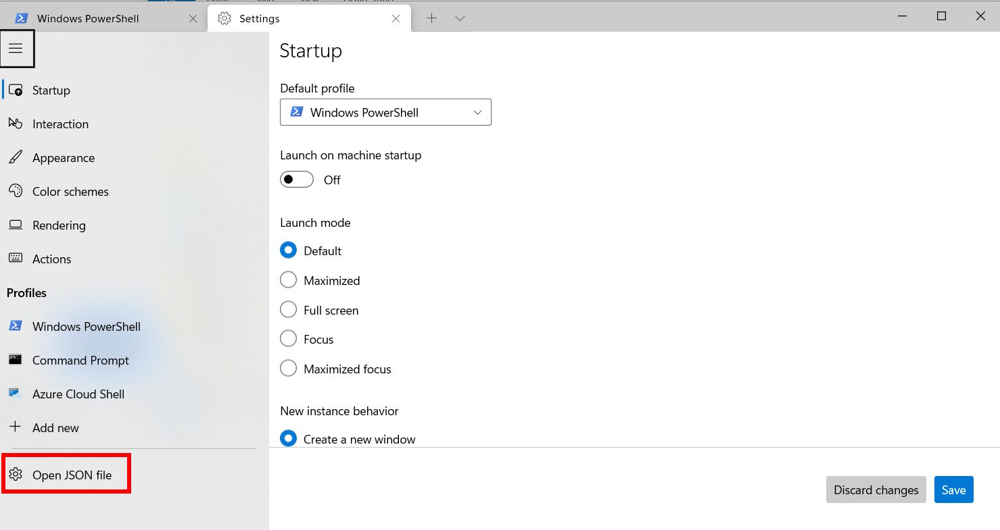

# Setup instructions

The following instructions will help you to get ready for [Le Wagon](http://www.lewagon.org) Web Development course:

- Grab a text editor, where you will spend your days and nights
- Install a package manager
- Pimp your terminal
- Setup git and GitHub
- Install Ruby


## Prerequisites

Before we start, it is important you meet the following prerequisites to ensure the smooth running of the setup.
Take your time to read through everything and do not hesitate to ask for help if you feel stuck.

Ready? Let's go :sunglasses:


### Windows 10

For this setup, you need to be using the latest version of Windows.

This means that you need to be on **Windows 10**, with all the latest updates installed.

To check your Windows version:


- Press `Windows` + `R`
- Type  `winver`
- Press `Enter`

&nbsp;

&nbsp;&nbsp;&nbsp; :x: If it does not mention **Windows 10**, you cannot proceed with this setup — but do not panic! You can always upgrade to Windows 10!

&nbsp;&nbsp;&nbsp; :white_check_mark: If the first words of this window are **Windows 10** you're good to go! :muscle:


---

#### :wrench: Potential Fixes

<details>
  <summary>Upgrade to Windows 10</summary>

  &nbsp;
  - Download Windows 10 from [Microsoft](https://www.microsoft.com/software-download/windows10ISO)
  - Install it. It should take roughly an hour, but this is dependent on your computer
</details>

---


Once you're sure that you're using Windows 10, you will need to check that your computer has all the latest updates.


### Latest version of Windows

Open Windows Update:


- Press `Windows` + `R`
- Type  `ms-settings:windowsupdate`
- Press `Enter`
>
>
- Click on `Check updates`

&nbsp;

&nbsp;&nbsp;&nbsp; :x: If you have an error message about Windows not being able to apply updates, please **contact a teacher**.

&nbsp;&nbsp;&nbsp; :white_check_mark: If you have updates available please install them and repeat the process until it says that you are up to date :star:.


---

#### :wrench: Potential Fixes

<details>
  <summary>Activate Windows Update Service to fix Updates</summary>

  &nbsp;


  Some antiviruses and pieces of software deactivate the Update service we need, resulting in the error you see. Let's fix that!


  - Press `Windows` + `R`
  - Type  `services.msc`
  - Press `Enter`
  >
  >
  - Double Click `Windows Update Service`
  - Set its `Startup` to `Automatic`
  - Click on `Start`
  - Click on `Ok`

  Then let's try updates again!
</details>

---

### Minimum version

Some of the tools we need to install have been release with the `1903` version **or above** of Windows 10 so we need to make sure you have at least this one.


- Press `Windows` + `R`
- Type  `winver`
- Press `Enter`


Check the **Version number**:


&nbsp;&nbsp;&nbsp; :x: If it is below `1903`, just follow the [Latest version of Windows](#Latest-version-of-Windows) paragraph above to install the latest updates.

&nbsp;&nbsp;&nbsp; :white_check_mark: If it says at least `1903`, you are good to go! :sunglasses:


### Virtualization

We need to ensure that the Virtualization options are enabled in the BIOS of your computer.

For many computers, this is already the case. Let's check:


- Press `Windows` + `R`
- Type  `taskmgr`
- Press `Enter`
>
>
- Click on the `Performance` tab
- Click on `CPU`


&nbsp;

&nbsp;&nbsp;&nbsp; :x: If the line is missing or if it is disabled, please **contact a teacher before trying to activate the Virtualization**.

&nbsp;&nbsp;&nbsp; :white_check_mark: The status will be listed under the graph and will say "Virtualization: Enabled" if this tool is enabled.


---

#### :wrench: Potential Fixes

<details>
  <summary>Activate Virtualization</summary>

  &nbsp;


  We need to access the BIOS / UEFI of the computer to activate it.


  - Press `Windows + R`
  - Type  `shutdown.exe /r /o /t 1`
  - Press `Enter`
  >
  >
  - Wait for the computer to shutdown
  >
  >
  - Click on `Troubleshoot`
  - Click on `Advanced Options`
  - Click on `UEFI Firmware Settings`
  - Click on `Restart`


  You need to activate the virtualization option for your processor here:
  - Most of the time, in the advanced settings, the CPU settings, or the Northbridge settings
  - The option can be called differently according to your computer:
      - Intel: `Intel VT-x`, `Intel Virtualization Technology`, `Virtualization Extensions`, `Vanderpool`...
      - AMD: `SVM Mode` or `AMD-V`
  - Save the changes after activation and reboot the computer through the appropriate option
</details>

---


## GitHub account

Have you signed up to GitHub? If not, [do it right away](https://github.com/join).

:point_right: **[Upload a picture](https://github.com/settings/profile)** and put your name correctly on your GitHub account. This is important as we'll use an internal dashboard with your avatars. Please do this **now**, before you continue with this guide.


## Zoom

To be able to interact when we are not in the same physical room, we will be using Zoom.

⚠️ If you already have Zoom installed, please make sure that the version is at least **5.6**.

Zoom is a video conferencing tool. To create an account and install the app, go to [https://zoom.us/download](https://zoom.us/download) and under **Zoom Client for Meetings** click the **Download** button. Open the file you have just downloaded. A progress bar will appear, then Zoom will start. Click on **Connection** and create an account with the **Sign Up Free** option:


Then sign in the Zoom app using your credentials. You should see a screen like this:


You can close Zoom now.


## Windows Subsystem for Linux
### Install WSL 1
WSL is the development environment we are using to run Ubuntu. You can learn more about WSL [here](https://docs.microsoft.com/en-us/windows/wsl/faq).

We will install WSL through the PowerShell Terminal:


:warning: In the following instruction, please be aware of the `Ctrl` + `Shift` + `Enter` key stroke to execute **Windows PowerShell** with administrator privileges instead of just clicking on `Ok`or pressing `Enter`.


- Press `Windows` + `R`
- Type  `powershell`
- Press `Ctrl` + `Shift` + `Enter`


:warning: You may have to accept the UAC confirmation about the privilege elevation.


&nbsp;
A blue terminal window will appear:


- Copy the following commands
- Paste them into the PowerShell window by right-clicking into it (`Ctrl` + `V` does not work here!)
- Run them by pressing `Enter`


&nbsp;
```powershell
Enable-WindowsOptionalFeature -Online -FeatureName Microsoft-Windows-Subsystem-Linux
```

```powershell
dism.exe /online /enable-feature /featurename:Microsoft-Windows-Subsystem-Linux /all /norestart
```

```powershell
dism.exe /online /enable-feature /featurename:VirtualMachinePlatform /all /norestart
```

&nbsp;


&nbsp;&nbsp;&nbsp; :x: If you encounter an error message (or if you see some text in red in the window), please **contact a teacher**!

&nbsp;&nbsp;&nbsp; :white_check_mark: When all three commands ran without any error, you can restart your computer.


### Upgrade to WSL 2
Once your computer has restarted, we need to download the WSL2 installer.


- Go to the [download page](https://aka.ms/wsl2kernel) and get the installer
- Click `Next`
- Click `Finish`


&nbsp;

&nbsp;&nbsp;&nbsp; :x: If you encounter the error `This update only applies to machines with the Windows Subsystem for Linux`, **right click** on the program and select `uninstall`; you shall be able to install it normally this time.

&nbsp;&nbsp;&nbsp; :white_check_mark: If everything is fine, we are ready to use WSL 2 instead of WSL 1!

### Make WSL 2 the default Windows Subsystem for Linux
Now that WSL 2 is installed, let's use it by default when we deal with WSL:


- Press `Windows` + `R`
- Type  `cmd`
- Press `Enter`


In the window which appears, type:

```bash
wsl --set-default-version 2
```

&nbsp;


&nbsp;&nbsp;&nbsp; :x: If the message you get talks about Virtualization, please **contact a teacher**

&nbsp;&nbsp;&nbsp; :white_check_mark: You can close this Command Prompt terminal; we are ready to install Ubuntu!


## Ubuntu
### Installation


- Click on `Start`
- Type  `Microsoft Store`
- Click on the Microsoft Windows Store in the list
>
>
- Search for `Ubuntu` in the search bar
- Select version without any number, just plain "Ubuntu"
>
>
- Click on `Install`


:warning: Don't install **Ubuntu 18.04 LTS** nor **Ubuntu 20.04**!

---

#### :wrench: Potential Fixes


<details>
  <summary>Uninstall wrong versions of Ubuntu</summary>

  &nbsp;


  To uninstall a wrong version of Ubuntu, you just have to go to the Installed Program List of Windows 10:


  - Press `Windows` + `R`
  - Type  `ms-settings:appsfeatures`
  - Press `Enter`


  Find the right software to uninstall and click on the uninstall button.
</details>

---


&nbsp;
Once the installation is done, the `Install` button becomes a `Launch` button:


- Click on `Launch`


At first launch, you will be asked some information:
- Choose a **username**:
    - one word
    - lowercase
    - no special characters
    - for example: `lewagon` or your `firstname`
- Choose a **password**
- Confirm your password


:warning: When typing the password, nothing will not appear on the screen — there will be no familiar typing indicator even though your keystrokes are being registered!

:warning: This is a security feature to mask not only your password as a whole but also its length!


&nbsp;


&nbsp;&nbsp;&nbsp; :white_check_mark: The installation should be complete; you can close the Ubuntu window now that it is installed on your computer.

### Check the WSL version of Ubuntu


- Press `Windows` + `R`
- Type  `cmd`
- Press `Enter`


Type the following command:

```bash
wsl -l -v
```

&nbsp;

&nbsp;&nbsp;&nbsp; :x: If the version of Ubuntu WSL is 1, we will need to convert it to version 2.

&nbsp;&nbsp;&nbsp; :white_check_mark: If the version of Ubuntu WSL is 2, you are ready to install VS Code!


---

#### :wrench: Potential Fixes


<details>
  <summary>Convert Ubuntu WSL V1 to V2</summary>


  &nbsp;


  In the Command Prompt window, type:

  ```bash
  wsl --set-version Ubuntu 2
  ```

  &nbsp;

  &nbsp;&nbsp;&nbsp; :white_check_mark: After a few seconds, you should get the following message: `The conversion is complete`.

  &nbsp;&nbsp;&nbsp; :x: If it does not work, we need to be sure that Ubuntu files are not compressed.
</details>

<details>
  <summary>Check for Uncompressed Files</summary>


  &nbsp;
  - Press `Windows` + `R`
  - Type  `%localappdata%\Packages`
  - Press `Enter`
  >
  >
  - Open the folder named `CanonicalGroupLimited.UbuntuonWindows...`
  - Right Click on the `LocalState` folder
  - Click on `Properties`
  - Click on `Advanced`
  - Make sure that the option `Compress content` is **not** ticked, then click on `Ok`.


  Apply changes to this folder only and try to convert the Ubuntu WSL version again.


  &nbsp;&nbsp;&nbsp; :x: If the conversion still does not work, please **contact a teacher**.
</details>

---


(You can now close this Command Prompt window.)


## Visual Studio Code

### Installation

Let's install [Visual Studio Code](https://code.visualstudio.com) text editor.

1. Download [Visual Studio Code for Windows](https://code.visualstudio.com/download).
2. Open the file you have just downloaded.
3. Install it with a few options:


When the installation is done, launch VS Code.

### Connecting VS Code to Ubuntu

You should see a frame at the bottom-right corner of VS Code saying it detects WSL. Accept the installation of the WSL extension for VS Code.

:warning: This extension is mandatory for you to be able to work with VS Code!


## VS Code Extensions

### Installation

Let's install some useful extensions to VS Code. Copy the command below then paste it in your terminal:

```bash
code --install-extension ms-vscode.sublime-keybindings
code --install-extension MS-vsliveshare.vsliveshare
code --install-extension misogi.ruby-rubocop
code --install-extension hridoy.rails-snippets
code --install-extension dbaeumer.vscode-eslint
```

Here is a list of the extensions you are installing:
- [Sublime Text Keymap and Settings Importer](https://marketplace.visualstudio.com/items?itemName=ms-vscode.sublime-keybindings)
- [Live Share](https://marketplace.visualstudio.com/items?itemName=MS-vsliveshare.vsliveshare)
- [ruby-rubocop](https://marketplace.visualstudio.com/items?itemName=misogi.ruby-rubocop)
- [Ruby on Rails](https://marketplace.visualstudio.com/items?itemName=hridoy.rails-snippets)
- [ESLint](https://marketplace.visualstudio.com/items?itemName=dbaeumer.vscode-eslint)

### Live Share configuration

[Visual Studio Live Share](https://visualstudio.microsoft.com/services/live-share/) is a VS Code extension which allows you to share the code in your text editor for debugging and pair-programming: let's set it up!

Click on the little arrow at the bottom of the left bar :point_down:


- Click on the "Share" button, then on "GitHub (Sign in using GitHub account)".
- A popup appears asking you to sign in with GitHub: click on "Allow".
- You are redirected to a GitHub page in you browser asking you to authorize Visual Studio Code: click on "Continue" then "Authorize github".
- VS Code may display additional pop-ups: close them by clicking "OK".

That's it, you're good to go!


## Windows Terminal

The standard Ubuntu terminal is a very crude way of using Ubuntu; let's use a real modern terminal!

### Installation

We first need to install **Windows Terminal** from the Microsoft Windows Store:


- Click on `Start`
- Type  `Microsoft Store`
- Click on the Microsoft Windows Store in the list
>
>
- Search for `Windows Terminal` in the search bar
>
>
- Click on `Install`


Once the installation is done, the `Install` button becomes a `Launch` button:


- Click on `Launch`
- Right Click on the icon in the taskbar
- Choose to pin the app to the bar


This terminal allows you to open multiple terminal sessions, including **PowerShell**, **Command Prompt** and **Ubuntu** that you installed earlier.

This terminal has tabs: you can choose to open a new terminal tab clicking on the **down arrow** / **v-shape** next to the current one.

:warning: From now on, we will only need **Ubuntu** as a terminal.

### Ubuntu as the default terminal

Let's make Ubuntu the default terminal of your Windows Terminal application.


- Press `Ctrl` + `,`


It should open the terminal settings:



Click on "Open JSON file"

We have put in red the part we will use or change:


&nbsp;


First, let us ask Ubuntu to start directly inside your Ubuntu Home Directory instead of the Windows one:


- Locate the `"name": "Ubuntu",`
- Add the following line after it:

```bash
"startingDirectory": "//wsl$/Ubuntu/home/the-username-you-chose-at-the-ubuntu-install",
```

:warning: Do not forget the comma at the end of the line!

:warning: Do not forget to replace the username by your own in the line above!


&nbsp;

Now, let us ask Windows Terminal to start directly an Ubuntu Terminal when launched:


- Locate the `"guid"` for Ubuntu
- Copy the value between `{` and `}`
- Locate the `"defaultProfile"`
- Replace the value between `{` and `}` with what you copied from above
- Add a comma after the `defaultProfile` so you can add the `"multiLinePasteWarning": false,` option as well. This will disable an annoying warning every time you want to paste multiple lines to your terminal.

You can refer to the screenshot above to get a sense of how it should look like. Don't hesitate to ask for help.


:warning: Do not forget to save those changes!

&nbsp;

&nbsp;&nbsp;&nbsp; :white_check_mark: Voilà, your **Windows Terminal** is setup! :confetti_ball:
&nbsp;&nbsp;&nbsp;&nbsp;&nbsp;&nbsp;&nbsp;&nbsp;&nbsp;&nbsp; **From now on, every time we will refer to the terminal or the console it will be this one.**


## Git

To install `git`:


- Open an Ubuntu terminal.
- Copy and paste the following lines:


```bash
sudo apt update
```
```bash
sudo apt install -y git apt-transport-https unzip gnome-terminal
````

Let's now install GitHub [official CLI](https://cli.github.com) (Command Line Interface) with the following commands:

```bash
sudo apt-key adv --keyserver hkp://keyserver.ubuntu.com:80 --recv-key C99B11DEB97541F0
sudo apt-add-repository https://cli.github.com/packages
sudo apt update
sudo apt install -y gh
```

To check that `gh` has been successfully installed on your machine, you can run:

```bash
gh --version
```

If you don't get a prompt saying `gh version X.Y.Z (YYYY-MM-DD)` with at least version 1.4, please refer to [the documentation](https://github.com/cli/cli/blob/trunk/docs/install_linux.md#official-sources) where they list some troubleshooting information. In doubt, ask a TA.


## Oh-my-zsh - Fancy your terminal

We will use the shell named `zsh` instead of `bash`, the default one.

```bash
sudo apt install -y zsh curl vim imagemagick jq
sh -c "$(curl -fsSL https://raw.githubusercontent.com/robbyrussell/oh-my-zsh/master/tools/install.sh)"
# it will ask for your session password
```

Be careful, those commands will ask you to type your password twice. At the end
your prompt should look like this:


If it doesn't, **ask a teacher**.

To make this change stick, restart your laptop (or virtual machine):

```bash
sudo reboot
```


## GitHub

We need to generate SSH keys which are going to be used by GitHub and Heroku
to authenticate you. Think of it as a way to log in, but different from the
well known username/password couple. If you already generated keys
that you already use with other services, you can skip this step.

Open a terminal and type this, replacing the email with **yours** (the
same one you used to create your GitHub account). It will prompt
for information. Just press enter until it asks for a **passphrase**.

```bash
mkdir -p ~/.ssh && ssh-keygen -t ed25519 -o -a 100 -f ~/.ssh/id_ed25519 -C "TYPE_YOUR_EMAIL@HERE.com"
```

**NB:** when asked for a passphrase, put something you want (and that you'll remember),
it's a password to protect your private key stored on your hard drive. You'll type,
nothing will show up on the screen, **that's normal**. Just type the passphrase,
and when you're done, press `Enter`.

Then you need to give your **public** key to GitHub. Run:

```bash
cat ~/.ssh/id_ed25519.pub
```

It will prompt on the screen the content of the `id_ed25519.pub` file.


- Copy that text from `ssh` to the end of your email address
- Go to [github.com/settings/ssh](https://github.com/settings/ssh)
- Click on the green button `New SSH key`
- Fill in the Title with your computer name (`Macbook Pro` for instance)
- Paste the **Key**
- Finish by clicking on the **Add key** green button.


To check that this step is completed, in the terminal run this.

```bash
ssh -T git@github.com
```

:warning: You will be prompted a warning, type `yes` then `Enter`.

This is the expected result:

```
# Hi --------! You've successfully authenticated, but GitHub does not provide shell access
```

&nbsp;

&nbsp;&nbsp;&nbsp; :white_check_mark: If you got this message, the keys were added successfully!

&nbsp;&nbsp;&nbsp; :x: If you encountered an error, you will have to try again. Do not hesitate to *contact a teacher*.


---

#### :wrench: Troubleshooting

<details>
  <summary>If <code>ssh -T git@github.com</code> does not work</summary>

  &nbsp;


  Try running this command before trying again:

  ```bash
  ssh-add ~/.ssh/id_ed25519
  ```
  </details>

---


Don't be in a rush, take time to [read this article](http://sebastien.saunier.me/blog/2015/05/10/github-public-key-authentication.html) to get a better
understanding of what those keys are used for.


## Linking your default browser to Ubuntu
To be sure that you can interact with your browser installed on Windows from your new Ubuntu terminal, we need to set it as your default browser there.

⚠️ You need to execute at least one of the following commands below:


<details>
  <summary>Google Chrome as your default browser</summary>

  &nbsp;


  Run the command:

  ```bash
    ls /mnt/c/Program\ Files\ \(x86\)/Google/Chrome/Application/chrome.exe
  ```

  If you get an error like `ls: cannot access...` Run the following command:

  ```bash
    echo "export BROWSER='\"/mnt/c/Program Files/Google/Chrome/Application/chrome.exe\"'" >> ~/.zshrc
  ```

  Else run:

  ```bash
    echo "export BROWSER='\"/mnt/c/Program Files (x86)/Google/Chrome/Application/chrome.exe\"'" >> ~/.zshrc
  ```

</details>


<details>
  <summary>Mozilla Firefox as your default browser</summary>

  &nbsp;


  Run the command:

  ```bash
    ls /mnt/c/Program\ Files\ \(x86\)/Mozilla\ Firefox/firefox.exe
  ```

  If you get an error like `ls: cannot access...` Run the following command:

  ```bash
    echo "export BROWSER='\"/mnt/c/Program Files/Mozilla Firefox/firefox.exe\"'" >> ~/.zshrc
  ```

  Else run:

  ```bash
    echo "export BROWSER='\"/mnt/c/Program Files (x86)/Mozilla Firefox/firefox.exe\"'" >> ~/.zshrc
  ```
</details>

<details>
  <summary>Microsoft Edge as your default browser</summary>

  &nbsp;


  Run the command:


  ```bash
  echo "export BROWSER='\"/mnt/c/Program Files (x86)/Microsoft/Edge/Application/msedge.exe\"'" >> ~/.zshrc
  ```
</details>


👉 Restart your terminal

Then please make sure that the following command returns "Browser defined 👌":

```bash
[ -z "$BROWSER" ] && echo "ERROR: please define a BROWSER environment variable ⚠️" || echo "Browser defined 👌"
```

If it does not, choose a browser in the list above and execute the corresponding command.


## GitHub CLI

CLI is the acronym of [Command-line Interface](https://en.wikipedia.org/wiki/Command-line_interface).

In this section, we will install [GitHub CLI](https://cli.github.com/) to perform useful actions with GitHub data directly from the Terminal.

It should already be installed on your laptop from the previous commands. First you need to **login**:

```bash
gh auth login -s 'user:email' -w
```

You will get the following output:

```bash
- Logging into github.com

! First copy your one-time code: 0EF9-D015
- Press Enter to open github.com in your browser...
```

Select and copy the code (`0EF9-D015` in the example), then type `Enter`. Your browser will open and ask you to authorize GitHub CLI to use your GitHub account. Accept and wait a bit. Come back to the terminal, type `Enter` again, and that should be it :tada:

To check that you are properly connected, type:

```bash
gh auth status
```

If you get `Logged in to github.com as <YOUR USERNAME> `, then all good. If not, **ask a teacher**.

Then run the following configuration line:

```bash
gh config set git_protocol ssh
```

Finally, create a [gist](https://docs.github.com/en/free-pro-team@latest/github/writing-on-github/editing-and-sharing-content-with-gists) to make sure `gh` is working:

```bash
echo "Hello [Le Wagon](https://www.lewagon.com) :wave:" | gh gist create -d "Starting my coding journey..." -f "SETUP_DAY.md" -p -w
```

This line should open your browser on the newly created gist page. See, we've just created a [**Markdown**](https://guides.github.com/features/mastering-markdown/) file!


## Dotfiles (Standard configuration)

Hackers love to refine and polish their shell and tools.

We'll start with a great default configuration provided by Le Wagon: [`lewagon/dotfiles`](https://github.com/lewagon/dotfiles).

As your configuration is personal, you need your **own** repository storing it. Forking means
that it will create a new repo in your GitHub account, identical to the original one.
You'll have a new repository on your GitHub account, `$GITHUB_USERNAME/dotfiles`.
We need to fork because each of you will need to put **specific** information (e.g. your name) in those files.

Open your terminal and run the following command:

```bash
export GITHUB_USERNAME=`gh api user | jq -r '.login'`
echo $GITHUB_USERNAME
```

You should see your GitHub username printed. If it's not the case, **stop here** and ask for help.
There seems to be a problem with the previous step (`gh auth`).

Time to fork the repo and clone it on your laptop:

```bash
mkdir -p ~/code/$GITHUB_USERNAME && cd $_
gh repo fork lewagon/dotfiles --clone
```

Run the `dotfiles` installer.

```bash
cd ~/code/$GITHUB_USERNAME/dotfiles
zsh install.sh
```

Check the emails registered with your GitHub Account. You'll need to pick one
at the next step:

```bash
gh api user/emails | jq -r '.[].email'
```

Run the git installer:

```bash
cd ~/code/$GITHUB_USERNAME/dotfiles && zsh git_setup.sh
```

:point_up: This will **prompt** you for your name (`FirstName LastName`) and your email. Be careful
you **need** to put one of the email listed above thanks to the previous `gh api ...` command. If you
don't do that, Kitt won't be able to track your progress.

Please now **quit** all your opened terminal windows.


&nbsp;


Let us open the `~/.zshrc` profile file in your text editor and change slightly its content:

```bash
code ~/.zshrc
```

- Locate the line `# Actually load Oh-My-Zsh`
- **Above it** write the following line:

```bash
ZSH_DISABLE_COMPFIX=true
```

&nbsp;

You don't want to be asked for your passphrase every time you communicate with a distant repository. So, you need to add the plugin `ssh-agent` to `oh my zsh`:


- Spot the line starting with `plugins=`
- Add `ssh-agent` to the plugins list.

The list should look like:

```
plugins=(gitfast last-working-dir common-aliases zsh-syntax-highlighting history-substring-search ssh-agent)
```

&nbsp;

&nbsp;&nbsp;&nbsp; :white_check_mark: Save the `.zshrc` file with `Ctrl` + `S` and close your text editor.


## Installing Ruby (with [rbenv](https://github.com/sstephenson/rbenv))

First, we need to clean up any previous Ruby installation you might have:

```bash
rvm implode && sudo rm -rf ~/.rvm
# If you got "zsh: command not found: rvm", carry on. It means `rvm` is not
# on your computer, that's what we want!

rm -rf ~/.rbenv
```

Then in the terminal, run:

```bash
sudo apt install -y build-essential tklib zlib1g-dev libssl-dev libffi-dev libxml2 libxml2-dev libxslt1-dev libreadline-dev
```
```bash
sudo apt clean
```
```bash
git clone https://github.com/rbenv/rbenv.git ~/.rbenv
```
```bash
git clone https://github.com/rbenv/ruby-build.git ~/.rbenv/plugins/ruby-build
```

**Close your terminal and open it again** (Alt+F4 and restart it). If you get a warning, just **ignore** it from now (Ruby is not installed yet).


Now, you are ready to install the latest ruby version and set it as the default version.

Run this command, it will **take a while (5-10 minutes)**

```bash
rbenv install 2.7.3
```

Once the ruby installation is done, run this command to tell the system
to use the 2.7.3 version by default.

```bash
rbenv global 2.7.3
```

Then **restart** your Terminal again (close it and reopen it).

```bash
ruby -v
```

You should see something starting with `ruby 2.7.3p`. If not, ask a teacher.

## Installing some gems

---

<details>
  <summary>Click here if you are in :cn: <bold>China</bold></summary>


  &nbsp;

  :warning: If you are in China, you should update the way we'll install gem with the following commands.

```bash
# China only!
gem sources --remove https://rubygems.org/
gem sources -a https://gems.ruby-china.com/
gem sources -l
# *** CURRENT SOURCES ***
# https://gems.ruby-china.com/
# Ruby-china.com must be in the list now
```
</details>

---

All, please run the following line:

```bash
gem install rake bundler rspec rubocop rubocop-performance pry pry-byebug colored http
```

If you encounter the following error:

`
ERROR: While executing gem ... (TypeError)
incompatible marshal file format (can't be read)
format version 4.8 required; 60.33 given
`

Run the following command:
```bash
rm -rf ~/.gemrc
```

Rerun the command to install the gems.

**Never** install a gem with `sudo gem install`! Even if you stumble upon a Stackoverflow answer
(or the Terminal) telling you to do so.


## Node (with [nvm](https://github.com/nvm-sh/nvm))

```bash
curl -o- https://raw.githubusercontent.com/nvm-sh/nvm/v0.37.0/install.sh | zsh
```

Restart your terminal and run the following:

```bash
nvm -v
```
You should see a version. If not, ask a teacher.

Now let's install node:

```bash
nvm install 14.15
```

When the command returns, run

```bash
node -v
```

You should see `v14.15`. If not, ask a teacher.


## yarn

Let's install [`yarn`](https://classic.yarnpkg.com/en/docs/install):

```bash
npm install --global yarn
```

Restart your terminal and run the following:

```bash
yarn -v
```

You should see a version. If not, ask a teacher.


## PostgreSQL

In a few weeks, we'll talk about SQL and Databases and you'll need something called PostgreSQL, an open-source robust and production-ready database.

Let's install it now.


```bash
sudo apt install -y postgresql postgresql-contrib libpq-dev build-essential
```
```bash
sudo /etc/init.d/postgresql start
```
```bash
sudo -u postgres psql --command "CREATE ROLE `whoami` LOGIN createdb;"
```

You can configure PostgreSQL to autostart, so you don't have to execute `sudo /etc/init.d/postgresql start` each time you open a new terminal:

```bash
sudo echo "`whoami` ALL=NOPASSWD:/etc/init.d/postgresql start" | sudo tee /etc/sudoers.d/postgresql
```
```bash
sudo chmod 440 /etc/sudoers.d/postgresql
```
```bash
echo "sudo /etc/init.d/postgresql start" >> ~/.zshrc
```


## Check-up

Let's check if you successfully installed everything.

Quit all opened Terminal, open a new one and run the following commands:

```bash
curl -Ls https://raw.githubusercontent.com/lewagon/setup/vscode/check.rb > _.rb && ruby _.rb || rm _.rb
```

It should tell you if your workstation is ready :) If not, ask a teacher.


## Ubuntu File System

### Exchange files between Windows and Ubuntu

We need an easy way to transfer files from Windows to Ubuntu and vice versa.

In order to do that, we will create shortcuts to Ubuntu directories in the Windows **File Explorer**.


Here are the steps:

- Open an Ubuntu terminal
- Open the Windows File Explorer (or use the shortcut Win + E)
- In the Address Bar, enter `\\wsl$\` (or `\\wsl$\Ubuntu` if it does not work)
- You now have acces to the Ubuntu file system
- Dive into the Ubuntu file system in order to look for directories of interest
- Drag the desired folders into the Address Bar in order to create shortcuts


### Open the Windows File Explorer from the Ubuntu terminal

Another option to move files around is to open the Windows **File Explorer** from the Ubuntu terminal.

In order to do that:

- Open an Ubuntu terminal
- Go to the directory you wish to explore
- Run the `explorer.exe .` command (alternatively, use `wslview .`)
- If you get an input output error message, run `wsl --shutdown` in a Windows PowerShell and reopen an Ubuntu terminal


### Find your way in the Ubuntu File System

You might want to figure out the exact location of a Windows directory in the Ubuntu file system, or the other way around.

In order to convert a Windows path to and from an Ubuntu path:

- Open an Ubuntu terminal
- Use the `wslpath "C:\Program Files"` command in order to translate a Windows path into an Ubuntu path
- Use the `wslpath -w "/home"` command in order to translate an Ubuntu path into a Windows path
- In particular, the `wslpath -w $(pwd)` command returns the Windows path of the current Ubuntu directory


## Alumni
:warning: If you have received an email from Le Wagon inviting you to sign up on Kitt (our learning platform), you can safely skip this step. Instead, please follow the instructions in the email you received if you haven't done so already.
If you are unsure about what to do, you can follow [this link](https://kitt.lewagon.com/). If you are already logged in, you can safely skip this section. If you are not logged in, click on `Enter Kitt as a Student`. If you manage to login, you can safely skip this step. Otherwise ask a teacher whether you should have received an email or follow the instructions below.

Register as a Wagon alumni by going to [kitt.lewagon.com/onboarding](http://kitt.lewagon.com/onboarding). Select your batch, sign in with GitHub and enter all your information.

Your teacher will then validate that you are indeed part of the batch. You can ask him to do it as soon as you completed the registration form.

Once the teacher has approved your profile, go to your email inbox. You should have 2 emails:

- One from Slack, inviting you to the Le Wagon Alumni slack community (where you'll chat with your buddies and all the previous alumni). Click on **Join** and fill the information.
- One from GitHub, inviting you to `lewagon` team. **Accept it** otherwise you won't be able to access the lecture slides.


## Slack

### Installation

[Download the Slack app](https://slack.com/downloads/windows) and install it.


### Settings

Launch the app and sign in to `lewagon-alumni` organization.

Make sure you **upload a profile picture** :pointing_down:


The idea is that you'll have Slack open all day, so that you can share useful links / ask for help / decide where to go to lunch / etc.

To ensure that everything is working fine for video calls, [test your camera and microphone](https://lewagon-alumni.slack.com/help/test/calls). If your browser is asking your permission to access your microphone and camera, click on yes.

After the test are finished, you should have green "All clear" messages at least for your microphone and camera. If not, ask a teacher.


You can also sign in to Slack on your iPhone or Android device!


## Pin apps to your taskbar

You are going to use most of the apps you've installed today really often. So let's pin them to your taskbar so that they are just one click away!

To pin an app to your taskbar, launch the app, right-click on the icon in the taskbar to bring up the context menu and choose "Pin to taskbar".


You must pin:
- Your terminal
- Your file explorer
- VS Code
- Your Internet browser
- Slack
- Zoom


