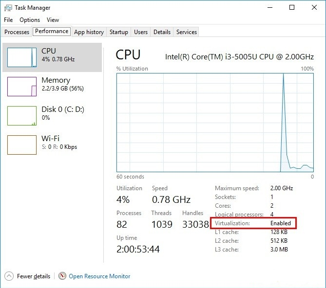
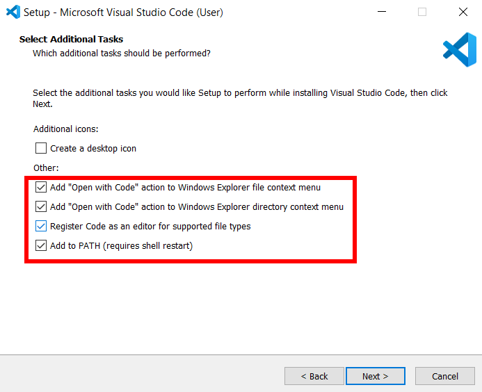
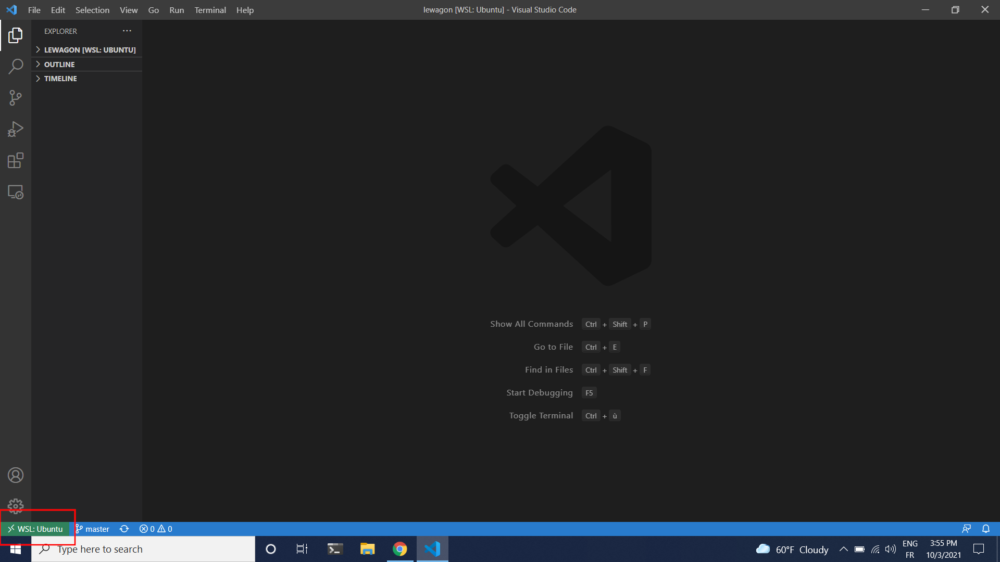
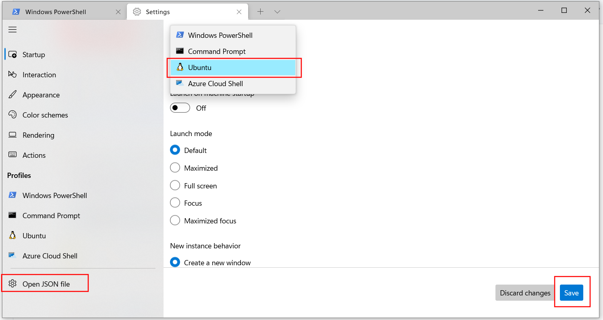
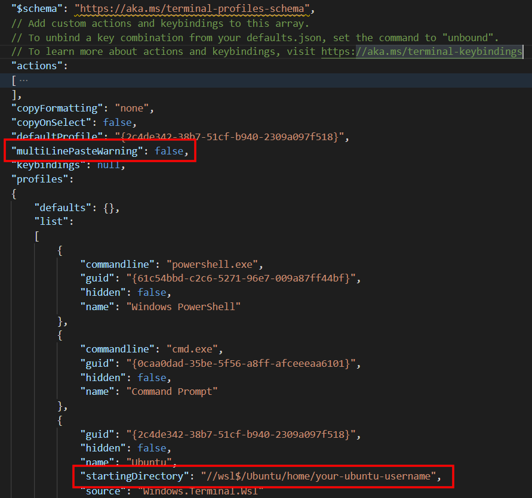
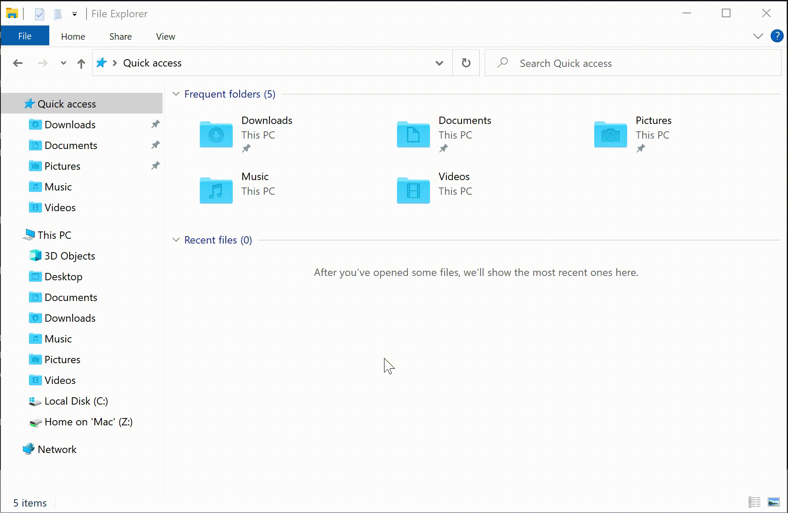
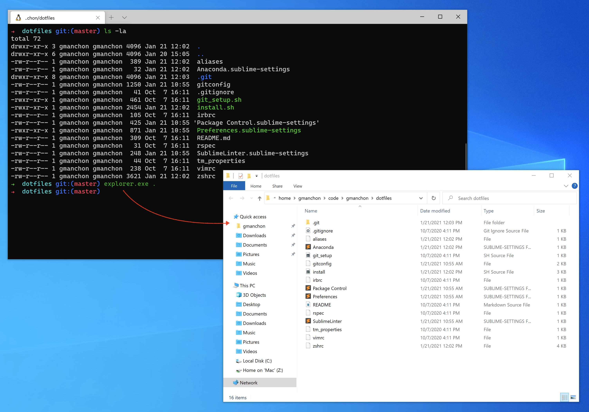
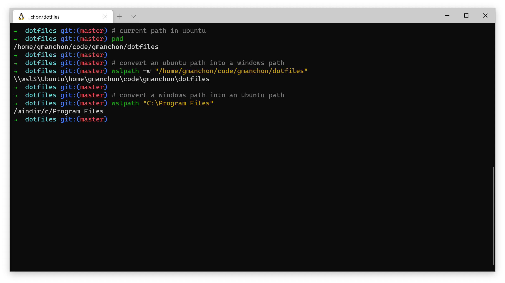
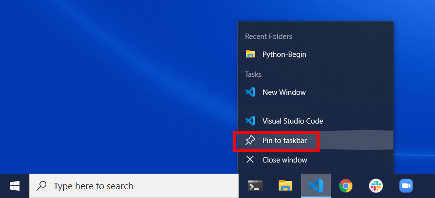

# Instruções de configuração

Você encontrará abaixo as instruções para configurar seu computador para o [curso de desenvolvimento web Le Wagon](https://www.lewagon.com/web-development-course/full-time).

Por favor **leia-os com atenção e execute todos os comandos na seguinte ordem**.

Se você tiver dúvidas, não hesite em pedir ajuda a um professor :raising_hand:

Você também pode dar uma olhada em [nossas cheatsheets](https://github.com/lewagon/setup/tree/master/docs) para soluções e dicas de problemas comuns :heavy_check_mark:

Vamos começar :rocket:


## Zoom

Para poder interagir quando não estivermos na mesma sala física, usaremos o [Zoom](https://zoom.us/), uma ferramenta de videoconferência.

:warning: Se você já possui o Zoom instalado, certifique-se de que a versão seja pelo menos **5.6**.

Acesse [zoom.us/download](https://zoom.us/download).

Em **Cliente Zoom** clique no botão **Baixar**.

Abra o arquivo que você acabou de baixar para instalar o aplicativo.

Abra o aplicativo Zoom.

Se você já possui uma conta Zoom, faça login usando suas credenciais.

Caso contrário, clique no link **Cadastre-se gratuitamente**:


Você será redirecionado ao site do Zoom para preencher um formulário.

Quando terminar, volte para o aplicativo Zoom e faça login usando suas credenciais.

Você deverá então ver uma tela como esta:


Agora você pode fechar o aplicativo Zoom.


## Conta GitHub

Você se inscreveu no GitHub? Caso contrário, [faça isso imediatamente](https://github.com/join).

:point_right: **[Carregue uma imagem](https://github.com/settings/profile)** e coloque seu nome corretamente em sua conta GitHub. Isso é importante porque usaremos um painel interno com seu avatar. Faça isso **agora**, antes de continuar com este guia.


## Versão do Windows

Antes de começarmos, precisamos verificar se a versão do Windows instalada no seu computador é compatível com estas instruções de configuração.

### Windows 10 ou Windows 11

Para poder configurar seu computador, você precisa ter o **Windows 10 ou Windows 11** instalado.

Para verificar sua versão do Windows:
- Pressione `Windows` + `R`
- Digite `winver`
- Pressione `Enter`

:heavy_check_mark: Se as primeiras palavras desta janela forem **Windows 10 ou Windows 11** você está pronto para prosseguir :+1:

:x: Caso contrário, você não poderá prosseguir com esta configuração. Você precisa atualizar para o Windows 10 primeiro :point_down:

<details>
   <summary>Atualizar para o Windows 10</summary>

   - Baixe o Windows 10 da [Microsoft](https://www.microsoft.com/software-download/windows10ISO)
   - Instale-o. Deve demorar cerca de uma hora, mas isso depende do seu computador.
   - Quando a instalação terminar, execute os comandos acima :point_up: para verificar se você agora tem o **Windows 10**.
</details>

:information_source: [A atualização do Windows 11 está sendo lançada agora](https://www.microsoft.com/en-us/windows/get-windows-11), o que significa que ela pode ou não estar disponível para o seu computador ainda .

:warning: **Se você tiver o Windows 10 instalado, não será necessário atualizar para o Windows 11 para prosseguir com esta configuração**.

### Ultimas atualizações

Quando tiver certeza de que está usando o Windows 10 ou 11, você precisará instalar todas as atualizações mais recentes.

Abra a atualização do Windows:
- Pressione `Windows` + `R`
- Digite `ms-settings:windowsupdate`
- Pressione `Enter`
- Clique em `Verificar atualizações`

:heavy_check_mark: Se você vir uma marca de seleção verde e a mensagem "Você está atualizado", você está pronto para prosseguir :+1:

:warning: Se você tiver um ponto de exclamação vermelho e a mensagem "Atualização disponível", instale-os e repita o processo até que apareça que você está atualizado :loop:

:x: Se você receber uma mensagem de erro sobre o Windows não conseguir aplicar atualizações, **entre em contato com um professor**.

<details>
   <summary>Ative o Windows Update Service para corrigir atualizações</summary>

   Alguns antivírus e softwares desativam o serviço de atualização de que precisamos, resultando no erro que você vê. Vamos consertar isso!
   - Pressione `Windows` + `R`
   - Digite `services.msc`
   - Pressione `Enter`
   - Clique duas vezes em `Serviço de atualização do Windows`
   - Defina sua `Inicialização` para `Automático`
   - Clique em `Iniciar`
   - Clique em `Ok`
   Então vamos tentar as atualizações novamente!
</details>

### Versão mínima

Algumas das ferramentas que precisamos instalar foram lançadas com a versão `1903` **ou superior** do Windows 10, então precisamos ter certeza de que você tem pelo menos esta.

- Pressione `Windows` + `R`
- Digite `winver`
- Pressione `Enter`

Verifique o **Número da versão**:

:heavy_check_mark: Se disser pelo menos `1903`, você está pronto :+1:

:x: Se estiver abaixo de `1903`, por favor **entre em contato com um professor**.


## Virtualização

Precisamos garantir que as opções de virtualização estejam habilitadas no BIOS do seu computador.

Para muitos computadores, este já é o caso. Vamos checar:
- Pressione `Windows` + `R`
- Digite `taskmgr`
- Pressione `Enter`
- Clique na aba `Desempenho`
- Clique em `CPU`



:heavy_check_mark: Se você vir "Virtualização: Ativada", está pronto :+1:

:x: Se a linha estiver faltando ou se a virtualização estiver desabilitada, por favor **entre em contato com um professor antes de tentar ativar a Virtualização**

<details>
   <summary>Ativar virtualização</summary>

   Precisamos acessar o BIOS/UEFI do computador para ativá-lo.
   - Pressione `Windows + R`
   - Digite `shutdown.exe /r /o /t 1`
   - Pressione `Enter`
   - Aguarde o computador desligar
   - Clique em `Solucionar problemas`
   - Clique em `Opções avançadas`
   - Clique em `Configurações de firmware UEFI`
   - Clique em `Reiniciar`

   Você precisa ativar a opção de virtualização para o seu processador aqui:
   - Na maioria das vezes, nas configurações avançadas, nas configurações da CPU ou nas configurações do Northbridge
   - A opção pode ter um nome diferente de acordo com o seu computador:
       - Intel: `Intel VT-x`, `Tecnologia de virtualização Intel`, `Extensões de virtualização`, `Vanderpool`...
       - AMD: `Modo SVM` ou `AMD-V`
   - Salve as alterações após a ativação e reinicie o computador através da opção apropriada
</details>


## Subsistema Windows para Linux (WSL)

WSL é o ambiente de desenvolvimento que usamos para executar o Ubuntu. Você pode aprender mais sobre WSL [aqui](https://docs.microsoft.com/en-us/windows/wsl/faq).

:information_source: As instruções a seguir dependem da sua versão do Windows. Por favor, execute apenas as instruções correspondentes à sua versão :point_down:

### Windows 11

Se você estiver executando o Windows 11, instalaremos o WSL 2 e o Ubuntu em um comando através do Terminal do Windows.

:warning: Nas instruções a seguir, esteja ciente do pressionamento de tecla `Ctrl` + `Shift` + `Enter` para executar o **Terminal Windows** com privilégios de administrador em vez de apenas clicar em `Ok` ou pressionar `Enter` .

- Pressione `Windows` + `R`
- Digite `wt`
- Pressione **`Ctrl` + `Shift` + `Enter`**

:warning: Você pode ter que aceitar a confirmação do UAC sobre a elevação de privilégio.

Uma janela de terminal azul aparecerá:
- Copie o seguinte comando (`Ctrl` + `C`)
- Cole-o na janela do terminal (`Ctrl` + `V` ou clicando com o botão direito na janela)
- Execute-o pressionando `Enter`

```powershell
wsl --install
```

:heavy_check_mark: Se o comando foi executado sem nenhum erro, reinicie o computador e continue abaixo :+1:

:x: Se você encontrar uma mensagem de erro (ou se vir algum texto em vermelho na janela), por favor **entre em contato com um professor**

### Windows 10

#### Instale o WSL 1

Se você estiver executando o Windows 10, primeiro instalaremos o WSL 1 por meio do Terminal PowerShell.

:warning: Nas instruções a seguir, esteja ciente do pressionamento de tecla `Ctrl` + `Shift` + `Enter` para executar o **Windows PowerShell** com privilégios de administrador em vez de apenas clicar em `Ok` ou pressionar `Enter` .

- Pressione `Windows` + `R`
- Digite `powershell`
- Pressione **`Ctrl` + `Shift` + `Enter`**

:warning: Você pode ter que aceitar a confirmação do UAC sobre a elevação de privilégio.

Uma janela de terminal azul aparecerá:
- Copie os seguintes comandos um por um (`Ctrl` + `C`)
- Cole-os na janela do PowerShell (`Ctrl` + `V` ou clicando com o botão direito na janela)
- Execute-os pressionando `Enter`

```powershell
Enable-WindowsOptionalFeature -Online -FeatureName Microsoft-Windows-Subsystem-Linux
```

```powershell
dism.exe /online /enable-feature /featurename:Microsoft-Windows-Subsystem-Linux /all /norestart
```

```powershell
dism.exe /online /enable-feature /featurename:VirtualMachinePlatform /all /norestart
```

:heavy_check_mark: Se todos os três comandos foram executados sem nenhum erro, reinicie o computador e continue abaixo :+1:

:x: Se você encontrar uma mensagem de erro (ou se vir algum texto em vermelho na janela), por favor **entre em contato com um professor**

#### Atualizar para WSL 2

Se você estiver executando o Windows 10, atualizaremos o WSL para a versão 2.

Assim que o computador for reiniciado, precisamos baixar o instalador WSL2.

- Vá para a [página de download](https://aka.ms/wsl2kernel)
- Baixe o "pacote de atualização do kernel WSL2 Linux"
- Abra o arquivo que você acabou de baixar
- Clique em `Avançar`
- Clique em `Concluir`


:heavy_check_mark: Se não encontrou nenhuma mensagem de erro, você está pronto :+1:

:x: Se você encontrar o erro "Esta atualização se aplica apenas a máquinas com o subsistema Windows para Linux", **clique com o botão direito** no programa e selecione `uninstall`; você poderá instalá-lo normalmente desta vez.

#### Torne o WSL 2 o subsistema Windows padrão para Linux

Se você estiver executando o Windows 10, definiremos a versão padrão do WSL como 2.

Agora que o WSL 2 está instalado, vamos torná-lo a versão padrão:
- Pressione `Windows` + `R`
- Digite `cmd`
- Pressione `Enter`

Na janela que aparece, digite:

```bash
wsl --set-default-version 2
```

:heavy_check_mark: Se você vir "A operação foi concluída com sucesso", você pode fechar este terminal e continuar seguindo as instruções abaixo :+1:

:x: Se a mensagem que você receber for sobre Virtualização, por favor **entre em contato com um professor**

<details>
   <summary>Ativar recurso Windows da Plataforma de Máquina Virtual</summary>

   Siga as etapas descritas [aqui](https://www.configserverfirewall.com/windows-10/please-enable-the-virtual-machine-platform-windows-feature-and-ensure-virtualization-is-enabled-in- the-bios/#:~:text=To%20enable%20WSL%202,%20Open,Windows%20feature%20on%20or%20off.&text=Garanta%20que%20the%20Virtual%20Machine,Windows%20will%20enable%20WSL %202) até você ativar a <strong>Plataforma de Máquina Virtual</strong> e o <strong>Subsistema Windows para Linux</strong>
</details>

<details>
   <summary>Ativar recurso Hyper-V do Windows</summary>

   Siga as etapas descritas [aqui](https://winaero.com/enable-use-hyper-v-windows-10/) até ativar o grupo <strong>Hyper-V</strong>

   :information_source: Se você estiver executando o Windows 10 **Home edition**, o recurso Hyper-V não estará disponível para o seu sistema operacional. Não bloqueia e você ainda pode continuar seguindo as instruções abaixo :ok_hand:
</details>


## Ubuntu

### Instalação

:information_source: As instruções a seguir dependem da sua versão do Windows. Por favor, execute apenas as instruções correspondentes à sua versão :point_down:

#### Windows 11

Se você estiver executando o Windows 11, após reiniciar o computador, você deverá ver uma janela de terminal informando que o WSL está retomando o processo de instalação do Ubuntu. Quando terminar, o Ubuntu será lançado.

#### Windows 10

Se você estiver executando o Windows 10, vamos instalar o Ubuntu através da Microsoft Store:

- Clique em `Iniciar`
- Digite `Microsoft Store`
- Clique em `Microsoft Store` na lista
- Procure por `Ubuntu` na barra de pesquisa
- **Selecione a versão sem nenhum número, simplesmente "Ubuntu"**
- Clique em `Obter`

:warning: Não instale **Ubuntu 18.04 LTS** nem **Ubuntu 20.04**!

<details>
   <summary>Desinstale versões erradas do Ubuntu</summary>

   Para desinstalar uma versão errada do Ubuntu, basta ir até a Lista de Programas Instalados do Windows 10:
   - Pressione `Windows` + `R`
   - Digite `ms-settings:appsfeatures`
   - Pressione `Enter`

   Encontre o software para desinstalar e clique no botão desinstalar.
</details>

Assim que a instalação for concluída, o botão `Get` se torna um botão `Open`: clique nele.

### Executando pela primeira vez

Na primeira execução, serão solicitadas algumas informações:
- Escolha um nome de **usuário**:
     - uma palavra
     - minúsculas
     - sem caracteres especiais
     - por exemplo: `lewagon` ou seu `nome`
- Escolha uma **senha**
- Confirme sua senha

:warning: Quando você digita sua senha, nada aparecerá na tela, **isso é normal**. Este é um recurso de segurança para mascarar não apenas sua senha como um todo, mas também seu comprimento. Basta digitar sua senha e quando terminar, pressione `Enter`.

Você pode fechar a janela do Ubuntu agora que ele está instalado no seu computador.

### Verifique a versão WSL do Ubuntu

- Pressione `Windows` + `R`
- Digite `cmd`
- Pressione `Enter`

Digite o seguinte comando:

```bash
wsl -l -v
```

:heavy_check_mark: Se a versão do Ubuntu WSL for 2, você está pronto :+1:

:x: Se a versão do Ubuntu WSL for 1, precisaremos convertê-lo para a versão 2.

<details>
   <summary>Converter Ubuntu WSL V1 em V2</summary>

   Na janela do prompt de comando, digite:

  ```bash
  wsl --set-version Ubuntu 2
  ```

   :heavy_check_mark: Após alguns segundos, você deverá receber a seguinte mensagem: `A conversão foi concluída`.

   :x: Se não funcionar, precisamos ter certeza de que os arquivos do Ubuntu não estão compactados.
</details>

<details>
   <summary>Verificar arquivos descompactados</summary>

   - Pressione `Windows` + `R`
   - Digite `%localappdata%\Packages`
   - Pressione `Enter`
   - Abra a pasta chamada `CanonicalGroupLimited.UbuntuonWindows...`
   - Clique com o botão direito na pasta `LocalState`
   - Clique em `Propriedades`
   - Clique em `Avançado`
   - Certifique-se de que a opção `Compactar conteúdo` **não** esteja marcada e clique em `Ok`.

   Aplique as alterações apenas nesta pasta e tente converter a versão WSL do Ubuntu novamente.

   :x: Se a conversão ainda não funcionar, por favor **entre em contato com um professor**.
</details>

### Verifique a localidade

A localidade é um mecanismo que permite personalizar programas de acordo com seu idioma e país.

Vamos verificar se a localidade padrão está definida como inglês, digite isto no terminal do Ubuntu:

```bash
locale
```

Se a saída não contiver `LANG=en_US.UTF-8`, execute o seguinte comando em um terminal Ubuntu para instalar a localidade em inglês:

```bash
sudo locale-gen en_US.UTF-8
```

Se, depois, receberes um aviso (`bash: warning: setlocale: LC_ALL: cannot change locale (en_US.utf-8)`) no teu terminal, por favor faz o seguinte:

<details>
  <summary>Gerar localidade</summary>

Por favor, executa estas linhas no teu terminal.

```bash
sudo update-locale LANG=en_US.UTF8
sudo apt-get update
sudo apt-get install language-pack-en language-pack-en-base manpages
```
</details>

Agora você pode fechar esta janela do terminal.


## Visual Studio Code

### Instalação

Vamos instalar o editor de texto [Visual Studio Code](https://code.visualstudio.com).

- Vá para a [página de download do Visual Studio Code](https://code.visualstudio.com/download).
- Clique no botão "Windows"
- Abra o arquivo que você acabou de baixar.
- Instale-o com algumas opções:



Quando a instalação for concluída, inicie o VS Code.

### Conectando o código VS ao Ubuntu

Para fazer o VS Code interagir corretamente com o Ubuntu, vamos instalar a extensão [Remote - WSL](https://marketplace.visualstudio.com/items?itemName=ms-vscode-remote.remote-wsl) VS Code.

Abra seu **terminal Ubuntu**.

Copie e cole os seguintes comandos no terminal:

```bash
code --install-extension ms-vscode-remote.remote-wsl
```

Em seguida, abra o VS Code em seu terminal:

```bash
code .
```

:heavy_check_mark: Se você vir `WSL: Ubuntu` no canto inferior esquerdo da janela do VS Code, você está pronto para prosseguir :+1:



:x: Caso contrário, por favor **entre em contato com um professor**


## Terminal do Windows

### Instalação

:information_source: As instruções a seguir dependem da sua versão do Windows.

Se você estiver executando o Windows 11, o Terminal do Windows já está instalado e você pode prosseguir para a próxima seção :point_down:

Se você estiver executando o Windows 10, vamos instalar o Windows Terminal, um terminal realmente moderno:

- Clique em `Iniciar`
- Digite `Microsoft Store`
- Clique em `Microsoft Store` na lista
- Procure por `Windows Terminal` na barra de pesquisa
- **Selecione Terminal do Windows"**
- Clique em `Instalar`

:warning: NÃO instale o **Windows Terminal Preview**, apenas o **Windows Terminal**!

<details>
   <summary>Desinstale a versão errada do Terminal do Windows</summary>

   Para desinstalar uma versão errada do Terminal Windows, basta ir até a Lista de Programas Instalados do Windows 10:

   - Pressione `Windows` + `R`
   - Digite `ms-settings:appsfeatures`
   - Pressione `Enter`

   Encontre o software para desinstalar e clique no botão desinstalar.
</details>

Assim que a instalação for concluída, o botão `Instalar` se torna um botão `Iniciar`: clique nele.

### Ubuntu como terminal padrão

Vamos tornar o Ubuntu o terminal padrão do seu aplicativo Windows Terminal.

Pressione `Ctrl` + `,`

Deve abrir as configurações do terminal:



- Altere o perfil padrão para "Ubuntu"
- Clique em "Salvar"
- Clique em "Abrir arquivo JSON"

Você pode ver um círculo laranja em vez de um pinguim como logotipo do Ubuntu.

Temos um círculo em vermelho na parte que você irá alterar:



Primeiro, vamos pedir ao Ubuntu para iniciar diretamente dentro do diretório inicial do Ubuntu, em vez do diretório do Windows:
- Localize a entrada com `"name": "Ubuntu",` e `"hidden": false,`
- Adicione a seguinte linha depois dela:

```bash
"commandline": "wsl.exe ~",
```

:warning: Não esqueça a vírgula no final da linha!

Então, vamos desabilitar o aviso para comandos de copiar e colar entre o Windows e o Ubuntu:
- Localize a linha `"defaultProfile": "{2c4de342-...}"`
- Adicione a seguinte linha depois dela:

```bash
"multiLinePasteWarning": false,
```

:warning: Não esqueça a vírgula no final da linha!

Você pode salvar essas alterações pressionando `Ctrl` + `S`

:heavy_check_mark: Seu **Terminal Windows** agora está configurado :+1:

Este terminal possui abas: você pode optar por abrir uma nova aba do terminal clicando em **+** ao lado da atual.

**De agora em diante, toda vez que nos referirmos ao terminal ou ao console será este.** NÃO utilize mais nenhum outro terminal.


## Extensões do VS Code

### Instalação

Vamos instalar algumas extensões úteis no VS Code.

Copie e cole os seguintes comandos em seu terminal:

```bash
code --install-extension ms-vscode.sublime-keybindings
code --install-extension emmanuelbeziat.vscode-great-icons
code --install-extension github.github-vscode-theme
code --install-extension MS-vsliveshare.vsliveshare
code --install-extension rebornix.ruby
code --install-extension dbaeumer.vscode-eslint
code --install-extension Rubymaniac.vscode-paste-and-indent
code --install-extension alexcvzz.vscode-sqlite
code --install-extension anteprimorac.html-end-tag-labels
```

Aqui está uma lista das extensões que você está instalando:

- [Sublime Text Keymap and Settings Importer](https://marketplace.visualstudio.com/items?itemName=ms-vscode.sublime-keybindings)
- [VSCode Great Icons](https://marketplace.visualstudio.com/items?itemName=emmanuelbeziat.vscode-great-icons)
- [Live Share](https://marketplace.visualstudio.com/items?itemName=MS-vsliveshare.vsliveshare)
- [Ruby](https://marketplace.visualstudio.com/items?itemName=rebornix.Ruby)
- [ESLint](https://marketplace.visualstudio.com/items?itemName=dbaeumer.vscode-eslint)
- [Paste and Indent](https://marketplace.visualstudio.com/items?itemName=Rubymaniac.vscode-paste-and-indent)
- [SQLite](https://marketplace.visualstudio.com/items?itemName=alexcvzz.vscode-sqlite)


### Configuração do Live Share

[Visual Studio Live Share](https://visualstudio.microsoft.com/services/live-share/) é uma extensão do VS Code que permite compartilhar o código em seu editor de texto para depuração e programação em pares: vamos configurá-lo acima!

Inicie o VS Code em seu terminal digitando `code` e pressionando `Enter`.

Clique na pequena seta na parte inferior da barra esquerda :point_down:


- Clique no botão "Compartilhar" e depois em "GitHub (faça login usando a conta GitHub)".
- Um pop-up aparece solicitando que você faça login no GitHub: clique em “Permitir”.
- Você é redirecionado para uma página do GitHub em seu navegador solicitando autorização do Visual Studio Code: clique em "Continuar" e depois em "Autorizar github".
- O VS Code pode exibir pop-ups adicionais: feche-os clicando em "OK".

É isso, você está pronto para continuar!


## Ferramentas de linha de comando

### Zsh e Git

Em vez de usar o `bash` [shell](https://en.wikipedia.org/wiki/Shell_(computing)), usaremos `zsh`.

Também usaremos [`git`](https://git-scm.com/), um software de linha de comando usado para controle de versão.

Vamos instalá-los, juntamente com outras ferramentas úteis:
- Abra um **terminal Ubuntu**
- Copie e cole os seguintes comandos:

```bash
sudo apt update
```

```bash
sudo apt install -y curl git imagemagick jq unzip vim zsh tree
```

Esses comandos solicitarão sua senha: digite-a.

:warning: Quando você digita sua senha, nada aparecerá na tela, **isso é normal**. Este é um recurso de segurança para mascarar não apenas sua senha como um todo, mas também seu comprimento. Basta digitar sua senha e quando terminar, pressione `Enter`.

### Instalação da CLI do GitHub

Vamos agora instalar a [CLI oficial do GitHub](https://cli.github.com) (interface de linha de comando). É um software usado para interagir com sua conta GitHub através da linha de comando.

Em seu terminal, copie e cole os seguintes comandos e digite sua senha, se solicitado:

```bash
sudo apt remove -y gitsome # gh command can conflict with gitsome if already installed
curl -fsSL https://cli.github.com/packages/githubcli-archive-keyring.gpg | sudo dd of=/usr/share/keyrings/githubcli-archive-keyring.gpg
```

```bash
echo "deb [arch=$(dpkg --print-architecture) signed-by=/usr/share/keyrings/githubcli-archive-keyring.gpg] https://cli.github.com/packages stable main" | sudo tee /etc/apt/sources.list.d/github-cli.list > /dev/null
```

```bash
sudo apt update
```

```bash
sudo apt install -y gh
```

Para verificar se `gh` foi instalado com sucesso em sua máquina, você pode executar:

```bash
gh --version
```

:heavy_check_mark: Se você vir `gh versão X.Y.Z (AAAA-MM-DD)`, está pronto para prosseguir :+1:

:x: Caso contrário, por favor **entre em contato com um professor**


## Oh-My-Zsh

Vamos instalar o plugin `zsh` [Oh My Zsh](https://ohmyz.sh/).

Em um terminal execute o seguinte comando:

```bash
sh -c "$(curl -fsSL https://raw.github.com/ohmyzsh/ohmyzsh/master/tools/install.sh)"
```

Se for perguntado "Deseja alterar seu shell padrão para zsh?", pressione `Y`

No final seu terminal deverá ficar assim:


:heavy_check_mark: Se isso acontecer, você pode continuar :+1:

:x: Caso contrário, por favor **entre em contato com um professor**


## Vinculando seu navegador padrão ao Ubuntu

Para ter certeza de que você pode interagir com seu navegador instalado no Windows a partir do terminal Ubuntu, precisamos defini-lo como navegador padrão.

:warning: Você precisa executar pelo menos um dos seguintes comandos abaixo:

<details>
   <summary>Google Chrome como navegador padrão</summary>

   Execute o comando:

  ```bash
    ls /mnt/c/Program\ Files\ \(x86\)/Google/Chrome/Application/chrome.exe
  ```

   Você recebeu um erro como `ls: não é possível acessar...`?

<details>
   <summary>Sim, ocorreu um erro</summary>

Execute os seguintes comandos:

  ```bash
    echo "export BROWSER=\"/mnt/c/Program Files/Google/Chrome/Application/chrome.exe\"" >> ~/.zshrc
    echo "export GH_BROWSER=\"'/mnt/c/Program Files/Google/Chrome/Application/chrome.exe'\"" >> ~/.zshrc
  ```
</details>

<details>
   <summary>Não, estava tudo bem</summary>

   Execute os seguintes comandos:

  ```bash
    echo "export BROWSER=\"/mnt/c/Program Files (x86)/Google/Chrome/Application/chrome.exe\"" >> ~/.zshrc
    echo "export GH_BROWSER=\"'/mnt/c/Program Files (x86)/Google/Chrome/Application/chrome.exe'\"" >> ~/.zshrc
  ```
</details>

---

</details>

<details>
   <summary>Mozilla Firefox como seu navegador padrão</summary>

   Execute o comando:

  ```bash
    ls /mnt/c/Program\ Files\ \(x86\)/Mozilla\ Firefox/firefox.exe
  ```

   Você recebeu um erro como `ls: não é possível acessar...`?

<details>
   <summary>Sim, ocorreu um erro</summary>

   Execute os seguintes comandos:

  ```bash
    echo "export BROWSER=\"/mnt/c/Program Files/Mozilla Firefox/firefox.exe\"" >> ~/.zshrc
    echo "export GH_BROWSER=\"'/mnt/c/Program Files/Mozilla Firefox/firefox.exe'\"" >> ~/.zshrc
  ```

</details>

<details>
   <summary>Não, estava tudo bem</summary>

   Execute os seguintes comandos:

  ```bash
    echo "export BROWSER=\"/mnt/c/Program Files (x86)/Mozilla Firefox/firefox.exe\"" >> ~/.zshrc
    echo "export GH_BROWSER=\"'/mnt/c/Program Files (x86)/Mozilla Firefox/firefox.exe'\"" >> ~/.zshrc
  ```
</details>

---

</details>

<details>
   <summary>Microsoft Edge como navegador padrão</summary>

   Execute os comandos:

  ```bash
    echo "export BROWSER='\"/mnt/c/Program Files (x86)/Microsoft/Edge/Application/msedge.exe\"'" >> ~/.zshrc
    echo "export GH_BROWSER=\"'/mnt/c/Program Files (x86)/Microsoft/Edge/Application/msedge.exe'\"" >> ~/.zshrc
  ```

---

</details>

Reinicie seu terminal.

Em seguida, certifique-se de que o seguinte comando retorne "Browser Defined 👌":

```bash
[ -z "$BROWSER" ] && echo "ERROR: please define a BROWSER environment variable ⚠️" || echo "Browser defined 👌"
```

Se isso não acontecer,

:heavy_check_mark: Se você recebeu esta mensagem, pode continuar :+1:

:x: Caso contrário, escolha um navegador na lista acima e execute o comando correspondente. Então não se esqueça de redefinir seu terminal:

```bash
exec zsh
```

Não hesite em **entrar em contato com um professor**.


## CLI do GitHub

CLI é o acrônimo de [Interface de linha de comando](https://en.wikipedia.org/wiki/Command-line_interface).

Nesta seção, usaremos [GitHub CLI](https://cli.github.com/) para interagir com o GitHub diretamente do terminal.

Ele já deve estar instalado no seu computador a partir dos comandos anteriores.

Primeiro, para **fazer login**, copie e cole o seguinte comando em seu terminal:

:warning: **NÃO edite o `email`**

```bash
gh auth login -s 'user:email' -w
```

`gh` fará algumas perguntas:

`What is your preferred protocol for Git operations?` Com as setas, escolha `SSH` e pressione `Enter`. SSH é um protocolo para fazer login usando chaves SSH em vez do conhecido par nome de usuário/senha.

`Generate a new SSH key to add to your GitHub account?` Pressione `Enter` para pedir ao gh para gerar as chaves SSH para você.

Se você já possui chaves SSH, verá `Upload your SSH public key to your GitHub account?` Com as setas, selecione o caminho do arquivo de sua chave pública e pressione `Enter`.

`Enter a passphrase for your new SSH key (Optional)`. Digite algo que você deseja e que você lembrará. É uma senha para proteger sua chave privada armazenada no disco rígido. Em seguida, pressione `Enter`.

`Title for your SSH key`. Você pode deixá-lo no "GitHub CLI" proposto, pressione `Enter`.

Você obterá então a seguinte saída:

```bash
! First copy your one-time code: 0EF9-D015
- Press Enter to open github.com in your browser...
```

Selecione e copie o código (`0EF9-D015` no exemplo) e pressione `Enter`.

Seu navegador será aberto e solicitará que você autorize o GitHub CLI a usar sua conta GitHub. Aceite e espere um pouco.

Volte ao terminal, pressione `Enter` novamente e pronto.

Para verificar se você está conectado corretamente, digite:

```bash
gh auth status
```

:heavy_check_mark: Se você estiver `Logado no github.com como <SEU NOME DE USUÁRIO> `, então tudo bem :+1:

:x: Caso contrário, **entre em contato com um professor**.


## Dotfiles (configuração padrão)

Os hackers adoram refinar e aprimorar sua estrutura e ferramentas.

Começaremos com uma ótima configuração padrão fornecida pelo Le Wagon: [`lewagon/dotfiles`](https://github.com/lewagon/dotfiles).

Como sua configuração é pessoal, você precisa de seu próprio repositório para armazená-la. Então você irá fazer o **fork** do repositório Le Wagon.

Bifurcar significa que você criará um novo repositório em sua própria conta GitHub `$GITHUB_USERNAME/dotfiles`, idêntico ao original do Le Wagon que você poderá modificar à vontade.

Abra seu terminal e defina uma variável para seu nome de usuário GitHub:

```bash
export GITHUB_USERNAME=`gh api user | jq -r '.login'`
```

```bash
echo $GITHUB_USERNAME
```

:heavy_check_mark: Você deverá ver seu nome de usuário do GitHub impresso.

:x: Se não, **pare aqui** e peça ajuda. Pode haver um problema com a etapa anterior (`gh auth`).

:warning: Por favor note que esta variável só é definida para o tempo em que seu terminal está aberto. Se você fechá-lo antes ou durante as próximas etapas, será necessário configurá-lo novamente com as duas etapas acima!


É hora de fazer um fork do repositório e cloná-lo em seu computador:

```bash
mkdir -p ~/code/$GITHUB_USERNAME && cd $_
```

```bash
gh repo fork lewagon/dotfiles --clone
```

### Instalador do Dotfiles

Execute o instalador `dotfiles`:

```bash
cd ~/code/$GITHUB_USERNAME/dotfiles
```

```bash
zsh install.sh
```

Verifique os e-mails registrados em sua conta GitHub. Você precisará escolher um na próxima etapa:

```bash
gh api user/emails | jq -r '.[].email'
```

:heavy_check_mark: Se você vir a lista de seus e-mails registrados, você pode prosseguir :+1:

:x: Caso contrário, [reautentique no GitHub](https://github.com/lewagon/setup/blob/master/windows.pt.md#github-cli) antes de executar este comando :point_up: novamente.

### Instalador git

Execute o instalador `git`:

```bash
cd ~/code/$GITHUB_USERNAME/dotfiles && zsh git_setup.sh
```

:point_up: Isso **solicitará** seu nome (`Nome Sobrenome`) e seu e-mail.

:warning: Você **precisa** colocar um dos e-mails listados acima graças ao comando anterior `gh api ...`. Se você não fizer isso, Kitt não conseguirá acompanhar seu progresso.

Agora **reinicie** seu terminal executando:

```bash
exec zsh
```


## Desativar prompt de senha SSH

Você não quer que sua senha seja solicitada sempre que se comunicar com um repositório distante. Então, você precisa adicionar o plugin `ssh-agent` ao `oh my zsh`:

Primeiro, abra o arquivo `.zshrc`:

```bash
code ~/.zshrc
```

Então:
- Identifique a linha que começa com `plugins=`
- Adicione `ssh-agent` no final da lista de plugins

:heavy_check_mark: Salve o arquivo `.zshrc` com `Ctrl` + `S` e feche seu editor de texto.


## rbenv

Vamos instalar o [`rbenv`](https://github.com/sstephenson/rbenv), um software para instalar e gerenciar ambientes `ruby`.

Primeiro, precisamos limpar qualquer instalação anterior do Ruby que você possa ter:

```bash
rvm implode && sudo rm -rf ~/.rvm
# Se você obteve "zsh: comando não encontrado: rvm", continue.
# Significa que `rvm` não está no seu computador, é isso que queremos!
rm -rf ~/.rbenv
```

Então no terminal, execute:

```bash
sudo apt install -y build-essential tklib zlib1g-dev libssl-dev libffi-dev libxml2 libxml2-dev libxslt1-dev libreadline-dev
```

```bash
git clone https://github.com/rbenv/rbenv.git ~/.rbenv
```

```bash
git clone https://github.com/rbenv/ruby-build.git ~/.rbenv/plugins/ruby-build
```

```bash
exec zsh
```


## Ruby

### Instalação

Agora, você está pronto para instalar a versão mais recente do [ruby](https://www.ruby-lang.org/en/) e defini-la como a versão padrão.

Execute este comando, **demorará um pouco (5 a 10 minutos)**

```bash
rbenv install 3.1.2
```

Assim que a instalação do Ruby estiver concluída, execute este comando para informar ao sistema
para usar a versão 3.1.2 por padrão.

```bash
rbenv global 3.1.2
```

**Reinicialize** seu terminal e verifique sua versão do Ruby:

```bash
exec zsh
```

Então corra:

```bash
ruby -v
```

:heavy_check_mark: Se você vir algo começando com `ruby 3.1.2p` então você pode prosseguir :+1:

:x: Se não, **pergunte a um professor**

### Instalando algumas gems

<details>
  <summary>Se você estiver na <bold>China</bold> 🇨🇳 clique aqui</summary>

  :warning: Se você estiver na China, você deve atualizar a forma como instalaremos o gem com os seguintes comandos.

```bash
# Somente China!
fontes de gemas --remove https://rubygems.org/
fontes de gemas -a https://gems.ruby-china.com/
fontes de gemas -l
#***FONTES ATUAIS***
# https://gems.ruby-china.com/
# Ruby-china.com deve estar na lista agora
```
</details>

**Todos, na China ou não**, continuem aqui para instalar gems.

No mundo Ruby, chamamos bibliotecas externas de `gems`: são pedaços de código Ruby que você pode baixar e executar em seu computador. Vamos instalar alguns!

No seu terminal, copie e cole o seguinte comando:

```bash
gem install colored faker http pry-byebug rake rails rest-client rspec rubocop-performance sqlite3
```

:heavy_check_mark: Se você tiver `xx gems installed`, então tudo bem :+1:

:x: Se você encontrar o seguinte erro:

```bash
ERROR: While executing gem ... (TypeError)
incompatible marshal file format (can't be read)
format version 4.8 required; 60.33 given
```

Execute o seguinte comando:
```bash
rm -rf ~/.gemrc
```

Execute novamente o comando para instalar as gemas.

:warning: **NUNCA** instale uma gem com `sudo gem install`! Mesmo se você encontrar uma resposta do Stackoverflow (ou o terminal) solicitando que você faça isso.


## Node.js

[Node.js](https://nodejs.org/en/) é um tempo de execução JavaScript para executar código JavaScript no terminal. Vamos instalá-lo com [nvm](https://github.com/nvm-sh/nvm), um gerenciador de versões para Node.js.

Em um terminal, execute os seguintes comandos:

```bash
curl -o- https://raw.githubusercontent.com/nvm-sh/nvm/v0.39.1/install.sh | zsh
```

```bash
exec zsh
```

Em seguida, execute o seguinte comando:

```bash
nvm -v
```

Você deverá ver uma versão. Se não, pergunte a um professor.

Agora vamos instalar o Node.js:

```bash
nvm install 16.15.1
```

Quando a instalação terminar, execute:

```bash
node -v
```

Se você vir `v16.15.1`, a instalação foi bem-sucedida :heavy_check_mark: Você pode então executar:

```bash
nvm cache clear
```

:x: Caso contrário, **entre em contato com um professor**


## Yarn

[`yarn`](https://yarnpkg.com/) é um gerenciador de pacotes para instalar bibliotecas JavaScript. Vamos instalá-lo:

Em um terminal, execute os seguintes comandos:

```bash
npm install --global yarn
```

```bash
exec zsh
```

Em seguida, execute o seguinte comando:

```bash
yarn -v
```

:heavy_check_mark: Se você vir uma versão, você está bem :+1:

:x: Se não, **entre em contato com um professor**


## SQLite

Em algumas semanas falaremos sobre bancos de dados e SQL. [SQLite](https://sqlite.org/index.html) é um mecanismo de banco de dados usado para executar consultas SQL em bancos de dados de arquivo único. Vamos instalá-lo:

Em um terminal, execute os seguintes comandos:

```bash
sudo apt-get install sqlite3 libsqlite3-dev
```

Em seguida, execute o seguinte comando:

```bash
sqlite3 -version
```

:heavy_check_mark: Se você vir uma versão, você está bem :+1:

:x: Se não, **peça um professor**


## PostgreSQL

Às vezes, o SQLite não é suficiente e precisaremos de uma ferramenta mais avançada chamada [PostgreSQL](https://www.postgresql.org/), um sistema de banco de dados de código aberto, robusto e pronto para produção.

Vamos instalá-lo agora.

Execute os seguintes comandos:

```bash
sudo apt install -y postgresql postgresql-contrib libpq-dev build-essential
```

```bash
sudo /etc/init.d/postgresql start
```

```bash
sudo -u postgres psql --command "CREATE ROLE \"`whoami`\" LOGIN createdb superuser;"
```

Você pode configurar o PostgreSQL para inicialização automática, para que não precise executar `sudo /etc/init.d/postgresql start` cada vez que abrir um novo terminal:

```bash
sudo echo "`whoami` ALL=NOPASSWD:/etc/init.d/postgresql start" | sudo tee /etc/sudoers.d/postgresql
```

```bash
sudo chmod 440 /etc/sudoers.d/postgresql
```

```bash
echo "sudo /etc/init.d/postgresql start" >> ~/.zshrc
```

Abra um novo terminal.

:heavy_check_mark: Se você vir uma mensagem `* Starting postgresql (via systemctl): postgresql.service` OU `* Starting PostgreSQL 14 database server`, você está pronto para prosseguir :+1:

:x: Caso contrário, **entre em contato com um professor**.


## Checagem

Vamos verificar se você instalou tudo com sucesso.

No seu terminal, execute o seguinte comando:

```bash
exec zsh
```

Então corra:

```bash
curl -Ls https://raw.githubusercontent.com/lewagon/setup/master/check.rb > _.rb && ruby _.rb && rm _.rb || rm _.rb
```

:heavy_check_mark: Se você receber uma mensagem verde `Awesome! Your computer is now ready!`, então você está bem :+1:

:x: Caso contrário, **entre em contato com um professor**.


## Kitt

:warning: Se você recebeu um e-mail do Le Wagon convidando você a se inscrever no Kitt (nossa plataforma de aprendizagem), você pode pular esta etapa com segurança. Em vez disso, siga as instruções no e-mail que você recebeu, caso ainda não tenha feito isso.

Se não tiver certeza sobre o que fazer, siga [este link](https://kitt.lewagon.com/). Se você já estiver logado, pode pular esta seção com segurança. Se você não estiver logado, clique em `Enter Kitt as a Student`. Se você conseguir fazer login, poderá pular esta etapa com segurança. Caso contrário, pergunte a um professor se você deveria ter recebido um e-mail ou siga as instruções abaixo.

Registre-se como Alumni da Le Wagon acessando [kitt.lewagon.com/onboarding](http://kitt.lewagon.com/onboarding). Selecione seu batch, faça login no GitHub e insira todas as suas informações.

Seu professor irá então validar que você realmente faz parte do batch. Você pode pedir que eles façam isso assim que preencher o formulário de registro.

Assim que o professor aprovar seu perfil, acesse sua caixa de entrada de e-mail. Você deve ter 2 e-mails:

- Um do Slack, convidando você para a comunidade Le Wagon Alumni do Slack (onde você conversará com seus amigos e todos os ex-alunos anteriores). Clique em **Inscreva-se** e preencha os dados.
- Um do GitHub, convidando você para a equipe `lewagon`. **Aceite** caso contrário você não conseguirá acessar os slides da aula.


## Slack

[Slack](https://slack.com/) é uma plataforma de comunicação bastante popular na indústria de tecnologia.

### Instalação

[Baixe o aplicativo Slack](https://slack.com/downloads/windows) e instale-o.

:warning: Se você já usa o Slack em seu navegador, baixe e instale **o aplicativo para desktop** que vem com todos os recursos.


### Configurações

Inicie o aplicativo e faça login na organização `lewagon-alumni`.

Certifique-se de **fazer upload de uma foto de perfil** :point_down:


A ideia é que você tenha o Slack aberto o dia todo, para que você possa compartilhar links úteis/pedir ajuda/decidir onde ir almoçar/etc.

Para garantir que tudo está funcionando bem nas videochamadas, vamos testar sua câmera e microfone:
- Abra o aplicativo Slack
- Clique na foto do seu perfil no canto superior direito.
- Selecione `Preferências` no menu.
- Clique em `Áudio e vídeo` na coluna do lado esquerdo.
- Abaixo de `Solução de problemas`, clique em `Executar um teste de áudio, vídeo e compartilhamento de tela`. O teste será aberto em uma nova janela.
- Verifique se seus dispositivos preferidos de alto-falante, microfone e câmera aparecem nos menus suspensos e clique em `Iniciar teste`.


:heavy_check_mark: Quando o teste terminar, você deverá ver mensagens verdes de "Sucesso" pelo menos para seu microfone e câmera. :+1:

:x: Caso contrário, **entre em contato com um professor**.

Você também pode instalar o aplicativo Slack no seu telefone e entrar em `lewagon-alumni`!


## Configurações do Windows

### Troque arquivos entre Windows e Ubuntu

Precisamos de uma maneira fácil de transferir arquivos do Windows para o Ubuntu e vice-versa.

Para fazer isso, vamos criar atalhos para diretórios do Ubuntu no **File Explorer** do Windows:
- Abra o Windows File Explorer (ou use o atalho `WIN` + `E`)
- Na barra de endereços, digite `\\wsl$\` (ou `\\wsl$\Ubuntu` se não funcionar)
- Agora você tem acesso ao sistema de arquivos Ubuntu
- Mergulhe no sistema de arquivos Ubuntu para procurar diretórios de interesse
- Arraste as pastas desejadas para a barra de endereços para criar atalhos



### Abra o Windows File Explorer no terminal Ubuntu

Outra opção para mover arquivos é abrir o Windows **File Explorer** no terminal Ubuntu:
- Abra um terminal Ubuntu
- Vá para o diretório que deseja explorar
- Execute o comando `explorer.exe .` (alternativamente, use `wslview .`)
- Se você receber uma mensagem de erro de entrada e saída, execute `wsl --shutdown` em um Windows PowerShell e reabra um terminal Ubuntu



### Encontre o seu caminho no sistema de arquivos Ubuntu

Você pode querer descobrir a localização exata de um diretório do Windows no sistema de arquivos Ubuntu ou vice-versa.

Para converter um caminho do Windows de e para um caminho do Ubuntu:
- Abra um terminal Ubuntu
- Use o comando `wslpath "C:\Program Files"` para traduzir um caminho do Windows em um caminho do Ubuntu
- Use o comando `wslpath -w "/home"` para traduzir um caminho do Ubuntu em um caminho do Windows
- Em particular, o comando `wslpath -w $(pwd)` retorna o caminho do Windows do diretório atual do Ubuntu



### Fixe aplicativos na sua barra de tarefas

Você usará a maioria dos aplicativos que instalou hoje com muita frequência. Vamos fixá-los na barra de tarefas para que estejam a apenas um clique de distância!

Para fixar um aplicativo na barra de tarefas, inicie o aplicativo, clique com o botão direito no ícone da barra de tarefas para abrir o menu de contexto e escolha “Fixar na barra de tarefas”.



Você deve fixar:
- Seu terminal
- Seu explorador de arquivos
- VS Code
- Seu navegador de Internet
- Slack
- Zoom


## Configuração concluída!

Seu computador agora está pronto para o [curso de Desenvolvimento Web Le Wagon](https://www.lewagon.com/web-development-course/full-time) :muscle: :clap:

Aproveite o bootcamp, você vai acertar :rocket:


