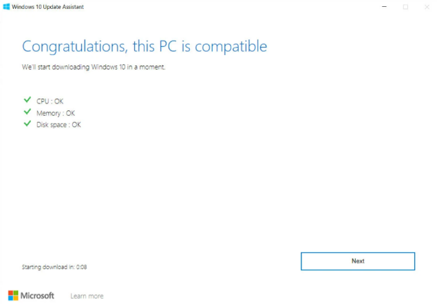
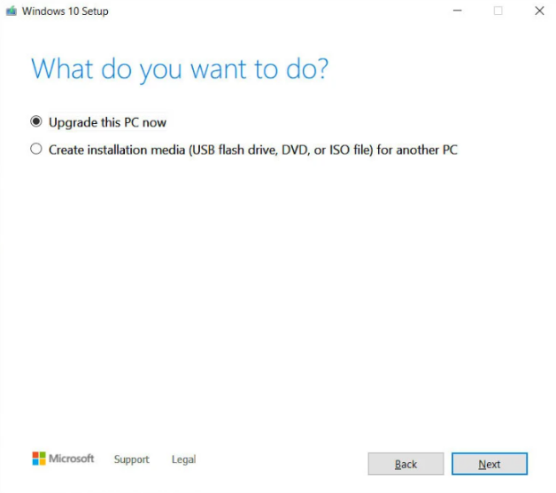
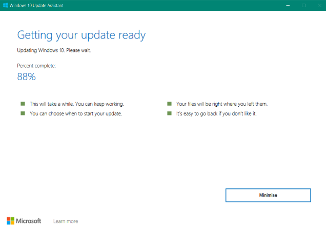
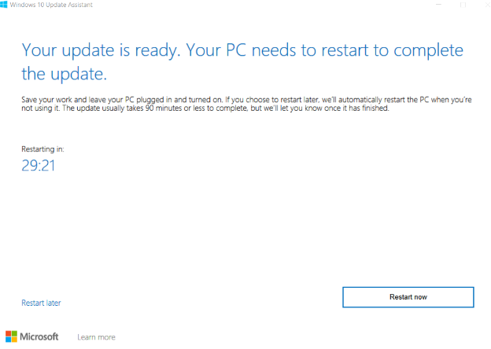

Hello and welcome to this WSL2 Cheatsheet.

The goal is to gather here all tips and known issues about WSL2!

 - [Issues](https://github.com/lewagon/setup/blob/master/wsl_cheatsheet.md#issues)
    - [I/O error](https://github.com/lewagon/setup/blob/master/wsl_cheatsheet.md#inputoutput-error)
    - [ERR_CONNECTION_REFUSED](https://github.com/lewagon/setup/blob/master/wsl_cheatsheet.md#err_connection_refused)
    - [Insecure World Writable](https://github.com/lewagon/setup/blob/master/wsl_cheatsheet.md#insecure-world-writable)
    - [Update version 2004 not offered](https://github.com/lewagon/setup/blob/master/wsl_cheatsheet.md#update-version-2004-not-offered)
 - [Tips](https://github.com/lewagon/setup/blob/master/wsl_cheatsheet.md#tips)
    - [Check Windows Subsystem for Linux](https://github.com/lewagon/setup/blob/master/wsl_cheatsheet.md#check-windows-subsystem-for-linux)
    - [Switch from version 1 to version 2](https://github.com/lewagon/setup/blob/master/wsl_cheatsheet.md#switch-from-version-1-to-version-2)
    - [Access root session](https://github.com/lewagon/setup/blob/master/wsl_cheatsheet.md#access-root-session)
    - [Testing in Rails](https://github.com/lewagon/setup/blob/master/wsl_cheatsheet.md#testing-on-rails)

# Issues

## Input/Output error

This happens when the hidden `wslhost.exe` is not working. We just need to restart it!

Close all WSL2 tabs.

Open a Powershell tab and run the following command:
```bash
wsl.exe --shutdown
```
Check that your Ubuntu is properly stopped with the command
```bash
wsl -l -v
```

Open a new WSL2 Tab, problem should be fixed.

## ERR_CONNECTION_REFUSED

If you get this error trying to connected to your `rails server` or `jupyter notebook`, you need to allow the connection in Windows Defender Public rules.
Close all WSL terminal. Open a Powershell terminal and type the following command to stop all WSL processes:
```bash
wsl --shutdown Ubuntu
```

Hit **Start** and type `Windows Defender Firewall` and open it.

Click on **Advanced Settings**

Right click on **Inboud Rules** and select **New Rule...**. Under **Rule Type** leave `Program` selected and hit **Next**.

For the program, Select `The program path:` and paste this path: `%SystemRoot%\System32\wsl.exe`. Click on **Next**.

For the Action section, make sure `Allow the connection` is selected and hit **Next**.

For the Profile section, make sure the 3 options are selected and click on **Next**. 

Finally you will be asked to chose a name for this new rule, go with `WSL - Inbound`.

Repeat the whole process by creating a **Outbound Rule** with the same settings, except for the name: `WSL - Outbound`.

## Insecure World Writable

The warning `Insecure world writable dir /mnt/c in PATH, mode 040777` is caused by the two differents way of Windows & Linux to deal with file permissions.
To silence those warnings:

```bash
sudo touch /etc/wsl.conf
echo '[automount]' | sudo tee -a /etc/wsl.conf > /dev/null
echo 'options="metadata,umask=0033"' | sudo tee -a /etc/wsl.conf > /dev/null
```

Restart all terminals.

## Update version 2004 not offered

Microsoft is slowly releasing the latest major version of Windows (version 2004). Here is the guideline if your Windows is not offering you the update.
Go to [Windows 10](https://www.microsoft.com/en-us/software-download/windows10) and under `Windows 10 May 2020 Update` click on **Update now**. This will download a tool on your machine. Open it.

A compatibility check will start:



Next, you will be offered a choice, choose **Upgrade this PC now** and click on **Next**:



Let the tool do the work:



When finished, you will be asked to restart your PC:



You should be running 2004 now.

# Tips

## Check Windows Subsystem for Linux

Open a Powershell terminal.

Type the following command:
```bash
wsl -l -v
```

It will tell you the name of your WSL, it's state and version.


## Switch from version 1 to version 2

To switch a WSL from version 1 to 2, open a Powershell terminal.

Type the following command:
⚠️ The conversion's time depends on the size of your Ubuntu filesystem, it can be long and WSL will be unsuable in the meantime. ⚠️
```bash
wsl --set-version Ubuntu 2
```

You can revert to version 1:
```bash
wsl --set-version Ubuntu 1
```


## Access root session

To access the `root` session, open a Powershell terminal.

Type the following command:
```bash
wsl -d Ubuntu -u root
```

You can change the password of that `root` session by using the command:
```bash
passwd
```
You will prompted to enter a new password.

Now, from your normal session, you can switch from your session to the `root` on with:
```bash
su -
```

You will be asked for the password.

You can exit the `root` session with `Ctrl + D`.


## Testing on Rails

Testing wont work by default on WSL2. It requires ChromeDriver and Chrome binary installed. For this we will need the `root` session ( AKA The super-mega-admin-session ).

You may skip the reset of the password if you already have one for your root session.

Close all WSL2 tabs.
Open a Powershell tab and run the following command:
```bash
wsl -d Ubuntu -u root
```

You are now login in your Ubuntu as `root`.

Type the following command to change it's password:
```bash
passwd
```

You will be prompted twice for a new password.

Close this WSL2 tab.

Open a WSL2 tab, you should be logged in with **your** account. Run the following command (**line per line**):
```bash
sudo apt-get update
sudo apt-get install -y unzip xvfb libxi6 libgconf-2-4
```

We need to act as the `root` session for the next command, so let's login as root (you will be prompted for the `root` password):
```bash
su -
```
Now, let's run:
```bash
sudo curl -sS -o - https://dl-ssl.google.com/linux/linux_signing_key.pub | apt-key add
sudo echo "deb [arch=amd64]  http://dl.google.com/linux/chrome/deb/ stable main" >> /etc/apt/sources.list.d/google-chrome.list
```
Press `Ctrl+D` to quit the root session.

If you are unsure about which session you're logged in with, you can use the ```whoami``` command 💡.

Let's run the following commands to install Google Chrome binary and ChromeDriver on your WSL2:
```bash
sudo apt-get -y update
sudo apt-get -y install google-chrome-stable
wget https://chromedriver.storage.googleapis.com/2.41/chromedriver_linux64.zip
unzip chromedriver_linux64.zip
sudo mv chromedriver /usr/bin/chromedriver
sudo chown your-session-here:your-session-here /usr/bin/chromedriver
sudo chmod +x /usr/bin/chromedriver
```
⚠️ Replace **your-session-here** by the result of the command ```whoami```.
My result is ```barangerbenjamin:barangerbenjamin```. ⚠️

You can now use testing in Rails. You need to open a second tab and run:
```bash
chromedriver
```
In the other tab you can run your tests with:
```bash
rails test:system
```